# Opinion Poll by TNS Kantar for Česká televize, 4–24 November 2017

<a href="#voting-intentions">Voting Intentions</a> | <a href="#seats">Seats</a> | <a href="#coalitions">Coalitions</a> | <a href="#technical-information">Technical Information</a>

## Voting Intentions

### Confidence Intervals

| Party | Last Result | Poll Result | 80% Confidence Interval | 90% Confidence Interval | 95% Confidence Interval | 99% Confidence Interval |
|:-----:|:-----------:|:-----------:|:-----------------------:|:-----------------------:|:-----------------------:|:-----------------------:|
| ANO 2011 (ALDE) | 16.1% | 30.0% | 28.3–31.7% |27.9–32.2% |27.5–32.7% |26.7–33.5% |
| Česká pirátská strana (Greens/EFA) | 4.8% | 14.0% | 12.8–15.4% |12.4–15.7% |12.1–16.1% |11.6–16.8% |
| Občanská demokratická strana (ECR) | 7.7% | 12.0% | 10.9–13.3% |10.5–13.7% |10.3–14.0% |9.8–14.6% |
| Svoboda a přímá demokracie (ENF) | 0.0% | 9.5% | 8.5–10.7% |8.2–11.0% |8.0–11.3% |7.5–11.9% |
| Komunistická strana Čech a Moravy (GUE/NGL) | 11.0% | 7.0% | 6.1–8.0% |5.9–8.3% |5.7–8.6% |5.3–9.1% |
| Česká strana sociálně demokratická (S&D) | 14.2% | 5.5% | 4.7–6.4% |4.5–6.7% |4.3–7.0% |4.0–7.4% |
| Starostové a nezávislí (EPP) | 16.0% | 5.5% | 4.7–6.4% |4.5–6.7% |4.3–7.0% |4.0–7.4% |
| TOP 09 (EPP) | 16.0% | 5.0% | 4.3–5.9% |4.1–6.2% |3.9–6.4% |3.6–6.8% |
| Křesťanská a demokratická unie–Československá strana lidová (EPP) | 10.0% | 4.5% | 3.8–5.4% |3.6–5.6% |3.5–5.8% |3.2–6.3% |
| Strana zelených (Greens/EFA) | 3.8% | 3.0% | 2.5–3.7% |2.3–3.9% |2.2–4.1% |1.9–4.5% |

*Note:* The poll result column reflects the actual value used in the calculations. Published results may vary slightly, and in addition be rounded to fewer digits.

## Seats

### Confidence Intervals

| Party | Last Result | Median | 80% Confidence Interval | 90% Confidence Interval | 95% Confidence Interval | 99% Confidence Interval |
|:-----:|:-----------:|:------:|:-----------------------:|:-----------------------:|:-----------------------:|:-----------------------:|
| <a href="#ano-2011-(alde)">ANO 2011 (ALDE)</a> | 4 | 8 | 8–9 |7–9 |7–9 |7–9 |
| <a href="#česká-pirátská-strana-(greens/efa)">Česká pirátská strana (Greens/EFA)</a> | 0 | 3 | 3–4 |3–4 |3–4 |3–4 |
| <a href="#občanská-demokratická-strana-(ecr)">Občanská demokratická strana (ECR)</a> | 2 | 3 | 3 |3 |2–4 |2–4 |
| <a href="#svoboda-a-přímá-demokracie-(enf)">Svoboda a přímá demokracie (ENF)</a> | 0 | 2 | 2–3 |2–3 |2–3 |2–3 |
| <a href="#komunistická-strana-čech-a-moravy-(gue/ngl)">Komunistická strana Čech a Moravy (GUE/NGL)</a> | 3 | 2 | 1–2 |1–2 |1–2 |1–2 |
| <a href="#česká-strana-sociálně-demokratická-(s&d)">Česká strana sociálně demokratická (S&D)</a> | 4 | 1 | 0–1 |0–1 |0–1 |0–2 |
| <a href="#starostové-a-nezávislí-(epp)">Starostové a nezávislí (EPP)</a> | 1 | 1 | 0–1 |0–1 |0–1 |0–2 |
| <a href="#top-09-(epp)">TOP 09 (EPP)</a> | 3 | 0 | 0–1 |0–1 |0–1 |0–1 |
| <a href="#křesťanská-a-demokratická-unie–československá-strana-lidová-(epp)">Křesťanská a demokratická unie–Československá strana lidová (EPP)</a> | 3 | 0 | 0–1 |0–1 |0–1 |0–1 |
| <a href="#strana-zelených-(greens/efa)">Strana zelených (Greens/EFA)</a> | 0 | 0 | 0 |0 |0 |0 |

### ANO 2011 (ALDE)

*For a full overview of the results for this party, see the [ANO 2011 (ALDE)](party-ano2011alde.html) page.*

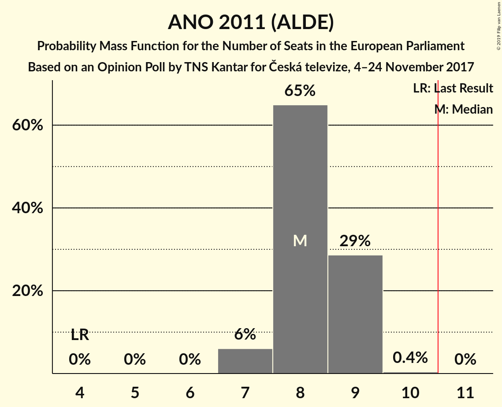

| Number of Seats | Probability | Accumulated | Special Marks |
|:---------------:|:-----------:|:-----------:|:-------------:|
| 4 | 0% | 100% | Last Result |
| 5 | 0% | 100% |  |
| 6 | 0% | 100% |  |
| 7 | 6% | 100% |  |
| 8 | 65% | 94% | Median |
| 9 | 29% | 29% |  |
| 10 | 0.4% | 0.4% |  |
| 11 | 0% | 0% | Majority |

### Česká pirátská strana (Greens/EFA)

*For a full overview of the results for this party, see the [Česká pirátská strana (Greens/EFA)](party-českápirátskástranagreensefa.html) page.*

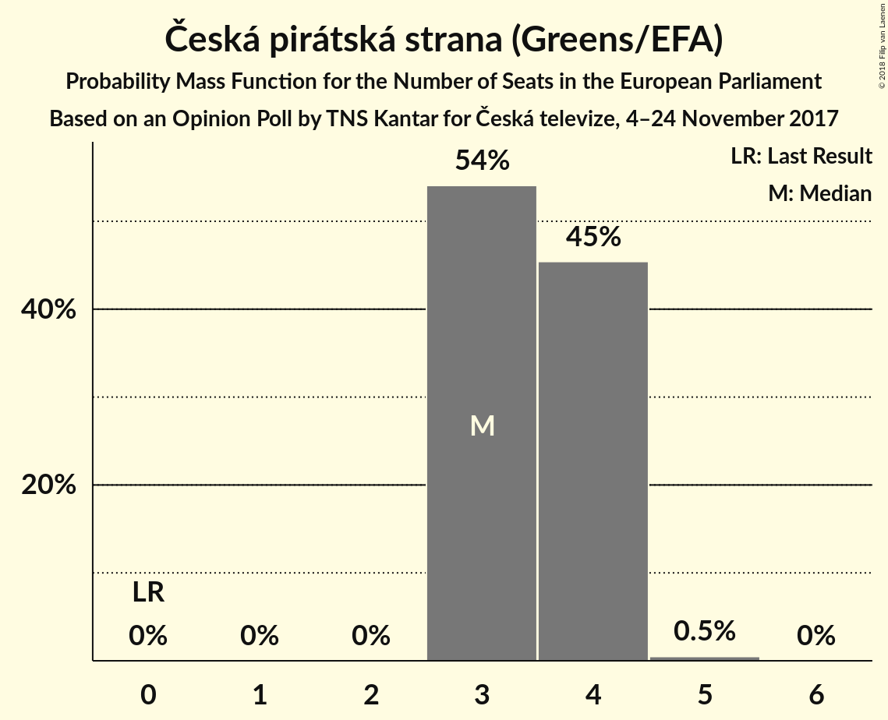

| Number of Seats | Probability | Accumulated | Special Marks |
|:---------------:|:-----------:|:-----------:|:-------------:|
| 0 | 0% | 100% | Last Result |
| 1 | 0% | 100% |  |
| 2 | 0% | 100% |  |
| 3 | 54% | 100% | Median |
| 4 | 45% | 46% |  |
| 5 | 0.5% | 0.5% |  |
| 6 | 0% | 0% |  |

### Občanská demokratická strana (ECR)

*For a full overview of the results for this party, see the [Občanská demokratická strana (ECR)](party-občanskádemokratickástranaecr.html) page.*

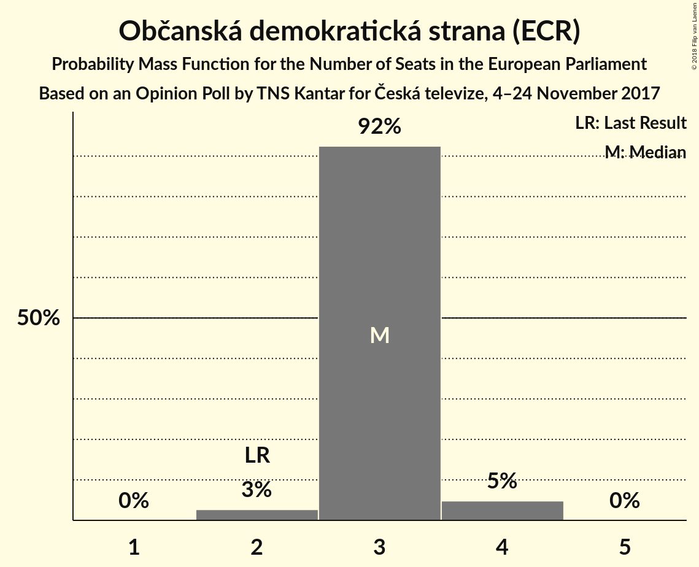

| Number of Seats | Probability | Accumulated | Special Marks |
|:---------------:|:-----------:|:-----------:|:-------------:|
| 2 | 3% | 100% | Last Result |
| 3 | 92% | 97% | Median |
| 4 | 5% | 5% |  |
| 5 | 0% | 0% |  |

### Svoboda a přímá demokracie (ENF)

*For a full overview of the results for this party, see the [Svoboda a přímá demokracie (ENF)](party-svobodaapřímádemokracieenf.html) page.*

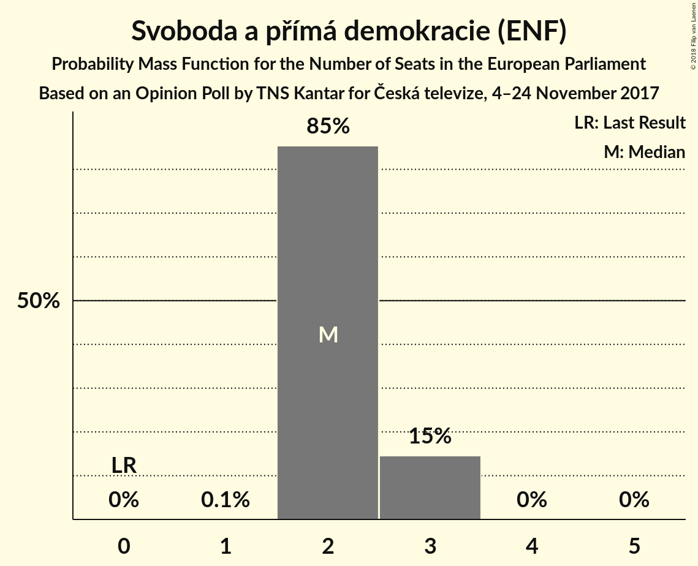

| Number of Seats | Probability | Accumulated | Special Marks |
|:---------------:|:-----------:|:-----------:|:-------------:|
| 0 | 0% | 100% | Last Result |
| 1 | 0.1% | 100% |  |
| 2 | 85% | 99.9% | Median |
| 3 | 15% | 15% |  |
| 4 | 0% | 0% |  |

### Komunistická strana Čech a Moravy (GUE/NGL)

*For a full overview of the results for this party, see the [Komunistická strana Čech a Moravy (GUE/NGL)](party-komunistickástranačechamoravyguengl.html) page.*

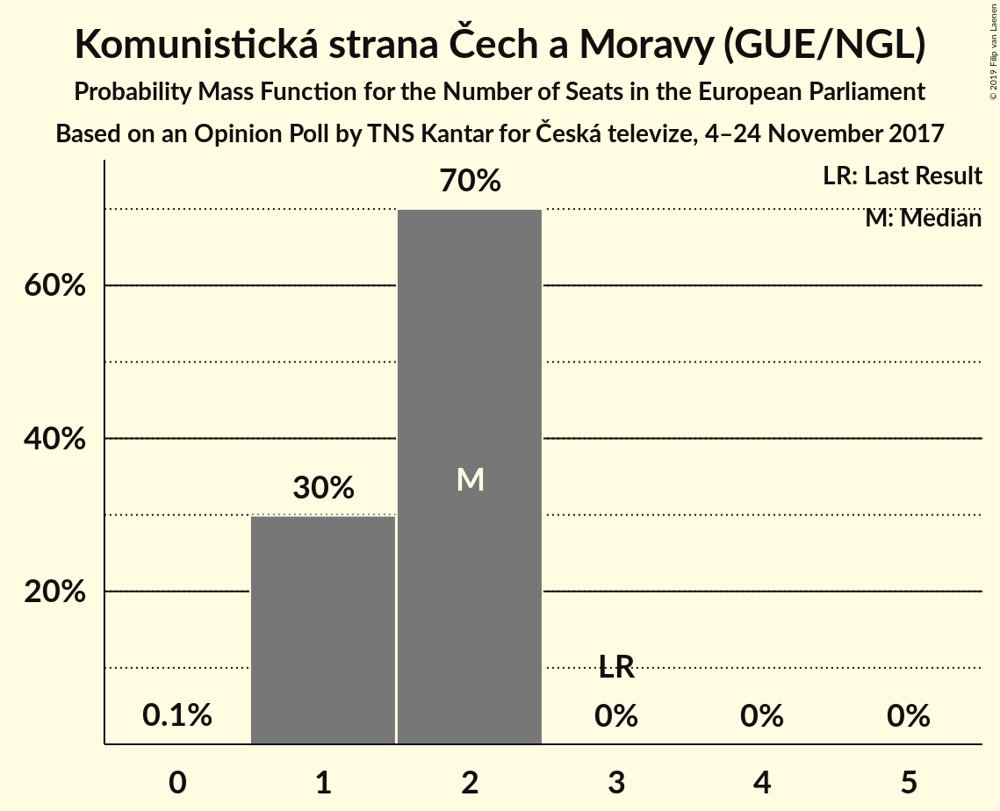

| Number of Seats | Probability | Accumulated | Special Marks |
|:---------------:|:-----------:|:-----------:|:-------------:|
| 0 | 0.1% | 100% |  |
| 1 | 30% | 99.9% |  |
| 2 | 70% | 70% | Median |
| 3 | 0% | 0% | Last Result |

### Česká strana sociálně demokratická (S&D)

*For a full overview of the results for this party, see the [Česká strana sociálně demokratická (S&D)](party-českástranasociálnědemokratickásd.html) page.*

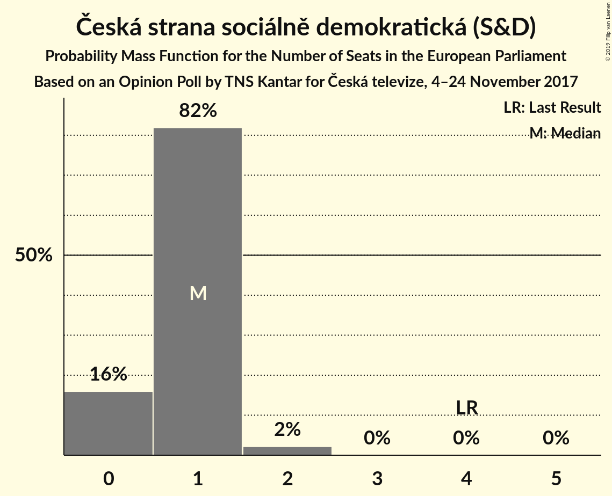

| Number of Seats | Probability | Accumulated | Special Marks |
|:---------------:|:-----------:|:-----------:|:-------------:|
| 0 | 16% | 100% |  |
| 1 | 82% | 84% | Median |
| 2 | 2% | 2% |  |
| 3 | 0% | 0% |  |
| 4 | 0% | 0% | Last Result |

### Starostové a nezávislí (EPP)

*For a full overview of the results for this party, see the [Starostové a nezávislí (EPP)](party-starostovéanezávislíepp.html) page.*

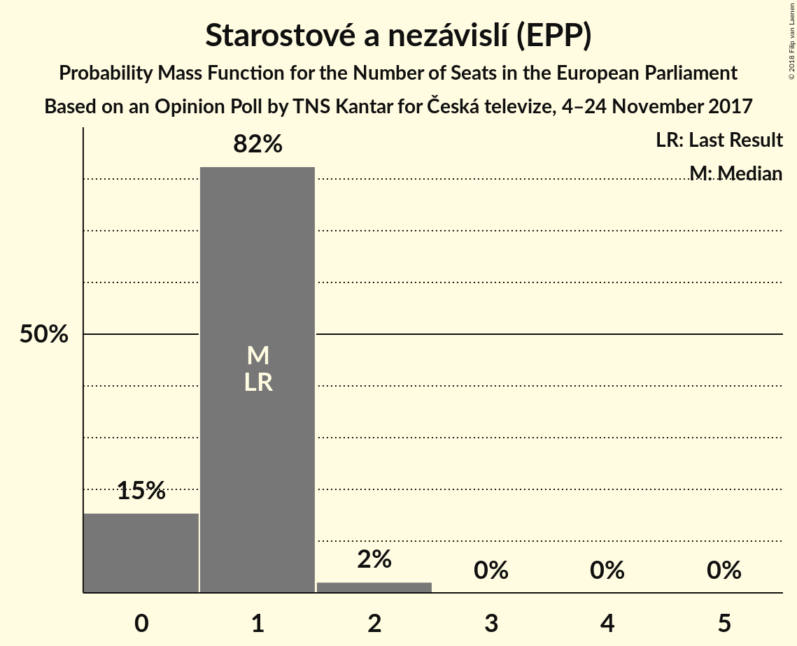

| Number of Seats | Probability | Accumulated | Special Marks |
|:---------------:|:-----------:|:-----------:|:-------------:|
| 0 | 15% | 100% |  |
| 1 | 82% | 85% | Last Result, Median |
| 2 | 2% | 2% |  |
| 3 | 0% | 0% |  |

### TOP 09 (EPP)

*For a full overview of the results for this party, see the [TOP 09 (EPP)](party-top09epp.html) page.*

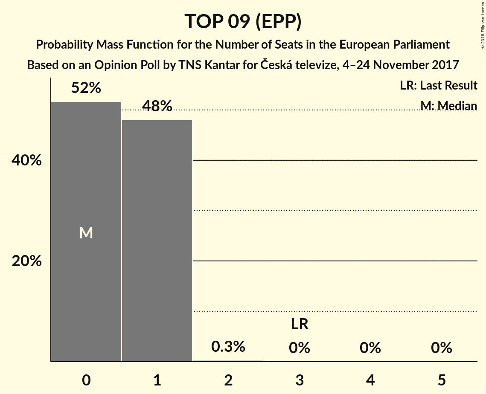

| Number of Seats | Probability | Accumulated | Special Marks |
|:---------------:|:-----------:|:-----------:|:-------------:|
| 0 | 52% | 100% | Median |
| 1 | 48% | 48% |  |
| 2 | 0.3% | 0.3% |  |
| 3 | 0% | 0% | Last Result |

### Křesťanská a demokratická unie–Československá strana lidová (EPP)

*For a full overview of the results for this party, see the [Křesťanská a demokratická unie–Československá strana lidová (EPP)](party-křesťanskáademokratickáunie–československástranalidováepp.html) page.*

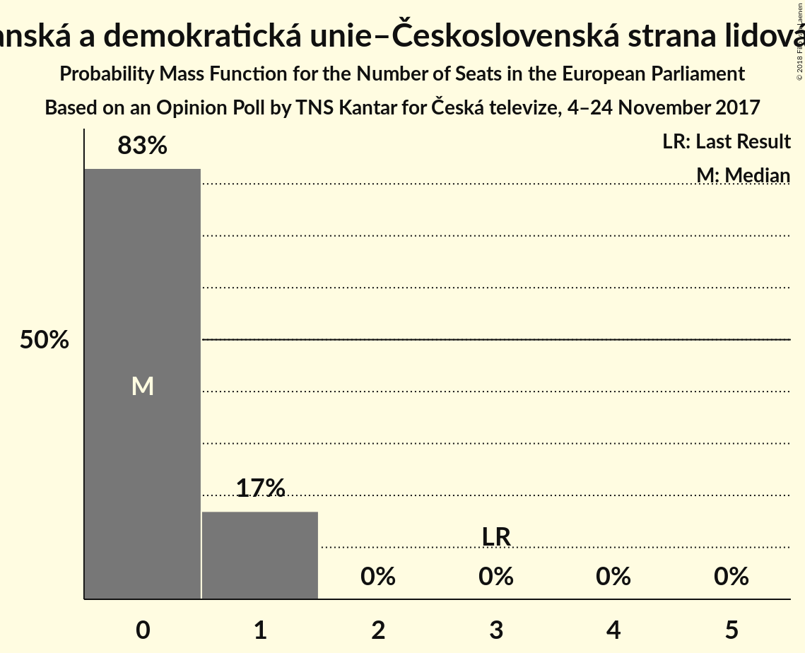

| Number of Seats | Probability | Accumulated | Special Marks |
|:---------------:|:-----------:|:-----------:|:-------------:|
| 0 | 83% | 100% | Median |
| 1 | 17% | 17% |  |
| 2 | 0% | 0% |  |
| 3 | 0% | 0% | Last Result |

### Strana zelených (Greens/EFA)

*For a full overview of the results for this party, see the [Strana zelených (Greens/EFA)](party-stranazelenýchgreensefa.html) page.*

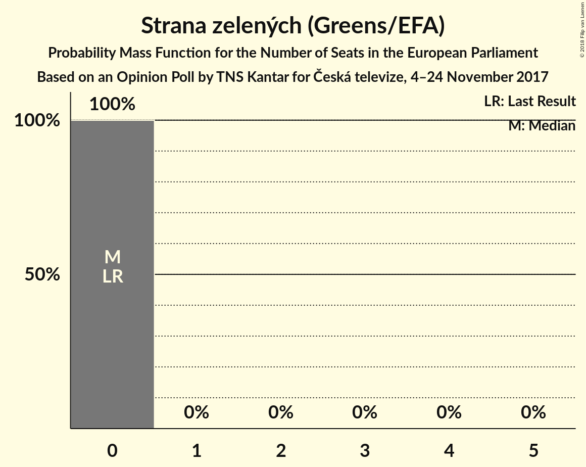

| Number of Seats | Probability | Accumulated | Special Marks |
|:---------------:|:-----------:|:-----------:|:-------------:|
| 0 | 100% | 100% | Last Result, Median |

## Coalitions

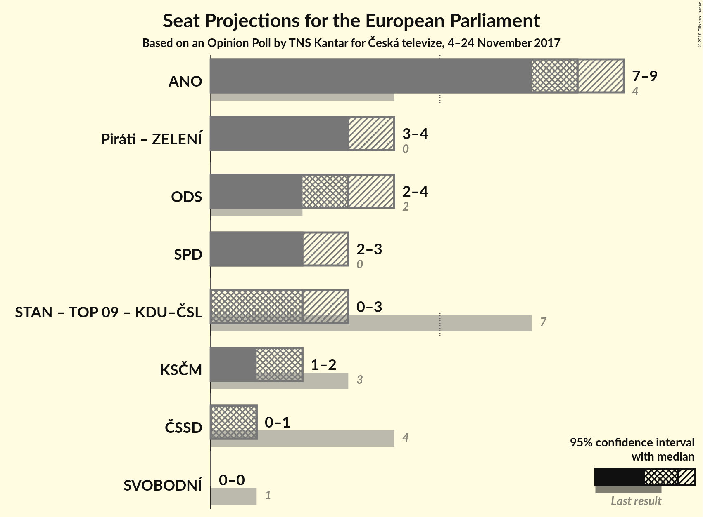

### Confidence Intervals

| Coalition | Last Result | Median | Majority? | 80% Confidence Interval | 90% Confidence Interval | 95% Confidence Interval | 99% Confidence Interval |
|:---------:|:-----------:|:------:|:---------:|:-----------------------:|:-----------------------:|:-----------------------:|:-----------------------:|
| ANO 2011 (ALDE) | 4 | 8 | 0% | 8–9 | 7–9 | 7–9 | 7–9 |
| Česká pirátská strana (Greens/EFA) – Strana zelených (Greens/EFA) | 0 | 3 | 0% | 3–4 | 3–4 | 3–4 | 3–4 |
| Občanská demokratická strana (ECR) | 2 | 3 | 0% | 3 | 3 | 2–4 | 2–4 |
| Svoboda a přímá demokracie (ENF) | 0 | 2 | 0% | 2–3 | 2–3 | 2–3 | 2–3 |
| Starostové a nezávislí (EPP) – TOP 09 (EPP) – Křesťanská a demokratická unie–Československá strana lidová (EPP) | 7 | 2 | 0% | 1–2 | 0–3 | 0–3 | 0–3 |
| Komunistická strana Čech a Moravy (GUE/NGL) | 3 | 2 | 0% | 1–2 | 1–2 | 1–2 | 1–2 |
| Česká strana sociálně demokratická (S&D) | 4 | 1 | 0% | 0–1 | 0–1 | 0–1 | 0–2 |

### ANO 2011 (ALDE)

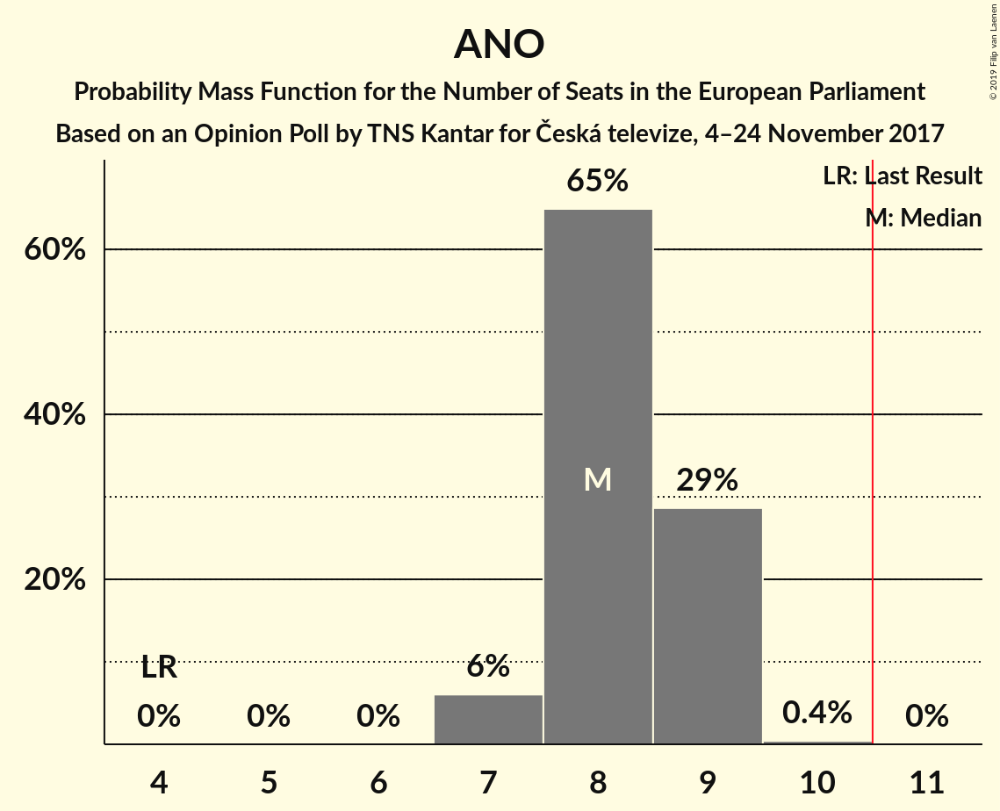

| Number of Seats | Probability | Accumulated | Special Marks |
|:---------------:|:-----------:|:-----------:|:-------------:|
| 4 | 0% | 100% | Last Result |
| 5 | 0% | 100% |  |
| 6 | 0% | 100% |  |
| 7 | 6% | 100% |  |
| 8 | 65% | 94% | Median |
| 9 | 29% | 29% |  |
| 10 | 0.4% | 0.4% |  |
| 11 | 0% | 0% | Majority |

### Česká pirátská strana (Greens/EFA) – Strana zelených (Greens/EFA)

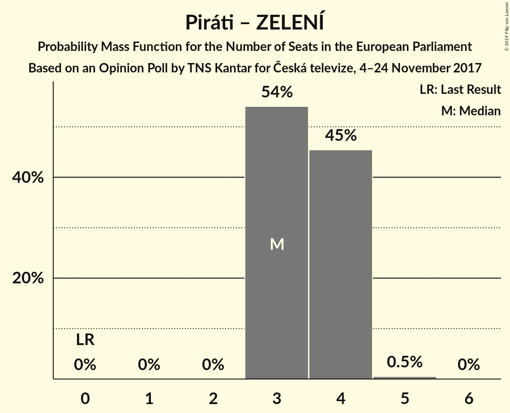

| Number of Seats | Probability | Accumulated | Special Marks |
|:---------------:|:-----------:|:-----------:|:-------------:|
| 0 | 0% | 100% | Last Result |
| 1 | 0% | 100% |  |
| 2 | 0% | 100% |  |
| 3 | 54% | 100% | Median |
| 4 | 45% | 46% |  |
| 5 | 0.5% | 0.5% |  |
| 6 | 0% | 0% |  |

### Občanská demokratická strana (ECR)

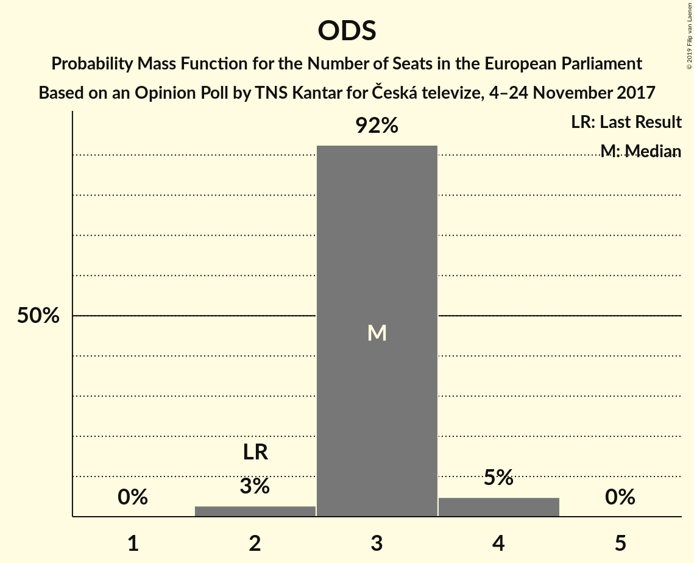

| Number of Seats | Probability | Accumulated | Special Marks |
|:---------------:|:-----------:|:-----------:|:-------------:|
| 2 | 3% | 100% | Last Result |
| 3 | 92% | 97% | Median |
| 4 | 5% | 5% |  |
| 5 | 0% | 0% |  |

### Svoboda a přímá demokracie (ENF)

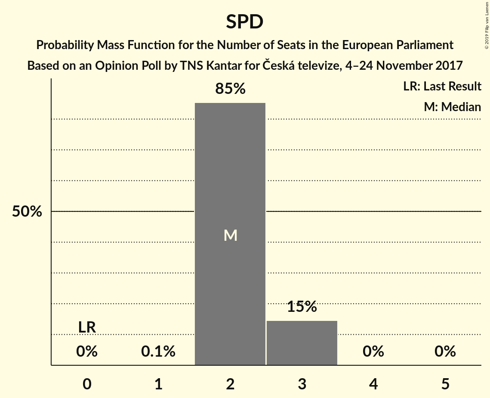

| Number of Seats | Probability | Accumulated | Special Marks |
|:---------------:|:-----------:|:-----------:|:-------------:|
| 0 | 0% | 100% | Last Result |
| 1 | 0.1% | 100% |  |
| 2 | 85% | 99.9% | Median |
| 3 | 15% | 15% |  |
| 4 | 0% | 0% |  |

### Starostové a nezávislí (EPP) – TOP 09 (EPP) – Křesťanská a demokratická unie–Československá strana lidová (EPP)

| Number of Seats | Probability | Accumulated | Special Marks |
|:---------------:|:-----------:|:-----------:|:-------------:|
| 0 | 8% | 100% |  |
| 1 | 39% | 92% | Median |
| 2 | 47% | 53% |  |
| 3 | 7% | 7% |  |
| 4 | 0.1% | 0.1% |  |
| 5 | 0% | 0% |  |
| 6 | 0% | 0% |  |
| 7 | 0% | 0% | Last Result |

### Komunistická strana Čech a Moravy (GUE/NGL)

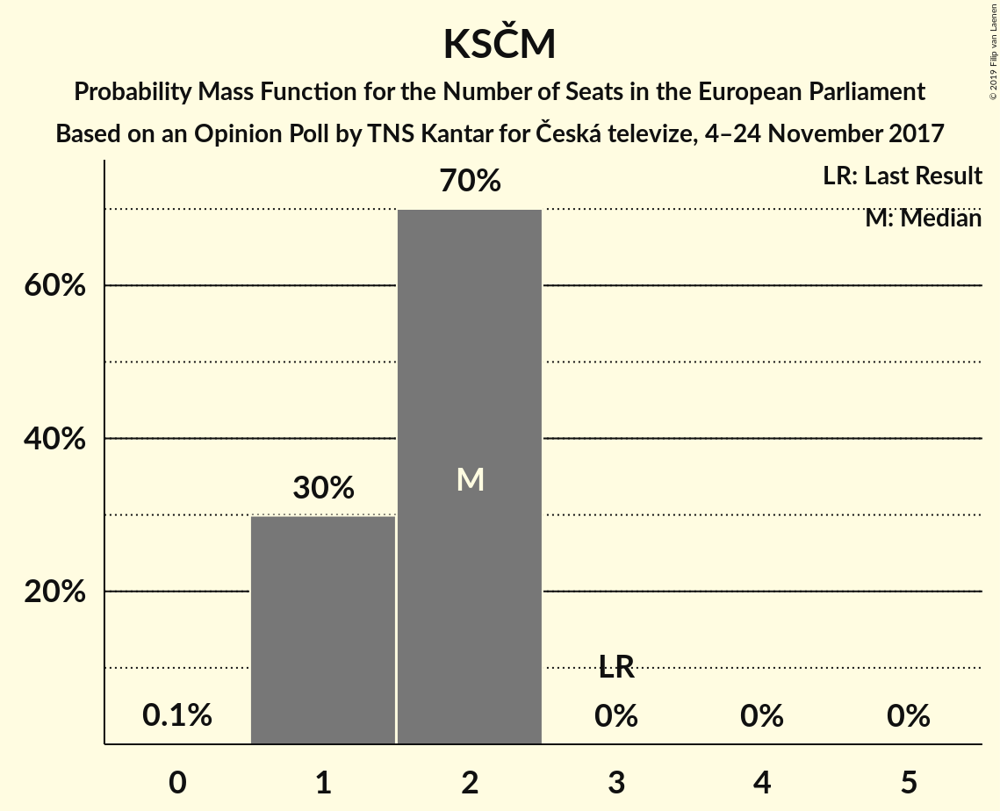

| Number of Seats | Probability | Accumulated | Special Marks |
|:---------------:|:-----------:|:-----------:|:-------------:|
| 0 | 0.1% | 100% |  |
| 1 | 30% | 99.9% |  |
| 2 | 70% | 70% | Median |
| 3 | 0% | 0% | Last Result |

### Česká strana sociálně demokratická (S&D)

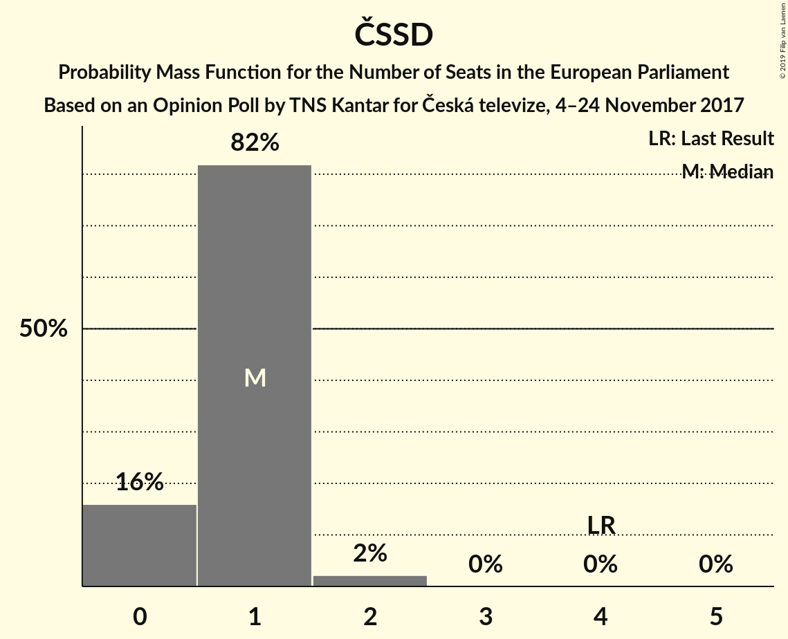

| Number of Seats | Probability | Accumulated | Special Marks |
|:---------------:|:-----------:|:-----------:|:-------------:|
| 0 | 16% | 100% |  |
| 1 | 82% | 84% | Median |
| 2 | 2% | 2% |  |
| 3 | 0% | 0% |  |
| 4 | 0% | 0% | Last Result |

## Technical Information

### Opinion Poll

+ **Polling firm:** TNS Kantar
+ **Commissioner(s):** Česká televize
+ **Fieldwork period:** 4–24 November 2017

### Calculations

+ **Sample size:** 1200
+ **Simulations done:** 2,097,152
+ **Error estimate:** 0.81%

