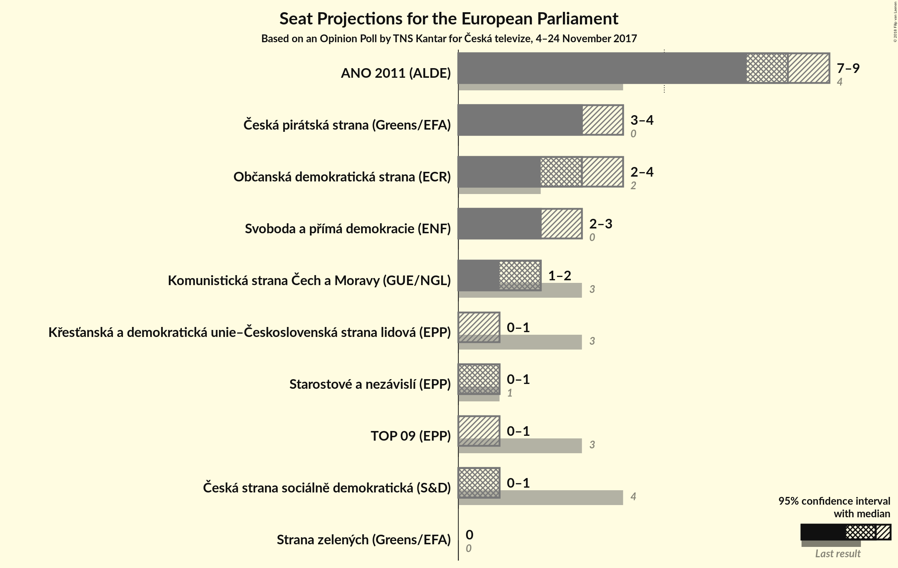

# Opinion Poll by TNS Kantar for Česká televize, 4–24 November 2017

<a href="#voting-intentions">Voting Intentions</a> | <a href="#seats">Seats</a> | <a href="#coalitions">Coalitions</a> | <a href="#technical-information">Technical Information</a>

## Voting Intentions

### Confidence Intervals

| Party | Last Result | Poll Result | 80% Confidence Interval | 90% Confidence Interval | 95% Confidence Interval | 99% Confidence Interval |
|:-----:|:-----------:|:-----------:|:-----------------------:|:-----------------------:|:-----------------------:|:-----------------------:|
| ANO 2011 (ALDE) | 16.1% | 30.0% | 28.3–31.7% |27.9–32.2% |27.5–32.7% |26.7–33.5% |
| Česká pirátská strana (*) | 4.8% | 14.0% | 12.8–15.4% |12.4–15.7% |12.1–16.1% |11.6–16.8% |
| TOP 09–Starostové a nezávislí–Strana zelených (EPP) | 3.8% | 13.5% | N/A |N/A |N/A |N/A |
| Občanská demokratická strana (ECR) | 7.7% | 12.0% | 10.9–13.3% |10.5–13.7% |10.3–14.0% |9.8–14.6% |
| Svoboda a přímá demokracie (EAPN) | 0.0% | 9.5% | 8.5–10.7% |8.2–11.0% |8.0–11.3% |7.5–11.9% |
| Komunistická strana Čech a Moravy (GUE/NGL) | 11.0% | 7.0% | 6.1–8.0% |5.9–8.3% |5.7–8.6% |5.3–9.1% |
| Česká strana sociálně demokratická (S&D) | 14.2% | 5.5% | 4.7–6.4% |4.5–6.7% |4.3–7.0% |4.0–7.4% |
| Křesťanská a demokratická unie–Československá strana lidová (EPP) | 10.0% | 4.5% | 3.8–5.4% |3.6–5.6% |3.5–5.8% |3.2–6.3% |

*Note:* The poll result column reflects the actual value used in the calculations. Published results may vary slightly, and in addition be rounded to fewer digits.

## Seats

### Confidence Intervals

| Party | Last Result | Median | 80% Confidence Interval | 90% Confidence Interval | 95% Confidence Interval | 99% Confidence Interval |
|:-----:|:-----------:|:------:|:-----------------------:|:-----------------------:|:-----------------------:|:-----------------------:|
| <a href="#ano-2011-(alde)">ANO 2011 (ALDE)</a> | 4 | 8 | 8–9 |7–9 |7–9 |7–9 |
| <a href="#česká-pirátská-strana-(*)">Česká pirátská strana (*)</a> | 0 | 3 | 3–4 |3–4 |3–4 |3–4 |
| <a href="#top-09–starostové-a-nezávislí–strana-zelených-(epp)">TOP 09–Starostové a nezávislí–Strana zelených (EPP)</a> | 4 | N/A | N/A |N/A |N/A |N/A |
| <a href="#občanská-demokratická-strana-(ecr)">Občanská demokratická strana (ECR)</a> | 2 | 3 | 3 |3 |2–4 |2–4 |
| <a href="#svoboda-a-přímá-demokracie-(eapn)">Svoboda a přímá demokracie (EAPN)</a> | 0 | 2 | 2–3 |2–3 |2–3 |2–3 |
| <a href="#komunistická-strana-čech-a-moravy-(gue/ngl)">Komunistická strana Čech a Moravy (GUE/NGL)</a> | 3 | 2 | 1–2 |1–2 |1–2 |1–2 |
| <a href="#česká-strana-sociálně-demokratická-(s&d)">Česká strana sociálně demokratická (S&D)</a> | 4 | 1 | 0–1 |0–1 |0–1 |0–2 |
| <a href="#křesťanská-a-demokratická-unie–československá-strana-lidová-(epp)">Křesťanská a demokratická unie–Československá strana lidová (EPP)</a> | 3 | 0 | 0–1 |0–1 |0–1 |0–1 |

