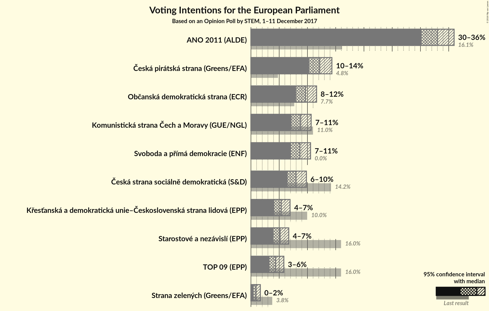
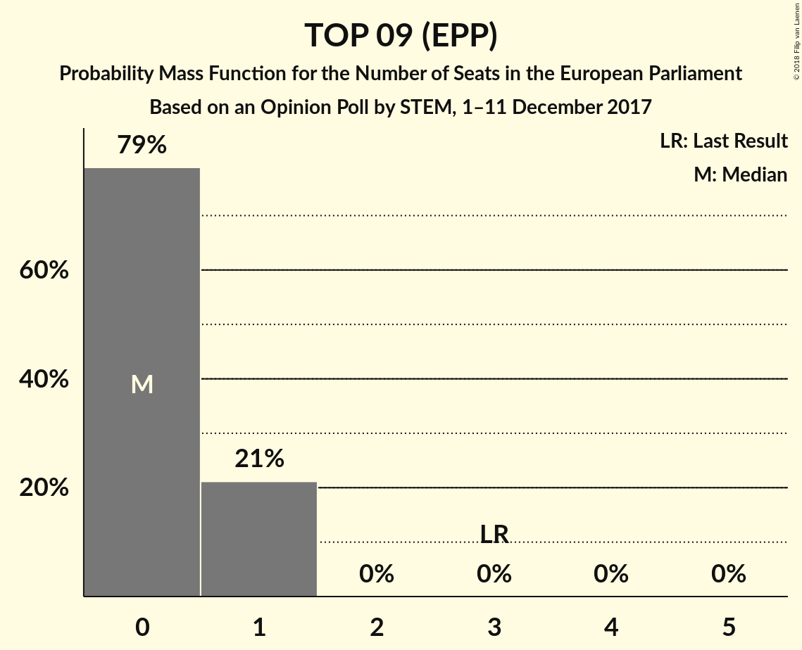

# Opinion Poll by STEM, 1–11 December 2017

<a href="#voting-intentions">Voting Intentions</a> | <a href="#seats">Seats</a> | <a href="#coalitions">Coalitions</a> | <a href="#technical-information">Technical Information</a>

## Voting Intentions

### Confidence Intervals

| Party | Last Result | Poll Result | 80% Confidence Interval | 90% Confidence Interval | 95% Confidence Interval | 99% Confidence Interval |
|:-----:|:-----------:|:-----------:|:-----------------------:|:-----------------------:|:-----------------------:|:-----------------------:|
| ANO 2011 (ALDE) | 16.1% | 33.0% | 31.2–34.9% |30.6–35.5% |30.2–36.0% |29.3–36.9% |
| Česká pirátská strana (Greens/EFA) | 4.8% | 12.2% | 10.9–13.6% |10.6–14.0% |10.3–14.3% |9.8–15.0% |
| Občanská demokratická strana (ECR) | 7.7% | 9.6% | 8.6–10.9% |8.2–11.3% |8.0–11.6% |7.5–12.3% |
| Komunistická strana Čech a Moravy (GUE/NGL) | 11.0% | 8.8% | 7.7–10.0% |7.4–10.3% |7.2–10.7% |6.7–11.3% |
| Svoboda a přímá demokracie (ENF) | 0.0% | 8.7% | 7.6–9.9% |7.3–10.2% |7.1–10.5% |6.6–11.2% |
| Česká strana sociálně demokratická (S&D) | 14.2% | 8.0% | 7.0–9.2% |6.7–9.5% |6.5–9.8% |6.0–10.4% |
| Křesťanská a demokratická unie–Československá strana lidová (EPP) | 10.0% | 5.4% | 4.5–6.4% |4.3–6.7% |4.1–6.9% |3.8–7.4% |
| Starostové a nezávislí (EPP) | 16.0% | 5.2% | 4.4–6.2% |4.1–6.4% |4.0–6.7% |3.6–7.2% |
| TOP 09 (EPP) | 16.0% | 4.4% | 3.7–5.3% |3.5–5.6% |3.3–5.8% |3.0–6.3% |
| Strana zelených (Greens/EFA) | 3.8% | 0.9% | 0.6–1.4% |0.5–1.5% |0.5–1.7% |0.4–1.9% |

*Note:* The poll result column reflects the actual value used in the calculations. Published results may vary slightly, and in addition be rounded to fewer digits.

## Seats

### Confidence Intervals

| Party | Last Result | Median | 80% Confidence Interval | 90% Confidence Interval | 95% Confidence Interval | 99% Confidence Interval |
|:-----:|:-----------:|:------:|:-----------------------:|:-----------------------:|:-----------------------:|:-----------------------:|
| <a href="#ano-2011-(alde)">ANO 2011 (ALDE)</a> | 4 | 9 | 8–10 |8–10 |8–10 |7–10 |
| <a href="#česká-pirátská-strana-(greens/efa)">Česká pirátská strana (Greens/EFA)</a> | 0 | 3 | 3 |2–3 |2–4 |2–4 |
| <a href="#občanská-demokratická-strana-(ecr)">Občanská demokratická strana (ECR)</a> | 2 | 2 | 2–3 |2–3 |2–3 |2–3 |
| <a href="#komunistická-strana-čech-a-moravy-(gue/ngl)">Komunistická strana Čech a Moravy (GUE/NGL)</a> | 3 | 2 | 2 |2 |2 |1–3 |
| <a href="#svoboda-a-přímá-demokracie-(enf)">Svoboda a přímá demokracie (ENF)</a> | 0 | 2 | 2 |2 |2–3 |1–3 |
| <a href="#česká-strana-sociálně-demokratická-(s&d)">Česká strana sociálně demokratická (S&D)</a> | 4 | 2 | 1–2 |1–2 |1–2 |1–2 |
| <a href="#křesťanská-a-demokratická-unie–československá-strana-lidová-(epp)">Křesťanská a demokratická unie–Československá strana lidová (EPP)</a> | 3 | 0 | 0–1 |0–1 |0–1 |0–1 |
| <a href="#starostové-a-nezávislí-(epp)">Starostové a nezávislí (EPP)</a> | 1 | 0 | 0–1 |0–1 |0–1 |0–1 |
| <a href="#top-09-(epp)">TOP 09 (EPP)</a> | 3 | 0 | 0–1 |0–1 |0–1 |0–1 |
| <a href="#strana-zelených-(greens/efa)">Strana zelených (Greens/EFA)</a> | 0 | 0 | 0 |0 |0 |0 |

### ANO 2011 (ALDE)

*For a full overview of the results for this party, see the [ANO 2011 (ALDE)](party-ano2011alde.html) page.*

| Number of Seats | Probability | Accumulated | Special Marks |
|:---------------:|:-----------:|:-----------:|:-------------:|
| 4 | 0% | 100% | Last Result |
| 5 | 0% | 100% |  |
| 6 | 0% | 100% |  |
| 7 | 1.5% | 100% |  |
| 8 | 25% | 98.5% |  |
| 9 | 50% | 73% | Median |
| 10 | 23% | 23% |  |
| 11 | 0.1% | 0.1% | Majority |
| 12 | 0% | 0% |  |

### Česká pirátská strana (Greens/EFA)

*For a full overview of the results for this party, see the [Česká pirátská strana (Greens/EFA)](party-českápirátskástranagreensefa.html) page.*

| Number of Seats | Probability | Accumulated | Special Marks |
|:---------------:|:-----------:|:-----------:|:-------------:|
| 0 | 0% | 100% | Last Result |
| 1 | 0% | 100% |  |
| 2 | 8% | 100% |  |
| 3 | 88% | 92% | Median |
| 4 | 4% | 4% |  |
| 5 | 0% | 0% |  |

### Občanská demokratická strana (ECR)

*For a full overview of the results for this party, see the [Občanská demokratická strana (ECR)](party-občanskádemokratickástranaecr.html) page.*

| Number of Seats | Probability | Accumulated | Special Marks |
|:---------------:|:-----------:|:-----------:|:-------------:|
| 1 | 0.2% | 100% |  |
| 2 | 88% | 99.8% | Last Result, Median |
| 3 | 12% | 12% |  |
| 4 | 0% | 0% |  |

### Komunistická strana Čech a Moravy (GUE/NGL)

*For a full overview of the results for this party, see the [Komunistická strana Čech a Moravy (GUE/NGL)](party-komunistickástranačechamoravyguengl.html) page.*

| Number of Seats | Probability | Accumulated | Special Marks |
|:---------------:|:-----------:|:-----------:|:-------------:|
| 1 | 2% | 100% |  |
| 2 | 96% | 98% | Median |
| 3 | 2% | 2% | Last Result |
| 4 | 0% | 0% |  |

### Svoboda a přímá demokracie (ENF)

*For a full overview of the results for this party, see the [Svoboda a přímá demokracie (ENF)](party-svobodaapřímádemokracieenf.html) page.*

| Number of Seats | Probability | Accumulated | Special Marks |
|:---------------:|:-----------:|:-----------:|:-------------:|
| 0 | 0% | 100% | Last Result |
| 1 | 2% | 100% |  |
| 2 | 94% | 98% | Median |
| 3 | 4% | 4% |  |
| 4 | 0% | 0% |  |

### Česká strana sociálně demokratická (S&D)

*For a full overview of the results for this party, see the [Česká strana sociálně demokratická (S&D)](party-českástranasociálnědemokratickásd.html) page.*

| Number of Seats | Probability | Accumulated | Special Marks |
|:---------------:|:-----------:|:-----------:|:-------------:|
| 1 | 19% | 100% |  |
| 2 | 81% | 81% | Median |
| 3 | 0.1% | 0.1% |  |
| 4 | 0% | 0% | Last Result |

### Křesťanská a demokratická unie–Československá strana lidová (EPP)

*For a full overview of the results for this party, see the [Křesťanská a demokratická unie–Československá strana lidová (EPP)](party-křesťanskáademokratickáunie–československástranalidováepp.html) page.*

| Number of Seats | Probability | Accumulated | Special Marks |
|:---------------:|:-----------:|:-----------:|:-------------:|
| 0 | 55% | 100% | Median |
| 1 | 44% | 45% |  |
| 2 | 0.4% | 0.4% |  |
| 3 | 0% | 0% | Last Result |

### Starostové a nezávislí (EPP)

*For a full overview of the results for this party, see the [Starostové a nezávislí (EPP)](party-starostovéanezávislíepp.html) page.*

| Number of Seats | Probability | Accumulated | Special Marks |
|:---------------:|:-----------:|:-----------:|:-------------:|
| 0 | 60% | 100% | Median |
| 1 | 39% | 40% | Last Result |
| 2 | 0.1% | 0.1% |  |
| 3 | 0% | 0% |  |

### TOP 09 (EPP)

*For a full overview of the results for this party, see the [TOP 09 (EPP)](party-top09epp.html) page.*

| Number of Seats | Probability | Accumulated | Special Marks |
|:---------------:|:-----------:|:-----------:|:-------------:|
| 0 | 79% | 100% | Median |
| 1 | 21% | 21% |  |
| 2 | 0% | 0% |  |
| 3 | 0% | 0% | Last Result |

### Strana zelených (Greens/EFA)

*For a full overview of the results for this party, see the [Strana zelených (Greens/EFA)](party-stranazelenýchgreensefa.html) page.*

| Number of Seats | Probability | Accumulated | Special Marks |
|:---------------:|:-----------:|:-----------:|:-------------:|
| 0 | 100% | 100% | Last Result, Median |

## Coalitions

### Confidence Intervals

| Coalition | Last Result | Median | Majority? | 80% Confidence Interval | 90% Confidence Interval | 95% Confidence Interval | 99% Confidence Interval |
|:---------:|:-----------:|:------:|:---------:|:-----------------------:|:-----------------------:|:-----------------------:|:-----------------------:|
| ANO 2011 (ALDE) | 4 | 9 | 0.1% | 8–10 | 8–10 | 8–10 | 7–10 |
| Česká pirátská strana (Greens/EFA) – Strana zelených (Greens/EFA) | 0 | 3 | 0% | 3 | 2–3 | 2–4 | 2–4 |
| Občanská demokratická strana (ECR) | 2 | 2 | 0% | 2–3 | 2–3 | 2–3 | 2–3 |
| Svoboda a přímá demokracie (ENF) | 0 | 2 | 0% | 2 | 2 | 2–3 | 1–3 |
| Křesťanská a demokratická unie–Československá strana lidová (EPP) – Starostové a nezávislí (EPP) – TOP 09 (EPP) | 7 | 1 | 0% | 0–2 | 0–3 | 0–3 | 0–3 |
| Komunistická strana Čech a Moravy (GUE/NGL) | 3 | 2 | 0% | 2 | 2 | 2 | 1–3 |
| Česká strana sociálně demokratická (S&D) | 4 | 2 | 0% | 1–2 | 1–2 | 1–2 | 1–2 |

### ANO 2011 (ALDE)

| Number of Seats | Probability | Accumulated | Special Marks |
|:---------------:|:-----------:|:-----------:|:-------------:|
| 4 | 0% | 100% | Last Result |
| 5 | 0% | 100% |  |
| 6 | 0% | 100% |  |
| 7 | 1.5% | 100% |  |
| 8 | 25% | 98.5% |  |
| 9 | 50% | 73% | Median |
| 10 | 23% | 23% |  |
| 11 | 0.1% | 0.1% | Majority |
| 12 | 0% | 0% |  |

### Česká pirátská strana (Greens/EFA) – Strana zelených (Greens/EFA)

| Number of Seats | Probability | Accumulated | Special Marks |
|:---------------:|:-----------:|:-----------:|:-------------:|
| 0 | 0% | 100% | Last Result |
| 1 | 0% | 100% |  |
| 2 | 8% | 100% |  |
| 3 | 88% | 92% | Median |
| 4 | 4% | 4% |  |
| 5 | 0% | 0% |  |

### Občanská demokratická strana (ECR)

| Number of Seats | Probability | Accumulated | Special Marks |
|:---------------:|:-----------:|:-----------:|:-------------:|
| 1 | 0.2% | 100% |  |
| 2 | 88% | 99.8% | Last Result, Median |
| 3 | 12% | 12% |  |
| 4 | 0% | 0% |  |

### Svoboda a přímá demokracie (ENF)

| Number of Seats | Probability | Accumulated | Special Marks |
|:---------------:|:-----------:|:-----------:|:-------------:|
| 0 | 0% | 100% | Last Result |
| 1 | 2% | 100% |  |
| 2 | 94% | 98% | Median |
| 3 | 4% | 4% |  |
| 4 | 0% | 0% |  |

### Křesťanská a demokratická unie–Československá strana lidová (EPP) – Starostové a nezávislí (EPP) – TOP 09 (EPP)

| Number of Seats | Probability | Accumulated | Special Marks |
|:---------------:|:-----------:|:-----------:|:-------------:|
| 0 | 31% | 100% | Median |
| 1 | 37% | 69% |  |
| 2 | 27% | 32% |  |
| 3 | 5% | 5% |  |
| 4 | 0% | 0% |  |
| 5 | 0% | 0% |  |
| 6 | 0% | 0% |  |
| 7 | 0% | 0% | Last Result |

### Komunistická strana Čech a Moravy (GUE/NGL)

| Number of Seats | Probability | Accumulated | Special Marks |
|:---------------:|:-----------:|:-----------:|:-------------:|
| 1 | 2% | 100% |  |
| 2 | 96% | 98% | Median |
| 3 | 2% | 2% | Last Result |
| 4 | 0% | 0% |  |

### Česká strana sociálně demokratická (S&D)

| Number of Seats | Probability | Accumulated | Special Marks |
|:---------------:|:-----------:|:-----------:|:-------------:|
| 1 | 19% | 100% |  |
| 2 | 81% | 81% | Median |
| 3 | 0.1% | 0.1% |  |
| 4 | 0% | 0% | Last Result |

## Technical Information

### Opinion Poll

+ **Polling firm:** STEM
+ **Commissioner(s):** —
+ **Fieldwork period:** 1–11 December 2017

### Calculations

+ **Sample size:** 1027
+ **Simulations done:** 2,097,152
+ **Error estimate:** 0.85%

