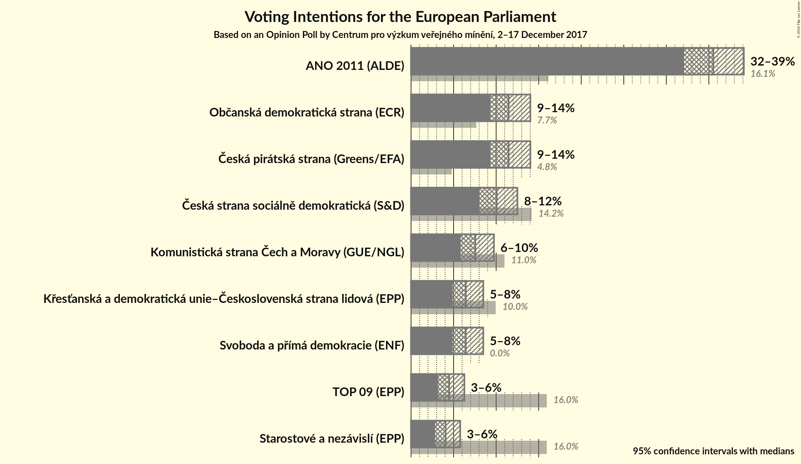
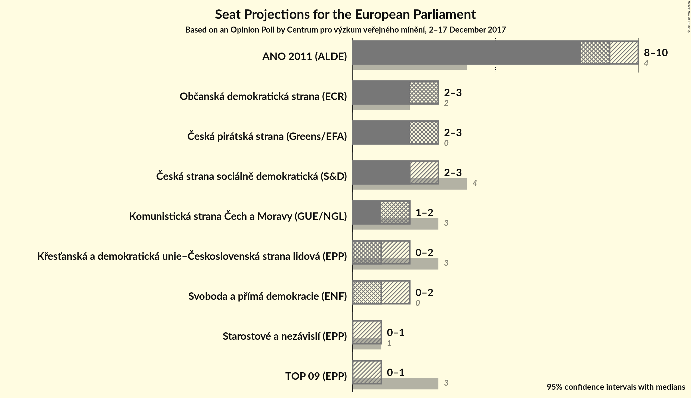

# Opinion Poll by Centrum pro výzkum veřejného mínění, 2–17 December 2017

<a href="#voting-intentions">Voting Intentions</a> | <a href="#seats">Seats</a> | <a href="#coalitions">Coalitions</a> | <a href="#technical-information">Technical Information</a>

## Voting Intentions

### Confidence Intervals

| Party | Last Result | Poll Result | 80% Confidence Interval | 90% Confidence Interval | 95% Confidence Interval | 99% Confidence Interval |
|:-----:|:-----------:|:-----------:|:-----------------------:|:-----------------------:|:-----------------------:|:-----------------------:|
| ANO 2011 (ALDE) | 16.1% | 35.5% | 33.3–37.9% |32.6–38.5% |32.1–39.1% |31.0–40.2% |
| Občanská demokratická strana (ECR) | 7.7% | 11.5% | 10.1–13.1% |9.7–13.6% |9.3–14.0% |8.7–14.9% |
| Česká pirátská strana (*) | 4.8% | 11.5% | 10.1–13.1% |9.7–13.6% |9.3–14.0% |8.7–14.9% |
| Česká strana sociálně demokratická (S&D) | 14.2% | 10.1% | 8.7–11.7% |8.4–12.1% |8.1–12.5% |7.5–13.3% |
| TOP 09–Starostové a nezávislí–Strana zelených (EPP) | 3.8% | 8.5% | N/A |N/A |N/A |N/A |
| Komunistická strana Čech a Moravy (GUE/NGL) | 11.0% | 7.6% | 6.4–9.0% |6.1–9.4% |5.8–9.7% |5.3–10.5% |
| Svoboda a přímá demokracie (EAPN) | 0.0% | 6.4% | 5.4–7.8% |5.1–8.2% |4.9–8.5% |4.4–9.2% |
| Křesťanská a demokratická unie–Československá strana lidová (EPP) | 10.0% | 6.4% | 5.4–7.8% |5.1–8.2% |4.9–8.5% |4.4–9.2% |

*Note:* The poll result column reflects the actual value used in the calculations. Published results may vary slightly, and in addition be rounded to fewer digits.

## Seats

### Confidence Intervals

| Party | Last Result | Median | 80% Confidence Interval | 90% Confidence Interval | 95% Confidence Interval | 99% Confidence Interval |
|:-----:|:-----------:|:------:|:-----------------------:|:-----------------------:|:-----------------------:|:-----------------------:|
| <a href="#ano-2011-(alde)">ANO 2011 (ALDE)</a> | 4 | 9 | 8–10 |8–10 |8–10 |8–11 |
| <a href="#občanská-demokratická-strana-(ecr)">Občanská demokratická strana (ECR)</a> | 2 | 3 | 2–3 |2–3 |2–3 |2–4 |
| <a href="#česká-pirátská-strana-(*)">Česká pirátská strana (*)</a> | 0 | 3 | 2–3 |2–3 |2–3 |2–4 |
| <a href="#česká-strana-sociálně-demokratická-(s&d)">Česká strana sociálně demokratická (S&D)</a> | 4 | 2 | 2–3 |2–3 |2–3 |2–3 |
| <a href="#top-09–starostové-a-nezávislí–strana-zelených-(epp)">TOP 09–Starostové a nezávislí–Strana zelených (EPP)</a> | 4 | N/A | N/A |N/A |N/A |N/A |
| <a href="#komunistická-strana-čech-a-moravy-(gue/ngl)">Komunistická strana Čech a Moravy (GUE/NGL)</a> | 3 | 2 | 1–2 |1–2 |1–2 |1–2 |
| <a href="#svoboda-a-přímá-demokracie-(eapn)">Svoboda a přímá demokracie (EAPN)</a> | 0 | 1 | 1–2 |1–2 |0–2 |0–2 |
| <a href="#křesťanská-a-demokratická-unie–československá-strana-lidová-(epp)">Křesťanská a demokratická unie–Československá strana lidová (EPP)</a> | 3 | 1 | 1–2 |1–2 |0–2 |0–2 |

