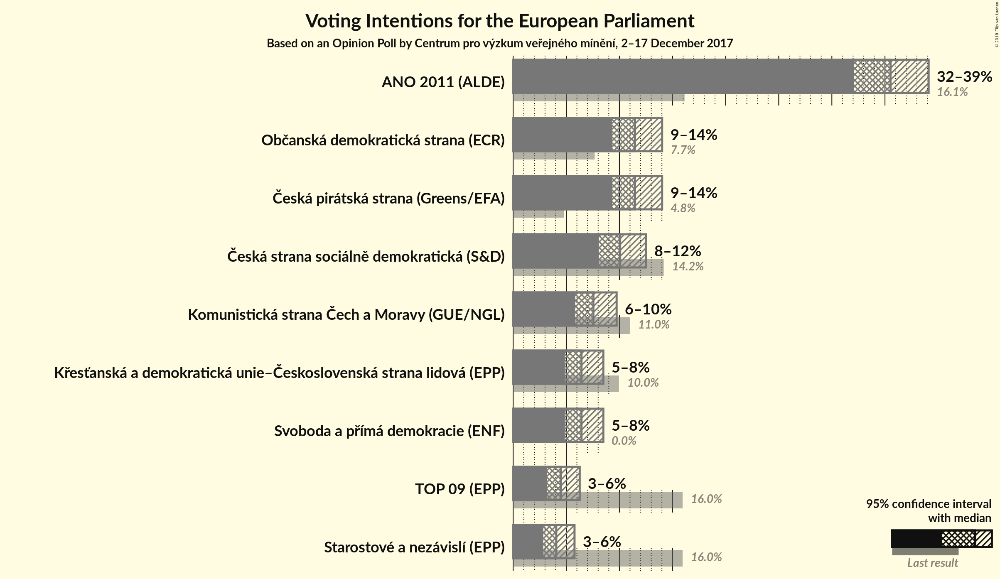
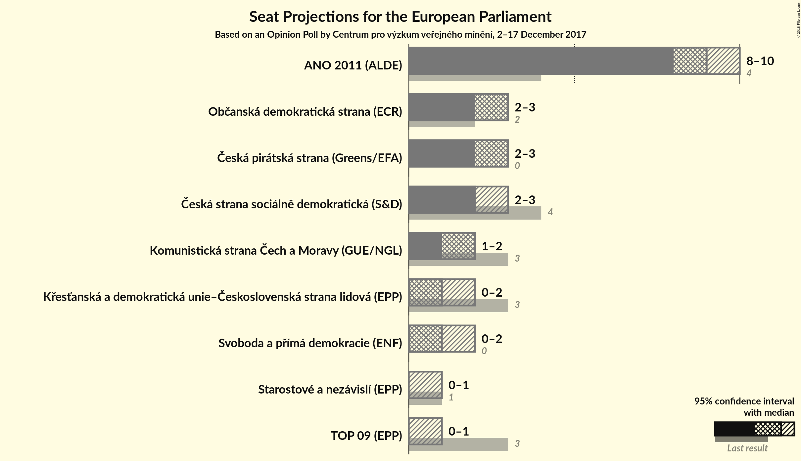
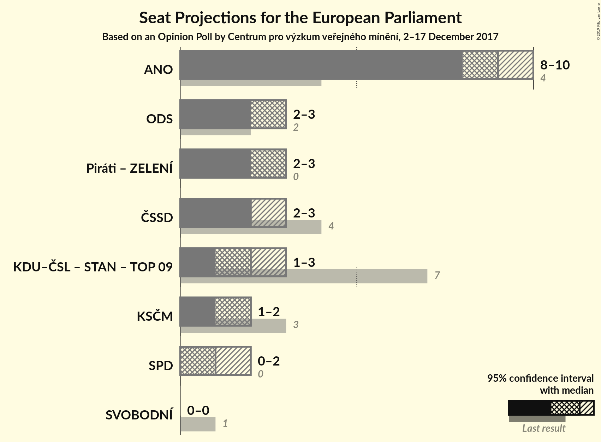

# Opinion Poll by Centrum pro výzkum veřejného mínění, 2–17 December 2017

<a href="#voting-intentions">Voting Intentions</a> | <a href="#seats">Seats</a> | <a href="#coalitions">Coalitions</a> | <a href="#technical-information">Technical Information</a>

## Voting Intentions

### Confidence Intervals

| Party | Last Result | Poll Result | 80% Confidence Interval | 90% Confidence Interval | 95% Confidence Interval | 99% Confidence Interval |
|:-----:|:-----------:|:-----------:|:-----------------------:|:-----------------------:|:-----------------------:|:-----------------------:|
| ANO 2011 (ALDE) | 16.1% | 35.5% | 33.3–37.9% |32.6–38.5% |32.1–39.1% |31.0–40.2% |
| Občanská demokratická strana (ECR) | 7.7% | 11.5% | 10.1–13.1% |9.7–13.6% |9.3–14.0% |8.7–14.9% |
| Česká pirátská strana (Greens/EFA) | 4.8% | 11.5% | 10.1–13.1% |9.7–13.6% |9.3–14.0% |8.7–14.9% |
| Česká strana sociálně demokratická (S&D) | 14.2% | 10.1% | 8.7–11.7% |8.4–12.1% |8.1–12.5% |7.5–13.3% |
| Komunistická strana Čech a Moravy (GUE/NGL) | 11.0% | 7.6% | 6.4–9.0% |6.1–9.4% |5.8–9.7% |5.3–10.5% |
| Svoboda a přímá demokracie (ENF) | 0.0% | 6.4% | 5.4–7.8% |5.1–8.2% |4.9–8.5% |4.4–9.2% |
| Křesťanská a demokratická unie–Československá strana lidová (EPP) | 10.0% | 6.4% | 5.4–7.8% |5.1–8.2% |4.9–8.5% |4.4–9.2% |
| TOP 09 (EPP) | 16.0% | 4.5% | 3.6–5.6% |3.4–6.0% |3.2–6.3% |2.8–6.9% |
| Starostové a nezávislí (EPP) | 16.0% | 4.1% | 3.2–5.2% |3.0–5.5% |2.8–5.8% |2.5–6.4% |

*Note:* The poll result column reflects the actual value used in the calculations. Published results may vary slightly, and in addition be rounded to fewer digits.

## Seats

### Confidence Intervals

| Party | Last Result | Median | 80% Confidence Interval | 90% Confidence Interval | 95% Confidence Interval | 99% Confidence Interval |
|:-----:|:-----------:|:------:|:-----------------------:|:-----------------------:|:-----------------------:|:-----------------------:|
| <a href="#ano-2011-(alde)">ANO 2011 (ALDE)</a> | 4 | 9 | 8–10 |8–10 |8–10 |8–11 |
| <a href="#občanská-demokratická-strana-(ecr)">Občanská demokratická strana (ECR)</a> | 2 | 3 | 2–3 |2–3 |2–3 |2–4 |
| <a href="#česká-pirátská-strana-(greens/efa)">Česká pirátská strana (Greens/EFA)</a> | 0 | 3 | 2–3 |2–3 |2–3 |2–4 |
| <a href="#česká-strana-sociálně-demokratická-(s&d)">Česká strana sociálně demokratická (S&D)</a> | 4 | 2 | 2–3 |2–3 |2–3 |2–3 |
| <a href="#komunistická-strana-čech-a-moravy-(gue/ngl)">Komunistická strana Čech a Moravy (GUE/NGL)</a> | 3 | 2 | 1–2 |1–2 |1–2 |1–2 |
| <a href="#svoboda-a-přímá-demokracie-(enf)">Svoboda a přímá demokracie (ENF)</a> | 0 | 1 | 1–2 |1–2 |0–2 |0–2 |
| <a href="#křesťanská-a-demokratická-unie–československá-strana-lidová-(epp)">Křesťanská a demokratická unie–Československá strana lidová (EPP)</a> | 3 | 1 | 1–2 |1–2 |0–2 |0–2 |
| <a href="#top-09-(epp)">TOP 09 (EPP)</a> | 3 | 0 | 0–1 |0–1 |0–1 |0–1 |
| <a href="#starostové-a-nezávislí-(epp)">Starostové a nezávislí (EPP)</a> | 1 | 0 | 0–1 |0–1 |0–1 |0–1 |

### ANO 2011 (ALDE)

*For a full overview of the results for this party, see the [ANO 2011 (ALDE)](party-ano2011alde.html) page.*

| Number of Seats | Probability | Accumulated | Special Marks |
|:---------------:|:-----------:|:-----------:|:-------------:|
| 4 | 0% | 100% | Last Result |
| 5 | 0% | 100% |  |
| 6 | 0% | 100% |  |
| 7 | 0.2% | 100% |  |
| 8 | 13% | 99.8% |  |
| 9 | 57% | 87% | Median |
| 10 | 29% | 30% |  |
| 11 | 1.3% | 1.3% | Majority |
| 12 | 0% | 0% |  |

### Občanská demokratická strana (ECR)

*For a full overview of the results for this party, see the [Občanská demokratická strana (ECR)](party-občanskádemokratickástranaecr.html) page.*

| Number of Seats | Probability | Accumulated | Special Marks |
|:---------------:|:-----------:|:-----------:|:-------------:|
| 2 | 34% | 100% | Last Result |
| 3 | 65% | 66% | Median |
| 4 | 1.0% | 1.0% |  |
| 5 | 0% | 0% |  |

### Česká pirátská strana (Greens/EFA)

*For a full overview of the results for this party, see the [Česká pirátská strana (Greens/EFA)](party-českápirátskástranagreensefa.html) page.*

| Number of Seats | Probability | Accumulated | Special Marks |
|:---------------:|:-----------:|:-----------:|:-------------:|
| 0 | 0% | 100% | Last Result |
| 1 | 0% | 100% |  |
| 2 | 34% | 100% |  |
| 3 | 66% | 66% | Median |
| 4 | 0.7% | 0.7% |  |
| 5 | 0% | 0% |  |

### Česká strana sociálně demokratická (S&D)

*For a full overview of the results for this party, see the [Česká strana sociálně demokratická (S&D)](party-českástranasociálnědemokratickásd.html) page.*

| Number of Seats | Probability | Accumulated | Special Marks |
|:---------------:|:-----------:|:-----------:|:-------------:|
| 1 | 0.4% | 100% |  |
| 2 | 79% | 99.6% | Median |
| 3 | 20% | 20% |  |
| 4 | 0.1% | 0.1% | Last Result |
| 5 | 0% | 0% |  |

### Komunistická strana Čech a Moravy (GUE/NGL)

*For a full overview of the results for this party, see the [Komunistická strana Čech a Moravy (GUE/NGL)](party-komunistickástranačechamoravyguengl.html) page.*

| Number of Seats | Probability | Accumulated | Special Marks |
|:---------------:|:-----------:|:-----------:|:-------------:|
| 0 | 0.2% | 100% |  |
| 1 | 42% | 99.8% |  |
| 2 | 58% | 58% | Median |
| 3 | 0.1% | 0.1% | Last Result |
| 4 | 0% | 0% |  |

### Svoboda a přímá demokracie (ENF)

*For a full overview of the results for this party, see the [Svoboda a přímá demokracie (ENF)](party-svobodaapřímádemokracieenf.html) page.*

| Number of Seats | Probability | Accumulated | Special Marks |
|:---------------:|:-----------:|:-----------:|:-------------:|
| 0 | 5% | 100% | Last Result |
| 1 | 77% | 95% | Median |
| 2 | 18% | 18% |  |
| 3 | 0% | 0% |  |

### Křesťanská a demokratická unie–Československá strana lidová (EPP)

*For a full overview of the results for this party, see the [Křesťanská a demokratická unie–Československá strana lidová (EPP)](party-křesťanskáademokratickáunie–československástranalidováepp.html) page.*

| Number of Seats | Probability | Accumulated | Special Marks |
|:---------------:|:-----------:|:-----------:|:-------------:|
| 0 | 4% | 100% |  |
| 1 | 74% | 96% | Median |
| 2 | 22% | 22% |  |
| 3 | 0% | 0% | Last Result |

### TOP 09 (EPP)

*For a full overview of the results for this party, see the [TOP 09 (EPP)](party-top09epp.html) page.*

| Number of Seats | Probability | Accumulated | Special Marks |
|:---------------:|:-----------:|:-----------:|:-------------:|
| 0 | 74% | 100% | Median |
| 1 | 25% | 26% |  |
| 2 | 0.1% | 0.1% |  |
| 3 | 0% | 0% | Last Result |

### Starostové a nezávislí (EPP)

*For a full overview of the results for this party, see the [Starostové a nezávislí (EPP)](party-starostovéanezávislíepp.html) page.*

| Number of Seats | Probability | Accumulated | Special Marks |
|:---------------:|:-----------:|:-----------:|:-------------:|
| 0 | 86% | 100% | Median |
| 1 | 14% | 14% | Last Result |
| 2 | 0% | 0% |  |

## Coalitions

### Confidence Intervals

| Coalition | Last Result | Median | Majority? | 80% Confidence Interval | 90% Confidence Interval | 95% Confidence Interval | 99% Confidence Interval |
|:---------:|:-----------:|:------:|:---------:|:-----------------------:|:-----------------------:|:-----------------------:|:-----------------------:|
| ANO 2011 (ALDE) | 4 | 9 | 1.3% | 8–10 | 8–10 | 8–10 | 8–11 |
| Občanská demokratická strana (ECR) | 2 | 3 | 0% | 2–3 | 2–3 | 2–3 | 2–4 |
| Česká strana sociálně demokratická (S&D) | 4 | 2 | 0% | 2–3 | 2–3 | 2–3 | 2–3 |
| Křesťanská a demokratická unie–Československá strana lidová (EPP) – TOP 09 (EPP) – Starostové a nezávislí (EPP) | 7 | 2 | 0% | 1–2 | 1–3 | 1–3 | 0–3 |
| Komunistická strana Čech a Moravy (GUE/NGL) | 3 | 2 | 0% | 1–2 | 1–2 | 1–2 | 1–2 |
| Svoboda a přímá demokracie (ENF) | 0 | 1 | 0% | 1–2 | 1–2 | 0–2 | 0–2 |

### ANO 2011 (ALDE)

| Number of Seats | Probability | Accumulated | Special Marks |
|:---------------:|:-----------:|:-----------:|:-------------:|
| 4 | 0% | 100% | Last Result |
| 5 | 0% | 100% |  |
| 6 | 0% | 100% |  |
| 7 | 0.2% | 100% |  |
| 8 | 13% | 99.8% |  |
| 9 | 57% | 87% | Median |
| 10 | 29% | 30% |  |
| 11 | 1.3% | 1.3% | Majority |
| 12 | 0% | 0% |  |

### Občanská demokratická strana (ECR)

| Number of Seats | Probability | Accumulated | Special Marks |
|:---------------:|:-----------:|:-----------:|:-------------:|
| 2 | 34% | 100% | Last Result |
| 3 | 65% | 66% | Median |
| 4 | 1.0% | 1.0% |  |
| 5 | 0% | 0% |  |

### Česká strana sociálně demokratická (S&D)

| Number of Seats | Probability | Accumulated | Special Marks |
|:---------------:|:-----------:|:-----------:|:-------------:|
| 1 | 0.4% | 100% |  |
| 2 | 79% | 99.6% | Median |
| 3 | 20% | 20% |  |
| 4 | 0.1% | 0.1% | Last Result |
| 5 | 0% | 0% |  |

### Křesťanská a demokratická unie–Československá strana lidová (EPP) – TOP 09 (EPP) – Starostové a nezávislí (EPP)

| Number of Seats | Probability | Accumulated | Special Marks |
|:---------------:|:-----------:|:-----------:|:-------------:|
| 0 | 2% | 100% |  |
| 1 | 47% | 98% | Median |
| 2 | 45% | 52% |  |
| 3 | 7% | 7% |  |
| 4 | 0.2% | 0.2% |  |
| 5 | 0% | 0% |  |
| 6 | 0% | 0% |  |
| 7 | 0% | 0% | Last Result |

### Komunistická strana Čech a Moravy (GUE/NGL)

| Number of Seats | Probability | Accumulated | Special Marks |
|:---------------:|:-----------:|:-----------:|:-------------:|
| 0 | 0.2% | 100% |  |
| 1 | 42% | 99.8% |  |
| 2 | 58% | 58% | Median |
| 3 | 0.1% | 0.1% | Last Result |
| 4 | 0% | 0% |  |

### Svoboda a přímá demokracie (ENF)

| Number of Seats | Probability | Accumulated | Special Marks |
|:---------------:|:-----------:|:-----------:|:-------------:|
| 0 | 5% | 100% | Last Result |
| 1 | 77% | 95% | Median |
| 2 | 18% | 18% |  |
| 3 | 0% | 0% |  |

## Technical Information

### Opinion Poll

+ **Polling firm:** Centrum pro výzkum veřejného mínění
+ **Commissioner(s):** —
+ **Fieldwork period:** 2–17 December 2017

### Calculations

+ **Sample size:** 715
+ **Simulations done:** 2,097,152
+ **Error estimate:** 1.89%

