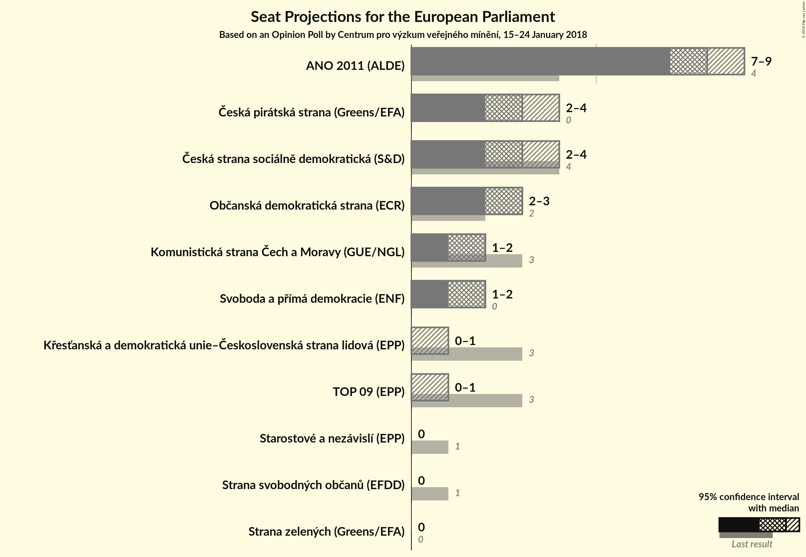

# Opinion Poll by Centrum pro výzkum veřejného mínění, 15–24 January 2018

<a href="#voting-intentions">Voting Intentions</a> | <a href="#seats">Seats</a> | <a href="#coalitions">Coalitions</a> | <a href="#technical-information">Technical Information</a>

## Voting Intentions

### Confidence Intervals

| Party | Last Result | Poll Result | 80% Confidence Interval | 90% Confidence Interval | 95% Confidence Interval | 99% Confidence Interval |
|:-----:|:-----------:|:-----------:|:-----------------------:|:-----------------------:|:-----------------------:|:-----------------------:|
| ANO 2011 (ALDE) | 16.1% | 30.5% | 28.8–32.4% |28.3–32.9% |27.8–33.4% |27.0–34.3% |
| Česká pirátská strana (*) | 4.8% | 12.5% | 11.3–13.9% |11.0–14.3% |10.7–14.7% |10.1–15.4% |
| Česká strana sociálně demokratická (S&D) | 14.2% | 12.5% | 11.3–13.9% |11.0–14.3% |10.7–14.7% |10.1–15.4% |
| Občanská demokratická strana (ECR) | 7.7% | 12.0% | 10.8–13.4% |10.5–13.7% |10.2–14.1% |9.6–14.8% |
| TOP 09–Starostové a nezávislí–Strana zelených (EPP) | 3.8% | 8.5% | N/A |N/A |N/A |N/A |
| Komunistická strana Čech a Moravy (GUE/NGL) | 11.0% | 8.0% | 7.0–9.1% |6.7–9.4% |6.5–9.7% |6.0–10.3% |
| Svoboda a přímá demokracie (EAPN) | 0.0% | 7.5% | 6.5–8.6% |6.3–8.9% |6.1–9.2% |5.6–9.8% |
| Křesťanská a demokratická unie–Československá strana lidová (EPP) | 10.0% | 5.0% | 4.2–5.9% |4.0–6.2% |3.8–6.4% |3.5–6.9% |
| Strana svobodných občanů (EFDD) | 5.2% | 1.5% | 1.1–2.1% |1.0–2.3% |0.9–2.4% |0.8–2.7% |

*Note:* The poll result column reflects the actual value used in the calculations. Published results may vary slightly, and in addition be rounded to fewer digits.

## Seats

### Confidence Intervals

| Party | Last Result | Median | 80% Confidence Interval | 90% Confidence Interval | 95% Confidence Interval | 99% Confidence Interval |
|:-----:|:-----------:|:------:|:-----------------------:|:-----------------------:|:-----------------------:|:-----------------------:|
| <a href="#ano-2011-(alde)">ANO 2011 (ALDE)</a> | 4 | 8 | 7–9 |7–9 |7–9 |7–9 |
| <a href="#česká-pirátská-strana-(*)">Česká pirátská strana (*)</a> | 0 | 3 | 3 |3 |2–4 |2–4 |
| <a href="#česká-strana-sociálně-demokratická-(s&d)">Česká strana sociálně demokratická (S&D)</a> | 4 | 3 | 3 |3 |2–4 |2–4 |
| <a href="#občanská-demokratická-strana-(ecr)">Občanská demokratická strana (ECR)</a> | 2 | 3 | 2–3 |2–3 |2–3 |2–4 |
| <a href="#top-09–starostové-a-nezávislí–strana-zelených-(epp)">TOP 09–Starostové a nezávislí–Strana zelených (EPP)</a> | 4 | N/A | N/A |N/A |N/A |N/A |
| <a href="#komunistická-strana-čech-a-moravy-(gue/ngl)">Komunistická strana Čech a Moravy (GUE/NGL)</a> | 3 | 2 | 1–2 |1–2 |1–2 |1–2 |
| <a href="#svoboda-a-přímá-demokracie-(eapn)">Svoboda a přímá demokracie (EAPN)</a> | 0 | 2 | 1–2 |1–2 |1–2 |1–2 |
| <a href="#křesťanská-a-demokratická-unie–československá-strana-lidová-(epp)">Křesťanská a demokratická unie–Československá strana lidová (EPP)</a> | 3 | 0 | 0–1 |0–1 |0–1 |0–1 |
| <a href="#strana-svobodných-občanů-(efdd)">Strana svobodných občanů (EFDD)</a> | 1 | 0 | 0 |0 |0 |0 |

