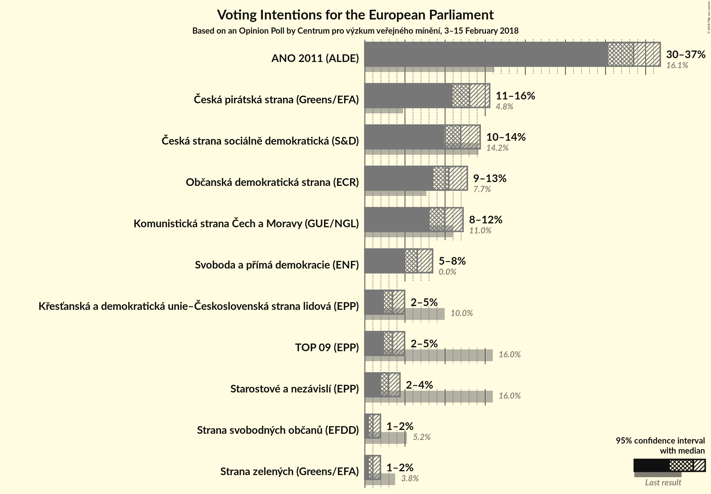
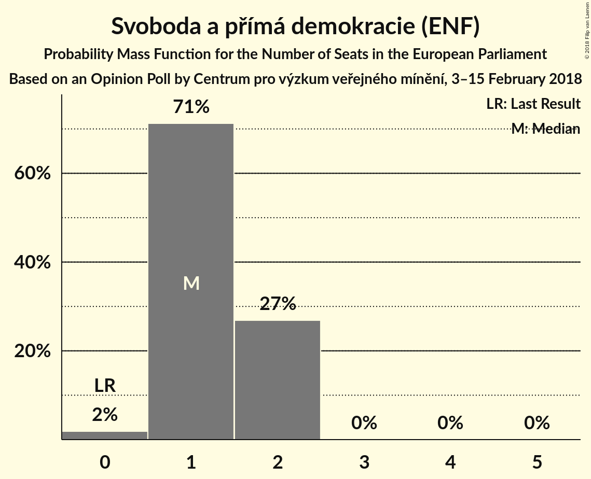
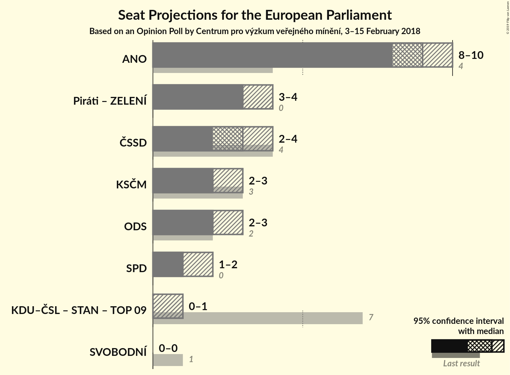

# Opinion Poll by Centrum pro výzkum veřejného mínění, 3–15 February 2018

<a href="#voting-intentions">Voting Intentions</a> | <a href="#seats">Seats</a> | <a href="#coalitions">Coalitions</a> | <a href="#technical-information">Technical Information</a>

## Voting Intentions

### Confidence Intervals

| Party | Last Result | Poll Result | 80% Confidence Interval | 90% Confidence Interval | 95% Confidence Interval | 99% Confidence Interval |
|:-----:|:-----------:|:-----------:|:-----------------------:|:-----------------------:|:-----------------------:|:-----------------------:|
| ANO 2011 (ALDE) | 16.1% | 33.5% | 31.4–35.7% |30.8–36.3% |30.3–36.8% |29.4–37.9% |
| Česká pirátská strana (Greens/EFA) | 4.8% | 13.1% | 11.6–14.7% |11.2–15.2% |10.9–15.6% |10.3–16.4% |
| Česká strana sociálně demokratická (S&D) | 14.2% | 11.9% | 10.6–13.5% |10.2–14.0% |9.9–14.4% |9.3–15.2% |
| Občanská demokratická strana (ECR) | 7.7% | 10.5% | 9.2–12.0% |8.8–12.4% |8.5–12.8% |8.0–13.5% |
| Komunistická strana Čech a Moravy (GUE/NGL) | 11.0% | 10.0% | 8.7–11.4% |8.4–11.9% |8.1–12.2% |7.5–13.0% |
| Svoboda a přímá demokracie (ENF) | 0.0% | 6.5% | 5.5–7.8% |5.3–8.1% |5.0–8.4% |4.6–9.1% |
| Křesťanská a demokratická unie–Československá strana lidová (EPP) | 10.0% | 3.4% | 2.7–4.4% |2.6–4.7% |2.4–5.0% |2.1–5.5% |
| TOP 09 (EPP) | 16.0% | 3.4% | 2.7–4.4% |2.6–4.7% |2.4–5.0% |2.1–5.5% |
| Starostové a nezávislí (EPP) | 16.0% | 3.0% | 2.3–3.9% |2.1–4.1% |2.0–4.4% |1.7–4.8% |
| Strana svobodných občanů (EFDD) | 5.2% | 1.0% | 0.7–1.6% |0.6–1.8% |0.5–1.9% |0.4–2.3% |
| Strana zelených (Greens/EFA) | 3.8% | 1.0% | 0.7–1.6% |0.6–1.8% |0.5–1.9% |0.4–2.3% |

*Note:* The poll result column reflects the actual value used in the calculations. Published results may vary slightly, and in addition be rounded to fewer digits.

## Seats

### Confidence Intervals

| Party | Last Result | Median | 80% Confidence Interval | 90% Confidence Interval | 95% Confidence Interval | 99% Confidence Interval |
|:-----:|:-----------:|:------:|:-----------------------:|:-----------------------:|:-----------------------:|:-----------------------:|
| <a href="#ano-2011-(alde)">ANO 2011 (ALDE)</a> | 4 | 9 | 8–10 |8–10 |8–10 |8–10 |
| <a href="#česká-pirátská-strana-(greens/efa)">Česká pirátská strana (Greens/EFA)</a> | 0 | 3 | 3–4 |3–4 |3–4 |2–4 |
| <a href="#česká-strana-sociálně-demokratická-(s&d)">Česká strana sociálně demokratická (S&D)</a> | 4 | 3 | 2–3 |2–3 |2–4 |2–4 |
| <a href="#občanská-demokratická-strana-(ecr)">Občanská demokratická strana (ECR)</a> | 2 | 2 | 2–3 |2–3 |2–3 |2–3 |
| <a href="#komunistická-strana-čech-a-moravy-(gue/ngl)">Komunistická strana Čech a Moravy (GUE/NGL)</a> | 3 | 2 | 2–3 |2–3 |2–3 |2–3 |
| <a href="#svoboda-a-přímá-demokracie-(enf)">Svoboda a přímá demokracie (ENF)</a> | 0 | 1 | 1–2 |1–2 |1–2 |0–2 |
| <a href="#křesťanská-a-demokratická-unie–československá-strana-lidová-(epp)">Křesťanská a demokratická unie–Československá strana lidová (EPP)</a> | 3 | 0 | 0 |0 |0 |0–1 |
| <a href="#top-09-(epp)">TOP 09 (EPP)</a> | 3 | 0 | 0 |0 |0 |0–1 |
| <a href="#starostové-a-nezávislí-(epp)">Starostové a nezávislí (EPP)</a> | 1 | 0 | 0 |0 |0 |0 |
| <a href="#strana-svobodných-občanů-(efdd)">Strana svobodných občanů (EFDD)</a> | 1 | 0 | 0 |0 |0 |0 |
| <a href="#strana-zelených-(greens/efa)">Strana zelených (Greens/EFA)</a> | 0 | 0 | 0 |0 |0 |0 |

### ANO 2011 (ALDE)

*For a full overview of the results for this party, see the [ANO 2011 (ALDE)](party-ano2011alde.html) page.*

| Number of Seats | Probability | Accumulated | Special Marks |
|:---------------:|:-----------:|:-----------:|:-------------:|
| 4 | 0% | 100% | Last Result |
| 5 | 0% | 100% |  |
| 6 | 0% | 100% |  |
| 7 | 0.3% | 100% |  |
| 8 | 24% | 99.7% |  |
| 9 | 59% | 75% | Median |
| 10 | 17% | 17% |  |
| 11 | 0.1% | 0.1% | Majority |
| 12 | 0% | 0% |  |

### Česká pirátská strana (Greens/EFA)

*For a full overview of the results for this party, see the [Česká pirátská strana (Greens/EFA)](party-českápirátskástranagreensefa.html) page.*

| Number of Seats | Probability | Accumulated | Special Marks |
|:---------------:|:-----------:|:-----------:|:-------------:|
| 0 | 0% | 100% | Last Result |
| 1 | 0% | 100% |  |
| 2 | 2% | 100% |  |
| 3 | 74% | 98% | Median |
| 4 | 24% | 24% |  |
| 5 | 0% | 0% |  |

### Česká strana sociálně demokratická (S&D)

*For a full overview of the results for this party, see the [Česká strana sociálně demokratická (S&D)](party-českástranasociálnědemokratickásd.html) page.*

| Number of Seats | Probability | Accumulated | Special Marks |
|:---------------:|:-----------:|:-----------:|:-------------:|
| 2 | 20% | 100% |  |
| 3 | 77% | 80% | Median |
| 4 | 3% | 3% | Last Result |
| 5 | 0% | 0% |  |

### Občanská demokratická strana (ECR)

*For a full overview of the results for this party, see the [Občanská demokratická strana (ECR)](party-občanskádemokratickástranaecr.html) page.*

| Number of Seats | Probability | Accumulated | Special Marks |
|:---------------:|:-----------:|:-----------:|:-------------:|
| 1 | 0.1% | 100% |  |
| 2 | 52% | 99.9% | Last Result, Median |
| 3 | 48% | 48% |  |
| 4 | 0.2% | 0.2% |  |
| 5 | 0% | 0% |  |

### Komunistická strana Čech a Moravy (GUE/NGL)

*For a full overview of the results for this party, see the [Komunistická strana Čech a Moravy (GUE/NGL)](party-komunistickástranačechamoravyguengl.html) page.*

| Number of Seats | Probability | Accumulated | Special Marks |
|:---------------:|:-----------:|:-----------:|:-------------:|
| 1 | 0.1% | 100% |  |
| 2 | 74% | 99.9% | Median |
| 3 | 25% | 25% | Last Result |
| 4 | 0% | 0% |  |

### Svoboda a přímá demokracie (ENF)

*For a full overview of the results for this party, see the [Svoboda a přímá demokracie (ENF)](party-svobodaapřímádemokracieenf.html) page.*

| Number of Seats | Probability | Accumulated | Special Marks |
|:---------------:|:-----------:|:-----------:|:-------------:|
| 0 | 2% | 100% | Last Result |
| 1 | 71% | 98% | Median |
| 2 | 27% | 27% |  |
| 3 | 0% | 0% |  |

### Křesťanská a demokratická unie–Československá strana lidová (EPP)

*For a full overview of the results for this party, see the [Křesťanská a demokratická unie–Československá strana lidová (EPP)](party-křesťanskáademokratickáunie–československástranalidováepp.html) page.*

| Number of Seats | Probability | Accumulated | Special Marks |
|:---------------:|:-----------:|:-----------:|:-------------:|
| 0 | 98.6% | 100% | Median |
| 1 | 1.4% | 1.4% |  |
| 2 | 0% | 0% |  |
| 3 | 0% | 0% | Last Result |

### TOP 09 (EPP)

*For a full overview of the results for this party, see the [TOP 09 (EPP)](party-top09epp.html) page.*

| Number of Seats | Probability | Accumulated | Special Marks |
|:---------------:|:-----------:|:-----------:|:-------------:|
| 0 | 98% | 100% | Median |
| 1 | 2% | 2% |  |
| 2 | 0% | 0% |  |
| 3 | 0% | 0% | Last Result |

### Starostové a nezávislí (EPP)

*For a full overview of the results for this party, see the [Starostové a nezávislí (EPP)](party-starostovéanezávislíepp.html) page.*

| Number of Seats | Probability | Accumulated | Special Marks |
|:---------------:|:-----------:|:-----------:|:-------------:|
| 0 | 99.6% | 100% | Median |
| 1 | 0.4% | 0.4% | Last Result |
| 2 | 0% | 0% |  |

### Strana svobodných občanů (EFDD)

*For a full overview of the results for this party, see the [Strana svobodných občanů (EFDD)](party-stranasvobodnýchobčanůefdd.html) page.*

| Number of Seats | Probability | Accumulated | Special Marks |
|:---------------:|:-----------:|:-----------:|:-------------:|
| 0 | 100% | 100% | Median |
| 1 | 0% | 0% | Last Result |

### Strana zelených (Greens/EFA)

*For a full overview of the results for this party, see the [Strana zelených (Greens/EFA)](party-stranazelenýchgreensefa.html) page.*

| Number of Seats | Probability | Accumulated | Special Marks |
|:---------------:|:-----------:|:-----------:|:-------------:|
| 0 | 100% | 100% | Last Result, Median |

## Coalitions

### Confidence Intervals

| Coalition | Last Result | Median | Majority? | 80% Confidence Interval | 90% Confidence Interval | 95% Confidence Interval | 99% Confidence Interval |
|:---------:|:-----------:|:------:|:---------:|:-----------------------:|:-----------------------:|:-----------------------:|:-----------------------:|
| ANO 2011 (ALDE) | 4 | 9 | 0.1% | 8–10 | 8–10 | 8–10 | 8–10 |
| Česká pirátská strana (Greens/EFA) – Strana zelených (Greens/EFA) | 0 | 3 | 0% | 3–4 | 3–4 | 3–4 | 2–4 |
| Česká strana sociálně demokratická (S&D) | 4 | 3 | 0% | 2–3 | 2–3 | 2–4 | 2–4 |
| Komunistická strana Čech a Moravy (GUE/NGL) | 3 | 2 | 0% | 2–3 | 2–3 | 2–3 | 2–3 |
| Občanská demokratická strana (ECR) | 2 | 2 | 0% | 2–3 | 2–3 | 2–3 | 2–3 |
| Svoboda a přímá demokracie (ENF) | 0 | 1 | 0% | 1–2 | 1–2 | 1–2 | 0–2 |
| Křesťanská a demokratická unie–Československá strana lidová (EPP) – TOP 09 (EPP) – Starostové a nezávislí (EPP) | 7 | 0 | 0% | 0 | 0 | 0–1 | 0–1 |
| Strana svobodných občanů (EFDD) | 1 | 0 | 0% | 0 | 0 | 0 | 0 |

### ANO 2011 (ALDE)

| Number of Seats | Probability | Accumulated | Special Marks |
|:---------------:|:-----------:|:-----------:|:-------------:|
| 4 | 0% | 100% | Last Result |
| 5 | 0% | 100% |  |
| 6 | 0% | 100% |  |
| 7 | 0.3% | 100% |  |
| 8 | 24% | 99.7% |  |
| 9 | 59% | 75% | Median |
| 10 | 17% | 17% |  |
| 11 | 0.1% | 0.1% | Majority |
| 12 | 0% | 0% |  |

### Česká pirátská strana (Greens/EFA) – Strana zelených (Greens/EFA)

| Number of Seats | Probability | Accumulated | Special Marks |
|:---------------:|:-----------:|:-----------:|:-------------:|
| 0 | 0% | 100% | Last Result |
| 1 | 0% | 100% |  |
| 2 | 2% | 100% |  |
| 3 | 74% | 98% | Median |
| 4 | 24% | 24% |  |
| 5 | 0% | 0% |  |

### Česká strana sociálně demokratická (S&D)

| Number of Seats | Probability | Accumulated | Special Marks |
|:---------------:|:-----------:|:-----------:|:-------------:|
| 2 | 20% | 100% |  |
| 3 | 77% | 80% | Median |
| 4 | 3% | 3% | Last Result |
| 5 | 0% | 0% |  |

### Komunistická strana Čech a Moravy (GUE/NGL)

| Number of Seats | Probability | Accumulated | Special Marks |
|:---------------:|:-----------:|:-----------:|:-------------:|
| 1 | 0.1% | 100% |  |
| 2 | 74% | 99.9% | Median |
| 3 | 25% | 25% | Last Result |
| 4 | 0% | 0% |  |

### Občanská demokratická strana (ECR)

| Number of Seats | Probability | Accumulated | Special Marks |
|:---------------:|:-----------:|:-----------:|:-------------:|
| 1 | 0.1% | 100% |  |
| 2 | 52% | 99.9% | Last Result, Median |
| 3 | 48% | 48% |  |
| 4 | 0.2% | 0.2% |  |
| 5 | 0% | 0% |  |

### Svoboda a přímá demokracie (ENF)

| Number of Seats | Probability | Accumulated | Special Marks |
|:---------------:|:-----------:|:-----------:|:-------------:|
| 0 | 2% | 100% | Last Result |
| 1 | 71% | 98% | Median |
| 2 | 27% | 27% |  |
| 3 | 0% | 0% |  |

### Křesťanská a demokratická unie–Československá strana lidová (EPP) – TOP 09 (EPP) – Starostové a nezávislí (EPP)

| Number of Seats | Probability | Accumulated | Special Marks |
|:---------------:|:-----------:|:-----------:|:-------------:|
| 0 | 96% | 100% | Median |
| 1 | 4% | 4% |  |
| 2 | 0% | 0% |  |
| 3 | 0% | 0% |  |
| 4 | 0% | 0% |  |
| 5 | 0% | 0% |  |
| 6 | 0% | 0% |  |
| 7 | 0% | 0% | Last Result |

### Strana svobodných občanů (EFDD)

| Number of Seats | Probability | Accumulated | Special Marks |
|:---------------:|:-----------:|:-----------:|:-------------:|
| 0 | 100% | 100% | Median |
| 1 | 0% | 0% | Last Result |

## Technical Information

### Opinion Poll

+ **Polling firm:** Centrum pro výzkum veřejného mínění
+ **Commissioner(s):** —
+ **Fieldwork period:** 3–15 February 2018

### Calculations

+ **Sample size:** 812
+ **Simulations done:** 2,097,152
+ **Error estimate:** 1.80%

