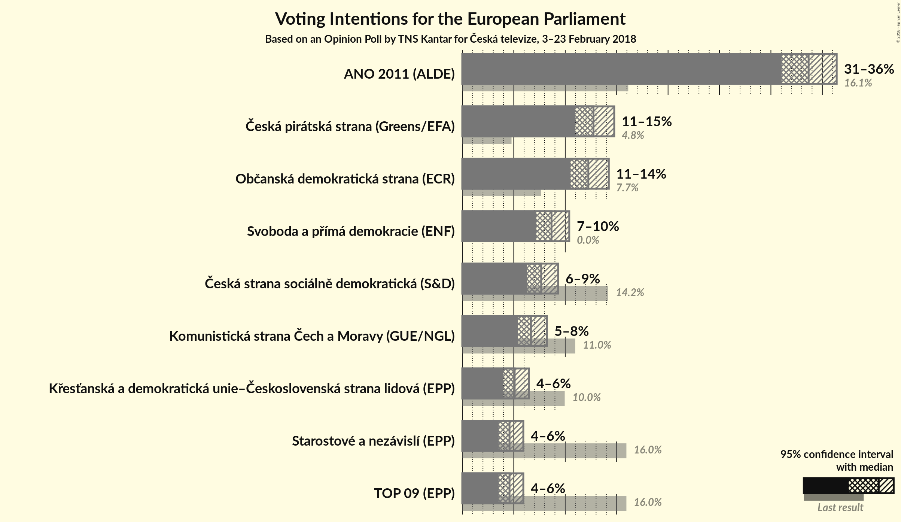

# Opinion Poll by TNS Kantar for Česká televize, 3–23 February 2018

<a href="#voting-intentions">Voting Intentions</a> | <a href="#seats">Seats</a> | <a href="#coalitions">Coalitions</a> | <a href="#technical-information">Technical Information</a>

## Voting Intentions

### Confidence Intervals

| Party | Last Result | Poll Result | 80% Confidence Interval | 90% Confidence Interval | 95% Confidence Interval | 99% Confidence Interval |
|:-----:|:-----------:|:-----------:|:-----------------------:|:-----------------------:|:-----------------------:|:-----------------------:|
| ANO 2011 (ALDE) | 16.1% | 33.7% | 31.9–35.5% |31.5–36.0% |31.0–36.4% |30.2–37.3% |
| Česká pirátská strana (*) | 4.8% | 12.8% | 11.6–14.1% |11.2–14.4% |11.0–14.8% |10.4–15.4% |
| Občanská demokratická strana (ECR) | 7.7% | 12.2% | 11.1–13.5% |10.8–13.9% |10.5–14.2% |10.0–14.9% |
| TOP 09–Starostové a nezávislí–Strana zelených (EPP) | 3.8% | 9.2% | N/A |N/A |N/A |N/A |
| Svoboda a přímá demokracie (EAPN) | 0.0% | 8.7% | 7.7–9.8% |7.4–10.1% |7.2–10.4% |6.8–11.0% |
| Česká strana sociálně demokratická (S&D) | 14.2% | 7.7% | 6.8–8.7% |6.5–9.1% |6.3–9.3% |5.9–9.9% |
| Komunistická strana Čech a Moravy (GUE/NGL) | 11.0% | 6.7% | 5.8–7.7% |5.6–8.0% |5.4–8.2% |5.0–8.7% |
| Křesťanská a demokratická unie–Československá strana lidová (EPP) | 10.0% | 5.1% | 4.3–6.0% |4.1–6.2% |4.0–6.5% |3.6–7.0% |

*Note:* The poll result column reflects the actual value used in the calculations. Published results may vary slightly, and in addition be rounded to fewer digits.

## Seats

### Confidence Intervals

| Party | Last Result | Median | 80% Confidence Interval | 90% Confidence Interval | 95% Confidence Interval | 99% Confidence Interval |
|:-----:|:-----------:|:------:|:-----------------------:|:-----------------------:|:-----------------------:|:-----------------------:|
| <a href="#ano-2011-(alde)">ANO 2011 (ALDE)</a> | 4 | 9 | 8–10 |8–10 |8–10 |8–10 |
| <a href="#česká-pirátská-strana-(*)">Česká pirátská strana (*)</a> | 0 | 3 | 3 |3–4 |2–4 |2–4 |
| <a href="#občanská-demokratická-strana-(ecr)">Občanská demokratická strana (ECR)</a> | 2 | 3 | 3 |2–3 |2–3 |2–4 |
| <a href="#top-09–starostové-a-nezávislí–strana-zelených-(epp)">TOP 09–Starostové a nezávislí–Strana zelených (EPP)</a> | 4 | N/A | N/A |N/A |N/A |N/A |
| <a href="#svoboda-a-přímá-demokracie-(eapn)">Svoboda a přímá demokracie (EAPN)</a> | 0 | 2 | 2 |2 |1–2 |1–3 |
| <a href="#česká-strana-sociálně-demokratická-(s&d)">Česká strana sociálně demokratická (S&D)</a> | 4 | 2 | 1–2 |1–2 |1–2 |1–2 |
| <a href="#komunistická-strana-čech-a-moravy-(gue/ngl)">Komunistická strana Čech a Moravy (GUE/NGL)</a> | 3 | 1 | 1–2 |1–2 |1–2 |0–2 |
| <a href="#křesťanská-a-demokratická-unie–československá-strana-lidová-(epp)">Křesťanská a demokratická unie–Československá strana lidová (EPP)</a> | 3 | 1 | 0–1 |0–1 |0–1 |0–1 |

