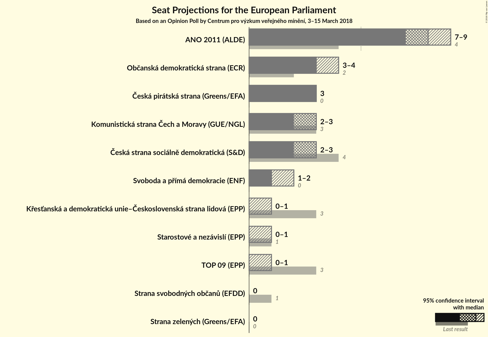

# Opinion Poll by Centrum pro výzkum veřejného mínění, 3–15 March 2018

<a href="#voting-intentions">Voting Intentions</a> | <a href="#seats">Seats</a> | <a href="#coalitions">Coalitions</a> | <a href="#technical-information">Technical Information</a>

## Voting Intentions

### Confidence Intervals

| Party | Last Result | Poll Result | 80% Confidence Interval | 90% Confidence Interval | 95% Confidence Interval | 99% Confidence Interval |
|:-----:|:-----------:|:-----------:|:-----------------------:|:-----------------------:|:-----------------------:|:-----------------------:|
| ANO 2011 (ALDE) | 16.1% | 30.5% | 28.8–32.4% |28.3–32.9% |27.8–33.4% |27.0–34.3% |
| Občanská demokratická strana (ECR) | 7.7% | 12.5% | 11.3–13.9% |11.0–14.3% |10.7–14.7% |10.1–15.4% |
| Česká pirátská strana (*) | 4.8% | 12.5% | 11.3–13.9% |11.0–14.3% |10.7–14.7% |10.1–15.4% |
| Komunistická strana Čech a Moravy (GUE/NGL) | 11.0% | 11.0% | 9.9–12.4% |9.6–12.7% |9.3–13.1% |8.7–13.7% |
| Česká strana sociálně demokratická (S&D) | 14.2% | 11.0% | 9.9–12.4% |9.6–12.7% |9.3–13.1% |8.7–13.7% |
| TOP 09–Starostové a nezávislí–Strana zelených (EPP) | 3.8% | 10.1% | N/A |N/A |N/A |N/A |
| Svoboda a přímá demokracie (EAPN) | 0.0% | 6.5% | 5.6–7.6% |5.4–7.9% |5.2–8.2% |4.8–8.7% |
| Křesťanská a demokratická unie–Československá strana lidová (EPP) | 10.0% | 4.5% | 3.8–5.5% |3.6–5.7% |3.4–6.0% |3.1–6.4% |
| Strana svobodných občanů (EFDD) | 5.2% | 1.0% | 0.7–1.6% |0.6–1.7% |0.6–1.9% |0.5–2.1% |

*Note:* The poll result column reflects the actual value used in the calculations. Published results may vary slightly, and in addition be rounded to fewer digits.

## Seats

### Confidence Intervals

| Party | Last Result | Median | 80% Confidence Interval | 90% Confidence Interval | 95% Confidence Interval | 99% Confidence Interval |
|:-----:|:-----------:|:------:|:-----------------------:|:-----------------------:|:-----------------------:|:-----------------------:|
| <a href="#ano-2011-(alde)">ANO 2011 (ALDE)</a> | 4 | 8 | 8 |8 |7–9 |7–9 |
| <a href="#občanská-demokratická-strana-(ecr)">Občanská demokratická strana (ECR)</a> | 2 | 3 | 3 |3 |3–4 |2–4 |
| <a href="#česká-pirátská-strana-(*)">Česká pirátská strana (*)</a> | 0 | 3 | 3 |3 |3 |2–4 |
| <a href="#komunistická-strana-čech-a-moravy-(gue/ngl)">Komunistická strana Čech a Moravy (GUE/NGL)</a> | 3 | 3 | 2–3 |2–3 |2–3 |2–3 |
| <a href="#česká-strana-sociálně-demokratická-(s&d)">Česká strana sociálně demokratická (S&D)</a> | 4 | 3 | 2–3 |2–3 |2–3 |2–3 |
| <a href="#top-09–starostové-a-nezávislí–strana-zelených-(epp)">TOP 09–Starostové a nezávislí–Strana zelených (EPP)</a> | 4 | N/A | N/A |N/A |N/A |N/A |
| <a href="#svoboda-a-přímá-demokracie-(eapn)">Svoboda a přímá demokracie (EAPN)</a> | 0 | 1 | 1 |1–2 |1–2 |1–2 |
| <a href="#křesťanská-a-demokratická-unie–československá-strana-lidová-(epp)">Křesťanská a demokratická unie–Československá strana lidová (EPP)</a> | 3 | 0 | 0–1 |0–1 |0–1 |0–1 |
| <a href="#strana-svobodných-občanů-(efdd)">Strana svobodných občanů (EFDD)</a> | 1 | 0 | 0 |0 |0 |0 |

