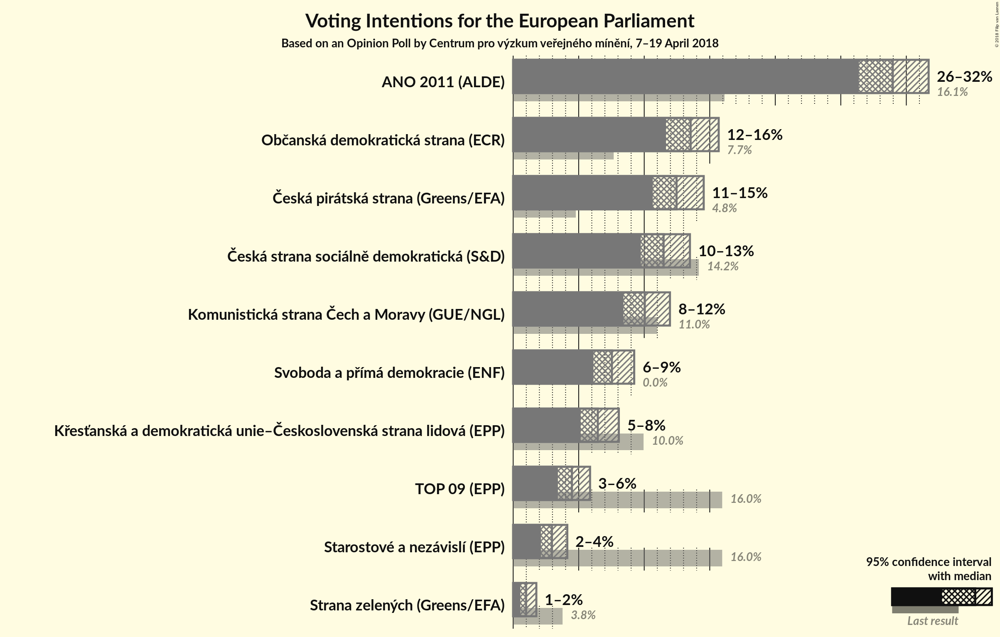
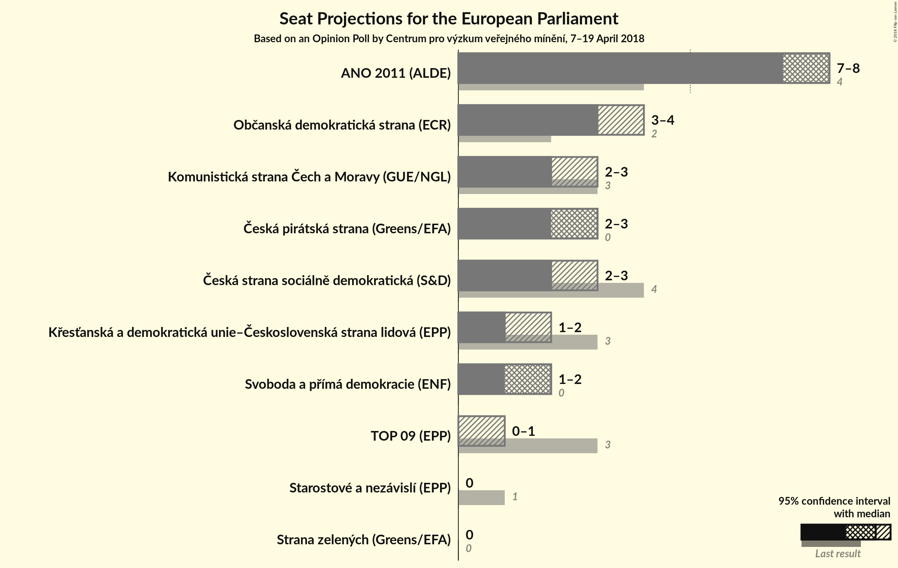

# Opinion Poll by Centrum pro výzkum veřejného mínění, 7–19 April 2018

<a href="#voting-intentions">Voting Intentions</a> | <a href="#seats">Seats</a> | <a href="#coalitions">Coalitions</a> | <a href="#technical-information">Technical Information</a>

## Voting Intentions

### Confidence Intervals

| Party | Last Result | Poll Result | 80% Confidence Interval | 90% Confidence Interval | 95% Confidence Interval | 99% Confidence Interval |
|:-----:|:-----------:|:-----------:|:-----------------------:|:-----------------------:|:-----------------------:|:-----------------------:|
| ANO 2011 (ALDE) | 16.1% | 29.0% | 27.3–30.8% |26.8–31.3% |26.4–31.7% |25.6–32.6% |
| Občanská demokratická strana (ECR) | 7.7% | 13.5% | 12.3–14.9% |11.9–15.3% |11.7–15.7% |11.1–16.4% |
| Česká pirátská strana (*) | 4.8% | 12.5% | 11.3–13.8% |10.9–14.2% |10.7–14.5% |10.1–15.2% |
| Česká strana sociálně demokratická (S&D) | 14.2% | 11.5% | 10.3–12.8% |10.0–13.2% |9.7–13.5% |9.2–14.1% |
| Komunistická strana Čech a Moravy (GUE/NGL) | 11.0% | 10.0% | 9.0–11.3% |8.7–11.6% |8.4–12.0% |7.9–12.6% |
| TOP 09–Starostové a nezávislí–Strana zelených (EPP) | 3.8% | 8.4% | N/A |N/A |N/A |N/A |
| Svoboda a přímá demokracie (EAPN) | 0.0% | 7.5% | 6.6–8.6% |6.3–9.0% |6.1–9.2% |5.7–9.8% |
| Křesťanská a demokratická unie–Československá strana lidová (EPP) | 10.0% | 6.5% | 5.6–7.5% |5.4–7.8% |5.2–8.1% |4.8–8.6% |

*Note:* The poll result column reflects the actual value used in the calculations. Published results may vary slightly, and in addition be rounded to fewer digits.

## Seats

### Confidence Intervals

| Party | Last Result | Median | 80% Confidence Interval | 90% Confidence Interval | 95% Confidence Interval | 99% Confidence Interval |
|:-----:|:-----------:|:------:|:-----------------------:|:-----------------------:|:-----------------------:|:-----------------------:|
| <a href="#ano-2011-(alde)">ANO 2011 (ALDE)</a> | 4 | 7 | 7–8 |7–8 |7–8 |6–8 |
| <a href="#občanská-demokratická-strana-(ecr)">Občanská demokratická strana (ECR)</a> | 2 | 3 | 3–4 |3–4 |3–4 |2–4 |
| <a href="#česká-pirátská-strana-(*)">Česká pirátská strana (*)</a> | 0 | 3 | 3 |2–3 |2–3 |2–4 |
| <a href="#česká-strana-sociálně-demokratická-(s&d)">Česká strana sociálně demokratická (S&D)</a> | 4 | 3 | 2–3 |2–3 |2–3 |2–3 |
| <a href="#komunistická-strana-čech-a-moravy-(gue/ngl)">Komunistická strana Čech a Moravy (GUE/NGL)</a> | 3 | 2 | 2–3 |2–3 |2–3 |2–3 |
| <a href="#top-09–starostové-a-nezávislí–strana-zelených-(epp)">TOP 09–Starostové a nezávislí–Strana zelených (EPP)</a> | 4 | N/A | N/A |N/A |N/A |N/A |
| <a href="#svoboda-a-přímá-demokracie-(eapn)">Svoboda a přímá demokracie (EAPN)</a> | 0 | 2 | 1–2 |1–2 |1–2 |1–2 |
| <a href="#křesťanská-a-demokratická-unie–československá-strana-lidová-(epp)">Křesťanská a demokratická unie–Československá strana lidová (EPP)</a> | 3 | 1 | 1–2 |1–2 |1–2 |0–2 |

