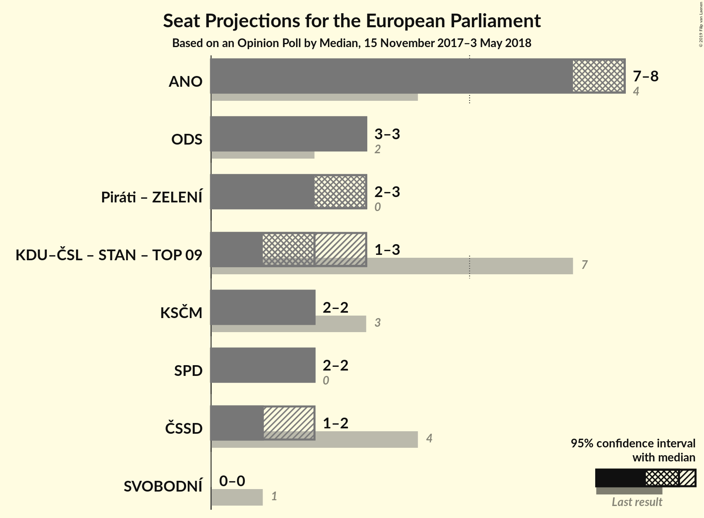

# Opinion Poll by Median, 15 November 2017–3 May 2018

<a href="#voting-intentions">Voting Intentions</a> | <a href="#seats">Seats</a> | <a href="#coalitions">Coalitions</a> | <a href="#technical-information">Technical Information</a>

## Voting Intentions

### Confidence Intervals

| Party | Last Result | Poll Result | 80% Confidence Interval | 90% Confidence Interval | 95% Confidence Interval | 99% Confidence Interval |
|:-----:|:-----------:|:-----------:|:-----------------------:|:-----------------------:|:-----------------------:|:-----------------------:|
| ANO 2011 (ALDE) | 16.1% | 30.2% | 29.4–31.0% |29.2–31.2% |29.0–31.4% |28.7–31.8% |
| Občanská demokratická strana (ECR) | 7.7% | 12.9% | 12.3–13.5% |12.2–13.6% |12.0–13.8% |11.8–14.1% |
| Česká pirátská strana (Greens/EFA) | 4.8% | 11.9% | 11.3–12.5% |11.2–12.6% |11.1–12.8% |10.8–13.0% |
| Svoboda a přímá demokracie (ENF) | 0.0% | 9.4% | 8.9–9.9% |8.8–10.1% |8.6–10.2% |8.5–10.5% |
| Komunistická strana Čech a Moravy (GUE/NGL) | 11.0% | 8.4% | 8.0–8.9% |7.8–9.1% |7.7–9.2% |7.5–9.4% |
| Česká strana sociálně demokratická (S&D) | 14.2% | 7.4% | 7.0–7.9% |6.9–8.0% |6.8–8.1% |6.5–8.4% |
| Křesťanská a demokratická unie–Československá strana lidová (EPP) | 10.0% | 5.4% | 5.1–5.9% |4.9–6.0% |4.9–6.1% |4.7–6.3% |
| TOP 09 (EPP) | 16.0% | 5.4% | 5.1–5.9% |4.9–6.0% |4.9–6.1% |4.7–6.3% |
| Starostové a nezávislí (EPP) | 16.0% | 4.9% | 4.6–5.3% |4.5–5.4% |4.4–5.6% |4.3–5.8% |

*Note:* The poll result column reflects the actual value used in the calculations. Published results may vary slightly, and in addition be rounded to fewer digits.

## Seats

### Confidence Intervals

| Party | Last Result | Median | 80% Confidence Interval | 90% Confidence Interval | 95% Confidence Interval | 99% Confidence Interval |
|:-----:|:-----------:|:------:|:-----------------------:|:-----------------------:|:-----------------------:|:-----------------------:|
| <a href="#ano-2011-(alde)">ANO 2011 (ALDE)</a> | 4 | N/A | N/A |N/A |N/A |N/A |
| <a href="#občanská-demokratická-strana-(ecr)">Občanská demokratická strana (ECR)</a> | 2 | N/A | N/A |N/A |N/A |N/A |
| <a href="#česká-pirátská-strana-(greens/efa)">Česká pirátská strana (Greens/EFA)</a> | 0 | N/A | N/A |N/A |N/A |N/A |
| <a href="#svoboda-a-přímá-demokracie-(enf)">Svoboda a přímá demokracie (ENF)</a> | 0 | N/A | N/A |N/A |N/A |N/A |
| <a href="#komunistická-strana-čech-a-moravy-(gue/ngl)">Komunistická strana Čech a Moravy (GUE/NGL)</a> | 3 | N/A | N/A |N/A |N/A |N/A |
| <a href="#česká-strana-sociálně-demokratická-(s&d)">Česká strana sociálně demokratická (S&D)</a> | 4 | N/A | N/A |N/A |N/A |N/A |
| <a href="#křesťanská-a-demokratická-unie–československá-strana-lidová-(epp)">Křesťanská a demokratická unie–Československá strana lidová (EPP)</a> | 3 | N/A | N/A |N/A |N/A |N/A |
| <a href="#top-09-(epp)">TOP 09 (EPP)</a> | 3 | N/A | N/A |N/A |N/A |N/A |
| <a href="#starostové-a-nezávislí-(epp)">Starostové a nezávislí (EPP)</a> | 1 | N/A | N/A |N/A |N/A |N/A |

## Coalitions

## Technical Information

### Opinion Poll

+ **Polling firm:** Median
+ **Commissioner(s):** —
+ **Fieldwork period:** 15 November 2017–3 May 2018

### Calculations

+ **Sample size:** 5781
+ **Simulations done:** 0
+ **Error estimate:** 100.00%

