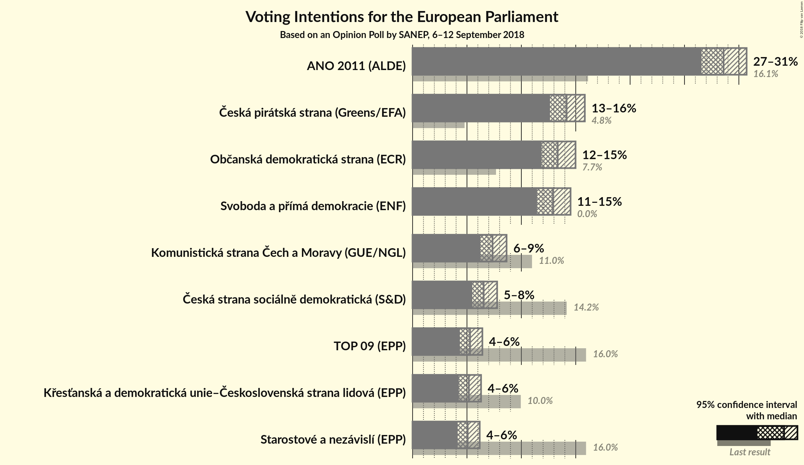
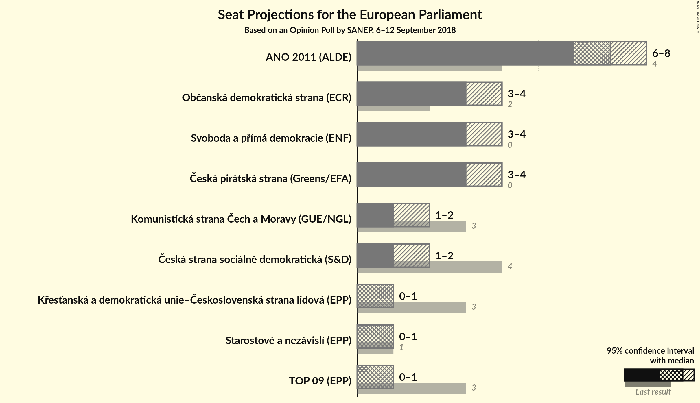

# Opinion Poll by SANEP, 6–12 September 2018

<a href="#voting-intentions">Voting Intentions</a> | <a href="#seats">Seats</a> | <a href="#coalitions">Coalitions</a> | <a href="#technical-information">Technical Information</a>

## Voting Intentions

### Confidence Intervals

| Party | Last Result | Poll Result | 80% Confidence Interval | 90% Confidence Interval | 95% Confidence Interval | 99% Confidence Interval |
|:-----:|:-----------:|:-----------:|:-----------------------:|:-----------------------:|:-----------------------:|:-----------------------:|
| ANO 2011 (ALDE) | 16.1% | 28.6% | 27.3–30.0% |26.9–30.4% |26.6–30.7% |25.9–31.4% |
| Česká pirátská strana (*) | 4.8% | 14.2% | 13.2–15.3% |12.9–15.6% |12.6–15.8% |12.2–16.4% |
| Občanská demokratická strana (ECR) | 7.7% | 13.3% | 12.4–14.4% |12.1–14.7% |11.9–15.0% |11.4–15.5% |
| Svoboda a přímá demokracie (EAPN) | 0.0% | 12.9% | 11.9–14.0% |11.7–14.3% |11.4–14.5% |11.0–15.0% |
| TOP 09–Starostové a nezávislí–Strana zelených (EPP) | 3.8% | 10.3% | N/A |N/A |N/A |N/A |
| Komunistická strana Čech a Moravy (GUE/NGL) | 11.0% | 7.4% | 6.6–8.2% |6.4–8.4% |6.2–8.6% |5.9–9.1% |
| Česká strana sociálně demokratická (S&D) | 14.2% | 6.5% | 5.9–7.3% |5.7–7.6% |5.5–7.8% |5.2–8.2% |
| Křesťanská a demokratická unie–Československá strana lidová (EPP) | 10.0% | 5.2% | 4.6–5.9% |4.4–6.1% |4.3–6.3% |4.0–6.7% |

*Note:* The poll result column reflects the actual value used in the calculations. Published results may vary slightly, and in addition be rounded to fewer digits.

## Seats

### Confidence Intervals

| Party | Last Result | Median | 80% Confidence Interval | 90% Confidence Interval | 95% Confidence Interval | 99% Confidence Interval |
|:-----:|:-----------:|:------:|:-----------------------:|:-----------------------:|:-----------------------:|:-----------------------:|
| <a href="#ano-2011-(alde)">ANO 2011 (ALDE)</a> | 4 | 7 | 7–8 |7–8 |6–8 |6–8 |
| <a href="#česká-pirátská-strana-(*)">Česká pirátská strana (*)</a> | 0 | 3 | 3–4 |3–4 |3–4 |3–4 |
| <a href="#občanská-demokratická-strana-(ecr)">Občanská demokratická strana (ECR)</a> | 2 | 3 | 3 |3–4 |3–4 |3–4 |
| <a href="#svoboda-a-přímá-demokracie-(eapn)">Svoboda a přímá demokracie (EAPN)</a> | 0 | 3 | 3 |3 |3–4 |2–4 |
| <a href="#top-09–starostové-a-nezávislí–strana-zelených-(epp)">TOP 09–Starostové a nezávislí–Strana zelených (EPP)</a> | 4 | N/A | N/A |N/A |N/A |N/A |
| <a href="#komunistická-strana-čech-a-moravy-(gue/ngl)">Komunistická strana Čech a Moravy (GUE/NGL)</a> | 3 | 2 | 1–2 |1–2 |1–2 |1–2 |
| <a href="#česká-strana-sociálně-demokratická-(s&d)">Česká strana sociálně demokratická (S&D)</a> | 4 | 1 | 1 |1–2 |1–2 |1–2 |
| <a href="#křesťanská-a-demokratická-unie–československá-strana-lidová-(epp)">Křesťanská a demokratická unie–Československá strana lidová (EPP)</a> | 3 | 1 | 0–1 |0–1 |0–1 |0–1 |

