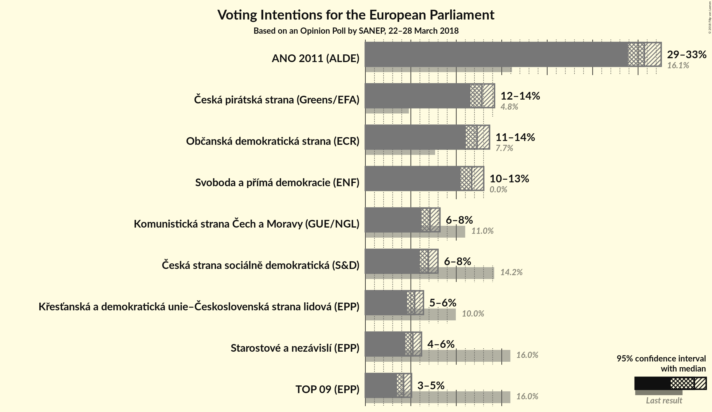
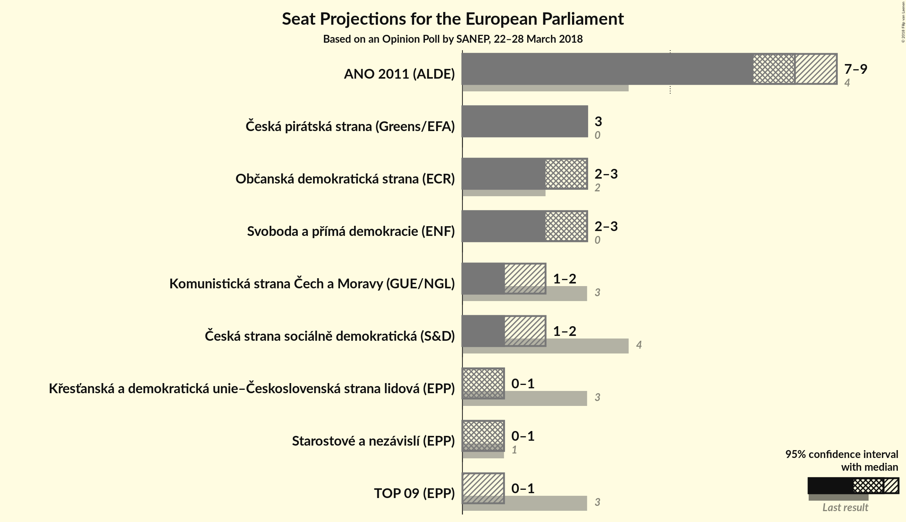

# Opinion Poll by SANEP, 22–28 March 2018

<a href="#voting-intentions">Voting Intentions</a> | <a href="#seats">Seats</a> | <a href="#coalitions">Coalitions</a> | <a href="#technical-information">Technical Information</a>

## Voting Intentions

### Confidence Intervals

| Party | Last Result | Poll Result | 80% Confidence Interval | 90% Confidence Interval | 95% Confidence Interval | 99% Confidence Interval |
|:-----:|:-----------:|:-----------:|:-----------------------:|:-----------------------:|:-----------------------:|:-----------------------:|
| ANO 2011 (ALDE) | 16.1% | 30.7% | 29.5–31.9% |29.2–32.3% |28.9–32.5% |28.3–33.1% |
| Česká pirátská strana (*) | 4.8% | 12.8% | 12.0–13.7% |11.8–14.0% |11.6–14.2% |11.2–14.6% |
| Občanská demokratická strana (ECR) | 7.7% | 12.3% | 11.5–13.2% |11.2–13.4% |11.1–13.7% |10.7–14.1% |
| Svoboda a přímá demokracie (EAPN) | 0.0% | 11.7% | 10.9–12.6% |10.7–12.8% |10.5–13.0% |10.1–13.4% |
| TOP 09–Starostové a nezávislí–Strana zelených (EPP) | 3.8% | 9.4% | N/A |N/A |N/A |N/A |
| Komunistická strana Čech a Moravy (GUE/NGL) | 11.0% | 7.1% | 6.5–7.8% |6.3–8.0% |6.2–8.2% |5.9–8.6% |
| Česká strana sociálně demokratická (S&D) | 14.2% | 6.9% | 6.3–7.6% |6.1–7.8% |6.0–8.0% |5.7–8.3% |
| Křesťanská a demokratická unie–Československá strana lidová (EPP) | 10.0% | 5.4% | 4.9–6.1% |4.7–6.2% |4.6–6.4% |4.3–6.7% |

*Note:* The poll result column reflects the actual value used in the calculations. Published results may vary slightly, and in addition be rounded to fewer digits.

## Seats

### Confidence Intervals

| Party | Last Result | Median | 80% Confidence Interval | 90% Confidence Interval | 95% Confidence Interval | 99% Confidence Interval |
|:-----:|:-----------:|:------:|:-----------------------:|:-----------------------:|:-----------------------:|:-----------------------:|
| <a href="#ano-2011-(alde)">ANO 2011 (ALDE)</a> | 4 | 8 | 8 |7–9 |7–9 |7–9 |
| <a href="#česká-pirátská-strana-(*)">Česká pirátská strana (*)</a> | 0 | 3 | 3 |3 |3 |2–4 |
| <a href="#občanská-demokratická-strana-(ecr)">Občanská demokratická strana (ECR)</a> | 2 | 3 | 3 |3 |2–3 |2–4 |
| <a href="#svoboda-a-přímá-demokracie-(eapn)">Svoboda a přímá demokracie (EAPN)</a> | 0 | 3 | 2–3 |2–3 |2–3 |2–3 |
| <a href="#top-09–starostové-a-nezávislí–strana-zelených-(epp)">TOP 09–Starostové a nezávislí–Strana zelených (EPP)</a> | 4 | N/A | N/A |N/A |N/A |N/A |
| <a href="#komunistická-strana-čech-a-moravy-(gue/ngl)">Komunistická strana Čech a Moravy (GUE/NGL)</a> | 3 | 1 | 1–2 |1–2 |1–2 |1–2 |
| <a href="#česká-strana-sociálně-demokratická-(s&d)">Česká strana sociálně demokratická (S&D)</a> | 4 | 1 | 1–2 |1–2 |1–2 |1–2 |
| <a href="#křesťanská-a-demokratická-unie–československá-strana-lidová-(epp)">Křesťanská a demokratická unie–Československá strana lidová (EPP)</a> | 3 | 1 | 0–1 |0–1 |0–1 |0–1 |

