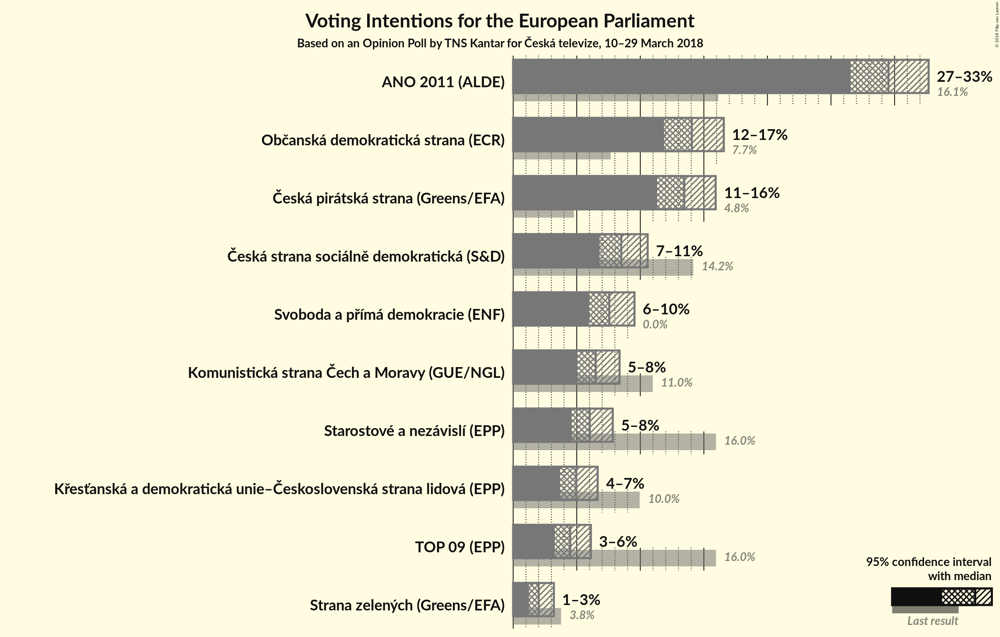
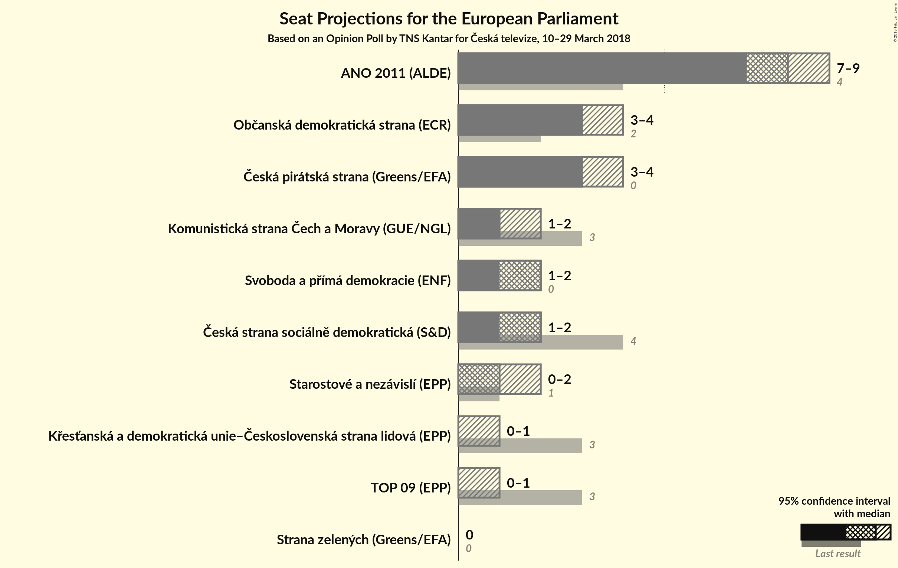

# Opinion Poll by TNS Kantar for Česká televize, 10–29 March 2018

<a href="#voting-intentions">Voting Intentions</a> | <a href="#seats">Seats</a> | <a href="#coalitions">Coalitions</a> | <a href="#technical-information">Technical Information</a>

## Voting Intentions

### Confidence Intervals

| Party | Last Result | Poll Result | 80% Confidence Interval | 90% Confidence Interval | 95% Confidence Interval | 99% Confidence Interval |
|:-----:|:-----------:|:-----------:|:-----------------------:|:-----------------------:|:-----------------------:|:-----------------------:|
| ANO 2011 (ALDE) | 16.1% | 29.5% | 27.6–31.6% |27.0–32.2% |26.5–32.7% |25.6–33.7% |
| Občanská demokratická strana (ECR) | 7.7% | 14.0% | 12.6–15.7% |12.2–16.2% |11.9–16.6% |11.2–17.4% |
| Česká pirátská strana (*) | 4.8% | 13.5% | 12.1–15.1% |11.7–15.5% |11.3–15.9% |10.7–16.7% |
| TOP 09–Starostové a nezávislí–Strana zelených (EPP) | 3.8% | 12.5% | N/A |N/A |N/A |N/A |
| Česká strana sociálně demokratická (S&D) | 14.2% | 8.5% | 7.4–9.9% |7.1–10.2% |6.8–10.6% |6.3–11.3% |
| Svoboda a přímá demokracie (EAPN) | 0.0% | 7.6% | 6.5–8.9% |6.2–9.2% |6.0–9.5% |5.5–10.2% |
| Komunistická strana Čech a Moravy (GUE/NGL) | 11.0% | 6.5% | 5.5–7.7% |5.2–8.1% |5.0–8.4% |4.6–9.0% |
| Křesťanská a demokratická unie–Československá strana lidová (EPP) | 10.0% | 5.0% | 4.1–6.1% |3.9–6.4% |3.7–6.6% |3.3–7.2% |

*Note:* The poll result column reflects the actual value used in the calculations. Published results may vary slightly, and in addition be rounded to fewer digits.

## Seats

### Confidence Intervals

| Party | Last Result | Median | 80% Confidence Interval | 90% Confidence Interval | 95% Confidence Interval | 99% Confidence Interval |
|:-----:|:-----------:|:------:|:-----------------------:|:-----------------------:|:-----------------------:|:-----------------------:|
| <a href="#ano-2011-(alde)">ANO 2011 (ALDE)</a> | 4 | 8 | 7–9 |7–9 |7–9 |6–9 |
| <a href="#občanská-demokratická-strana-(ecr)">Občanská demokratická strana (ECR)</a> | 2 | 3 | 3–4 |3–4 |3–4 |3–4 |
| <a href="#česká-pirátská-strana-(*)">Česká pirátská strana (*)</a> | 0 | 3 | 3–4 |3–4 |3–4 |2–4 |
| <a href="#top-09–starostové-a-nezávislí–strana-zelených-(epp)">TOP 09–Starostové a nezávislí–Strana zelených (EPP)</a> | 4 | N/A | N/A |N/A |N/A |N/A |
| <a href="#česká-strana-sociálně-demokratická-(s&d)">Česká strana sociálně demokratická (S&D)</a> | 4 | 2 | 2 |1–2 |1–2 |1–3 |
| <a href="#svoboda-a-přímá-demokracie-(eapn)">Svoboda a přímá demokracie (EAPN)</a> | 0 | 2 | 1–2 |1–2 |1–2 |1–2 |
| <a href="#komunistická-strana-čech-a-moravy-(gue/ngl)">Komunistická strana Čech a Moravy (GUE/NGL)</a> | 3 | 1 | 1–2 |1–2 |1–2 |0–2 |
| <a href="#křesťanská-a-demokratická-unie–československá-strana-lidová-(epp)">Křesťanská a demokratická unie–Československá strana lidová (EPP)</a> | 3 | 0 | 0–1 |0–1 |0–1 |0–2 |

