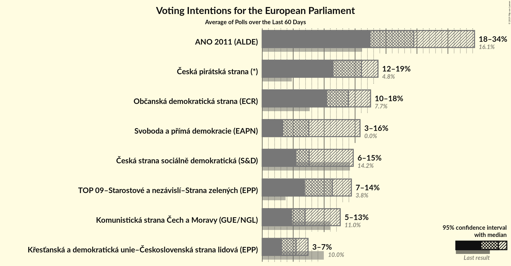
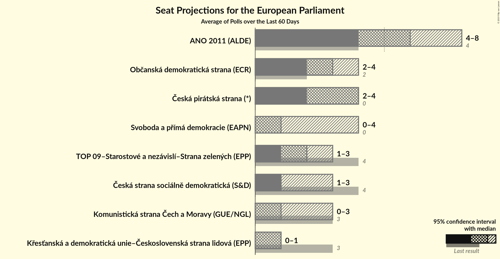
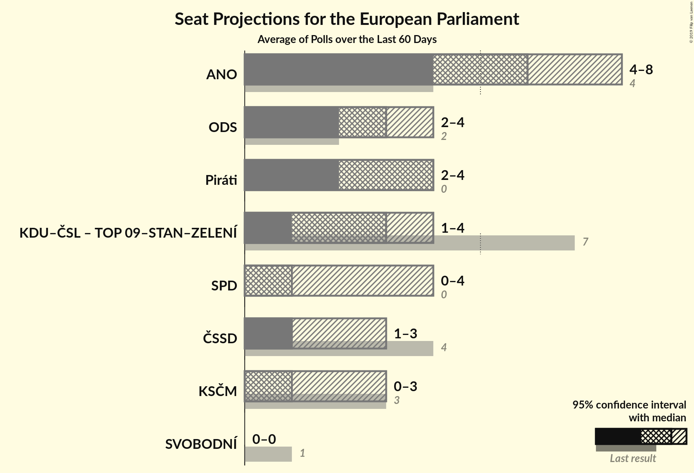

# Overview

The table below lists the most recent polls (less than 60 days old) registered and analyzed so far.

| Period     | Polling firm/Commissioner(s) | ANO | TOP 09 | STAN | ČSSD | KSČM | KDU–ČSL | ODS | SVOBODNÍ | Piráti | ZELENÍ | SPD | TOP 09–STAN–ZELENÍ |
|:----------:|:----------------------------:|:--:|:--:|:--:|:--:|:--:|:--:|:--:|:--:|:--:|:--:|:--:|:--:|
| 24–25 May 2014 | General Election | 16.1%   4 | 16.0%   3 | 16.0%   1 | 14.2%   4 | 11.0%   3 | 10.0%   3 | 7.7%   2 | 5.2%   1 | 4.8%   0 | 3.8%   0 | 0.0%   0 | 3.8%   4 |
| N/A | [Poll Average](average.html) | 18–34%   4–8 | N/A   N/A | N/A   N/A | 6–15%   1–3 | 5–13%   0–3 | 3–7%   0–1 | 10–18%   2–4 | N/A   N/A | 12–19%   2–4 | N/A   N/A | 3–16%   0–4 | 7–14%   1–3 |
| [10 April–16 May 2019](2019-05-16-PhoenixResearch.html) | Phoenix Research | 17–21%   4–5 | N/A   N/A | N/A   N/A | 6–10%   1–2 | 5–8%   0–2 | 4–6%   0–1 | 14–18%   3–4 | N/A   N/A | 15–19%   3–5 | N/A   N/A | 3–5%   0–1 | 11–15%   2–3 |
| [12 April–3 May 2019](2019-05-03-TNSKantar.html) | TNS Kantar   Česká televize | 27–33%   6–8 | N/A   N/A | N/A   N/A | 5–9%   1–2 | 5–8%   0–2 | 5–8%   0–2 | 12–16%   3–4 | N/A   N/A | 13–18%   3–4 | N/A   N/A | 7–11%   1–2 | 8–12%   2–3 |
| [29 April–3 May 2019](2019-05-03-STEM.html) | STEM | 19–23%   4–6 | N/A   N/A | N/A   N/A | 5–8%   1–2 | 6–9%   1–2 | 5–8%   1 | 10–13%   2–3 | N/A   N/A | 15–19%   3–4 | N/A   N/A | 13–16%   3–4 | 11–14%   2–3 |
| [30 March–10 April 2019](2019-04-10-Centrumprovýzkumveřejnéhomínění.html) | Centrum pro výzkum veřejného mínění | 29–35%   7–8 | N/A   N/A | N/A   N/A | 11–16%   2–3 | 9–13%   2–3 | 3–6%   0–1 | 12–17%   2–4 | N/A   N/A | 11–16%   2–3 | N/A   N/A | 4–8%   0–1 | 6–10%   1–2 |
| 24–25 May 2014 | General Election | 16.1%   4 | 16.0%   3 | 16.0%   1 | 14.2%   4 | 11.0%   3 | 10.0%   3 | 7.7%   2 | 5.2%   1 | 4.8%   0 | 3.8%   0 | 0.0%   0 | 3.8%   4 |

Only polls for which at least the sample size has been published are included in the table above.

**Legend:**
+ **Top half of each row:** Voting intentions (95% confidence interval)
+ **Bottom half of each row:** Seat projections for the European Parliament (95% confidence interval)
+ **ANO:** ANO 2011 (ALDE)
+ **TOP 09:** TOP 09 (EPP)
+ **STAN:** Starostové a nezávislí (EPP)
+ **ČSSD:** Česká strana sociálně demokratická (S&D)
+ **KSČM:** Komunistická strana Čech a Moravy (GUE/NGL)
+ **KDU–ČSL:** Křesťanská a demokratická unie–Československá strana lidová (EPP)
+ **ODS:** Občanská demokratická strana (ECR)
+ **SVOBODNÍ:** Strana svobodných občanů (EFDD)
+ **Piráti:** Česká pirátská strana (*)
+ **ZELENÍ:** Strana zelených (Greens/EFA)
+ **SPD:** Svoboda a přímá demokracie (EAPN)
+ **TOP 09–STAN–ZELENÍ:** TOP 09–Starostové a nezávislí–Strana zelených (EPP)
+ **N/A (single party):** Party not included the published results
+ **N/A (entire row):** Calculation for this opinion poll not started yet

