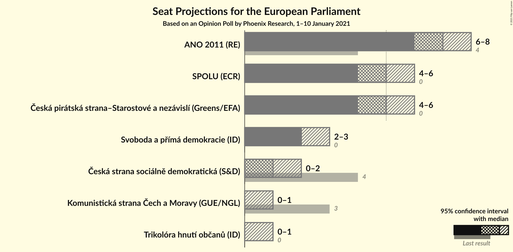
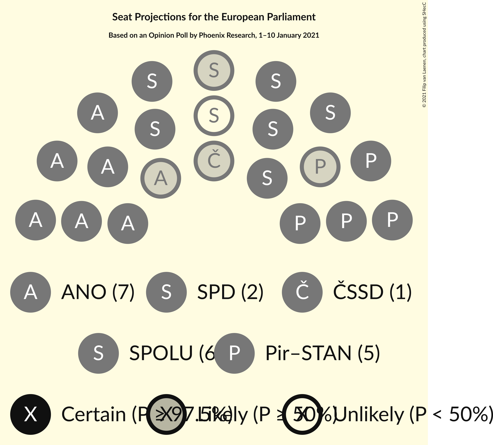
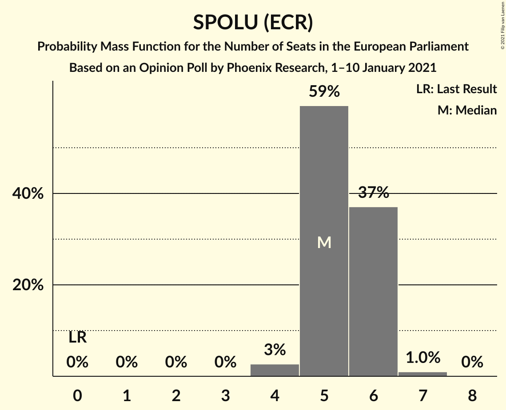
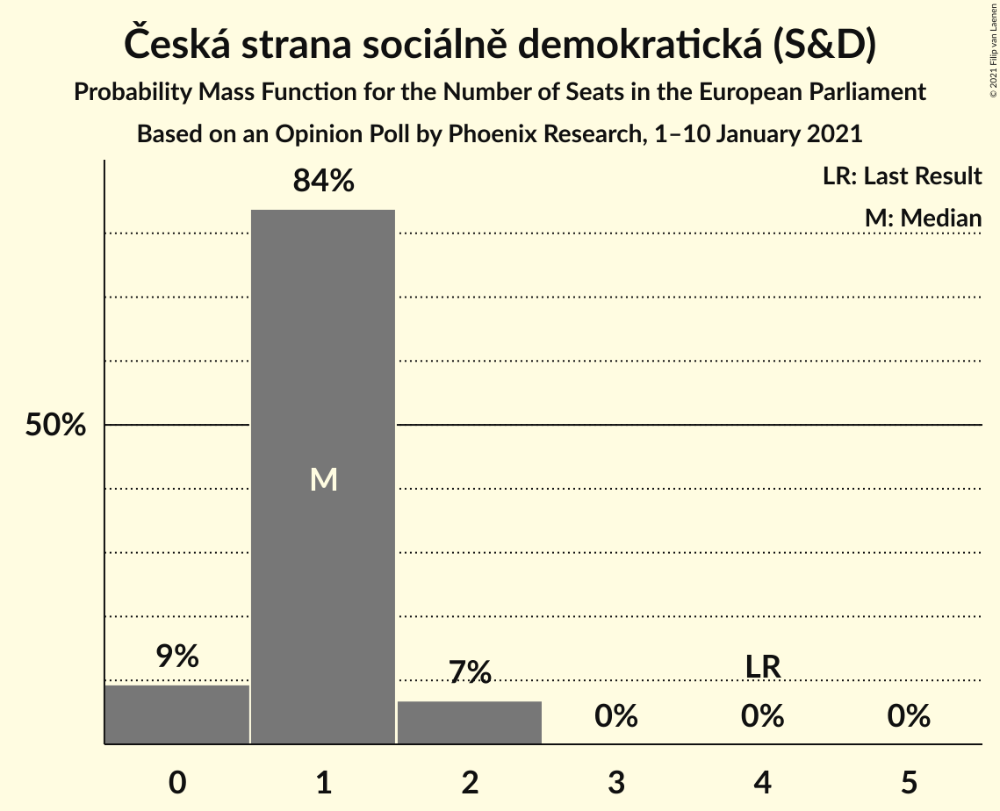
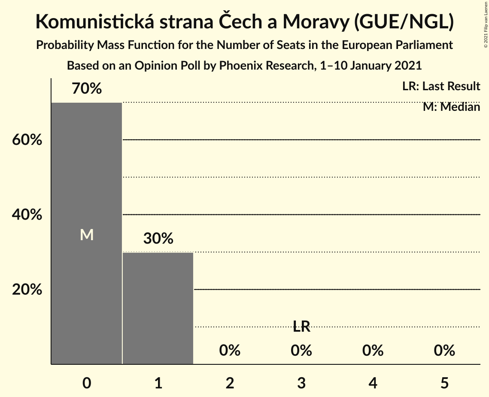
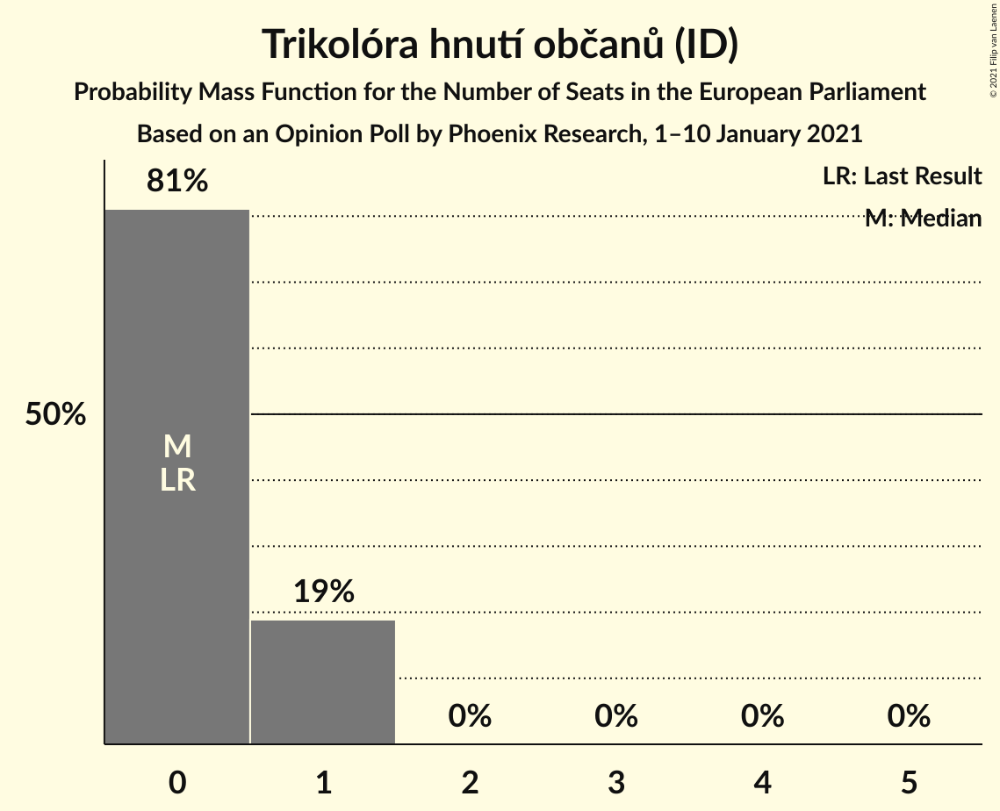
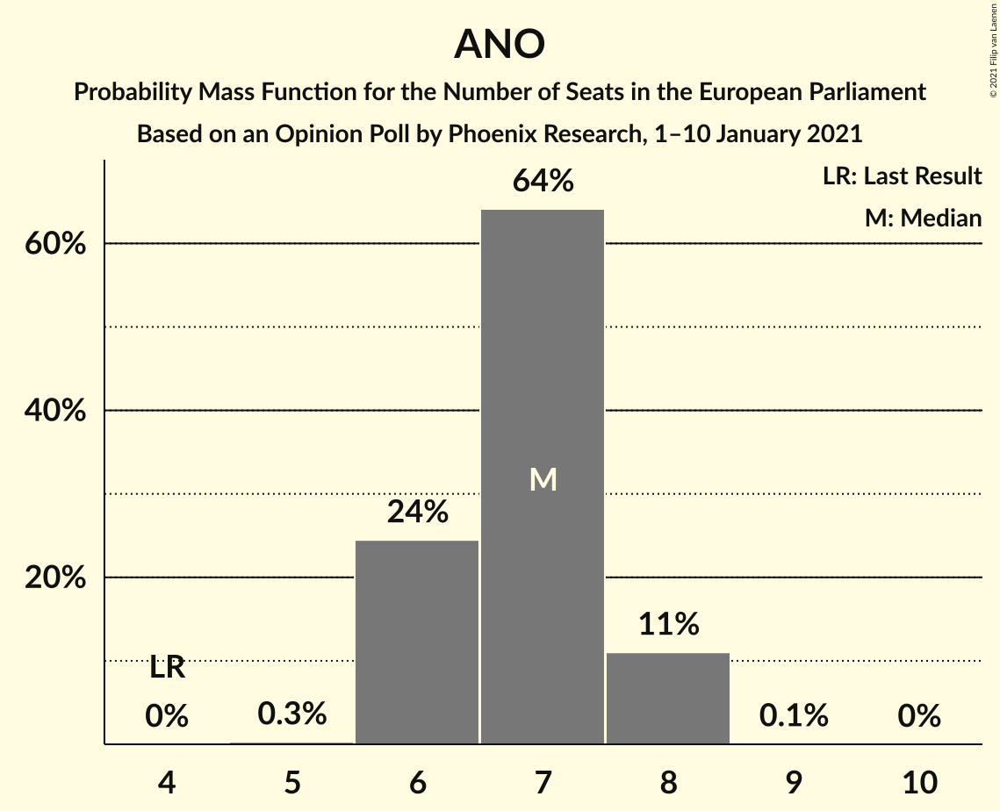
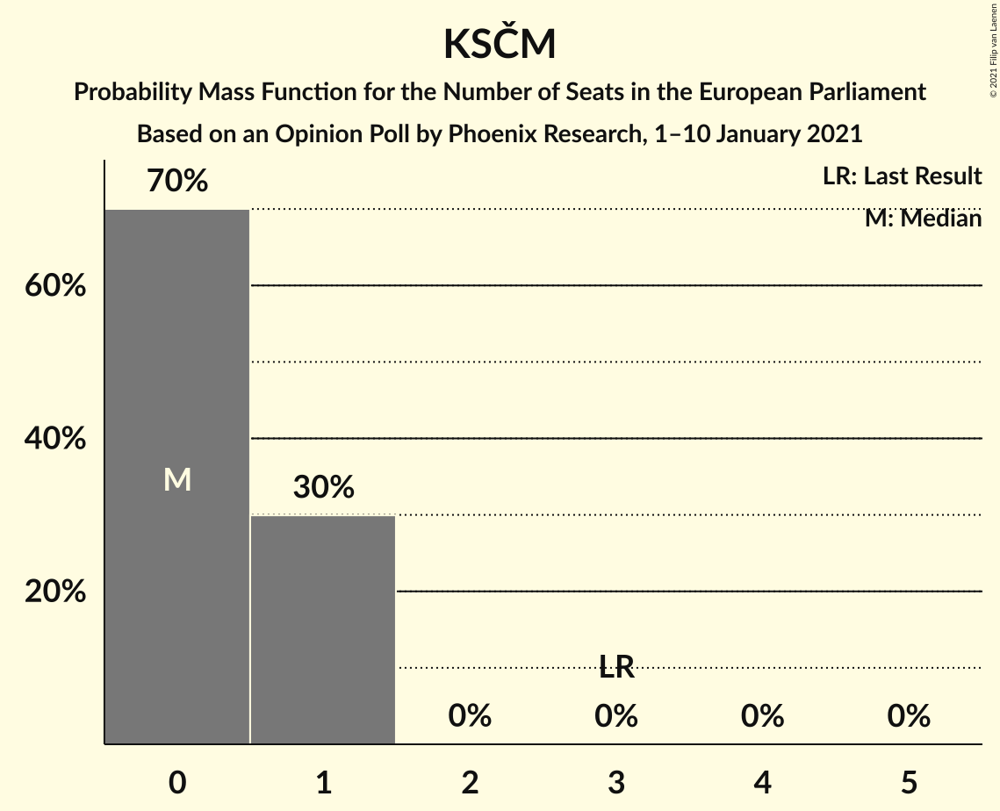

# Opinion Poll by Phoenix Research, 1–10 January 2021

<a href="#voting-intentions">Voting Intentions</a> | <a href="#seats">Seats</a> | <a href="#coalitions">Coalitions</a> | <a href="#technical-information">Technical Information</a>

## Voting Intentions

### Confidence Intervals

| Party | Last Result | Poll Result | 80% Confidence Interval | 90% Confidence Interval | 95% Confidence Interval | 99% Confidence Interval |
|:-----:|:-----------:|:-----------:|:-----------------------:|:-----------------------:|:-----------------------:|:-----------------------:|
| ANO 2011 (RE) | 16.1% | 27.9% | 25.8–30.1% |25.2–30.7% |24.7–31.3% |23.7–32.4% |
| SPOLU (ECR) | 0.0% | 22.2% | 20.3–24.3% |19.8–24.9% |19.3–25.4% |18.4–26.5% |
| Česká pirátská strana–Starostové a nezávislí (Greens/EFA) | 0.0% | 21.1% | 19.2–23.2% |18.7–23.7% |18.2–24.2% |17.4–25.3% |
| Svoboda a přímá demokracie (ID) | 0.0% | 9.9% | 8.6–11.5% |8.2–11.9% |7.9–12.3% |7.3–13.1% |
| Česká strana sociálně demokratická (S&D) | 14.2% | 6.1% | 5.1–7.4% |4.8–7.8% |4.5–8.1% |4.1–8.8% |
| Komunistická strana Čech a Moravy (GUE/NGL) | 11.0% | 4.5% | 3.7–5.7% |3.4–6.0% |3.2–6.3% |2.9–6.9% |
| Trikolóra hnutí občanů (ID) | 0.0% | 4.2% | 3.4–5.4% |3.2–5.7% |3.0–6.0% |2.6–6.6% |

*Note:* The poll result column reflects the actual value used in the calculations. Published results may vary slightly, and in addition be rounded to fewer digits.

## Seats

### Confidence Intervals

| Party | Last Result | Median | 80% Confidence Interval | 90% Confidence Interval | 95% Confidence Interval | 99% Confidence Interval |
|:-----:|:-----------:|:------:|:-----------------------:|:-----------------------:|:-----------------------:|:-----------------------:|
| <a href="#ano-2011-(re)">ANO 2011 (RE)</a> | 4 | 7 | 6–8 |6–8 |6–8 |6–8 |
| <a href="#spolu-(ecr)">SPOLU (ECR)</a> | 0 | 5 | 5–6 |5–6 |5–6 |4–7 |
| <a href="#česká-pirátská-strana–starostové-a-nezávislí-(greens/efa)">Česká pirátská strana–Starostové a nezávislí (Greens/EFA)</a> | 0 | 5 | 4–6 |4–6 |4–6 |4–6 |
| <a href="#svoboda-a-přímá-demokracie-(id)">Svoboda a přímá demokracie (ID)</a> | 0 | 2 | 2–3 |2–3 |2–3 |1–3 |
| <a href="#česká-strana-sociálně-demokratická-(s&d)">Česká strana sociálně demokratická (S&D)</a> | 4 | 1 | 0–1 |0–2 |0–2 |0–2 |
| <a href="#komunistická-strana-čech-a-moravy-(gue/ngl)">Komunistická strana Čech a Moravy (GUE/NGL)</a> | 3 | 0 | 0–1 |0–1 |0–1 |0–1 |
| <a href="#trikolóra-hnutí-občanů-(id)">Trikolóra hnutí občanů (ID)</a> | 0 | 0 | 0–1 |0–1 |0–1 |0–1 |

### ANO 2011 (RE)

*For a full overview of the results for this party, see the [ANO 2011 (RE)](party-ano2011re.html) page.*

| Number of Seats | Probability | Accumulated | Special Marks |
|:---------------:|:-----------:|:-----------:|:-------------:|
| 4 | 0% | 100% | Last Result |
| 5 | 0.1% | 100% |  |
| 6 | 25% | 99.9% |  |
| 7 | 56% | 74% | Median |
| 8 | 18% | 18% |  |
| 9 | 0% | 0% |  |

### SPOLU (ECR)

*For a full overview of the results for this party, see the [SPOLU (ECR)](party-spoluecr.html) page.*

| Number of Seats | Probability | Accumulated | Special Marks |
|:---------------:|:-----------:|:-----------:|:-------------:|
| 0 | 0% | 100% | Last Result |
| 1 | 0% | 100% |  |
| 2 | 0% | 100% |  |
| 3 | 0% | 100% |  |
| 4 | 2% | 100% |  |
| 5 | 61% | 98% | Median |
| 6 | 35% | 36% |  |
| 7 | 1.3% | 1.3% |  |
| 8 | 0% | 0% |  |

### Česká pirátská strana–Starostové a nezávislí (Greens/EFA)

*For a full overview of the results for this party, see the [Česká pirátská strana–Starostové a nezávislí (Greens/EFA)](party-českápirátskástrana–starostovéanezávislígreensefa.html) page.*

| Number of Seats | Probability | Accumulated | Special Marks |
|:---------------:|:-----------:|:-----------:|:-------------:|
| 0 | 0% | 100% | Last Result |
| 1 | 0% | 100% |  |
| 2 | 0% | 100% |  |
| 3 | 0% | 100% |  |
| 4 | 13% | 100% |  |
| 5 | 74% | 87% | Median |
| 6 | 13% | 13% |  |
| 7 | 0% | 0% |  |

### Svoboda a přímá demokracie (ID)

*For a full overview of the results for this party, see the [Svoboda a přímá demokracie (ID)](party-svobodaapřímádemokracieid.html) page.*

| Number of Seats | Probability | Accumulated | Special Marks |
|:---------------:|:-----------:|:-----------:|:-------------:|
| 0 | 0% | 100% | Last Result |
| 1 | 2% | 100% |  |
| 2 | 88% | 98% | Median |
| 3 | 11% | 11% |  |
| 4 | 0% | 0% |  |

### Česká strana sociálně demokratická (S&D)

*For a full overview of the results for this party, see the [Česká strana sociálně demokratická (S&D)](party-českástranasociálnědemokratickásd.html) page.*

| Number of Seats | Probability | Accumulated | Special Marks |
|:---------------:|:-----------:|:-----------:|:-------------:|
| 0 | 10% | 100% |  |
| 1 | 83% | 90% | Median |
| 2 | 6% | 6% |  |
| 3 | 0% | 0% |  |
| 4 | 0% | 0% | Last Result |

### Komunistická strana Čech a Moravy (GUE/NGL)

*For a full overview of the results for this party, see the [Komunistická strana Čech a Moravy (GUE/NGL)](party-komunistickástranačechamoravyguengl.html) page.*

| Number of Seats | Probability | Accumulated | Special Marks |
|:---------------:|:-----------:|:-----------:|:-------------:|
| 0 | 66% | 100% | Median |
| 1 | 34% | 34% |  |
| 2 | 0% | 0% |  |
| 3 | 0% | 0% | Last Result |

### Trikolóra hnutí občanů (ID)

*For a full overview of the results for this party, see the [Trikolóra hnutí občanů (ID)](party-trikolórahnutíobčanůid.html) page.*

| Number of Seats | Probability | Accumulated | Special Marks |
|:---------------:|:-----------:|:-----------:|:-------------:|
| 0 | 81% | 100% | Last Result, Median |
| 1 | 19% | 19% |  |
| 2 | 0% | 0% |  |

## Coalitions

### Confidence Intervals

| Coalition | Last Result | Median | Majority? | 80% Confidence Interval | 90% Confidence Interval | 95% Confidence Interval | 99% Confidence Interval |
|:---------:|:-----------:|:------:|:---------:|:-----------------------:|:-----------------------:|:-----------------------:|:-----------------------:|
| ANO 2011 (RE) | 4 | 7 | 0% | 6–8 | 6–8 | 6–8 | 6–8 |
| Svoboda a přímá demokracie (ID) – Trikolóra hnutí občanů (ID) | 0 | 2 | 0% | 2–3 | 2–3 | 2–3 | 1–4 |
| Česká strana sociálně demokratická (S&D) | 4 | 1 | 0% | 0–1 | 0–2 | 0–2 | 0–2 |
| Komunistická strana Čech a Moravy (GUE/NGL) | 3 | 0 | 0% | 0–1 | 0–1 | 0–1 | 0–1 |

### ANO 2011 (RE)

| Number of Seats | Probability | Accumulated | Special Marks |
|:---------------:|:-----------:|:-----------:|:-------------:|
| 4 | 0% | 100% | Last Result |
| 5 | 0.1% | 100% |  |
| 6 | 25% | 99.9% |  |
| 7 | 56% | 74% | Median |
| 8 | 18% | 18% |  |
| 9 | 0% | 0% |  |

### Svoboda a přímá demokracie (ID) – Trikolóra hnutí občanů (ID)

| Number of Seats | Probability | Accumulated | Special Marks |
|:---------------:|:-----------:|:-----------:|:-------------:|
| 0 | 0% | 100% | Last Result |
| 1 | 1.3% | 100% |  |
| 2 | 71% | 98.7% | Median |
| 3 | 26% | 28% |  |
| 4 | 2% | 2% |  |
| 5 | 0% | 0% |  |

### Česká strana sociálně demokratická (S&D)

| Number of Seats | Probability | Accumulated | Special Marks |
|:---------------:|:-----------:|:-----------:|:-------------:|
| 0 | 10% | 100% |  |
| 1 | 83% | 90% | Median |
| 2 | 6% | 6% |  |
| 3 | 0% | 0% |  |
| 4 | 0% | 0% | Last Result |

### Komunistická strana Čech a Moravy (GUE/NGL)

| Number of Seats | Probability | Accumulated | Special Marks |
|:---------------:|:-----------:|:-----------:|:-------------:|
| 0 | 66% | 100% | Median |
| 1 | 34% | 34% |  |
| 2 | 0% | 0% |  |
| 3 | 0% | 0% | Last Result |

## Technical Information

### Opinion Poll

+ **Polling firm:** Phoenix Research
+ **Commissioner(s):** —
+ **Fieldwork period:** 1–10 January 2021

### Calculations

+ **Sample size:** 707
+ **Simulations done:** 131,072
+ **Error estimate:** 1.51%

