# Opinion Poll by TNS Kantar for O24, 18 January–5 February 2021

<a href="#voting-intentions">Voting Intentions</a> | <a href="#seats">Seats</a> | <a href="#coalitions">Coalitions</a> | <a href="#technical-information">Technical Information</a>

## Voting Intentions

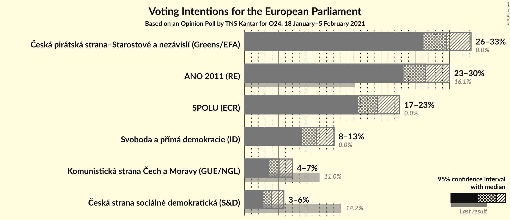

### Confidence Intervals

| Party | Last Result | Poll Result | 80% Confidence Interval | 90% Confidence Interval | 95% Confidence Interval | 99% Confidence Interval |
|:-----:|:-----------:|:-----------:|:-----------------------:|:-----------------------:|:-----------------------:|:-----------------------:|
| Česká pirátská strana–Starostové a nezávislí (Greens/EFA) | 0.0% | 29.6% | 27.4–31.9% |26.7–32.6% |26.2–33.2% |25.2–34.3% |
| ANO 2011 (RE) | 16.1% | 26.5% | 24.4–28.8% |23.8–29.5% |23.3–30.0% |22.3–31.2% |
| SPOLU (ECR) | 0.0% | 19.5% | 17.6–21.6% |17.1–22.2% |16.7–22.7% |15.8–23.8% |
| Svoboda a přímá demokracie (ID) | 0.0% | 10.5% | 9.1–12.2% |8.7–12.7% |8.4–13.1% |7.8–14.0% |
| Komunistická strana Čech a Moravy (GUE/NGL) | 11.0% | 5.0% | 4.1–6.3% |3.8–6.7% |3.6–7.0% |3.2–7.7% |
| Česká strana sociálně demokratická (S&D) | 14.2% | 4.0% | 3.1–5.1% |2.9–5.5% |2.7–5.7% |2.4–6.4% |

*Note:* The poll result column reflects the actual value used in the calculations. Published results may vary slightly, and in addition be rounded to fewer digits.

## Seats

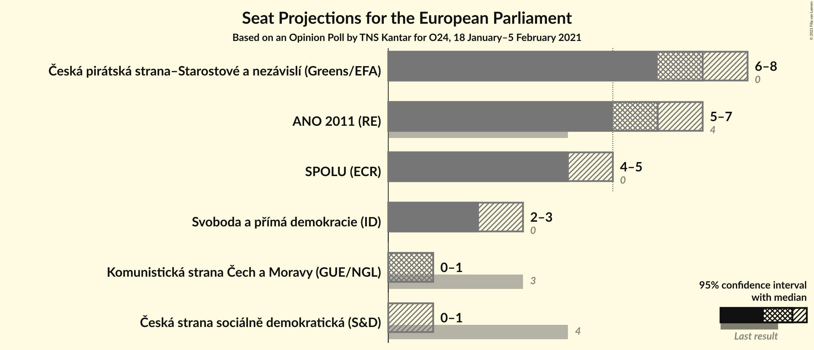

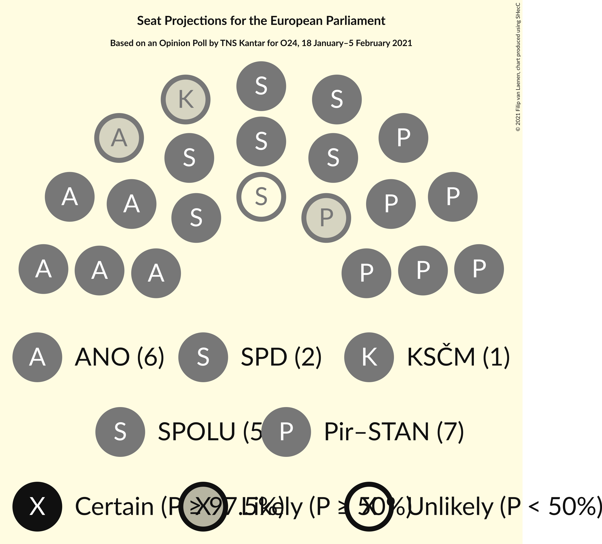

### Confidence Intervals

| Party | Last Result | Median | 80% Confidence Interval | 90% Confidence Interval | 95% Confidence Interval | 99% Confidence Interval |
|:-----:|:-----------:|:------:|:-----------------------:|:-----------------------:|:-----------------------:|:-----------------------:|
| <a href="#česká-pirátská-strana–starostové-a-nezávislí-(greens/efa)">Česká pirátská strana–Starostové a nezávislí (Greens/EFA)</a> | 0 | 7 | 6–8 |6–8 |6–8 |6–8 |
| <a href="#ano-2011-(re)">ANO 2011 (RE)</a> | 4 | 6 | 6–7 |5–7 |5–7 |5–8 |
| <a href="#spolu-(ecr)">SPOLU (ECR)</a> | 0 | 4 | 4–5 |4–5 |4–5 |3–6 |
| <a href="#svoboda-a-přímá-demokracie-(id)">Svoboda a přímá demokracie (ID)</a> | 0 | 2 | 2–3 |2–3 |2–3 |1–3 |
| <a href="#komunistická-strana-čech-a-moravy-(gue/ngl)">Komunistická strana Čech a Moravy (GUE/NGL)</a> | 3 | 1 | 0–1 |0–1 |0–1 |0–1 |
| <a href="#česká-strana-sociálně-demokratická-(s&d)">Česká strana sociálně demokratická (S&D)</a> | 4 | 0 | 0–1 |0–1 |0–1 |0–1 |

### Česká pirátská strana–Starostové a nezávislí (Greens/EFA)

*For a full overview of the results for this party, see the [Česká pirátská strana–Starostové a nezávislí (Greens/EFA)](party-českápirátskástrana–starostovéanezávislígreensefa.html) page.*

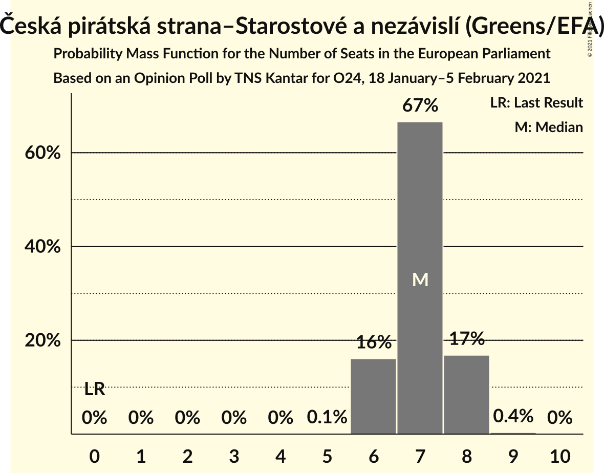

| Number of Seats | Probability | Accumulated | Special Marks |
|:---------------:|:-----------:|:-----------:|:-------------:|
| 0 | 0% | 100% | Last Result |
| 1 | 0% | 100% |  |
| 2 | 0% | 100% |  |
| 3 | 0% | 100% |  |
| 4 | 0% | 100% |  |
| 5 | 0.1% | 100% |  |
| 6 | 16% | 99.9% |  |
| 7 | 67% | 84% | Median |
| 8 | 17% | 17% |  |
| 9 | 0.4% | 0.4% |  |
| 10 | 0% | 0% |  |

### ANO 2011 (RE)

*For a full overview of the results for this party, see the [ANO 2011 (RE)](party-ano2011re.html) page.*

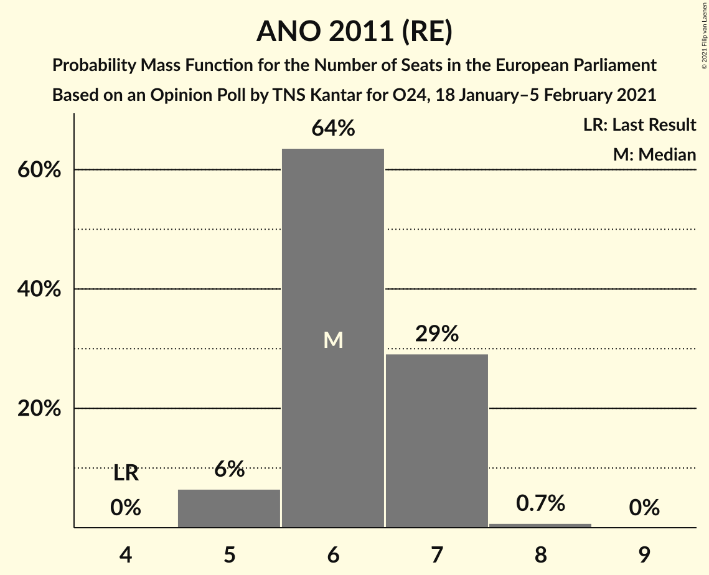

| Number of Seats | Probability | Accumulated | Special Marks |
|:---------------:|:-----------:|:-----------:|:-------------:|
| 4 | 0% | 100% | Last Result |
| 5 | 6% | 100% |  |
| 6 | 64% | 94% | Median |
| 7 | 29% | 30% |  |
| 8 | 0.7% | 0.7% |  |
| 9 | 0% | 0% |  |

### SPOLU (ECR)

*For a full overview of the results for this party, see the [SPOLU (ECR)](party-spoluecr.html) page.*

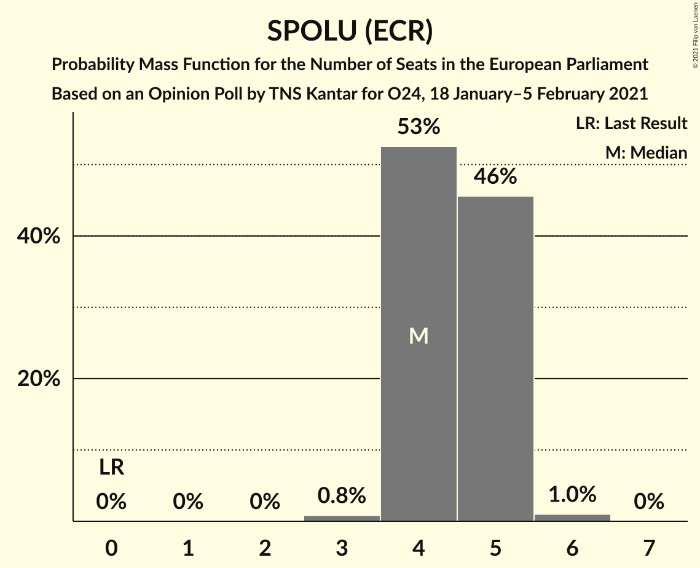

| Number of Seats | Probability | Accumulated | Special Marks |
|:---------------:|:-----------:|:-----------:|:-------------:|
| 0 | 0% | 100% | Last Result |
| 1 | 0% | 100% |  |
| 2 | 0% | 100% |  |
| 3 | 0.8% | 100% |  |
| 4 | 53% | 99.2% | Median |
| 5 | 46% | 47% |  |
| 6 | 1.0% | 1.0% |  |
| 7 | 0% | 0% |  |

### Svoboda a přímá demokracie (ID)

*For a full overview of the results for this party, see the [Svoboda a přímá demokracie (ID)](party-svobodaapřímádemokracieid.html) page.*

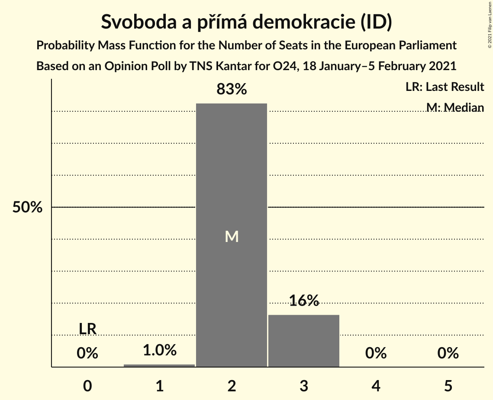

| Number of Seats | Probability | Accumulated | Special Marks |
|:---------------:|:-----------:|:-----------:|:-------------:|
| 0 | 0% | 100% | Last Result |
| 1 | 1.0% | 100% |  |
| 2 | 83% | 99.0% | Median |
| 3 | 16% | 16% |  |
| 4 | 0% | 0% |  |

### Komunistická strana Čech a Moravy (GUE/NGL)

*For a full overview of the results for this party, see the [Komunistická strana Čech a Moravy (GUE/NGL)](party-komunistickástranačechamoravyguengl.html) page.*

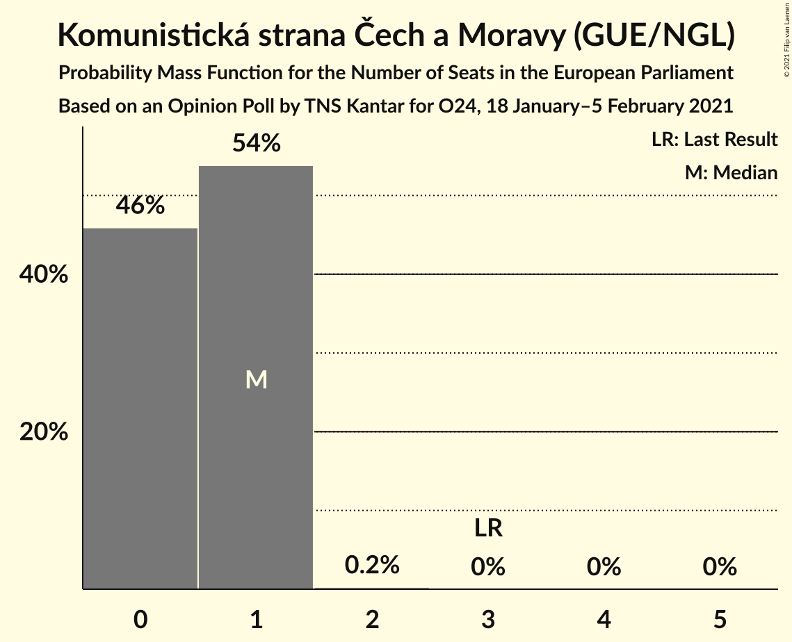

| Number of Seats | Probability | Accumulated | Special Marks |
|:---------------:|:-----------:|:-----------:|:-------------:|
| 0 | 46% | 100% |  |
| 1 | 54% | 54% | Median |
| 2 | 0.2% | 0.2% |  |
| 3 | 0% | 0% | Last Result |

### Česká strana sociálně demokratická (S&D)

*For a full overview of the results for this party, see the [Česká strana sociálně demokratická (S&D)](party-českástranasociálnědemokratickásd.html) page.*

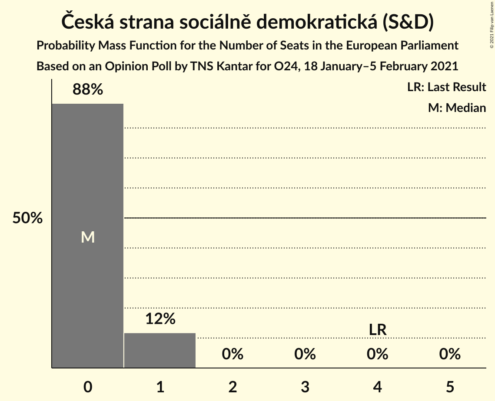

| Number of Seats | Probability | Accumulated | Special Marks |
|:---------------:|:-----------:|:-----------:|:-------------:|
| 0 | 88% | 100% | Median |
| 1 | 12% | 12% |  |
| 2 | 0% | 0% |  |
| 3 | 0% | 0% |  |
| 4 | 0% | 0% | Last Result |

## Coalitions

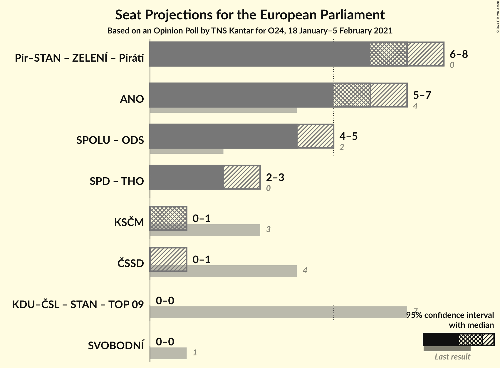

### Confidence Intervals

| Coalition | Last Result | Median | Majority? | 80% Confidence Interval | 90% Confidence Interval | 95% Confidence Interval | 99% Confidence Interval |
|:---------:|:-----------:|:------:|:---------:|:-----------------------:|:-----------------------:|:-----------------------:|:-----------------------:|
| ANO 2011 (RE) | 4 | 6 | 0% | 6–7 | 5–7 | 5–7 | 5–8 |
| Komunistická strana Čech a Moravy (GUE/NGL) | 3 | 1 | 0% | 0–1 | 0–1 | 0–1 | 0–1 |
| Česká strana sociálně demokratická (S&D) | 4 | 0 | 0% | 0–1 | 0–1 | 0–1 | 0–1 |

### ANO 2011 (RE)

| Number of Seats | Probability | Accumulated | Special Marks |
|:---------------:|:-----------:|:-----------:|:-------------:|
| 4 | 0% | 100% | Last Result |
| 5 | 6% | 100% |  |
| 6 | 64% | 94% | Median |
| 7 | 29% | 30% |  |
| 8 | 0.7% | 0.7% |  |
| 9 | 0% | 0% |  |

### Komunistická strana Čech a Moravy (GUE/NGL)

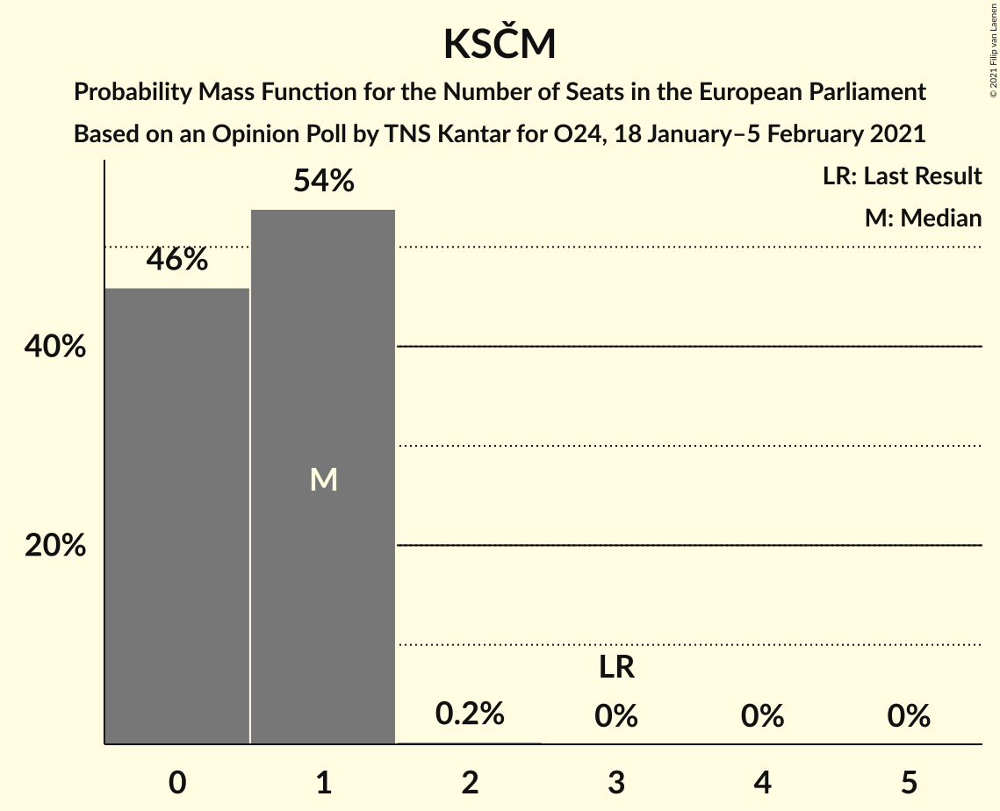

| Number of Seats | Probability | Accumulated | Special Marks |
|:---------------:|:-----------:|:-----------:|:-------------:|
| 0 | 46% | 100% |  |
| 1 | 54% | 54% | Median |
| 2 | 0.2% | 0.2% |  |
| 3 | 0% | 0% | Last Result |

### Česká strana sociálně demokratická (S&D)

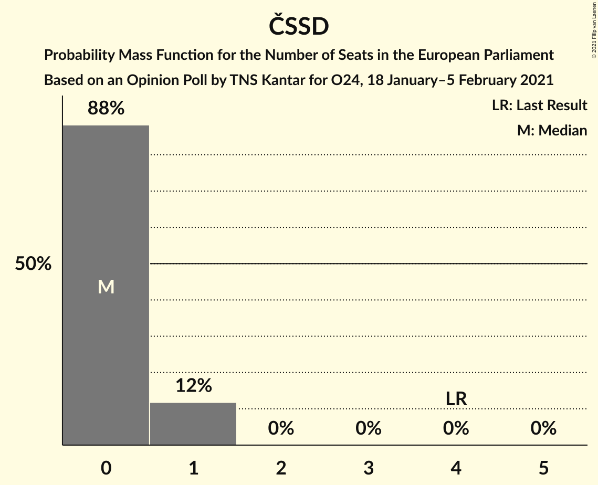

| Number of Seats | Probability | Accumulated | Special Marks |
|:---------------:|:-----------:|:-----------:|:-------------:|
| 0 | 88% | 100% | Median |
| 1 | 12% | 12% |  |
| 2 | 0% | 0% |  |
| 3 | 0% | 0% |  |
| 4 | 0% | 0% | Last Result |

## Technical Information

### Opinion Poll

+ **Polling firm:** TNS Kantar
+ **Commissioner(s):** O24
+ **Fieldwork period:** 18 January–5 February 2021

### Calculations

+ **Sample size:** 656
+ **Simulations done:** 1,048,576
+ **Error estimate:** 1.05%

