# Opinion Poll by Kantar for CT24, 25 March–1 April 2021

<a href="#voting-intentions">Voting Intentions</a> | <a href="#seats">Seats</a> | <a href="#coalitions">Coalitions</a> | <a href="#technical-information">Technical Information</a>

## Voting Intentions

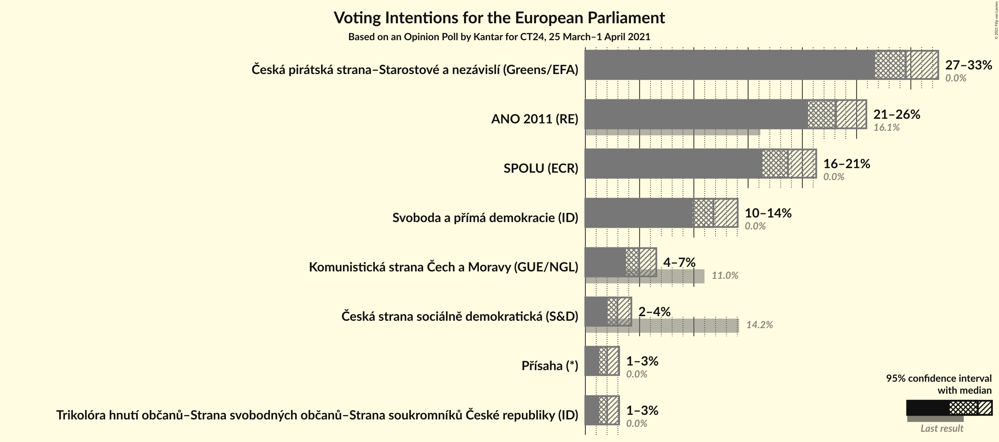

### Confidence Intervals

| Party | Last Result | Poll Result | 80% Confidence Interval | 90% Confidence Interval | 95% Confidence Interval | 99% Confidence Interval |
|:-----:|:-----------:|:-----------:|:-----------------------:|:-----------------------:|:-----------------------:|:-----------------------:|
| Česká pirátská strana–Starostové a nezávislí (Greens/EFA) | 0.0% | 29.5% | 27.7–31.5% |27.2–32.0% |26.7–32.5% |25.8–33.5% |
| ANO 2011 (RE) | 16.1% | 23.1% | 21.4–24.9% |20.9–25.5% |20.5–25.9% |19.7–26.8% |
| SPOLU (ECR) | 0.0% | 18.7% | 17.1–20.4% |16.7–20.9% |16.3–21.3% |15.6–22.1% |
| Svoboda a přímá demokracie (ID) | 0.0% | 11.8% | 10.6–13.3% |10.2–13.7% |9.9–14.0% |9.3–14.8% |
| Komunistická strana Čech a Moravy (GUE/NGL) | 11.0% | 5.0% | 4.2–6.0% |3.9–6.3% |3.7–6.5% |3.4–7.1% |
| Česká strana sociálně demokratická (S&D) | 14.2% | 3.0% | 2.3–3.8% |2.2–4.0% |2.0–4.2% |1.8–4.7% |
| Trikolóra hnutí občanů–Strana svobodných občanů–Strana soukromníků České republiky (ID) | 0.0% | 2.0% | 1.5–2.7% |1.4–2.9% |1.3–3.1% |1.1–3.5% |
| Přísaha (*) | 0.0% | 2.0% | 1.5–2.7% |1.4–2.9% |1.3–3.1% |1.1–3.5% |

*Note:* The poll result column reflects the actual value used in the calculations. Published results may vary slightly, and in addition be rounded to fewer digits.

## Seats

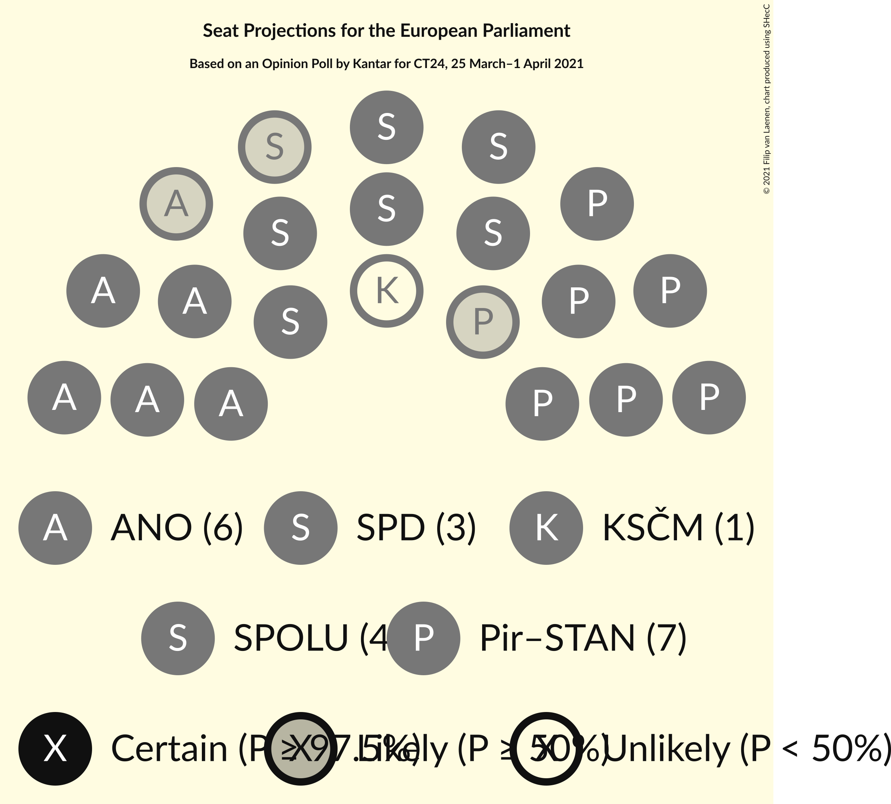

### Confidence Intervals

| Party | Last Result | Median | 80% Confidence Interval | 90% Confidence Interval | 95% Confidence Interval | 99% Confidence Interval |
|:-----:|:-----------:|:------:|:-----------------------:|:-----------------------:|:-----------------------:|:-----------------------:|
| <a href="#česká-pirátská-strana–starostové-a-nezávislí-(greens/efa)">Česká pirátská strana–Starostové a nezávislí (Greens/EFA)</a> | 0 | 7 | 7–8 |7–8 |6–8 |6–9 |
| <a href="#ano-2011-(re)">ANO 2011 (RE)</a> | 4 | 6 | 5–6 |5–6 |5–6 |5–7 |
| <a href="#spolu-(ecr)">SPOLU (ECR)</a> | 0 | 4 | 4–5 |4–5 |4–5 |4–5 |
| <a href="#svoboda-a-přímá-demokracie-(id)">Svoboda a přímá demokracie (ID)</a> | 0 | 3 | 2–3 |2–3 |2–3 |2–3 |
| <a href="#komunistická-strana-čech-a-moravy-(gue/ngl)">Komunistická strana Čech a Moravy (GUE/NGL)</a> | 3 | 0 | 0–1 |0–1 |0–1 |0–1 |
| <a href="#česká-strana-sociálně-demokratická-(s&d)">Česká strana sociálně demokratická (S&D)</a> | 4 | 0 | 0 |0 |0 |0 |
| <a href="#trikolóra-hnutí-občanů–strana-svobodných-občanů–strana-soukromníků-české-republiky-(id)">Trikolóra hnutí občanů–Strana svobodných občanů–Strana soukromníků České republiky (ID)</a> | 0 | 0 | 0 |0 |0 |0 |
| <a href="#přísaha-(*)">Přísaha (*)</a> | 0 | 0 | 0 |0 |0 |0 |

### Česká pirátská strana–Starostové a nezávislí (Greens/EFA)

*For a full overview of the results for this party, see the [Česká pirátská strana–Starostové a nezávislí (Greens/EFA)](party-českápirátskástrana–starostovéanezávislígreensefa.html) page.*

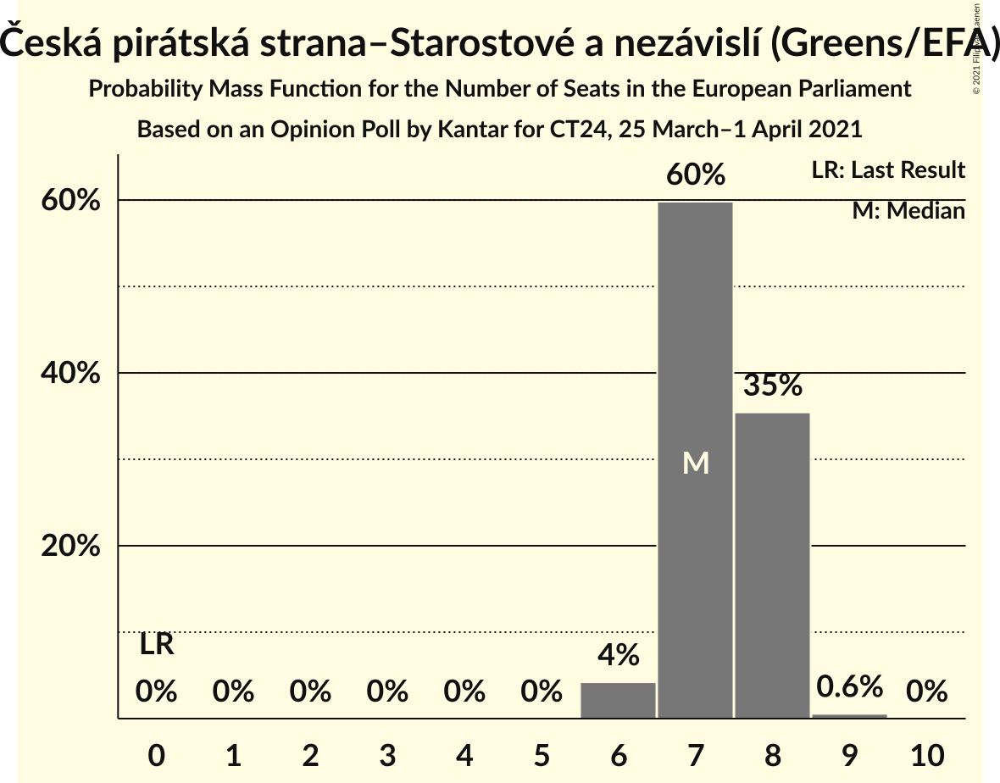

| Number of Seats | Probability | Accumulated | Special Marks |
|:---------------:|:-----------:|:-----------:|:-------------:|
| 0 | 0% | 100% | Last Result |
| 1 | 0% | 100% |  |
| 2 | 0% | 100% |  |
| 3 | 0% | 100% |  |
| 4 | 0% | 100% |  |
| 5 | 0% | 100% |  |
| 6 | 4% | 100% |  |
| 7 | 60% | 96% | Median |
| 8 | 35% | 36% |  |
| 9 | 0.6% | 0.6% |  |
| 10 | 0% | 0% |  |

### ANO 2011 (RE)

*For a full overview of the results for this party, see the [ANO 2011 (RE)](party-ano2011re.html) page.*

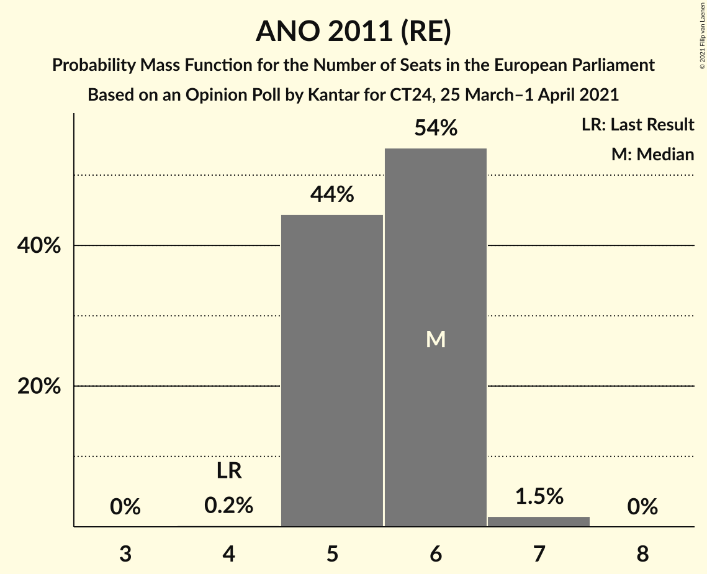

| Number of Seats | Probability | Accumulated | Special Marks |
|:---------------:|:-----------:|:-----------:|:-------------:|
| 4 | 0.2% | 100% | Last Result |
| 5 | 44% | 99.8% |  |
| 6 | 54% | 55% | Median |
| 7 | 1.5% | 1.5% |  |
| 8 | 0% | 0% |  |

### SPOLU (ECR)

*For a full overview of the results for this party, see the [SPOLU (ECR)](party-spoluecr.html) page.*

| Number of Seats | Probability | Accumulated | Special Marks |
|:---------------:|:-----------:|:-----------:|:-------------:|
| 0 | 0% | 100% | Last Result |
| 1 | 0% | 100% |  |
| 2 | 0% | 100% |  |
| 3 | 0.4% | 100% |  |
| 4 | 57% | 99.6% | Median |
| 5 | 42% | 43% |  |
| 6 | 0.4% | 0.4% |  |
| 7 | 0% | 0% |  |

### Svoboda a přímá demokracie (ID)

*For a full overview of the results for this party, see the [Svoboda a přímá demokracie (ID)](party-svobodaapřímádemokracieid.html) page.*

| Number of Seats | Probability | Accumulated | Special Marks |
|:---------------:|:-----------:|:-----------:|:-------------:|
| 0 | 0% | 100% | Last Result |
| 1 | 0% | 100% |  |
| 2 | 30% | 100% |  |
| 3 | 70% | 70% | Median |
| 4 | 0.3% | 0.3% |  |
| 5 | 0% | 0% |  |

### Komunistická strana Čech a Moravy (GUE/NGL)

*For a full overview of the results for this party, see the [Komunistická strana Čech a Moravy (GUE/NGL)](party-komunistickástranačechamoravyguengl.html) page.*

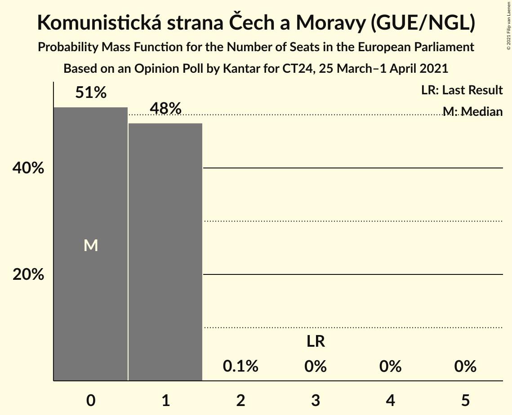

| Number of Seats | Probability | Accumulated | Special Marks |
|:---------------:|:-----------:|:-----------:|:-------------:|
| 0 | 51% | 100% | Median |
| 1 | 48% | 49% |  |
| 2 | 0.1% | 0.1% |  |
| 3 | 0% | 0% | Last Result |

### Česká strana sociálně demokratická (S&D)

*For a full overview of the results for this party, see the [Česká strana sociálně demokratická (S&D)](party-českástranasociálnědemokratickásd.html) page.*

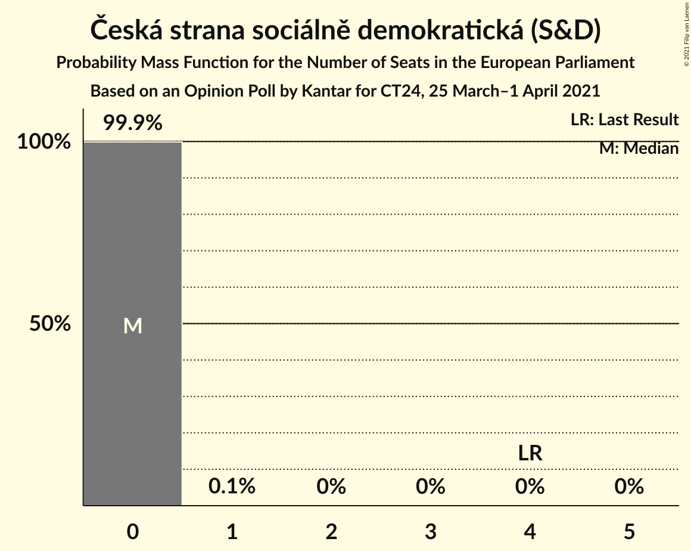

| Number of Seats | Probability | Accumulated | Special Marks |
|:---------------:|:-----------:|:-----------:|:-------------:|
| 0 | 99.9% | 100% | Median |
| 1 | 0.1% | 0.1% |  |
| 2 | 0% | 0% |  |
| 3 | 0% | 0% |  |
| 4 | 0% | 0% | Last Result |

### Trikolóra hnutí občanů–Strana svobodných občanů–Strana soukromníků České republiky (ID)

*For a full overview of the results for this party, see the [Trikolóra hnutí občanů–Strana svobodných občanů–Strana soukromníků České republiky (ID)](party-trikolórahnutíobčanů–stranasvobodnýchobčanů–stranasoukromníkůčeskérepublikyid.html) page.*

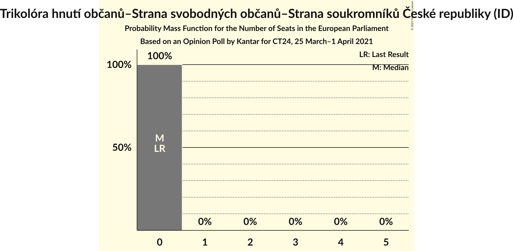

| Number of Seats | Probability | Accumulated | Special Marks |
|:---------------:|:-----------:|:-----------:|:-------------:|
| 0 | 100% | 100% | Last Result, Median |

### Přísaha (*)

*For a full overview of the results for this party, see the [Přísaha (*)](party-přísaha.html) page.*

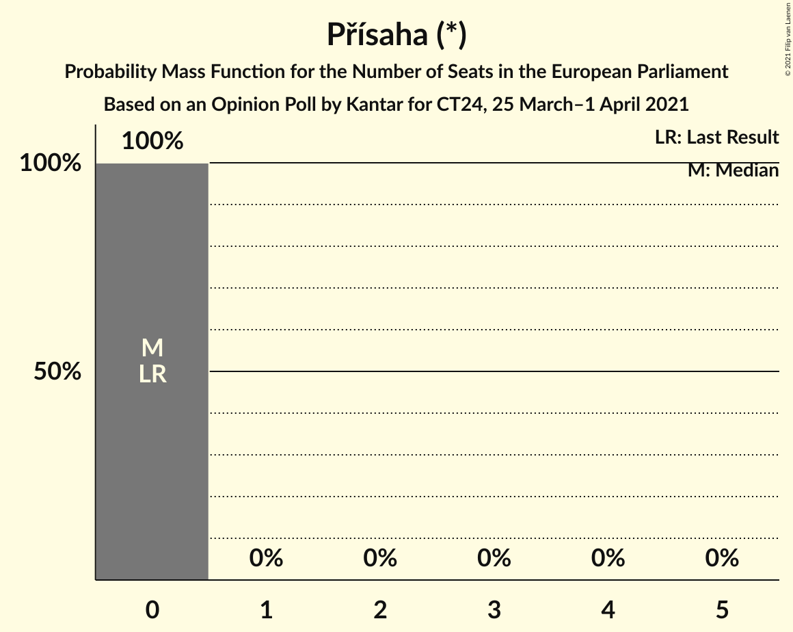

| Number of Seats | Probability | Accumulated | Special Marks |
|:---------------:|:-----------:|:-----------:|:-------------:|
| 0 | 100% | 100% | Last Result, Median |

## Coalitions

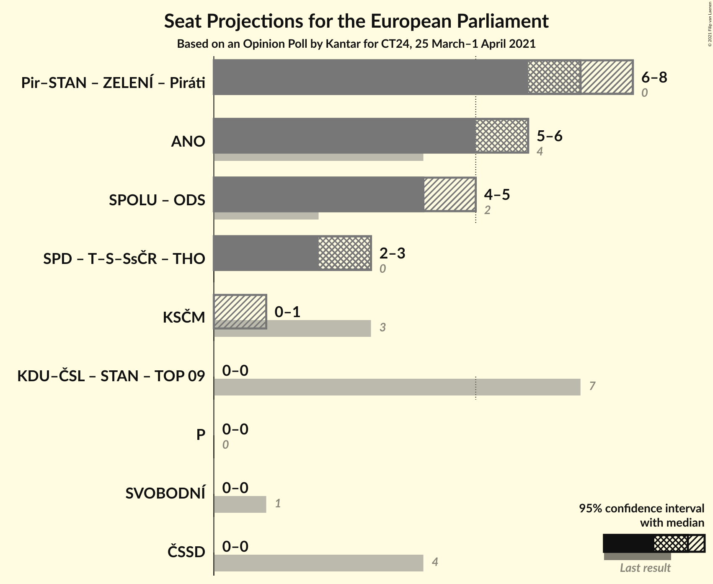

### Confidence Intervals

| Coalition | Last Result | Median | Majority? | 80% Confidence Interval | 90% Confidence Interval | 95% Confidence Interval | 99% Confidence Interval |
|:---------:|:-----------:|:------:|:---------:|:-----------------------:|:-----------------------:|:-----------------------:|:-----------------------:|
| ANO 2011 (RE) | 4 | 6 | 0% | 5–6 | 5–6 | 5–6 | 5–7 |
| Komunistická strana Čech a Moravy (GUE/NGL) | 3 | 0 | 0% | 0–1 | 0–1 | 0–1 | 0–1 |
| Přísaha (*) | 0 | 0 | 0% | 0 | 0 | 0 | 0 |
| Česká strana sociálně demokratická (S&D) | 4 | 0 | 0% | 0 | 0 | 0 | 0 |

### ANO 2011 (RE)

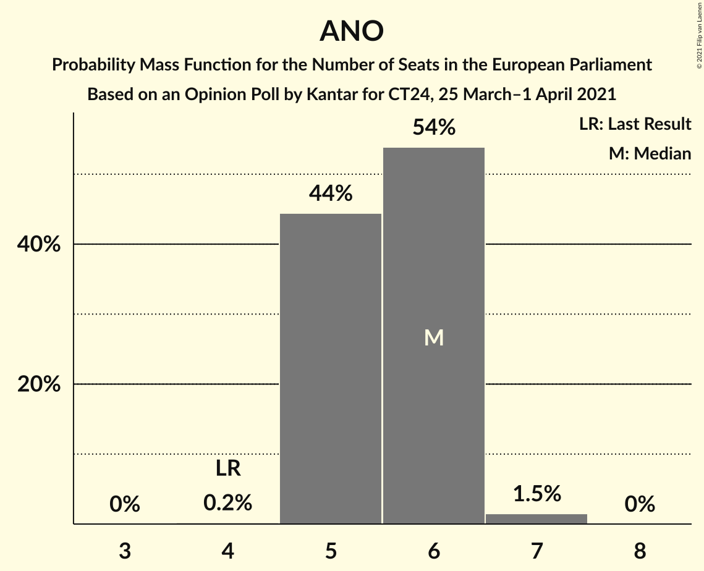

| Number of Seats | Probability | Accumulated | Special Marks |
|:---------------:|:-----------:|:-----------:|:-------------:|
| 4 | 0.2% | 100% | Last Result |
| 5 | 44% | 99.8% |  |
| 6 | 54% | 55% | Median |
| 7 | 1.5% | 1.5% |  |
| 8 | 0% | 0% |  |

### Komunistická strana Čech a Moravy (GUE/NGL)

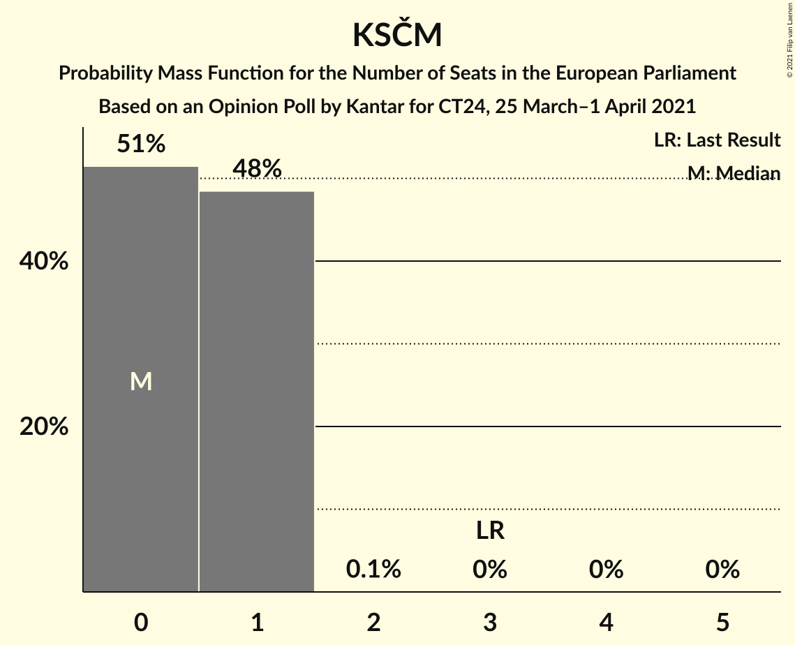

| Number of Seats | Probability | Accumulated | Special Marks |
|:---------------:|:-----------:|:-----------:|:-------------:|
| 0 | 51% | 100% | Median |
| 1 | 48% | 49% |  |
| 2 | 0.1% | 0.1% |  |
| 3 | 0% | 0% | Last Result |

### Přísaha (*)

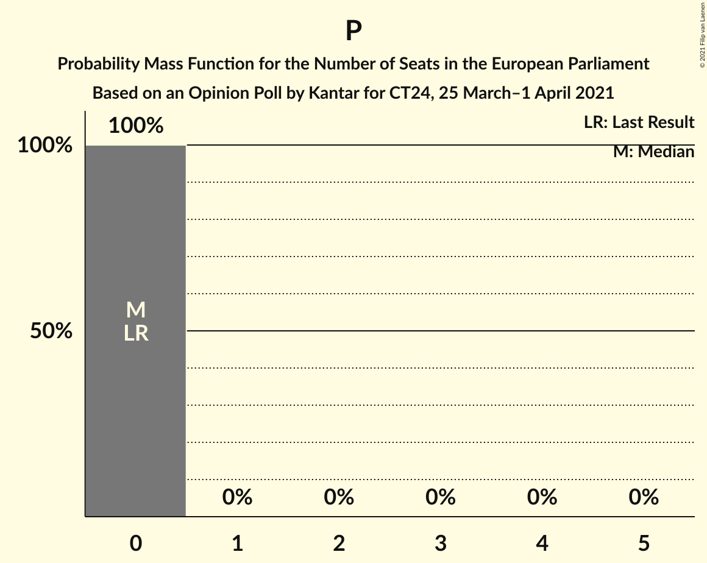

| Number of Seats | Probability | Accumulated | Special Marks |
|:---------------:|:-----------:|:-----------:|:-------------:|
| 0 | 100% | 100% | Last Result, Median |

### Česká strana sociálně demokratická (S&D)

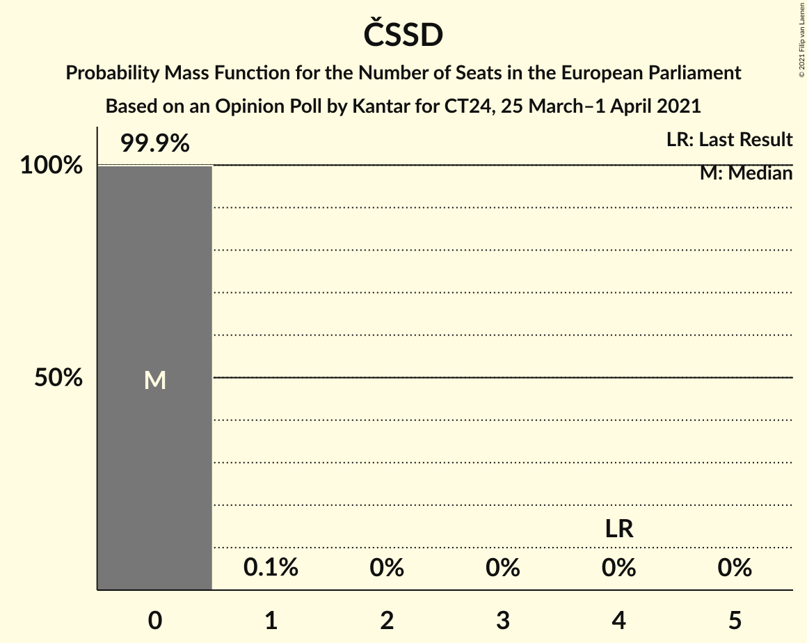

| Number of Seats | Probability | Accumulated | Special Marks |
|:---------------:|:-----------:|:-----------:|:-------------:|
| 0 | 99.9% | 100% | Median |
| 1 | 0.1% | 0.1% |  |
| 2 | 0% | 0% |  |
| 3 | 0% | 0% |  |
| 4 | 0% | 0% | Last Result |

## Technical Information

### Opinion Poll

+ **Polling firm:** Kantar
+ **Commissioner(s):** CT24
+ **Fieldwork period:** 25 March–1 April 2021

### Calculations

+ **Sample size:** 948
+ **Simulations done:** 1,048,576
+ **Error estimate:** 1.19%

