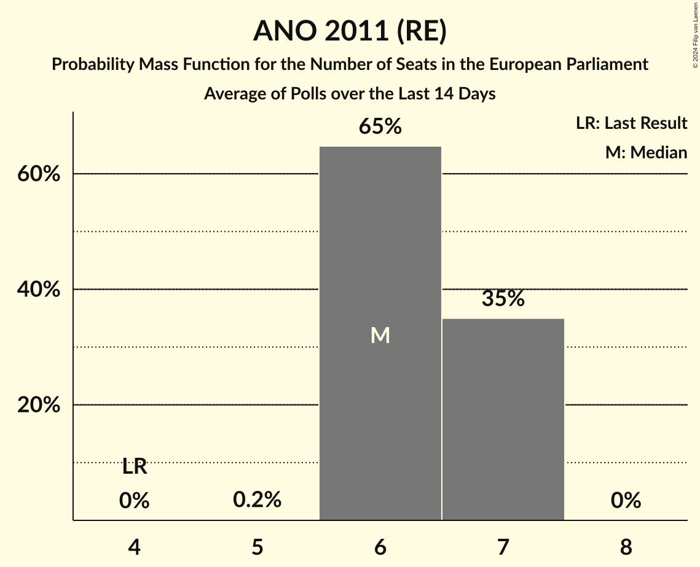

# ANO 2011 (RE)

<a href="#voting-intentions">Voting Intentions</a> | <a href="#seats">Seats</a>

## Voting Intentions

Last result: **16.1%** (General Election of 24–25 May 2019)

### Confidence Intervals

| Period     | Polling firm/Commissioner(s) | Median | 80% Confidence Interval | 90% Confidence Interval | 95% Confidence Interval | 99% Confidence Interval |
|:----------:|:----------------:|:-----------:|:-----------------------:|:-----------------------:|:-----------------------:|:-----------------------:|
| N/A | [Poll Average](average.html) | 26.1% | 24.7–27.7% | 24.2–28.1% | 23.9–28.5% | 23.2–29.2% |
| [20–27 May 2024](2024-05-27-STEM.html) | STEM   Institut H21 | 26.1% | 24.6–27.7% | 24.2–28.1% | 23.9–28.5% | 23.2–29.2% |
| [1–13 May 2024](2024-05-13-PhoenixResearch.html) | Phoenix Research | 27.4% | 25.7–29.3% | 25.2–29.8% | 24.8–30.2% | 23.9–31.1% |
| [28 March–8 April 2024](2024-04-08-STEM.html) | STEM | 27.5% | 25.7–29.3% | 25.2–29.8% | 24.8–30.3% | 24.0–31.2% |
| [15–25 March 2024](2024-03-25-STEM.html) | STEM   CNN Prima News | 32.8% | N/A | N/A | N/A | N/A |
| [25 March 2024](2024-03-25-DataCollect.html) | Data Collect | 27.3% | 25.1–29.6% | 24.5–30.3% | 24.0–30.9% | 23.0–32.0% |
| [23 February–5 March 2024](2024-03-05-Ipsos.html) | Ipsos   Euronews | 26.3% | 24.9–27.8% | 24.5–28.2% | 24.1–28.6% | 23.5–29.3% |
| [1 February–4 March 2024](2024-03-04-Median.html) | Median | 31.0% | 29.2–32.9% | 28.7–33.5% | 28.2–33.9% | 27.4–34.9% |
| [12 February–1 March 2024](2024-03-01-Kantar.html) | Kantar   ČT24 | 38.5% | 36.6–40.5% | 36.0–41.1% | 35.6–41.6% | 34.7–42.5% |
| [15 January–2 February 2024](2024-02-02-Kantar.html) | Kantar   ČT24 | 35.0% | N/A | N/A | N/A | N/A |
| [15 January–1 February 2024](2024-02-01-Median.html) | Median | 31.5% | N/A | N/A | N/A | N/A |
| [18–27 January 2024](2024-01-27-STEM.html) | STEM   CNN Prima News | 33.4% | 31.6–35.3% | 31.1–35.8% | 30.7–36.3% | 29.8–37.2% |
| [1–31 December 2023](2023-12-31-Ipsos.html) | Ipsos | 26.3% | 24.2–28.6% | 23.6–29.3% | 23.1–29.9% | 22.1–31.0% |
| [29 November–30 December 2023](2023-12-30-Median.html) | Median | 35.0% | 33.1–37.0% | 32.6–37.6% | 32.1–38.1% | 31.2–39.0% |
| [1–30 November 2023](2023-11-30-STEM.html) | STEM   CNN Prima News | 33.2% | 31.4–35.0% | 30.9–35.6% | 30.5–36.0% | 29.6–36.9% |
| [23–28 November 2023](2023-11-28-STEMMARK.html) | STEM/MARK | 33.8% | 31.9–35.7% | 31.4–36.3% | 30.9–36.7% | 30.0–37.7% |
| [16 October–3 November 2023](2023-11-03-Kantar.html) | Kantar   ČT24 | 32.5% | 30.8–34.3% | 30.3–34.8% | 29.9–35.2% | 29.1–36.1% |
| [3–31 October 2023](2023-10-31-Median.html) | Median | 35.0% | 33.2–37.0% | 32.6–37.6% | 32.2–38.0% | 31.3–39.0% |
| [5 September–2 October 2023](2023-10-02-Median.html) | Median | 34.0% | 32.1–36.0% | 31.6–36.5% | 31.2–37.0% | 30.3–37.9% |
| [11–29 September 2023](2023-09-29-Kantar.html) | Kantar   ČT24 | 33.5% | 31.6–35.5% | 31.1–36.0% | 30.6–36.5% | 29.7–37.5% |
| [7–17 September 2023](2023-09-17-STEM.html) | STEM   CNN Prima News | 30.8% | 29.1–32.6% | 28.6–33.1% | 28.2–33.6% | 27.4–34.5% |
| [1 July–8 August 2023](2023-08-08-Median.html) | Median | 33.0% | 31.1–34.9% | 30.6–35.5% | 30.1–35.9% | 29.3–36.9% |
| [12–30 June 2023](2023-06-30-Median.html) | Median | 35.5% | 33.5–37.4% | 33.0–38.0% | 32.6–38.5% | 31.7–39.4% |
| [1 May–2 June 2023](2023-06-02-Median.html) | Median | 34.5% | 32.6–36.4% | 32.1–37.0% | 31.6–37.5% | 30.7–38.4% |
| [15 May–2 June 2023](2023-06-02-Kantar.html) | Kantar   ČT24 | 33.5% | 32.0–35.9% | 31.4–36.5% | 31.0–36.9% | 30.1–37.9% |
| [18–29 May 2023](2023-05-29-STEM.html) | STEM   CNN Prima News | 33.4% | 31.4–34.9% | 30.9–35.5% | 30.5–35.9% | 29.6–36.8% |
| [17 April–5 May 2023](2023-05-05-Kantar.html) | Kantar   ČT24 | 30.5% | 28.6–32.4% | 28.1–33.0% | 27.7–33.4% | 26.8–34.4% |
| [1 April–2 May 2023](2023-05-02-Median.html) | Median | 31.0% | N/A | N/A | N/A | N/A |
| [1–30 April 2023](2023-04-30-PhoenixResearch.html) | Phoenix Research | 31.5% | 29.0–32.8% | 28.5–33.3% | 28.0–33.8% | 27.2–34.7% |
| [20 March–6 April 2023](2023-04-06-Kantar.html) | Kantar   ČT24 | 29.5% | 27.7–31.5% | 27.2–32.1% | 26.7–32.5% | 25.8–33.5% |
| [2 March–3 April 2023](2023-04-03-Median.html) | Median | 34.2% | 32.3–36.2% | 31.8–36.7% | 31.3–37.2% | 30.4–38.1% |
| [1 February–31 March 2023](2023-03-31-PhoenixResearch.html) | Phoenix Research | 27.6% | 25.8–29.4% | 25.4–30.0% | 24.9–30.4% | 24.1–31.3% |
| [12 February–7 March 2023](2023-03-07-Median.html) | Median | 32.0% | 29.9–34.2% | 29.3–34.8% | 28.8–35.4% | 27.8–36.5% |
| [13 February–3 March 2023](2023-03-03-Kantar.html) | Kantar   ČT24 | 30.5% | 28.6–32.5% | 28.1–33.0% | 27.6–33.5% | 26.8–34.5% |
| [29 November–5 December 2022](2022-12-05-STEM.html) | STEM   CNN Prima News | 30.8% | 29.5–32.1% | 29.1–32.5% | 28.8–32.8% | 28.2–33.5% |
| [17 October–4 November 2022](2022-11-04-Kantar.html) | Kantar   ČT24 | 26.5% | 24.9–28.2% | 24.5–28.7% | 24.1–29.1% | 23.3–29.9% |
| [1–31 October 2022](2022-10-31-Median.html) | Median | 31.5% | 29.2–34.1% | 28.5–34.8% | 27.9–35.4% | 26.8–36.6% |
| [1–30 September 2022](2022-09-30-Median.html) | Median | 30.5% | N/A | N/A | N/A | N/A |
| [12–30 September 2022](2022-09-30-Kantar.html) | Kantar   ČT24 | 29.5% | 27.7–31.4% | 27.2–31.9% | 26.7–32.4% | 25.9–33.3% |
| [1–8 September 2022](2022-09-08-STEM.html) | STEM   CNN Prima News | 30.0% | 28.3–31.7% | 27.8–32.2% | 27.4–32.6% | 26.6–33.5% |
| [15 August–2 September 2022](2022-09-02-Kantar.html) | Kantar   ČT24 | 30.5% | N/A | N/A | N/A | N/A |
| [1–31 August 2022](2022-08-31-Median.html) | Median | 29.1% | 26.7–31.6% | 26.1–32.3% | 25.5–32.9% | 24.4–34.1% |
| [4–11 August 2022](2022-08-11-STEM.html) | STEM   CNN Prima News | 31.1% | N/A | N/A | N/A | N/A |
| [8 July–2 August 2022](2022-08-02-Median.html) | Median | 30.0% | 28.2–32.0% | 27.7–32.5% | 27.3–33.0% | 26.4–33.9% |
| [20 May–4 July 2022](2022-07-04-Median.html) | Median | 29.0% | 27.2–30.9% | 26.7–31.4% | 26.3–31.9% | 25.5–32.8% |
| [1 May–2 June 2022](2022-06-02-Median.html) | Median | 28.5% | 26.7–30.4% | 26.2–30.9% | 25.8–31.4% | 25.0–32.3% |
| [16 May–2 June 2022](2022-06-02-Kantar.html) | Kantar   ČT24 | 29.4% | 27.0–32.0% | 26.4–32.7% | 25.8–33.4% | 24.7–34.6% |
| [8–29 April 2022](2022-04-29-Kantar.html) | Kantar   ČT24 | 28.4% | 26.2–30.9% | 25.5–31.6% | 25.0–32.2% | 23.9–33.4% |
| [14 March–1 April 2022](2022-04-01-Kantar.html) | Kantar   ČT24 | 28.5% | N/A | N/A | N/A | N/A |
| [14 February–4 March 2022](2022-03-04-Kantar.html) | Kantar   ČT24 | 27.4% | N/A | N/A | N/A | N/A |
| [1–28 February 2022](2022-02-28-PhoenixResearch.html) | Phoenix Research | 26.4% | N/A | N/A | N/A | N/A |
| [1 November–1 December 2021](2021-12-01-Median.html) | Median | 29.5% | 27.4–31.7% | 26.8–32.3% | 26.3–32.9% | 25.3–34.0% |
| [1–19 November 2021](2021-11-19-Kantar.html) | Kantar   ČT24 | 27.0% | 25.6–30.5% | 24.9–31.3% | 24.4–31.9% | 23.3–33.1% |
| [24–30 September 2021](2021-09-30-STEM.html) | STEM   CNN Prima News | 27.3% | 25.7–28.9% | 25.2–29.4% | 24.9–29.8% | 24.1–30.6% |
| [1–30 September 2021](2021-09-30-Median.html) | Median | 28.5% | 26.8–30.5% | 26.3–31.0% | 25.9–31.5% | 25.1–32.4% |
| [23–29 September 2021](2021-09-29-Median.html) | Median   iDNES | 25.2% | N/A | N/A | N/A | N/A |
| [13–22 September 2021](2021-09-22-Kantar.html) | Kantar   ČT24 | 24.5% | 23.0–26.2% | 22.5–26.6% | 22.1–27.0% | 21.4–27.8% |
| [8–12 September 2021](2021-09-12-Ipsos.html) | Ipsos | 27.4% | 25.6–29.3% | 25.1–29.8% | 24.7–30.3% | 23.9–31.2% |
| [1–10 September 2021](2021-09-10-PhoenixResearch.html) | Phoenix Research | 25.4% | 23.8–27.2% | 23.3–27.7% | 22.9–28.1% | 22.1–29.0% |
| [31 August–8 September 2021](2021-09-08-STEM.html) | STEM | 32.4% | N/A | N/A | N/A | N/A |
| [30 August–8 September 2021](2021-09-08-DataCollect.html) | Data Collect | 25.0% | 23.4–26.7% | 23.0–27.1% | 22.6–27.5% | 21.9–28.3% |
| [1 August–2 September 2021](2021-09-02-Median.html) | Median | 27.0% | N/A | N/A | N/A | N/A |
| [1–31 August 2021](2021-08-31-MédeaResearch.html) | Médea Research | 27.6% | N/A | N/A | N/A | N/A |
| [2–13 August 2021](2021-08-13-Kantar.html) | Kantar   ČT24 | 27.5% | N/A | N/A | N/A | N/A |
| [9–12 August 2021](2021-08-12-STEM.html) | STEM | 31.1% | N/A | N/A | N/A | N/A |
| [1–10 August 2021](2021-08-10-PhoenixResearch.html) | Phoenix Research | 24.4% | N/A | N/A | N/A | N/A |
| [1–31 July 2021](2021-07-31-Median.html) | Median | 26.0% | N/A | N/A | N/A | N/A |
| [26 June–11 July 2021](2021-07-11-CVVM.html) | CVVM | 23.5% | 20.9–26.4% | 20.2–27.3% | 19.6–28.0% | 18.4–29.4% |
| [1–10 July 2021](2021-07-10-PhoenixResearch.html) | Phoenix Research | 22.1% | N/A | N/A | N/A | N/A |
| [1–30 June 2021](2021-06-30-Median.html) | Median | 26.0% | 24.3–27.8% | 23.9–28.4% | 23.5–28.8% | 22.7–29.7% |
| [21–29 June 2021](2021-06-29-STEM.html) | STEM | 26.7% | 24.5–29.1% | 23.9–29.8% | 23.4–30.4% | 22.3–31.6% |
| [7–18 June 2021](2021-06-18-Kantar.html) | Kantar   ČT24 | 21.5% | 19.9–23.4% | 19.4–23.9% | 19.0–24.3% | 18.2–25.2% |
| [29 May–13 June 2021](2021-06-13-CVVM.html) | CVVM | 24.6% | 22.5–26.9% | 21.9–27.5% | 21.4–28.1% | 20.4–29.2% |
| [31 May–11 June 2021](2021-06-11-DataCollect.html) | Data Collect   ČT24 | 20.5% | 18.6–22.7% | 18.1–23.3% | 17.6–23.8% | 16.8–24.8% |
| [1–10 June 2021](2021-06-10-PhoenixResearch.html) | Phoenix Research | 21.2% | 19.7–22.8% | 19.3–23.3% | 18.9–23.7% | 18.2–24.5% |
| [2–6 June 2021](2021-06-06-Ipsos.html) | Ipsos | 23.6% | 21.6–25.8% | 21.0–26.4% | 20.5–26.9% | 19.6–28.0% |
| [1–31 May 2021](2021-05-31-Median.html) | Median | 22.8% | 21.2–24.5% | 20.7–25.0% | 20.3–25.4% | 19.6–26.2% |
| [10–28 May 2021](2021-05-28-Kantar.html) | Kantar   ČT24 | 20.0% | 18.4–21.8% | 17.9–22.3% | 17.5–22.7% | 16.8–23.6% |
| [19–24 May 2021](2021-05-24-Ipsos.html) | Ipsos | 22.1% | 20.1–24.3% | 19.6–25.0% | 19.1–25.5% | 18.2–26.6% |
| [3–21 May 2021](2021-05-21-DataCollect.html) | Data Collect   ČT24 | 19.4% | 17.6–21.6% | 17.0–22.2% | 16.6–22.7% | 15.7–23.7% |
| [1–15 May 2021](2021-05-15-PhoenixResearch.html) | Phoenix Research | 22.5% | 20.9–24.3% | 20.4–24.8% | 20.1–25.2% | 19.3–26.0% |
| [1 April–4 May 2021](2021-05-04-Median.html) | Median | 21.0% | 19.1–23.2% | 18.6–23.8% | 18.1–24.3% | 17.2–25.3% |
| [12–30 April 2021](2021-04-30-Kantar.html) | Kantar   ČT24 | 21.0% | 19.5–22.6% | 19.1–23.0% | 18.8–23.4% | 18.1–24.2% |
| [7–13 April 2021](2021-04-13-STEM.html) | STEM | 24.0% | 22.4–25.8% | 21.9–26.3% | 21.5–26.7% | 20.8–27.6% |
| [8–12 April 2021](2021-04-12-Ipsos.html) | Ipsos   SPOLU | 22.2% | 20.6–23.9% | 20.1–24.4% | 19.7–24.9% | 19.0–25.7% |
| [1–10 April 2021](2021-04-10-PhoenixResearch.html) | Phoenix Research | 24.0% | 21.9–26.4% | 21.3–27.1% | 20.8–27.7% | 19.8–28.8% |
| [25 March–1 April 2021](2021-04-01-Kantar.html) | Kantar   ČT24 | 23.1% | 21.4–24.9% | 20.9–25.5% | 20.5–25.9% | 19.7–26.8% |
| [25 March–1 April 2021](2021-04-01-DataCollect.html) | Data Collect   ČT24 | 22.1% | 20.4–23.9% | 19.9–24.4% | 19.5–24.9% | 18.7–25.8% |
| [1–29 March 2021](2021-03-29-Median.html) | Median | 24.5% | 22.8–26.3% | 22.3–26.8% | 21.9–27.2% | 21.1–28.1% |
| [12–16 March 2021](2021-03-16-Ipsos.html) | Ipsos   SPOLU | 26.0% | 24.4–27.9% | 23.9–28.4% | 23.5–28.8% | 22.7–29.7% |
| [15 February–5 March 2021](2021-03-05-Kantar.html) | Kantar   ČT24 | 22.0% | 20.4–23.9% | 19.9–24.4% | 19.5–24.8% | 18.7–25.7% |
| [1 February–2 March 2021](2021-03-02-Median.html) | Median | 26.5% | 24.8–28.3% | 24.4–28.8% | 23.9–29.3% | 23.1–30.2% |
| [15–19 February 2021](2021-02-19-Ipsos.html) | Ipsos   SPOLU | 25.4% | 23.7–27.2% | 23.2–27.7% | 22.8–28.2% | 22.0–29.1% |
| [18 January–5 February 2021](2021-02-05-TNSKantar.html) | TNS Kantar   O24 | 26.5% | 24.4–28.8% | 23.8–29.5% | 23.3–30.0% | 22.3–31.2% |
| [1–29 January 2021](2021-01-29-Median.html) | Median | 26.6% | 24.5–28.8% | 23.9–29.5% | 23.4–30.0% | 22.4–31.1% |
| [15–19 January 2021](2021-01-19-Ipsos.html) | Ipsos | 27.1% | 25.1–29.6% | 24.5–30.3% | 24.0–30.8% | 23.0–32.0% |
| [1–10 January 2021](2021-01-10-PhoenixResearch.html) | Phoenix Research | 27.9% | 25.8–30.1% | 25.2–30.7% | 24.7–31.3% | 23.7–32.4% |
| [13 November–4 December 2020](2020-12-04-TNSKantar.html) | TNS Kantar   O24 | 25.0% | 23.2–26.9% | 22.7–27.5% | 22.2–28.0% | 21.4–28.9% |
| [1–30 November 2020](2020-11-30-Median.html) | Median | 28.5% | 26.3–30.9% | 25.7–31.6% | 25.1–32.2% | 24.1–33.4% |
| [19 October–6 November 2020](2020-11-06-TNSKantar.html) | TNS Kantar   O24 | 27.5% | 25.6–29.5% | 25.0–30.1% | 24.6–30.6% | 23.7–31.6% |
| [1–29 October 2020](2020-10-29-Median.html) | Median | 28.3% | 26.2–30.6% | 25.6–31.2% | 25.1–31.8% | 24.1–32.9% |
| [21 September–9 October 2020](2020-10-09-TNSKantar.html) | TNS Kantar   O24 | 24.5% | 22.9–26.6% | 22.4–27.1% | 22.0–27.6% | 21.2–28.5% |
| [5–20 September 2020](2020-09-20-CVVM.html) | CVVM | 31.6% | 29.3–34.0% | 28.7–34.6% | 28.1–35.2% | 27.1–36.4% |
| [31 August–13 September 2020](2020-09-13-STEM.html) | STEM | 28.4% | 26.7–30.3% | 26.2–30.8% | 25.8–31.3% | 24.9–32.2% |
| [24 August–11 September 2020](2020-09-11-TNSKantar.html) | TNS Kantar   O24 | 27.6% | 25.7–29.5% | 25.2–30.1% | 24.7–30.6% | 23.9–31.5% |
| [1–27 August 2020](2020-08-27-Median.html) | Median | 29.5% | 27.7–31.4% | 27.2–31.9% | 26.8–32.4% | 26.0–33.3% |
| [18–27 July 2020](2020-07-27-CVVM.html) | CVVM | 29.0% | 26.7–31.5% | 26.0–32.2% | 25.5–32.8% | 24.4–34.0% |
| [15 June–3 July 2020](2020-07-03-TNSKantar.html) | TNS Kantar   O24 | 32.0% | 30.8–33.2% | 30.5–33.5% | 30.2–33.8% | 29.7–34.4% |
| [20 June–2 July 2020](2020-07-02-CVVM.html) | CVVM | 29.0% | 27.0–31.4% | 26.4–32.1% | 25.9–32.6% | 24.9–33.7% |
| [18 May–5 June 2020](2020-06-05-TNSKantar.html) | TNS Kantar   O24 | 31.5% | 29.8–33.3% | 29.3–33.8% | 28.9–34.2% | 28.1–35.0% |
| [22 May–1 June 2020](2020-06-01-STEM.html) | STEM | 33.7% | 31.9–35.6% | 31.4–36.1% | 30.9–36.6% | 30.1–37.5% |
| [15–30 April 2020](2020-04-30-g82.html) | g82 | 35.0% | N/A | N/A | N/A | N/A |
| [13–30 April 2020](2020-04-30-TNSKantar.html) | TNS Kantar   O24 | 34.0% | 32.0–36.1% | 31.5–36.6% | 31.0–37.1% | 30.0–38.1% |
| [9–27 March 2020](2020-03-27-TNSKantar.html) | TNS Kantar   O24 | 34.5% | 32.6–36.6% | 32.0–37.2% | 31.5–37.7% | 30.6–38.6% |
| [29 February–26 March 2020](2020-03-26-Median.html) | Median | 29.5% | 27.8–31.4% | 27.3–32.0% | 26.8–32.4% | 26.0–33.3% |
| [29 February–11 March 2020](2020-03-11-CVVM.html) | CVVM | 33.0% | 30.7–35.5% | 30.0–36.2% | 29.4–36.8% | 28.3–38.0% |
| [10–28 February 2020](2020-02-28-TNSKantar.html) | TNS Kantar   O24 | 31.0% | 28.8–33.4% | 28.1–34.1% | 27.6–34.7% | 26.5–35.9% |
| [1 January–13 February 2020](2020-02-13-Median.html) | Median | 30.0% | 27.8–32.3% | 27.2–32.9% | 26.7–33.5% | 25.7–34.6% |
| [1–13 February 2020](2020-02-13-CVVM.html) | CVVM | 33.1% | 30.7–35.5% | 30.1–36.2% | 29.5–36.8% | 28.4–38.0% |
| [13–31 January 2020](2020-01-31-TNSKantar.html) | TNS Kantar | 29.8% | 27.4–32.4% | 26.7–33.2% | 26.1–33.9% | 24.9–35.1% |
| [11–20 January 2020](2020-01-20-CVVM.html) | CVVM | 32.1% | 29.9–34.3% | 29.3–34.9% | 28.8–35.5% | 27.8–36.5% |
| [1–12 January 2020](2020-01-12-PhoenixResearch.html) | Phoenix Research | 28.8% | 27.1–30.7% | 26.6–31.3% | 26.1–31.7% | 25.3–32.6% |
| [30 November–11 December 2019](2019-12-11-CVVM.html) | CVVM | 29.5% | 27.3–31.7% | 26.7–32.4% | 26.2–32.9% | 25.2–34.0% |
| [29 October–30 November 2019](2019-11-30-Median.html) | Median | 30.5% | 28.7–32.3% | 28.3–32.8% | 27.8–33.2% | 27.0–34.1% |
| [9–29 November 2019](2019-11-29-TNSKantar.html) | TNS Kantar | 28.2% | 26.6–30.0% | 26.2–30.5% | 25.8–30.9% | 25.0–31.7% |
| [14–26 November 2019](2019-11-26-STEM.html) | STEM | 34.9% | 33.2–36.9% | 32.7–37.4% | 32.3–37.9% | 31.4–38.8% |
| [1–18 November 2019](2019-11-18-PhoenixResearch.html) | Phoenix Research | 26.6% | 25.0–28.4% | 24.5–28.9% | 24.1–29.3% | 23.3–30.2% |
| [2–15 November 2019](2019-11-15-CVVM.html) | CVVM | 29.9% | 27.1–32.9% | 26.4–33.7% | 25.7–34.5% | 24.4–35.9% |
| [12 October–1 November 2019](2019-11-01-TNSKantar.html) | TNS Kantar | 31.3% | 29.6–33.1% | 29.2–33.6% | 28.8–34.0% | 28.0–34.9% |
| [30 September–28 October 2019](2019-10-28-Median.html) | Median | 30.5% | 28.8–32.3% | 28.3–32.8% | 27.9–33.3% | 27.1–34.1% |
| [11–25 October 2019](2019-10-25-STEM.html) | STEM | 33.1% | 31.2–35.1% | 30.7–35.6% | 30.2–36.1% | 29.4–37.0% |
| [16 September–5 October 2019](2019-10-05-TNSKantar.html) | TNS Kantar | 29.2% | 27.6–31.0% | 27.1–31.5% | 26.7–31.9% | 26.0–32.7% |
| [28 August–29 September 2019](2019-09-29-Median.html) | Median | 31.0% | 29.2–32.9% | 28.7–33.4% | 28.3–33.9% | 27.4–34.8% |
| [20 August–18 September 2019](2019-09-18-PhoenixResearch.html) | Phoenix Research | 29.6% | 27.8–31.4% | 27.3–31.9% | 26.9–32.4% | 26.1–33.3% |
| [7–17 September 2019](2019-09-17-CVVM.html) | CVVM | 30.0% | 28.0–32.8% | 27.3–33.5% | 26.7–34.1% | 25.7–35.3% |
| [10–30 August 2019](2019-08-30-TNSKantar.html) | TNS Kantar | 30.0% | 28.3–31.7% | 27.9–32.2% | 27.5–32.7% | 26.7–33.5% |
| [27 July–26 August 2019](2019-08-26-Median.html) | Median | 29.2% | 27.4–31.1% | 26.9–31.6% | 26.5–32.0% | 25.7–33.0% |
| [1–26 July 2019](2019-07-26-Median.html) | Median | 28.5% | 26.8–30.4% | 26.3–30.9% | 25.9–31.4% | 25.0–32.3% |
| [1–30 June 2019](2019-06-30-Median.html) | Median | 29.0% | 27.2–30.8% | 26.7–31.4% | 26.3–31.8% | 25.5–32.7% |
| [17–26 June 2019](2019-06-26-TNSKantar.html) | TNS Kantar   Česká televize | 25.5% | 23.9–27.2% | 23.5–27.6% | 23.1–28.0% | 22.4–28.9% |
| [8–17 June 2019](2019-06-17-CVVM.html) | CVVM | 29.0% | 27.2–30.9% | 26.7–31.4% | 26.3–31.9% | 25.4–32.8% |
| [11–31 May 2019](2019-05-31-TNSKantar.html) | TNS Kantar   Česká televize | 27.5% | 25.9–29.2% | 25.4–29.7% | 25.0–30.1% | 24.3–30.9% |

### Probability Mass Function

The following table shows the probability mass function per percentage block of voting intentions for the [poll average](average.html) for ANO 2011 (RE).

| Voting Intentions | Probability | Accumulated | Special Marks |
|:-----------------:|:-----------:|:-----------:|:-------------:|
| 15.5–16.5% | 0% | 100% | Last Result |
| 16.5–17.5% | 0% | 100% |  |
| 17.5–18.5% | 0% | 100% |  |
| 18.5–19.5% | 0% | 100% |  |
| 19.5–20.5% | 0% | 100% |  |
| 20.5–21.5% | 0% | 100% |  |
| 21.5–22.5% | 0.1% | 100% |  |
| 22.5–23.5% | 1.1% | 99.9% |  |
| 23.5–24.5% | 7% | 98.8% |  |
| 24.5–25.5% | 22% | 91% |  |
| 25.5–26.5% | 33% | 69% | Median |
| 26.5–27.5% | 25% | 36% |  |
| 27.5–28.5% | 9% | 11% |  |
| 28.5–29.5% | 2% | 2% |  |
| 29.5–30.5% | 0.2% | 0.2% |  |
| 30.5–31.5% | 0% | 0% |  |

## Seats

Last result: **4** seats (General Election of 24–25 May 2019)

### Confidence Intervals

| Period     | Polling firm/Commissioner(s) | Median | 80% Confidence Interval | 90% Confidence Interval | 95% Confidence Interval | 99% Confidence Interval |
|:----------:|:----------------:|:------:|:-----------------------:|:-----------------------:|:-----------------------:|:-----------------------:|
| N/A | [Poll Average](average.html) | 6 | 6–7 | 6–7 | 6–7 | 6–7 |
| [20–27 May 2024](2024-05-27-STEM.html) | STEM   Institut H21 | 6 | 6–7 | 6–7 | 6–7 | 6–7 |
| [1–13 May 2024](2024-05-13-PhoenixResearch.html) | Phoenix Research | 7 | 7–8 | 7–9 | 6–9 | 6–9 |
| [28 March–8 April 2024](2024-04-08-STEM.html) | STEM | 7 | 7 | 6–8 | 6–8 | 6–8 |
| [15–25 March 2024](2024-03-25-STEM.html) | STEM   CNN Prima News |  |  |  |  |  |
| [25 March 2024](2024-03-25-DataCollect.html) | Data Collect | 8 | 7–8 | 6–8 | 6–8 | 6–9 |
| [23 February–5 March 2024](2024-03-05-Ipsos.html) | Ipsos   Euronews | 7 | 6–7 | 6–7 | 6–7 | 6–8 |
| [1 February–4 March 2024](2024-03-04-Median.html) | Median | 9 | 8–9 | 8–9 | 7–9 | 7–9 |
| [12 February–1 March 2024](2024-03-01-Kantar.html) | Kantar   ČT24 | 10 | 10–11 | 9–11 | 9–11 | 9–11 |
| [15 January–2 February 2024](2024-02-02-Kantar.html) | Kantar   ČT24 |  |  |  |  |  |
| [15 January–1 February 2024](2024-02-01-Median.html) | Median |  |  |  |  |  |
| [18–27 January 2024](2024-01-27-STEM.html) | STEM   CNN Prima News | 9 | 8–9 | 8–9 | 8–9 | 8–10 |
| [1–31 December 2023](2023-12-31-Ipsos.html) | Ipsos | 7 | 6–7 | 6–8 | 6–8 | 5–8 |
| [29 November–30 December 2023](2023-12-30-Median.html) | Median | 9 | 9–10 | 9–10 | 8–10 | 8–10 |
| [1–30 November 2023](2023-11-30-STEM.html) | STEM   CNN Prima News | 9 | 8–9 | 8–10 | 8–10 | 8–10 |
| [23–28 November 2023](2023-11-28-STEMMARK.html) | STEM/MARK | 9 | 8–9 | 8–10 | 8–10 | 8–10 |
| [16 October–3 November 2023](2023-11-03-Kantar.html) | Kantar   ČT24 | 8 | 8–9 | 8–9 | 8–9 | 8–10 |
| [3–31 October 2023](2023-10-31-Median.html) | Median | 10 | 9–11 | 9–11 | 9–11 | 9–12 |
| [5 September–2 October 2023](2023-10-02-Median.html) | Median | 10 | 9–10 | 9–10 | 9–10 | 8–11 |
| [11–29 September 2023](2023-09-29-Kantar.html) | Kantar   ČT24 | 10 | 10–11 | 10–11 | 9–11 | 9–11 |
| [7–17 September 2023](2023-09-17-STEM.html) | STEM   CNN Prima News | 9 | 8–10 | 8–10 | 8–10 | 8–11 |
| [1 July–8 August 2023](2023-08-08-Median.html) | Median | 9 | 8–10 | 8–10 | 8–10 | 8–10 |
| [12–30 June 2023](2023-06-30-Median.html) | Median | 10 | 10–11 | 10–11 | 10–11 | 9–11 |
| [1 May–2 June 2023](2023-06-02-Median.html) | Median | 10 | 9–11 | 9–11 | 9–11 | 8–11 |
| [15 May–2 June 2023](2023-06-02-Kantar.html) | Kantar   ČT24 | 10 | 9–10 | 9–11 | 9–11 | 9–12 |
| [18–29 May 2023](2023-05-29-STEM.html) | STEM   CNN Prima News | 10 | 9–11 | 9–11 | 9–11 | 9–12 |
| [17 April–5 May 2023](2023-05-05-Kantar.html) | Kantar   ČT24 | 8 | 8–9 | 8–9 | 8–10 | 7–10 |
| [1 April–2 May 2023](2023-05-02-Median.html) | Median |  |  |  |  |  |
| [1–30 April 2023](2023-04-30-PhoenixResearch.html) | Phoenix Research | 8 | 7–9 | 7–9 | 6–9 | 6–9 |
| [20 March–6 April 2023](2023-04-06-Kantar.html) | Kantar   ČT24 | 8 | 8–9 | 7–9 | 7–10 | 7–10 |
| [2 March–3 April 2023](2023-04-03-Median.html) | Median | 9 | 9–11 | 9–11 | 9–11 | 8–11 |
| [1 February–31 March 2023](2023-03-31-PhoenixResearch.html) | Phoenix Research | 7 | 6–7 | 6–7 | 6–8 | 6–8 |
| [12 February–7 March 2023](2023-03-07-Median.html) | Median | 9 | 8–10 | 8–10 | 8–10 | 8–11 |
| [13 February–3 March 2023](2023-03-03-Kantar.html) | Kantar   ČT24 | 7 | 7–8 | 7–8 | 6–8 | 6–8 |
| [29 November–5 December 2022](2022-12-05-STEM.html) | STEM   CNN Prima News | 8 | 8–9 | 8–9 | 8–9 | 7–9 |
| [17 October–4 November 2022](2022-11-04-Kantar.html) | Kantar   ČT24 | 7 | 7–8 | 7–8 | 7–8 | 6–8 |
| [1–31 October 2022](2022-10-31-Median.html) | Median | 9 | 8–9 | 8–10 | 8–10 | 7–10 |
| [1–30 September 2022](2022-09-30-Median.html) | Median |  |  |  |  |  |
| [12–30 September 2022](2022-09-30-Kantar.html) | Kantar   ČT24 | 8 | 7–9 | 7–9 | 7–9 | 7–9 |
| [1–8 September 2022](2022-09-08-STEM.html) | STEM   CNN Prima News | 8 | 7–9 | 7–9 | 7–9 | 7–9 |
| [15 August–2 September 2022](2022-09-02-Kantar.html) | Kantar   ČT24 |  |  |  |  |  |
| [1–31 August 2022](2022-08-31-Median.html) | Median | 9 | 8–9 | 7–9 | 7–10 | 7–10 |
| [4–11 August 2022](2022-08-11-STEM.html) | STEM   CNN Prima News |  |  |  |  |  |
| [8 July–2 August 2022](2022-08-02-Median.html) | Median | 9 | 8–9 | 8–9 | 8–10 | 8–10 |
| [20 May–4 July 2022](2022-07-04-Median.html) | Median | 8 | 8–9 | 8–9 | 7–9 | 7–9 |
| [1 May–2 June 2022](2022-06-02-Median.html) | Median | 8 | 7–9 | 7–9 | 7–9 | 7–10 |
| [16 May–2 June 2022](2022-06-02-Kantar.html) | Kantar   ČT24 | 7 | 7–8 | 6–8 | 6–8 | 6–9 |
| [8–29 April 2022](2022-04-29-Kantar.html) | Kantar   ČT24 | 7 | 6–8 | 6–8 | 6–8 | 6–8 |
| [14 March–1 April 2022](2022-04-01-Kantar.html) | Kantar   ČT24 |  |  |  |  |  |
| [14 February–4 March 2022](2022-03-04-Kantar.html) | Kantar   ČT24 |  |  |  |  |  |
| [1–28 February 2022](2022-02-28-PhoenixResearch.html) | Phoenix Research |  |  |  |  |  |
| [1 November–1 December 2021](2021-12-01-Median.html) | Median | 8 | 7–8 | 7–8 | 7–9 | 6–9 |
| [1–19 November 2021](2021-11-19-Kantar.html) | Kantar   ČT24 | 7 | 7–8 | 6–8 | 6–8 | 6–9 |
| [24–30 September 2021](2021-09-30-STEM.html) | STEM   CNN Prima News | 7 | 6–7 | 6–7 | 6–8 | 6–8 |
| [1–30 September 2021](2021-09-30-Median.html) | Median | 8 | 7–8 | 7–8 | 7–8 | 6–8 |
| [23–29 September 2021](2021-09-29-Median.html) | Median   iDNES |  |  |  |  |  |
| [13–22 September 2021](2021-09-22-Kantar.html) | Kantar   ČT24 | 6 | 6–7 | 6–7 | 5–7 | 5–7 |
| [8–12 September 2021](2021-09-12-Ipsos.html) | Ipsos | 7 | 7–8 | 6–8 | 6–8 | 6–8 |
| [1–10 September 2021](2021-09-10-PhoenixResearch.html) | Phoenix Research | 6 | 6–7 | 6–7 | 5–7 | 5–7 |
| [31 August–8 September 2021](2021-09-08-STEM.html) | STEM |  |  |  |  |  |
| [30 August–8 September 2021](2021-09-08-DataCollect.html) | Data Collect | 6 | 6–7 | 6–7 | 6–7 | 5–7 |
| [1 August–2 September 2021](2021-09-02-Median.html) | Median |  |  |  |  |  |
| [1–31 August 2021](2021-08-31-MédeaResearch.html) | Médea Research |  |  |  |  |  |
| [2–13 August 2021](2021-08-13-Kantar.html) | Kantar   ČT24 |  |  |  |  |  |
| [9–12 August 2021](2021-08-12-STEM.html) | STEM |  |  |  |  |  |
| [1–10 August 2021](2021-08-10-PhoenixResearch.html) | Phoenix Research |  |  |  |  |  |
| [1–31 July 2021](2021-07-31-Median.html) | Median |  |  |  |  |  |
| [26 June–11 July 2021](2021-07-11-CVVM.html) | CVVM | 6 | 5–7 | 5–7 | 5–7 | 4–7 |
| [1–10 July 2021](2021-07-10-PhoenixResearch.html) | Phoenix Research |  |  |  |  |  |
| [1–30 June 2021](2021-06-30-Median.html) | Median | 7 | 6–7 | 6–7 | 6–7 | 6–8 |
| [21–29 June 2021](2021-06-29-STEM.html) | STEM | 7 | 6–7 | 6–8 | 6–8 | 5–8 |
| [7–18 June 2021](2021-06-18-Kantar.html) | Kantar   ČT24 | 5 | 5–6 | 5–6 | 4–6 | 4–6 |
| [29 May–13 June 2021](2021-06-13-CVVM.html) | CVVM | 6 | 5–7 | 5–7 | 5–7 | 5–7 |
| [31 May–11 June 2021](2021-06-11-DataCollect.html) | Data Collect   ČT24 | 5 | 4–6 | 4–6 | 4–6 | 4–6 |
| [1–10 June 2021](2021-06-10-PhoenixResearch.html) | Phoenix Research | 5 | 5–6 | 5–6 | 5–6 | 4–7 |
| [2–6 June 2021](2021-06-06-Ipsos.html) | Ipsos | 6 | 5–6 | 5–7 | 5–7 | 5–7 |
| [1–31 May 2021](2021-05-31-Median.html) | Median | 6 | 5–6 | 5–6 | 5–6 | 5–7 |
| [10–28 May 2021](2021-05-28-Kantar.html) | Kantar   ČT24 | 5 | 5–6 | 4–6 | 4–6 | 4–6 |
| [19–24 May 2021](2021-05-24-Ipsos.html) | Ipsos | 6 | 5–6 | 5–6 | 5–7 | 4–7 |
| [3–21 May 2021](2021-05-21-DataCollect.html) | Data Collect   ČT24 | 5 | 4–5 | 4–6 | 4–6 | 4–6 |
| [1–15 May 2021](2021-05-15-PhoenixResearch.html) | Phoenix Research | 6 | 5–6 | 5–6 | 5–7 | 5–7 |
| [1 April–4 May 2021](2021-05-04-Median.html) | Median | 5 | 5–6 | 5–6 | 4–6 | 4–6 |
| [12–30 April 2021](2021-04-30-Kantar.html) | Kantar   ČT24 | 5 | 5–6 | 5–6 | 5–6 | 4–6 |
| [7–13 April 2021](2021-04-13-STEM.html) | STEM | 6 | 5–6 | 5–6 | 5–6 | 5–7 |
| [8–12 April 2021](2021-04-12-Ipsos.html) | Ipsos   SPOLU | 5 | 5–6 | 5–6 | 5–6 | 5–7 |
| [1–10 April 2021](2021-04-10-PhoenixResearch.html) | Phoenix Research | 6 | 5–6 | 5–7 | 5–7 | 5–7 |
| [25 March–1 April 2021](2021-04-01-Kantar.html) | Kantar   ČT24 | 6 | 5–6 | 5–6 | 5–6 | 5–7 |
| [25 March–1 April 2021](2021-04-01-DataCollect.html) | Data Collect   ČT24 | 5 | 5–6 | 5–6 | 5–6 | 4–6 |
| [1–29 March 2021](2021-03-29-Median.html) | Median | 6 | 6–7 | 5–7 | 5–7 | 5–7 |
| [12–16 March 2021](2021-03-16-Ipsos.html) | Ipsos   SPOLU | 6 | 6–7 | 6–7 | 6–7 | 6–8 |
| [15 February–5 March 2021](2021-03-05-Kantar.html) | Kantar   ČT24 | 5 | 5–6 | 4–6 | 4–6 | 4–6 |
| [1 February–2 March 2021](2021-03-02-Median.html) | Median | 7 | 6–7 | 6–7 | 6–7 | 5–8 |
| [15–19 February 2021](2021-02-19-Ipsos.html) | Ipsos   SPOLU | 6 | 6–7 | 6–7 | 6–7 | 5–7 |
| [18 January–5 February 2021](2021-02-05-TNSKantar.html) | TNS Kantar   O24 | 6 | 6–7 | 5–7 | 5–7 | 5–8 |
| [1–29 January 2021](2021-01-29-Median.html) | Median | 6 | 6–7 | 6–7 | 5–7 | 5–8 |
| [15–19 January 2021](2021-01-19-Ipsos.html) | Ipsos | 7 | 6–7 | 6–7 | 6–8 | 5–8 |
| [1–10 January 2021](2021-01-10-PhoenixResearch.html) | Phoenix Research | 7 | 6–8 | 6–8 | 6–8 | 6–8 |
| [13 November–4 December 2020](2020-12-04-TNSKantar.html) | TNS Kantar   O24 | 7 | 6–7 | 6–8 | 6–8 | 5–8 |
| [1–30 November 2020](2020-11-30-Median.html) | Median | 8 | 7–8 | 7–9 | 6–9 | 6–9 |
| [19 October–6 November 2020](2020-11-06-TNSKantar.html) | TNS Kantar   O24 | 7 | 7–8 | 6–8 | 6–8 | 6–9 |
| [1–29 October 2020](2020-10-29-Median.html) | Median | 7 | 7–8 | 7–8 | 6–8 | 6–9 |
| [21 September–9 October 2020](2020-10-09-TNSKantar.html) | TNS Kantar   O24 | 6 | 6–7 | 6–7 | 5–7 | 5–8 |
| [5–20 September 2020](2020-09-20-CVVM.html) | CVVM | 9 | 8–9 | 7–9 | 7–9 | 7–10 |
| [31 August–13 September 2020](2020-09-13-STEM.html) | STEM | 8 | 7–8 | 7–8 | 6–8 | 6–9 |
| [24 August–11 September 2020](2020-09-11-TNSKantar.html) | TNS Kantar   O24 | 7 | 7–8 | 6–8 | 6–8 | 6–9 |
| [1–27 August 2020](2020-08-27-Median.html) | Median | 8 | 7–9 | 7–9 | 7–9 | 7–9 |
| [18–27 July 2020](2020-07-27-CVVM.html) | CVVM | 8 | 7–9 | 6–9 | 6–9 | 6–9 |
| [15 June–3 July 2020](2020-07-03-TNSKantar.html) | TNS Kantar   O24 | 9 | 8–9 | 8–9 | 8–10 | 8–10 |
| [20 June–2 July 2020](2020-07-02-CVVM.html) | CVVM | 8 | 7–9 | 7–9 | 7–9 | 6–9 |
| [18 May–5 June 2020](2020-06-05-TNSKantar.html) | TNS Kantar   O24 | 9 | 8–9 | 8–9 | 8–10 | 7–10 |
| [22 May–1 June 2020](2020-06-01-STEM.html) | STEM | 9 | 8–9 | 8–9 | 8–10 | 8–10 |
| [15–30 April 2020](2020-04-30-g82.html) | g82 |  |  |  |  |  |
| [13–30 April 2020](2020-04-30-TNSKantar.html) | TNS Kantar   O24 | 9 | 8–10 | 8–10 | 8–10 | 8–11 |
| [9–27 March 2020](2020-03-27-TNSKantar.html) | TNS Kantar   O24 | 9 | 9–10 | 9–11 | 8–11 | 8–11 |
| [29 February–26 March 2020](2020-03-26-Median.html) | Median | 8 | 7–9 | 7–9 | 7–9 | 7–9 |
| [29 February–11 March 2020](2020-03-11-CVVM.html) | CVVM | 9 | 8–10 | 8–10 | 8–10 | 7–11 |
| [10–28 February 2020](2020-02-28-TNSKantar.html) | TNS Kantar   O24 | 9 | 8–9 | 8–10 | 7–10 | 7–10 |
| [1 January–13 February 2020](2020-02-13-Median.html) | Median | 8 | 7–9 | 7–9 | 7–9 | 7–9 |
| [1–13 February 2020](2020-02-13-CVVM.html) | CVVM | 8 | 8–9 | 8–10 | 8–10 | 7–10 |
| [13–31 January 2020](2020-01-31-TNSKantar.html) | TNS Kantar | 8 | 7–9 | 7–9 | 7–9 | 6–10 |
| [11–20 January 2020](2020-01-20-CVVM.html) | CVVM | 8 | 8–9 | 8–9 | 7–10 | 7–10 |
| [1–12 January 2020](2020-01-12-PhoenixResearch.html) | Phoenix Research | 8 | 7–8 | 7–8 | 7–8 | 6–9 |
| [30 November–11 December 2019](2019-12-11-CVVM.html) | CVVM | 8 | 7–9 | 7–9 | 7–9 | 7–9 |
| [29 October–30 November 2019](2019-11-30-Median.html) | Median | 8 | 7–9 | 7–9 | 7–9 | 7–9 |
| [9–29 November 2019](2019-11-29-TNSKantar.html) | TNS Kantar | 8 | 7–8 | 7–8 | 7–9 | 6–9 |
| [14–26 November 2019](2019-11-26-STEM.html) | STEM | 9 | 8–10 | 8–10 | 8–10 | 8–10 |
| [1–18 November 2019](2019-11-18-PhoenixResearch.html) | Phoenix Research | 7 | 6–8 | 6–8 | 6–8 | 6–8 |
| [2–15 November 2019](2019-11-15-CVVM.html) | CVVM | 8 | 7–9 | 7–9 | 7–9 | 6–9 |
| [12 October–1 November 2019](2019-11-01-TNSKantar.html) | TNS Kantar | 9 | 8–9 | 8–9 | 8–9 | 7–10 |
| [30 September–28 October 2019](2019-10-28-Median.html) | Median | 8 | 7–9 | 7–9 | 7–9 | 7–9 |
| [11–25 October 2019](2019-10-25-STEM.html) | STEM | 9 | 9 | 8–10 | 8–10 | 7–10 |
| [16 September–5 October 2019](2019-10-05-TNSKantar.html) | TNS Kantar | 8 | 8–9 | 7–9 | 7–10 | 7–10 |
| [28 August–29 September 2019](2019-09-29-Median.html) | Median | 9 | 8–9 | 7–9 | 7–9 | 7–10 |
| [20 August–18 September 2019](2019-09-18-PhoenixResearch.html) | Phoenix Research | 8 | 7–9 | 7–9 | 7–10 | 7–10 |
| [7–17 September 2019](2019-09-17-CVVM.html) | CVVM | 8 | 7–9 | 7–9 | 7–9 | 7–9 |
| [10–30 August 2019](2019-08-30-TNSKantar.html) | TNS Kantar | 8 | 8–9 | 7–9 | 7–9 | 7–9 |
| [27 July–26 August 2019](2019-08-26-Median.html) | Median | 8 | 7–9 | 7–9 | 7–9 | 7–9 |
| [1–26 July 2019](2019-07-26-Median.html) | Median | 7 | 7–8 | 7–8 | 7–8 | 6–9 |
| [1–30 June 2019](2019-06-30-Median.html) | Median | 8 | 7–8 | 7–8 | 6–9 | 6–9 |
| [17–26 June 2019](2019-06-26-TNSKantar.html) | TNS Kantar   Česká televize | 7 | 6–7 | 6–8 | 6–8 | 6–8 |
| [8–17 June 2019](2019-06-17-CVVM.html) | CVVM | 8 | 7–8 | 7–8 | 7–8 | 6–9 |
| [11–31 May 2019](2019-05-31-TNSKantar.html) | TNS Kantar   Česká televize | 7 | 7–8 | 7–8 | 6–8 | 6–8 |

### Probability Mass Function

The following table shows the probability mass function per seat for the [poll average](average.html) for ANO 2011 (RE).

| Number of Seats | Probability | Accumulated | Special Marks |
|:---------------:|:-----------:|:-----------:|:-------------:|
| 4 | 0% | 100% | Last Result |
| 5 | 0.2% | 100% |  |
| 6 | 65% | 99.8% | Median |
| 7 | 35% | 35% |  |
| 8 | 0% | 0% |  |

