# Poll Average

<a href="#voting-intentions">Voting Intentions</a> | <a href="#seats">Seats</a> | <a href="#coalitions">Coalitions</a> | <a href="#technical-information">Technical Information</a>

## Summary

The table below lists the polls on which the average is based. They are the most recent polls (less than 90 days old) registered and analyzed so far.

| Period     | Polling firm/Commissioner(s) | ANO | TOP 09 | STAN | ČSSD | KSČM | KDU–ČSL | ODS | SVOBODNÍ | Piráti | ZELENÍ | SPD | TOP 09–STAN–ZELENÍ |
|:----------:|:----------------------------:|:--:|:--:|:--:|:--:|:--:|:--:|:--:|:--:|:--:|:--:|:--:|:--:|
| 24–25 May 2014 | General Election | 16.1%   4 | 16.0%   3 | 16.0%   1 | 14.2%   4 | 11.0%   3 | 10.0%   3 | 7.7%   2 | 5.2%   1 | 4.8%   0 | 3.8%   0 | 0.0%   0 | 3.8%   4 |
| N/A | Poll Average | 19–34%   4–8 | N/A   N/A | N/A   N/A | 6–14%   1–3 | 5–10%   1–2 | 4–7%   0–1 | 10–19%   2–4 | 1–2%   0 | 12–26%   2–6 | N/A   N/A | 4–11%   0–2 | 7–12%   1–2 |
| [21 March–4 April 2019](2019-04-04-PhoenixResearch.html) | Phoenix Research   Blesk Zprávy | 18–24%   4–6 | N/A   N/A | N/A   N/A | 8–12%   2–3 | 6–10%   1–2 | 4–8%   0–2 | 15–21%   3–5 | N/A   N/A | 21–27%   5–7 | N/A   N/A | 3–6%   0–1 | 6–10%   1–2 |
| [24 February–24 March 2019](2019-03-24-Median.html) | Median | 28–33%   6–8 | N/A   N/A | N/A   N/A | 6–10%   1–2 | 6–10%   1–2 | 4–7%   0–1 | 12–16%   3–4 | 1–2%   0 | 12–16%   3–4 | N/A   N/A | 7–10%   1–2 | 9–12%   2–3 |
| [14–20 March 2019](2019-03-20-SANEP.html) | SANEP | 29–34%   7–9 | N/A   N/A | N/A   N/A | 5–7%   1 | 5–8%   1–2 | 4–6%   0–1 | 11–14%   2–3 | N/A   N/A | 16–19%   4–5 | N/A   N/A | 8–11%   2 | 6–9%   1–2 |
| [12–13 March 2019](2019-03-13-Centrumprovýzkumveřejnéhomínění.html) | Centrum pro výzkum veřejného mínění | 29–35%   7–9 | N/A   N/A | N/A   N/A | 11–15%   2–3 | 7–10%   1–2 | 4–7%   0–1 | 12–16%   3–4 | N/A   N/A | 11–15%   2–3 | N/A   N/A | 3–6%   0–1 | 7–10%   1–2 |
| [9 February–1 March 2019](2019-03-01-TNSKantar.html) | TNS Kantar   Česká televize | 28–34%   7–9 | N/A   N/A | N/A   N/A | 5–8%   1–2 | 5–7%   0–1 | 3–6%   0–1 | 11–14%   2–3 | N/A   N/A | 15–20%   4–5 | N/A   N/A | 8–11%   2–3 | 7–11%   1–2 |
| [25 January–6 February 2019](2019-02-06-STEM.html) | STEM | 29–35%   7–8 | N/A   N/A | N/A   N/A | 7–10%   1–2 | 7–10%   1–2 | 5–8%   0–1 | 9–13%   2–3 | 1–2%   0 | 14–18%   3–4 | N/A   N/A | 6–9%   1–2 | 7–10%   1–2 |
| 24–25 May 2014 | General Election | 16.1%   4 | 16.0%   3 | 16.0%   1 | 14.2%   4 | 11.0%   3 | 10.0%   3 | 7.7%   2 | 5.2%   1 | 4.8%   0 | 3.8%   0 | 0.0%   0 | 3.8%   4 |

Only polls for which at least the sample size has been published are included in the table above.

**Legend:**
+ **Top half of each row:** Voting intentions (95% confidence interval)
+ **Bottom half of each row:** Seat projections for the European Parliament (95% confidence interval)
+ **ANO:** ANO 2011 (ALDE)
+ **TOP 09:** TOP 09 (EPP)
+ **STAN:** Starostové a nezávislí (EPP)
+ **ČSSD:** Česká strana sociálně demokratická (S&D)
+ **KSČM:** Komunistická strana Čech a Moravy (GUE/NGL)
+ **KDU–ČSL:** Křesťanská a demokratická unie–Československá strana lidová (EPP)
+ **ODS:** Občanská demokratická strana (ECR)
+ **SVOBODNÍ:** Strana svobodných občanů (EFDD)
+ **Piráti:** Česká pirátská strana (*)
+ **ZELENÍ:** Strana zelených (Greens/EFA)
+ **SPD:** Svoboda a přímá demokracie (ENF)
+ **TOP 09–STAN–ZELENÍ:** TOP 09–Starostové a nezávislí–Strana zelených (EPP)
+ **N/A (single party):** Party not included the published results
+ **N/A (entire row):** Calculation for this opinion poll not started yet

## Voting Intentions

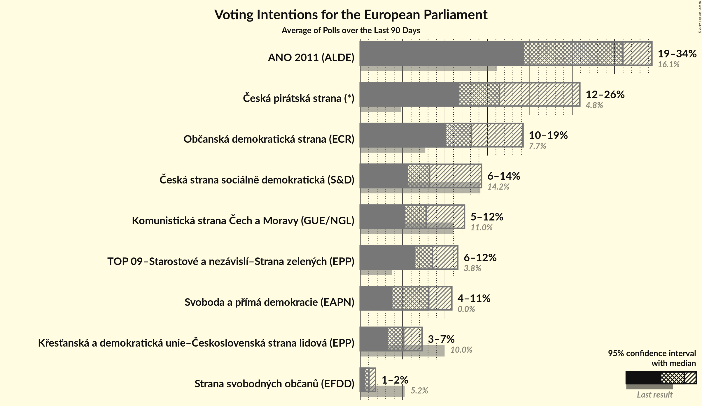

### Confidence Intervals

| Party | Last Result | Median | 80% Confidence Interval | 90% Confidence Interval | 95% Confidence Interval | 99% Confidence Interval |
|:-----:|:-----------:|:------:|:-----------------------:|:-----------------------:|:-----------------------:|:-----------------------:|
| <a href="#ano-2011-(alde)">ANO 2011 (ALDE)</a> | 16.1% | 31.0% | 21.3–33.1% |20.1–33.7% | 19.3–34.2% | 18.1–35.2% |
| <a href="#top-09-(epp)">TOP 09 (EPP)</a> | 16.0% | N/A | N/A |N/A | N/A | N/A |
| <a href="#starostové-a-nezávislí-(epp)">Starostové a nezávislí (EPP)</a> | 16.0% | N/A | N/A |N/A | N/A | N/A |
| <a href="#česká-strana-sociálně-demokratická-(s&d)">Česká strana sociálně demokratická (S&D)</a> | 14.2% | 8.2% | 6.1–12.4% |5.8–13.1% | 5.6–13.6% | 5.1–14.5% |
| <a href="#komunistická-strana-čech-a-moravy-(gue/ngl)">Komunistická strana Čech a Moravy (GUE/NGL)</a> | 11.0% | 7.6% | 5.9–9.2% |5.6–9.6% | 5.3–9.9% | 4.8–10.6% |
| <a href="#křesťanská-a-demokratická-unie–československá-strana-lidová-(epp)">Křesťanská a demokratická unie–Československá strana lidová (EPP)</a> | 10.0% | 5.4% | 4.4–6.6% |4.1–7.0% | 3.9–7.3% | 3.5–8.0% |
| <a href="#občanská-demokratická-strana-(ecr)">Občanská demokratická strana (ECR)</a> | 7.7% | 13.1% | 11.0–17.3% |10.5–18.4% | 10.1–19.2% | 9.3–20.4% |
| <a href="#strana-svobodných-občanů-(efdd)">Strana svobodných občanů (EFDD)</a> | 5.2% | 1.0% | 0.7–1.5% |0.6–1.7% | 0.6–1.8% | 0.4–2.1% |
| <a href="#česká-pirátská-strana-(*)">Česká pirátská strana (*)</a> | 4.8% | 16.4% | 12.6–23.8% |12.0–25.0% | 11.5–25.9% | 10.7–27.3% |
| <a href="#strana-zelených-(greens/efa)">Strana zelených (Greens/EFA)</a> | 3.8% | N/A | N/A |N/A | N/A | N/A |
| <a href="#top-09–starostové-a-nezávislí–strana-zelených-(epp)">TOP 09–Starostové a nezávislí–Strana zelených (EPP)</a> | 3.8% | 8.6% | 7.2–10.5% |6.9–11.0% | 6.6–11.5% | 6.1–12.3% |
| <a href="#svoboda-a-přímá-demokracie-(enf)">Svoboda a přímá demokracie (ENF)</a> | 0.0% | 8.1% | 4.2–10.1% |3.8–10.5% | 3.6–10.8% | 3.2–11.4% |

### ANO 2011 (ALDE)

*For a full overview of the results for this party, see the [ANO 2011 (ALDE)](party-ano2011alde.html) page.*

| Voting Intentions | Probability | Accumulated | Special Marks |
|:-----------------:|:-----------:|:-----------:|:-------------:|
| 15.5–16.5% | 0% | 100% | Last Result |
| 16.5–17.5% | 0.2% | 100% |  |
| 17.5–18.5% | 0.8% | 99.8% |  |
| 18.5–19.5% | 2% | 99.0% |  |
| 19.5–20.5% | 4% | 97% |  |
| 20.5–21.5% | 4% | 93% |  |
| 21.5–22.5% | 3% | 89% |  |
| 22.5–23.5% | 2% | 86% |  |
| 23.5–24.5% | 0.6% | 84% |  |
| 24.5–25.5% | 0.1% | 83% |  |
| 25.5–26.5% | 0.1% | 83% |  |
| 26.5–27.5% | 0.4% | 83% |  |
| 27.5–28.5% | 2% | 83% |  |
| 28.5–29.5% | 6% | 81% |  |
| 29.5–30.5% | 14% | 75% |  |
| 30.5–31.5% | 22% | 60% | Median |
| 31.5–32.5% | 21% | 38% |  |
| 32.5–33.5% | 12% | 17% |  |
| 33.5–34.5% | 4% | 6% |  |
| 34.5–35.5% | 1.1% | 1.4% |  |
| 35.5–36.5% | 0.2% | 0.2% |  |
| 36.5–37.5% | 0% | 0% |  |

### Česká strana sociálně demokratická (S&D)

*For a full overview of the results for this party, see the [Česká strana sociálně demokratická (S&D)](party-českástranasociálnědemokratickásd.html) page.*

| Voting Intentions | Probability | Accumulated | Special Marks |
|:-----------------:|:-----------:|:-----------:|:-------------:|
| 3.5–4.5% | 0% | 100% |  |
| 4.5–5.5% | 2% | 100% |  |
| 5.5–6.5% | 18% | 98% |  |
| 6.5–7.5% | 19% | 80% |  |
| 7.5–8.5% | 18% | 61% | Median |
| 8.5–9.5% | 14% | 43% |  |
| 9.5–10.5% | 8% | 30% |  |
| 10.5–11.5% | 6% | 22% |  |
| 11.5–12.5% | 7% | 16% |  |
| 12.5–13.5% | 6% | 9% |  |
| 13.5–14.5% | 2% | 3% | Last Result |
| 14.5–15.5% | 0.4% | 0.5% |  |
| 15.5–16.5% | 0% | 0% |  |

### Komunistická strana Čech a Moravy (GUE/NGL)

*For a full overview of the results for this party, see the [Komunistická strana Čech a Moravy (GUE/NGL)](party-komunistickástranačechamoravyguengl.html) page.*

| Voting Intentions | Probability | Accumulated | Special Marks |
|:-----------------:|:-----------:|:-----------:|:-------------:|
| 2.5–3.5% | 0% | 100% |  |
| 3.5–4.5% | 0.2% | 100% |  |
| 4.5–5.5% | 5% | 99.8% |  |
| 5.5–6.5% | 20% | 95% |  |
| 6.5–7.5% | 23% | 75% |  |
| 7.5–8.5% | 28% | 52% | Median |
| 8.5–9.5% | 19% | 25% |  |
| 9.5–10.5% | 5% | 6% |  |
| 10.5–11.5% | 0.5% | 0.6% | Last Result |
| 11.5–12.5% | 0% | 0% |  |

### Křesťanská a demokratická unie–Československá strana lidová (EPP)

*For a full overview of the results for this party, see the [Křesťanská a demokratická unie–Československá strana lidová (EPP)](party-křesťanskáademokratickáunie–československástranalidováepp.html) page.*

| Voting Intentions | Probability | Accumulated | Special Marks |
|:-----------------:|:-----------:|:-----------:|:-------------:|
| 1.5–2.5% | 0% | 100% |  |
| 2.5–3.5% | 0.7% | 100% |  |
| 3.5–4.5% | 15% | 99.3% |  |
| 4.5–5.5% | 42% | 84% | Median |
| 5.5–6.5% | 31% | 42% |  |
| 6.5–7.5% | 9% | 11% |  |
| 7.5–8.5% | 1.5% | 2% |  |
| 8.5–9.5% | 0.1% | 0.1% |  |
| 9.5–10.5% | 0% | 0% | Last Result |

### Občanská demokratická strana (ECR)

*For a full overview of the results for this party, see the [Občanská demokratická strana (ECR)](party-občanskádemokratickástranaecr.html) page.*

| Voting Intentions | Probability | Accumulated | Special Marks |
|:-----------------:|:-----------:|:-----------:|:-------------:|
| 7.5–8.5% | 0% | 100% | Last Result |
| 8.5–9.5% | 0.9% | 100% |  |
| 9.5–10.5% | 5% | 99.1% |  |
| 10.5–11.5% | 13% | 94% |  |
| 11.5–12.5% | 20% | 82% |  |
| 12.5–13.5% | 19% | 62% | Median |
| 13.5–14.5% | 15% | 42% |  |
| 14.5–15.5% | 9% | 27% |  |
| 15.5–16.5% | 5% | 18% |  |
| 16.5–17.5% | 5% | 13% |  |
| 17.5–18.5% | 4% | 9% |  |
| 18.5–19.5% | 3% | 4% |  |
| 19.5–20.5% | 1.2% | 2% |  |
| 20.5–21.5% | 0.3% | 0.4% |  |
| 21.5–22.5% | 0.1% | 0.1% |  |
| 22.5–23.5% | 0% | 0% |  |

### Strana svobodných občanů (EFDD)

*For a full overview of the results for this party, see the [Strana svobodných občanů (EFDD)](party-stranasvobodnýchobčanůefdd.html) page.*

| Voting Intentions | Probability | Accumulated | Special Marks |
|:-----------------:|:-----------:|:-----------:|:-------------:|
| 0.0–0.5% | 2% | 100% |  |
| 0.5–1.5% | 90% | 98% | Median |
| 1.5–2.5% | 8% | 8% |  |
| 2.5–3.5% | 0% | 0% |  |
| 3.5–4.5% | 0% | 0% |  |
| 4.5–5.5% | 0% | 0% | Last Result |

### Česká pirátská strana (*)

*For a full overview of the results for this party, see the [Česká pirátská strana (*)](party-českápirátskástrana.html) page.*

| Voting Intentions | Probability | Accumulated | Special Marks |
|:-----------------:|:-----------:|:-----------:|:-------------:|
| 4.5–5.5% | 0% | 100% | Last Result |
| 5.5–6.5% | 0% | 100% |  |
| 6.5–7.5% | 0% | 100% |  |
| 7.5–8.5% | 0% | 100% |  |
| 8.5–9.5% | 0% | 100% |  |
| 9.5–10.5% | 0.3% | 100% |  |
| 10.5–11.5% | 2% | 99.7% |  |
| 11.5–12.5% | 7% | 97% |  |
| 12.5–13.5% | 10% | 90% |  |
| 13.5–14.5% | 10% | 80% |  |
| 14.5–15.5% | 10% | 70% |  |
| 15.5–16.5% | 12% | 60% | Median |
| 16.5–17.5% | 15% | 48% |  |
| 17.5–18.5% | 11% | 33% |  |
| 18.5–19.5% | 4% | 21% |  |
| 19.5–20.5% | 0.8% | 17% |  |
| 20.5–21.5% | 0.7% | 17% |  |
| 21.5–22.5% | 2% | 16% |  |
| 22.5–23.5% | 3% | 14% |  |
| 23.5–24.5% | 4% | 11% |  |
| 24.5–25.5% | 4% | 7% |  |
| 25.5–26.5% | 2% | 3% |  |
| 26.5–27.5% | 0.9% | 1.3% |  |
| 27.5–28.5% | 0.3% | 0.3% |  |
| 28.5–29.5% | 0.1% | 0.1% |  |
| 29.5–30.5% | 0% | 0% |  |

### TOP 09–Starostové a nezávislí–Strana zelených (EPP)

*For a full overview of the results for this party, see the [TOP 09–Starostové a nezávislí–Strana zelených (EPP)](party-top09–starostovéanezávislí–stranazelenýchepp.html) page.*

| Voting Intentions | Probability | Accumulated | Special Marks |
|:-----------------:|:-----------:|:-----------:|:-------------:|
| 3.5–4.5% | 0% | 100% | Last Result |
| 4.5–5.5% | 0.1% | 100% |  |
| 5.5–6.5% | 2% | 99.9% |  |
| 6.5–7.5% | 16% | 98% |  |
| 7.5–8.5% | 30% | 82% |  |
| 8.5–9.5% | 27% | 52% | Median |
| 9.5–10.5% | 15% | 24% |  |
| 10.5–11.5% | 7% | 9% |  |
| 11.5–12.5% | 2% | 2% |  |
| 12.5–13.5% | 0.3% | 0.3% |  |
| 13.5–14.5% | 0% | 0% |  |

### Svoboda a přímá demokracie (ENF)

*For a full overview of the results for this party, see the [Svoboda a přímá demokracie (ENF)](party-svobodaapřímádemokracieenf.html) page.*

| Voting Intentions | Probability | Accumulated | Special Marks |
|:-----------------:|:-----------:|:-----------:|:-------------:|
| 0.0–0.5% | 0% | 100% | Last Result |
| 0.5–1.5% | 0% | 100% |  |
| 1.5–2.5% | 0% | 100% |  |
| 2.5–3.5% | 2% | 100% |  |
| 3.5–4.5% | 15% | 98% |  |
| 4.5–5.5% | 13% | 83% |  |
| 5.5–6.5% | 4% | 70% |  |
| 6.5–7.5% | 8% | 66% |  |
| 7.5–8.5% | 16% | 58% | Median |
| 8.5–9.5% | 21% | 42% |  |
| 9.5–10.5% | 16% | 21% |  |
| 10.5–11.5% | 4% | 5% |  |
| 11.5–12.5% | 0.3% | 0.3% |  |
| 12.5–13.5% | 0% | 0% |  |

## Seats

### Confidence Intervals

| Party | Last Result | Median | 80% Confidence Interval | 90% Confidence Interval | 95% Confidence Interval | 99% Confidence Interval |
|:-----:|:-----------:|:------:|:-----------------------:|:-----------------------:|:-----------------------:|:-----------------------:|
| <a href="#ano-2011-(alde)">ANO 2011 (ALDE)</a> | 4 | 8 | 5–8 |5–8 | 4–8 | 4–9 |
| <a href="#top-09-(epp)">TOP 09 (EPP)</a> | 3 | N/A | N/A |N/A | N/A | N/A |
| <a href="#starostové-a-nezávislí-(epp)">Starostové a nezávislí (EPP)</a> | 1 | N/A | N/A |N/A | N/A | N/A |
| <a href="#česká-strana-sociálně-demokratická-(s&d)">Česká strana sociálně demokratická (S&D)</a> | 4 | 2 | 1–3 |1–3 | 1–3 | 1–3 |
| <a href="#komunistická-strana-čech-a-moravy-(gue/ngl)">Komunistická strana Čech a Moravy (GUE/NGL)</a> | 3 | 1 | 1–2 |1–2 | 1–2 | 0–2 |
| <a href="#křesťanská-a-demokratická-unie–československá-strana-lidová-(epp)">Křesťanská a demokratická unie–Československá strana lidová (EPP)</a> | 3 | 1 | 0–1 |0–1 | 0–1 | 0–2 |
| <a href="#občanská-demokratická-strana-(ecr)">Občanská demokratická strana (ECR)</a> | 2 | 3 | 2–4 |2–4 | 2–4 | 2–5 |
| <a href="#strana-svobodných-občanů-(efdd)">Strana svobodných občanů (EFDD)</a> | 1 | 0 | 0 |0 | 0 | 0 |
| <a href="#česká-pirátská-strana-(*)">Česká pirátská strana (*)</a> | 0 | 4 | 3–6 |3–6 | 2–6 | 2–7 |
| <a href="#strana-zelených-(greens/efa)">Strana zelených (Greens/EFA)</a> | 0 | N/A | N/A |N/A | N/A | N/A |
| <a href="#top-09–starostové-a-nezávislí–strana-zelených-(epp)">TOP 09–Starostové a nezávislí–Strana zelených (EPP)</a> | 4 | 2 | 1–2 |1–2 | 1–2 | 1–3 |
| <a href="#svoboda-a-přímá-demokracie-(enf)">Svoboda a přímá demokracie (ENF)</a> | 0 | 2 | 0–2 |0–2 | 0–2 | 0–3 |

### ANO 2011 (ALDE)

*For a full overview of the results for this party, see the [ANO 2011 (ALDE)](party-ano2011alde.html) page.*

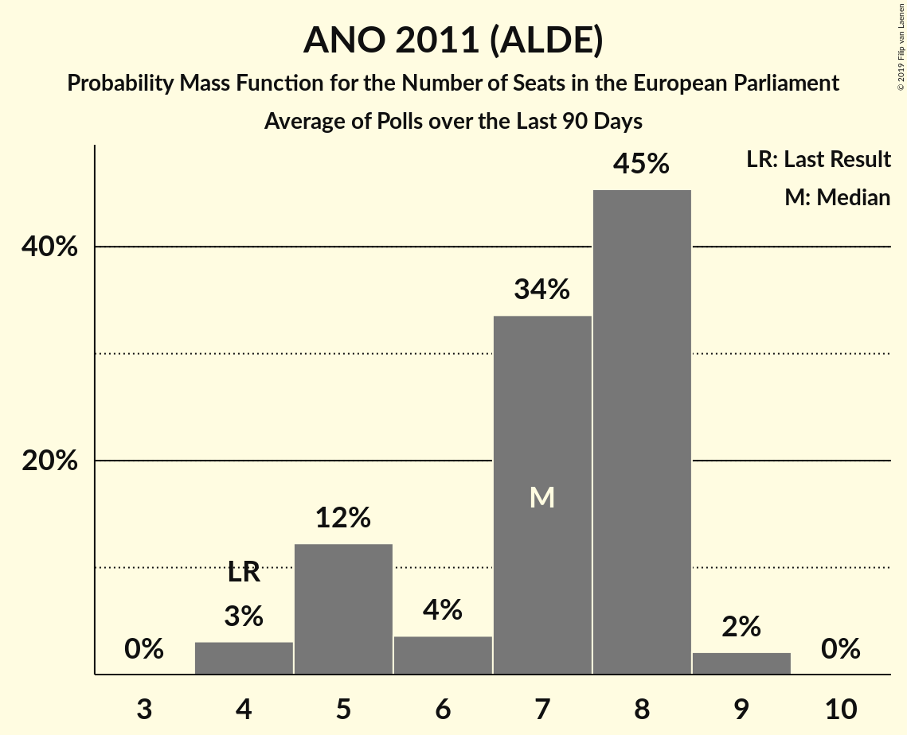

| Number of Seats | Probability | Accumulated | Special Marks |
|:---------------:|:-----------:|:-----------:|:-------------:|
| 4 | 3% | 100% | Last Result |
| 5 | 12% | 97% |  |
| 6 | 3% | 85% |  |
| 7 | 28% | 81% |  |
| 8 | 51% | 53% | Median |
| 9 | 2% | 2% |  |
| 10 | 0% | 0% |  |

### Česká strana sociálně demokratická (S&D)

*For a full overview of the results for this party, see the [Česká strana sociálně demokratická (S&D)](party-českástranasociálnědemokratickásd.html) page.*

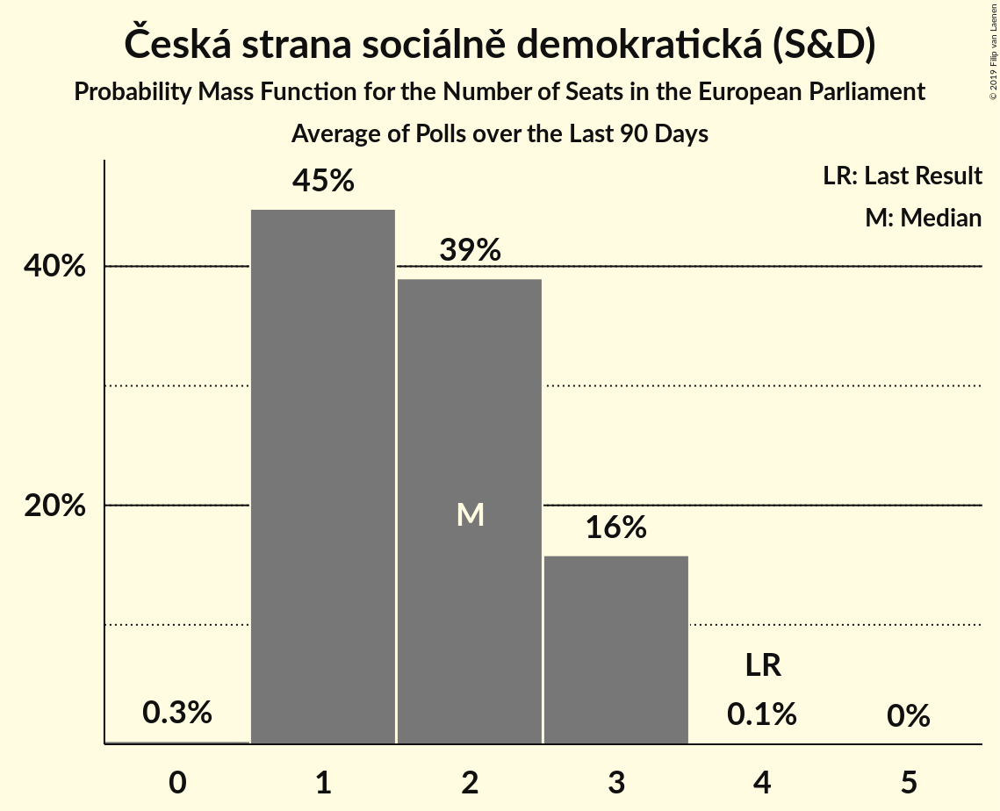

| Number of Seats | Probability | Accumulated | Special Marks |
|:---------------:|:-----------:|:-----------:|:-------------:|
| 0 | 0.3% | 100% |  |
| 1 | 45% | 99.7% |  |
| 2 | 40% | 55% | Median |
| 3 | 15% | 15% |  |
| 4 | 0.1% | 0.1% | Last Result |
| 5 | 0% | 0% |  |

### Komunistická strana Čech a Moravy (GUE/NGL)

*For a full overview of the results for this party, see the [Komunistická strana Čech a Moravy (GUE/NGL)](party-komunistickástranačechamoravyguengl.html) page.*

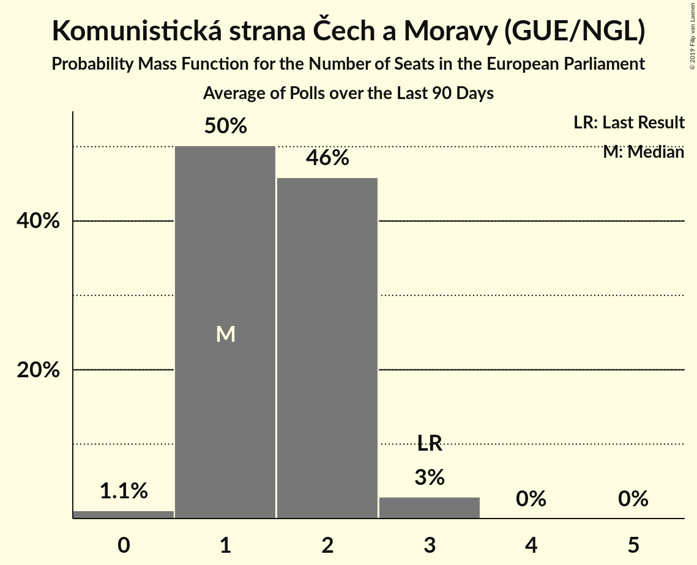

| Number of Seats | Probability | Accumulated | Special Marks |
|:---------------:|:-----------:|:-----------:|:-------------:|
| 0 | 1.1% | 100% |  |
| 1 | 53% | 98.9% | Median |
| 2 | 46% | 46% |  |
| 3 | 0% | 0% | Last Result |

### Křesťanská a demokratická unie–Československá strana lidová (EPP)

*For a full overview of the results for this party, see the [Křesťanská a demokratická unie–Československá strana lidová (EPP)](party-křesťanskáademokratickáunie–československástranalidováepp.html) page.*

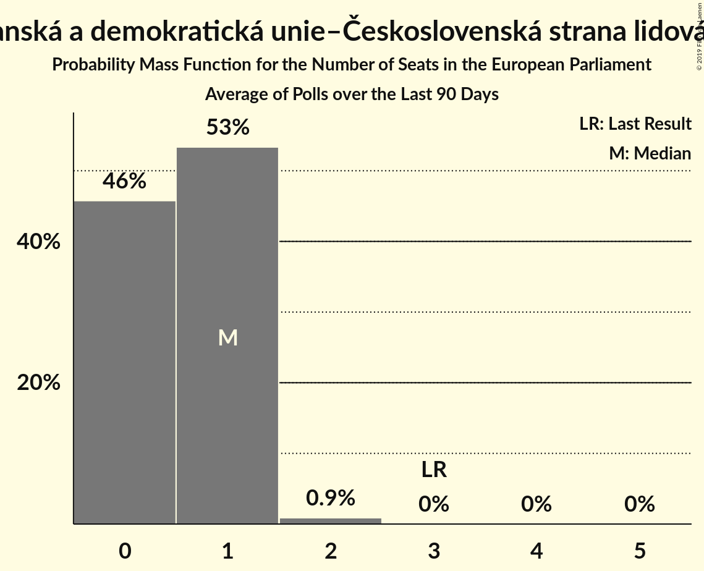

| Number of Seats | Probability | Accumulated | Special Marks |
|:---------------:|:-----------:|:-----------:|:-------------:|
| 0 | 34% | 100% |  |
| 1 | 65% | 66% | Median |
| 2 | 0.9% | 0.9% |  |
| 3 | 0% | 0% | Last Result |

### Občanská demokratická strana (ECR)

*For a full overview of the results for this party, see the [Občanská demokratická strana (ECR)](party-občanskádemokratickástranaecr.html) page.*

| Number of Seats | Probability | Accumulated | Special Marks |
|:---------------:|:-----------:|:-----------:|:-------------:|
| 2 | 17% | 100% | Last Result |
| 3 | 65% | 83% | Median |
| 4 | 16% | 18% |  |
| 5 | 2% | 2% |  |
| 6 | 0% | 0% |  |

### Strana svobodných občanů (EFDD)

*For a full overview of the results for this party, see the [Strana svobodných občanů (EFDD)](party-stranasvobodnýchobčanůefdd.html) page.*

| Number of Seats | Probability | Accumulated | Special Marks |
|:---------------:|:-----------:|:-----------:|:-------------:|
| 0 | 100% | 100% | Median |
| 1 | 0% | 0% | Last Result |

### Česká pirátská strana (*)

*For a full overview of the results for this party, see the [Česká pirátská strana (*)](party-českápirátskástrana.html) page.*

| Number of Seats | Probability | Accumulated | Special Marks |
|:---------------:|:-----------:|:-----------:|:-------------:|
| 0 | 0% | 100% | Last Result |
| 1 | 0% | 100% |  |
| 2 | 5% | 100% |  |
| 3 | 36% | 95% |  |
| 4 | 39% | 59% | Median |
| 5 | 9% | 20% |  |
| 6 | 10% | 11% |  |
| 7 | 0.9% | 0.9% |  |
| 8 | 0% | 0% |  |

### TOP 09–Starostové a nezávislí–Strana zelených (EPP)

*For a full overview of the results for this party, see the [TOP 09–Starostové a nezávislí–Strana zelených (EPP)](party-top09–starostovéanezávislí–stranazelenýchepp.html) page.*

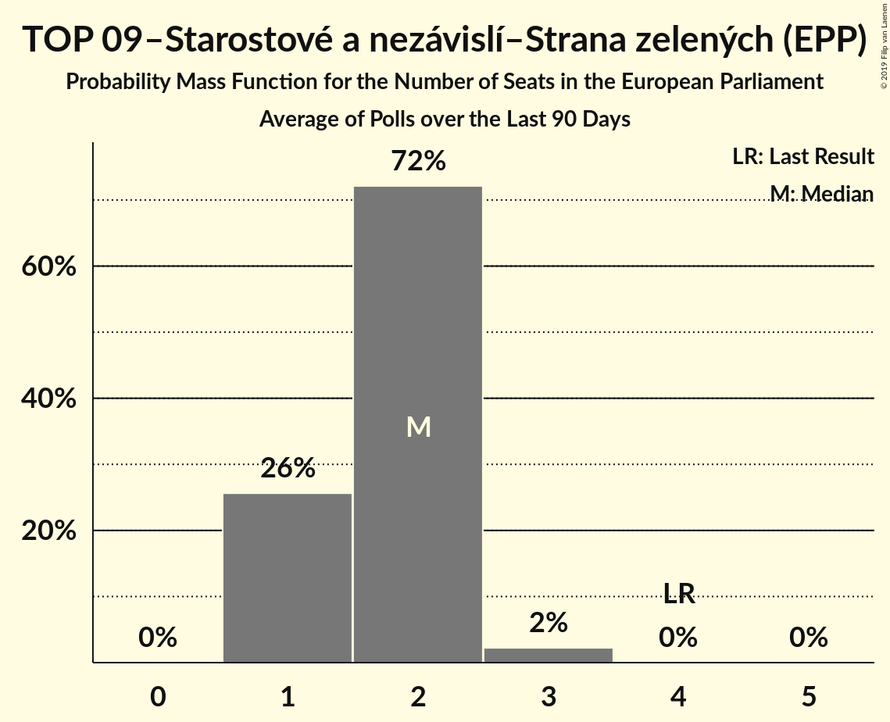

| Number of Seats | Probability | Accumulated | Special Marks |
|:---------------:|:-----------:|:-----------:|:-------------:|
| 1 | 23% | 100% |  |
| 2 | 74% | 77% | Median |
| 3 | 2% | 2% |  |
| 4 | 0% | 0% | Last Result |

### Svoboda a přímá demokracie (ENF)

*For a full overview of the results for this party, see the [Svoboda a přímá demokracie (ENF)](party-svobodaapřímádemokracieenf.html) page.*

| Number of Seats | Probability | Accumulated | Special Marks |
|:---------------:|:-----------:|:-----------:|:-------------:|
| 0 | 25% | 100% | Last Result |
| 1 | 19% | 75% |  |
| 2 | 55% | 56% | Median |
| 3 | 0.7% | 0.7% |  |
| 4 | 0% | 0% |  |

## Coalitions

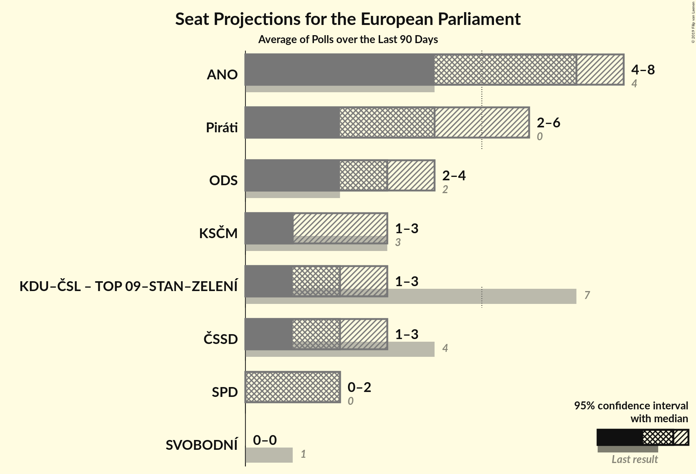

### Confidence Intervals

| Coalition | Last Result | Median | Majority? | 80% Confidence Interval | 90% Confidence Interval | 95% Confidence Interval | 99% Confidence Interval |
|:---------:|:-----------:|:------:|:---------:|:-----------------------:|:-----------------------:|:-----------------------:|:-----------------------:|
| ANO 2011 (ALDE) | 4 | 8 | 0% | 5–8 | 5–8 | 4–8 | 4–9 |
| Česká pirátská strana (*) | 0 | 4 | 0% | 3–6 | 3–6 | 2–6 | 2–7 |
| Občanská demokratická strana (ECR) | 2 | 3 | 0% | 2–4 | 2–4 | 2–4 | 2–5 |
| Křesťanská a demokratická unie–Československá strana lidová (EPP) – TOP 09–Starostové a nezávislí–Strana zelených (EPP) | 7 | 2 | 0% | 2–3 | 2–3 | 1–3 | 1–4 |
| Česká strana sociálně demokratická (S&D) | 4 | 2 | 0% | 1–3 | 1–3 | 1–3 | 1–3 |
| Komunistická strana Čech a Moravy (GUE/NGL) | 3 | 1 | 0% | 1–2 | 1–2 | 1–2 | 0–2 |
| Svoboda a přímá demokracie (ENF) | 0 | 2 | 0% | 0–2 | 0–2 | 0–2 | 0–3 |
| Strana svobodných občanů (EFDD) | 1 | 0 | 0% | 0 | 0 | 0 | 0 |

### ANO 2011 (ALDE)

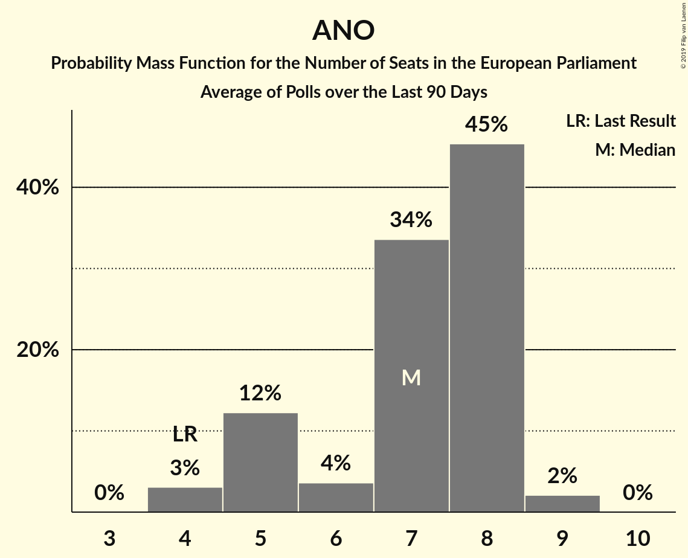

| Number of Seats | Probability | Accumulated | Special Marks |
|:---------------:|:-----------:|:-----------:|:-------------:|
| 4 | 3% | 100% | Last Result |
| 5 | 12% | 97% |  |
| 6 | 3% | 85% |  |
| 7 | 28% | 81% |  |
| 8 | 51% | 53% | Median |
| 9 | 2% | 2% |  |
| 10 | 0% | 0% |  |

### Česká pirátská strana (*)

| Number of Seats | Probability | Accumulated | Special Marks |
|:---------------:|:-----------:|:-----------:|:-------------:|
| 0 | 0% | 100% | Last Result |
| 1 | 0% | 100% |  |
| 2 | 5% | 100% |  |
| 3 | 36% | 95% |  |
| 4 | 39% | 59% | Median |
| 5 | 9% | 20% |  |
| 6 | 10% | 11% |  |
| 7 | 0.9% | 0.9% |  |
| 8 | 0% | 0% |  |

### Občanská demokratická strana (ECR)

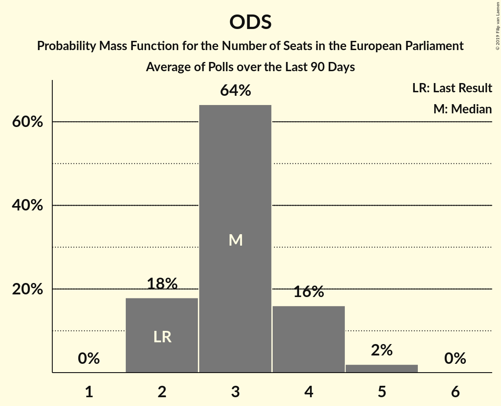

| Number of Seats | Probability | Accumulated | Special Marks |
|:---------------:|:-----------:|:-----------:|:-------------:|
| 2 | 17% | 100% | Last Result |
| 3 | 65% | 83% | Median |
| 4 | 16% | 18% |  |
| 5 | 2% | 2% |  |
| 6 | 0% | 0% |  |

### Křesťanská a demokratická unie–Československá strana lidová (EPP) – TOP 09–Starostové a nezávislí–Strana zelených (EPP)

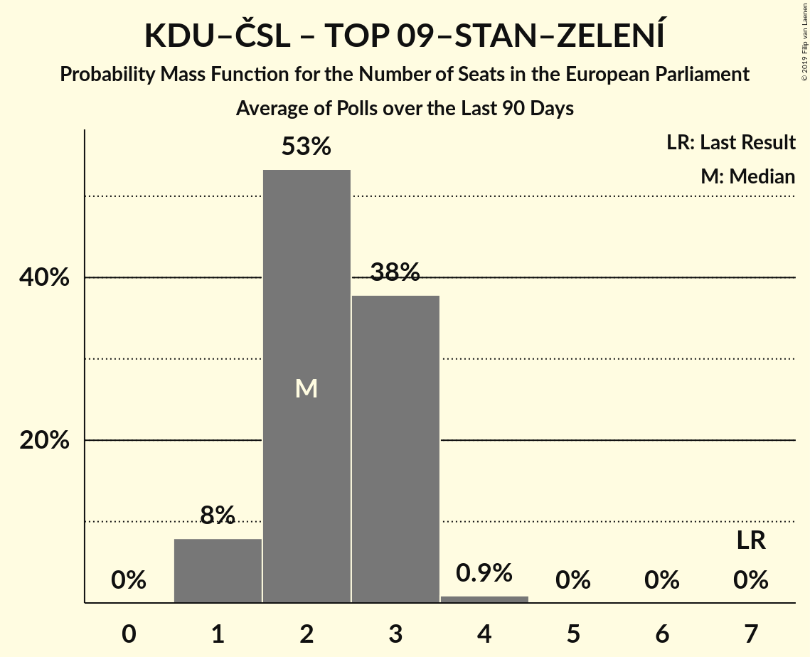

| Number of Seats | Probability | Accumulated | Special Marks |
|:---------------:|:-----------:|:-----------:|:-------------:|
| 1 | 4% | 100% |  |
| 2 | 48% | 96% |  |
| 3 | 47% | 48% | Median |
| 4 | 0.9% | 0.9% |  |
| 5 | 0% | 0% |  |
| 6 | 0% | 0% |  |
| 7 | 0% | 0% | Last Result |

### Česká strana sociálně demokratická (S&D)

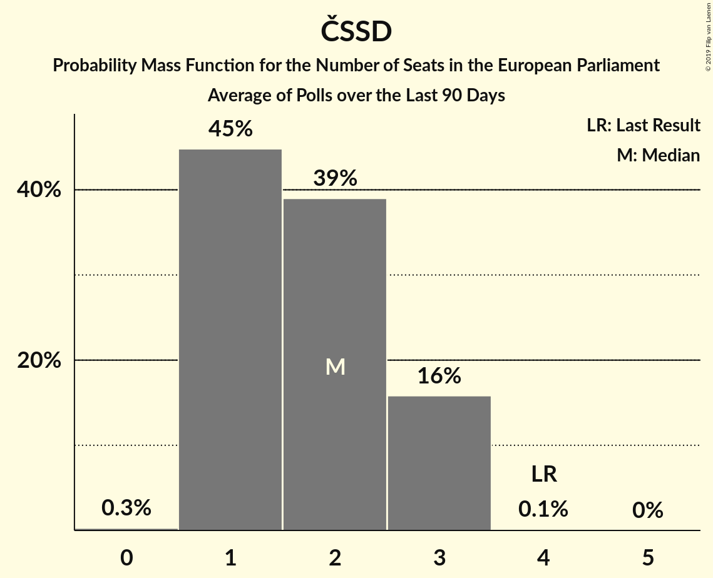

| Number of Seats | Probability | Accumulated | Special Marks |
|:---------------:|:-----------:|:-----------:|:-------------:|
| 0 | 0.3% | 100% |  |
| 1 | 45% | 99.7% |  |
| 2 | 40% | 55% | Median |
| 3 | 15% | 15% |  |
| 4 | 0.1% | 0.1% | Last Result |
| 5 | 0% | 0% |  |

### Komunistická strana Čech a Moravy (GUE/NGL)

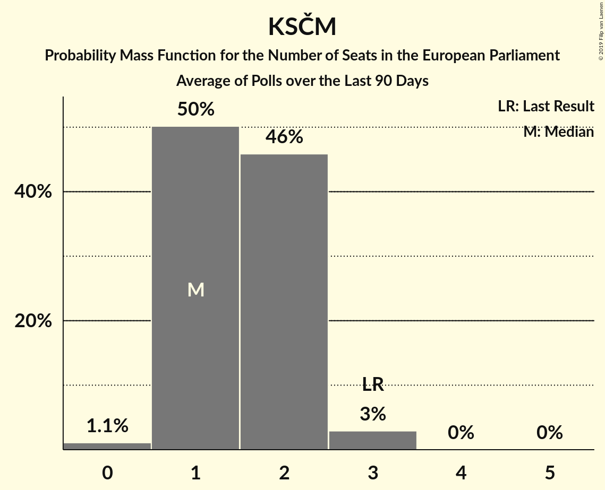

| Number of Seats | Probability | Accumulated | Special Marks |
|:---------------:|:-----------:|:-----------:|:-------------:|
| 0 | 1.1% | 100% |  |
| 1 | 53% | 98.9% | Median |
| 2 | 46% | 46% |  |
| 3 | 0% | 0% | Last Result |

### Svoboda a přímá demokracie (ENF)

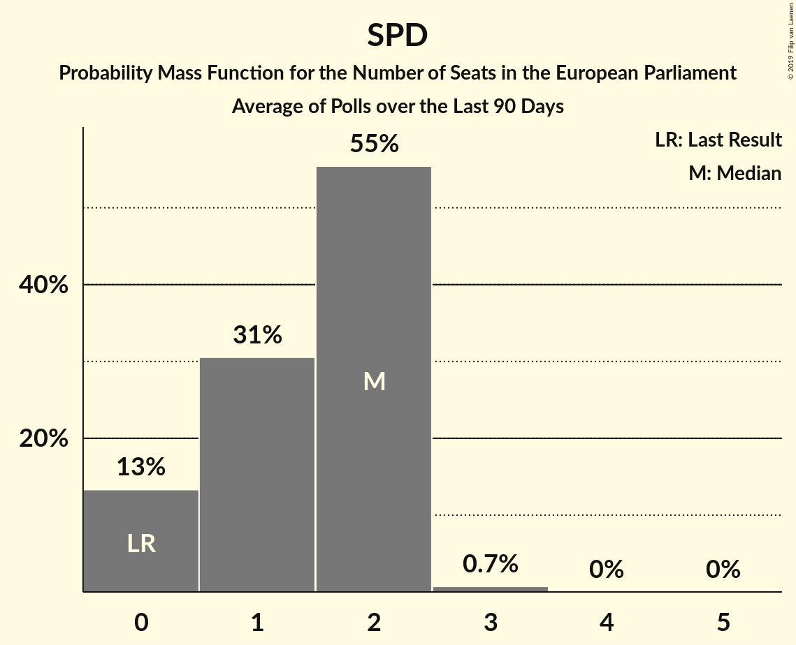

| Number of Seats | Probability | Accumulated | Special Marks |
|:---------------:|:-----------:|:-----------:|:-------------:|
| 0 | 25% | 100% | Last Result |
| 1 | 19% | 75% |  |
| 2 | 55% | 56% | Median |
| 3 | 0.7% | 0.7% |  |
| 4 | 0% | 0% |  |

### Strana svobodných občanů (EFDD)

| Number of Seats | Probability | Accumulated | Special Marks |
|:---------------:|:-----------:|:-----------:|:-------------:|
| 0 | 100% | 100% | Median |
| 1 | 0% | 0% | Last Result |

## Technical Information

+ **Number of polls included in this average:** 6
+ **Lowest number of simulations done in a poll included in this average:** 1,048,576
+ **Total number of simulations done in the polls included in this average:** 6,291,456
+ **Error estimate:** 3.08%
