# Poll Average

<a href="#voting-intentions">Voting Intentions</a> | <a href="#seats">Seats</a> | <a href="#coalitions">Coalitions</a> | <a href="#technical-information">Technical Information</a>

## Summary

The table below lists the polls on which the average is based. They are the most recent polls (less than 60 days old) registered and analyzed so far.

| Period     | Polling firm/Commissioner(s) | ANO | TOP 09 | STAN | ČSSD | KSČM | KDU–ČSL | ODS | SVOBODNÍ | Piráti | ZELENÍ | SPD | TOP 09–STAN–ZELENÍ |
|:----------:|:----------------------------:|:--:|:--:|:--:|:--:|:--:|:--:|:--:|:--:|:--:|:--:|:--:|:--:|
| 24–25 May 2014 | General Election | 16.1%   4 | 16.0%   3 | 16.0%   1 | 14.2%   4 | 11.0%   3 | 10.0%   3 | 7.7%   2 | 5.2%   1 | 4.8%   0 | 3.8%   0 | 0.0%   0 | 3.8%   4 |
| N/A | Poll Average | 19–35%   5–8 | N/A   N/A | N/A   N/A | 5–15%   1–3 | 5–13%   0–3 | 3–8%   0–1 | 10–16%   2–4 | N/A   N/A | 11–18%   2–4 | N/A   N/A | 5–16%   0–4 | 7–14%   1–3 |
| [10 April–16 May 2019](2019-05-16-PhoenixResearch.html) | Phoenix Research | N/A   N/A | N/A   N/A | N/A   N/A | N/A   N/A | N/A   N/A | N/A   N/A | N/A   N/A | N/A   N/A | N/A   N/A | N/A   N/A | N/A   N/A | N/A   N/A |
| [12 April–3 May 2019](2019-05-03-TNSKantar.html) | TNS Kantar   Česká televize | 27–33%   6–8 | N/A   N/A | N/A   N/A | 5–9%   1–2 | 5–8%   0–2 | 5–8%   0–2 | 12–16%   3–4 | N/A   N/A | 13–18%   3–4 | N/A   N/A | 7–11%   1–2 | 8–12%   2–3 |
| [29 April–3 May 2019](2019-05-03-STEM.html) | STEM | 19–23%   4–6 | N/A   N/A | N/A   N/A | 5–8%   1–2 | 6–9%   1–2 | 5–8%   1 | 10–13%   2–3 | N/A   N/A | 15–19%   3–4 | N/A   N/A | 13–16%   3–4 | 11–14%   2–3 |
| [30 March–10 April 2019](2019-04-10-Centrumprovýzkumveřejnéhomínění.html) | Centrum pro výzkum veřejného mínění | 29–35%   7–8 | N/A   N/A | N/A   N/A | 11–16%   2–3 | 9–13%   2–3 | 3–6%   0–1 | 12–17%   2–4 | N/A   N/A | 11–16%   2–3 | N/A   N/A | 4–8%   0–1 | 6–10%   1–2 |
| 24–25 May 2014 | General Election | 16.1%   4 | 16.0%   3 | 16.0%   1 | 14.2%   4 | 11.0%   3 | 10.0%   3 | 7.7%   2 | 5.2%   1 | 4.8%   0 | 3.8%   0 | 0.0%   0 | 3.8%   4 |

Only polls for which at least the sample size has been published are included in the table above.

**Legend:**
+ **Top half of each row:** Voting intentions (95% confidence interval)
+ **Bottom half of each row:** Seat projections for the European Parliament (95% confidence interval)
+ **ANO:** ANO 2011 (ALDE)
+ **TOP 09:** TOP 09 (EPP)
+ **STAN:** Starostové a nezávislí (EPP)
+ **ČSSD:** Česká strana sociálně demokratická (S&D)
+ **KSČM:** Komunistická strana Čech a Moravy (GUE/NGL)
+ **KDU–ČSL:** Křesťanská a demokratická unie–Československá strana lidová (EPP)
+ **ODS:** Občanská demokratická strana (ECR)
+ **SVOBODNÍ:** Strana svobodných občanů (EFDD)
+ **Piráti:** Česká pirátská strana (*)
+ **ZELENÍ:** Strana zelených (Greens/EFA)
+ **SPD:** Svoboda a přímá demokracie (EAPN)
+ **TOP 09–STAN–ZELENÍ:** TOP 09–Starostové a nezávislí–Strana zelených (EPP)
+ **N/A (single party):** Party not included the published results
+ **N/A (entire row):** Calculation for this opinion poll not started yet

## Voting Intentions

### Confidence Intervals

| Party | Last Result | Median | 80% Confidence Interval | 90% Confidence Interval | 95% Confidence Interval | 99% Confidence Interval |
|:-----:|:-----------:|:------:|:-----------------------:|:-----------------------:|:-----------------------:|:-----------------------:|
| <a href="#ano-2011-(alde)">ANO 2011 (ALDE)</a> | 16.1% | 29.4% | 20.3–33.0% |19.8–33.9% | 19.4–34.6% | 18.7–35.9% |
| <a href="#top-09-(epp)">TOP 09 (EPP)</a> | 16.0% | N/A | N/A |N/A | N/A | N/A |
| <a href="#starostové-a-nezávislí-(epp)">Starostové a nezávislí (EPP)</a> | 16.0% | N/A | N/A |N/A | N/A | N/A |
| <a href="#česká-strana-sociálně-demokratická-(s&d)">Česká strana sociálně demokratická (S&D)</a> | 14.2% | 7.2% | 5.9–13.7% |5.6–14.3% | 5.4–14.9% | 5.0–15.9% |
| <a href="#komunistická-strana-čech-a-moravy-(gue/ngl)">Komunistická strana Čech a Moravy (GUE/NGL)</a> | 11.0% | 7.4% | 5.6–11.7% |5.2–12.3% | 4.9–12.8% | 4.4–13.8% |
| <a href="#křesťanská-a-demokratická-unie–československá-strana-lidová-(epp)">Křesťanská a demokratická unie–Československá strana lidová (EPP)</a> | 10.0% | 5.7% | 3.7–6.9% |3.4–7.2% | 3.1–7.5% | 2.7–8.0% |
| <a href="#občanská-demokratická-strana-(ecr)">Občanská demokratická strana (ECR)</a> | 7.7% | 13.2% | 11.1–15.3% |10.7–15.8% | 10.4–16.3% | 9.9–17.2% |
| <a href="#strana-svobodných-občanů-(efdd)">Strana svobodných občanů (EFDD)</a> | 5.2% | N/A | N/A |N/A | N/A | N/A |
| <a href="#česká-pirátská-strana-(*)">Česká pirátská strana (*)</a> | 4.8% | 15.5% | 12.4–17.4% |11.7–17.9% | 11.3–18.2% | 10.4–19.0% |
| <a href="#strana-zelených-(greens/efa)">Strana zelených (Greens/EFA)</a> | 3.8% | N/A | N/A |N/A | N/A | N/A |
| <a href="#top-09–starostové-a-nezávislí–strana-zelených-(epp)">TOP 09–Starostové a nezávislí–Strana zelených (EPP)</a> | 3.8% | 10.1% | 7.6–12.9% |7.1–13.4% | 6.8–13.7% | 6.1–14.3% |
| <a href="#svoboda-a-přímá-demokracie-(eapn)">Svoboda a přímá demokracie (EAPN)</a> | 0.0% | 9.0% | 5.6–15.1% |5.2–15.5% | 4.9–15.9% | 4.3–16.6% |

### ANO 2011 (ALDE)

*For a full overview of the results for this party, see the [ANO 2011 (ALDE)](party-ano2011alde.html) page.*

| Voting Intentions | Probability | Accumulated | Special Marks |
|:-----------------:|:-----------:|:-----------:|:-------------:|
| 15.5–16.5% | 0% | 100% | Last Result |
| 16.5–17.5% | 0% | 100% |  |
| 17.5–18.5% | 0.3% | 100% |  |
| 18.5–19.5% | 3% | 99.7% |  |
| 19.5–20.5% | 10% | 97% |  |
| 20.5–21.5% | 13% | 87% |  |
| 21.5–22.5% | 6% | 75% |  |
| 22.5–23.5% | 1.4% | 68% |  |
| 23.5–24.5% | 0.1% | 67% |  |
| 24.5–25.5% | 0.1% | 67% |  |
| 25.5–26.5% | 0.6% | 67% |  |
| 26.5–27.5% | 2% | 66% |  |
| 27.5–28.5% | 6% | 64% |  |
| 28.5–29.5% | 10% | 58% | Median |
| 29.5–30.5% | 12% | 48% |  |
| 30.5–31.5% | 12% | 36% |  |
| 31.5–32.5% | 10% | 24% |  |
| 32.5–33.5% | 7% | 14% |  |
| 33.5–34.5% | 4% | 7% |  |
| 34.5–35.5% | 2% | 3% |  |
| 35.5–36.5% | 0.6% | 0.8% |  |
| 36.5–37.5% | 0.1% | 0.2% |  |
| 37.5–38.5% | 0% | 0% |  |

### Česká strana sociálně demokratická (S&D)

*For a full overview of the results for this party, see the [Česká strana sociálně demokratická (S&D)](party-českástranasociálnědemokratickásd.html) page.*

| Voting Intentions | Probability | Accumulated | Special Marks |
|:-----------------:|:-----------:|:-----------:|:-------------:|
| 3.5–4.5% | 0% | 100% |  |
| 4.5–5.5% | 4% | 100% |  |
| 5.5–6.5% | 28% | 96% |  |
| 6.5–7.5% | 25% | 68% | Median |
| 7.5–8.5% | 8% | 43% |  |
| 8.5–9.5% | 1.5% | 35% |  |
| 9.5–10.5% | 0.7% | 33% |  |
| 10.5–11.5% | 3% | 33% |  |
| 11.5–12.5% | 8% | 29% |  |
| 12.5–13.5% | 10% | 21% |  |
| 13.5–14.5% | 7% | 11% | Last Result |
| 14.5–15.5% | 3% | 4% |  |
| 15.5–16.5% | 0.8% | 0.9% |  |
| 16.5–17.5% | 0.1% | 0.1% |  |
| 17.5–18.5% | 0% | 0% |  |

### Komunistická strana Čech a Moravy (GUE/NGL)

*For a full overview of the results for this party, see the [Komunistická strana Čech a Moravy (GUE/NGL)](party-komunistickástranačechamoravyguengl.html) page.*

| Voting Intentions | Probability | Accumulated | Special Marks |
|:-----------------:|:-----------:|:-----------:|:-------------:|
| 2.5–3.5% | 0% | 100% |  |
| 3.5–4.5% | 0.9% | 100% |  |
| 4.5–5.5% | 9% | 99.1% |  |
| 5.5–6.5% | 19% | 90% |  |
| 6.5–7.5% | 25% | 71% | Median |
| 7.5–8.5% | 13% | 47% |  |
| 8.5–9.5% | 4% | 34% |  |
| 9.5–10.5% | 8% | 30% |  |
| 10.5–11.5% | 11% | 22% | Last Result |
| 11.5–12.5% | 8% | 11% |  |
| 12.5–13.5% | 3% | 4% |  |
| 13.5–14.5% | 0.6% | 0.7% |  |
| 14.5–15.5% | 0.1% | 0.1% |  |
| 15.5–16.5% | 0% | 0% |  |

### Křesťanská a demokratická unie–Československá strana lidová (EPP)

*For a full overview of the results for this party, see the [Křesťanská a demokratická unie–Československá strana lidová (EPP)](party-křesťanskáademokratickáunie–československástranalidováepp.html) page.*

| Voting Intentions | Probability | Accumulated | Special Marks |
|:-----------------:|:-----------:|:-----------:|:-------------:|
| 0.5–1.5% | 0% | 100% |  |
| 1.5–2.5% | 0.2% | 100% |  |
| 2.5–3.5% | 7% | 99.8% |  |
| 3.5–4.5% | 18% | 93% |  |
| 4.5–5.5% | 20% | 75% |  |
| 5.5–6.5% | 36% | 55% | Median |
| 6.5–7.5% | 18% | 20% |  |
| 7.5–8.5% | 2% | 2% |  |
| 8.5–9.5% | 0.1% | 0.1% |  |
| 9.5–10.5% | 0% | 0% | Last Result |

### Občanská demokratická strana (ECR)

*For a full overview of the results for this party, see the [Občanská demokratická strana (ECR)](party-občanskádemokratickástranaecr.html) page.*

| Voting Intentions | Probability | Accumulated | Special Marks |
|:-----------------:|:-----------:|:-----------:|:-------------:|
| 7.5–8.5% | 0% | 100% | Last Result |
| 8.5–9.5% | 0.2% | 100% |  |
| 9.5–10.5% | 4% | 99.8% |  |
| 10.5–11.5% | 15% | 96% |  |
| 11.5–12.5% | 19% | 81% |  |
| 12.5–13.5% | 20% | 62% | Median |
| 13.5–14.5% | 21% | 42% |  |
| 14.5–15.5% | 14% | 21% |  |
| 15.5–16.5% | 6% | 7% |  |
| 16.5–17.5% | 1.4% | 2% |  |
| 17.5–18.5% | 0.2% | 0.3% |  |
| 18.5–19.5% | 0% | 0% |  |

### Česká pirátská strana (*)

*For a full overview of the results for this party, see the [Česká pirátská strana (*)](party-českápirátskástrana.html) page.*

| Voting Intentions | Probability | Accumulated | Special Marks |
|:-----------------:|:-----------:|:-----------:|:-------------:|
| 4.5–5.5% | 0% | 100% | Last Result |
| 5.5–6.5% | 0% | 100% |  |
| 6.5–7.5% | 0% | 100% |  |
| 7.5–8.5% | 0% | 100% |  |
| 8.5–9.5% | 0% | 100% |  |
| 9.5–10.5% | 0.6% | 100% |  |
| 10.5–11.5% | 3% | 99.4% |  |
| 11.5–12.5% | 8% | 96% |  |
| 12.5–13.5% | 11% | 88% |  |
| 13.5–14.5% | 12% | 77% |  |
| 14.5–15.5% | 15% | 65% |  |
| 15.5–16.5% | 22% | 50% | Median |
| 16.5–17.5% | 19% | 27% |  |
| 17.5–18.5% | 7% | 8% |  |
| 18.5–19.5% | 1.2% | 1.3% |  |
| 19.5–20.5% | 0.1% | 0.1% |  |
| 20.5–21.5% | 0% | 0% |  |

### TOP 09–Starostové a nezávislí–Strana zelených (EPP)

*For a full overview of the results for this party, see the [TOP 09–Starostové a nezávislí–Strana zelených (EPP)](party-top09–starostovéanezávislí–stranazelenýchepp.html) page.*

| Voting Intentions | Probability | Accumulated | Special Marks |
|:-----------------:|:-----------:|:-----------:|:-------------:|
| 3.5–4.5% | 0% | 100% | Last Result |
| 4.5–5.5% | 0.1% | 100% |  |
| 5.5–6.5% | 2% | 99.9% |  |
| 6.5–7.5% | 8% | 98% |  |
| 7.5–8.5% | 15% | 91% |  |
| 8.5–9.5% | 17% | 76% |  |
| 9.5–10.5% | 15% | 58% | Median |
| 10.5–11.5% | 11% | 43% |  |
| 11.5–12.5% | 15% | 32% |  |
| 12.5–13.5% | 13% | 16% |  |
| 13.5–14.5% | 3% | 4% |  |
| 14.5–15.5% | 0.3% | 0.3% |  |
| 15.5–16.5% | 0% | 0% |  |

### Svoboda a přímá demokracie (EAPN)

*For a full overview of the results for this party, see the [Svoboda a přímá demokracie (EAPN)](party-svobodaapřímádemokracieeapn.html) page.*

| Voting Intentions | Probability | Accumulated | Special Marks |
|:-----------------:|:-----------:|:-----------:|:-------------:|
| 0.0–0.5% | 0% | 100% | Last Result |
| 0.5–1.5% | 0% | 100% |  |
| 1.5–2.5% | 0% | 100% |  |
| 2.5–3.5% | 0% | 100% |  |
| 3.5–4.5% | 1.1% | 100% |  |
| 4.5–5.5% | 8% | 98.9% |  |
| 5.5–6.5% | 14% | 91% |  |
| 6.5–7.5% | 10% | 76% |  |
| 7.5–8.5% | 11% | 67% |  |
| 8.5–9.5% | 13% | 56% | Median |
| 9.5–10.5% | 7% | 42% |  |
| 10.5–11.5% | 2% | 35% |  |
| 11.5–12.5% | 0.4% | 34% |  |
| 12.5–13.5% | 3% | 33% |  |
| 13.5–14.5% | 12% | 30% |  |
| 14.5–15.5% | 13% | 18% |  |
| 15.5–16.5% | 4% | 5% |  |
| 16.5–17.5% | 0.5% | 0.5% |  |
| 17.5–18.5% | 0% | 0% |  |

## Seats

### Confidence Intervals

| Party | Last Result | Median | 80% Confidence Interval | 90% Confidence Interval | 95% Confidence Interval | 99% Confidence Interval |
|:-----:|:-----------:|:------:|:-----------------------:|:-----------------------:|:-----------------------:|:-----------------------:|
| <a href="#ano-2011-(alde)">ANO 2011 (ALDE)</a> | 4 | 7 | 5–8 |5–8 | 5–8 | 4–9 |
| <a href="#top-09-(epp)">TOP 09 (EPP)</a> | 3 | N/A | N/A |N/A | N/A | N/A |
| <a href="#starostové-a-nezávislí-(epp)">Starostové a nezávislí (EPP)</a> | 1 | N/A | N/A |N/A | N/A | N/A |
| <a href="#česká-strana-sociálně-demokratická-(s&d)">Česká strana sociálně demokratická (S&D)</a> | 4 | 1 | 1–3 |1–3 | 1–3 | 1–3 |
| <a href="#komunistická-strana-čech-a-moravy-(gue/ngl)">Komunistická strana Čech a Moravy (GUE/NGL)</a> | 3 | 1 | 1–2 |1–3 | 0–3 | 0–3 |
| <a href="#křesťanská-a-demokratická-unie–československá-strana-lidová-(epp)">Křesťanská a demokratická unie–Československá strana lidová (EPP)</a> | 3 | 1 | 0–1 |0–1 | 0–1 | 0–2 |
| <a href="#občanská-demokratická-strana-(ecr)">Občanská demokratická strana (ECR)</a> | 2 | 3 | 2–3 |2–4 | 2–4 | 2–4 |
| <a href="#strana-svobodných-občanů-(efdd)">Strana svobodných občanů (EFDD)</a> | 1 | N/A | N/A |N/A | N/A | N/A |
| <a href="#česká-pirátská-strana-(*)">Česká pirátská strana (*)</a> | 0 | 4 | 3–4 |2–4 | 2–4 | 2–5 |
| <a href="#strana-zelených-(greens/efa)">Strana zelených (Greens/EFA)</a> | 0 | N/A | N/A |N/A | N/A | N/A |
| <a href="#top-09–starostové-a-nezávislí–strana-zelených-(epp)">TOP 09–Starostové a nezávislí–Strana zelených (EPP)</a> | 4 | 2 | 1–3 |1–3 | 1–3 | 1–3 |
| <a href="#svoboda-a-přímá-demokracie-(eapn)">Svoboda a přímá demokracie (EAPN)</a> | 0 | 2 | 1–3 |1–4 | 0–4 | 0–4 |

### ANO 2011 (ALDE)

*For a full overview of the results for this party, see the [ANO 2011 (ALDE)](party-ano2011alde.html) page.*

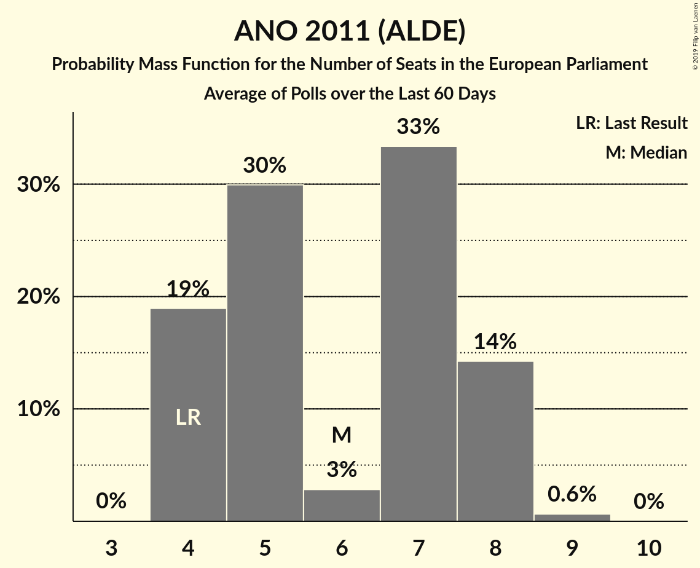

| Number of Seats | Probability | Accumulated | Special Marks |
|:---------------:|:-----------:|:-----------:|:-------------:|
| 4 | 2% | 100% | Last Result |
| 5 | 30% | 98% |  |
| 6 | 4% | 68% |  |
| 7 | 44% | 64% | Median |
| 8 | 19% | 20% |  |
| 9 | 0.9% | 0.9% |  |
| 10 | 0% | 0% |  |

### Česká strana sociálně demokratická (S&D)

*For a full overview of the results for this party, see the [Česká strana sociálně demokratická (S&D)](party-českástranasociálnědemokratickásd.html) page.*

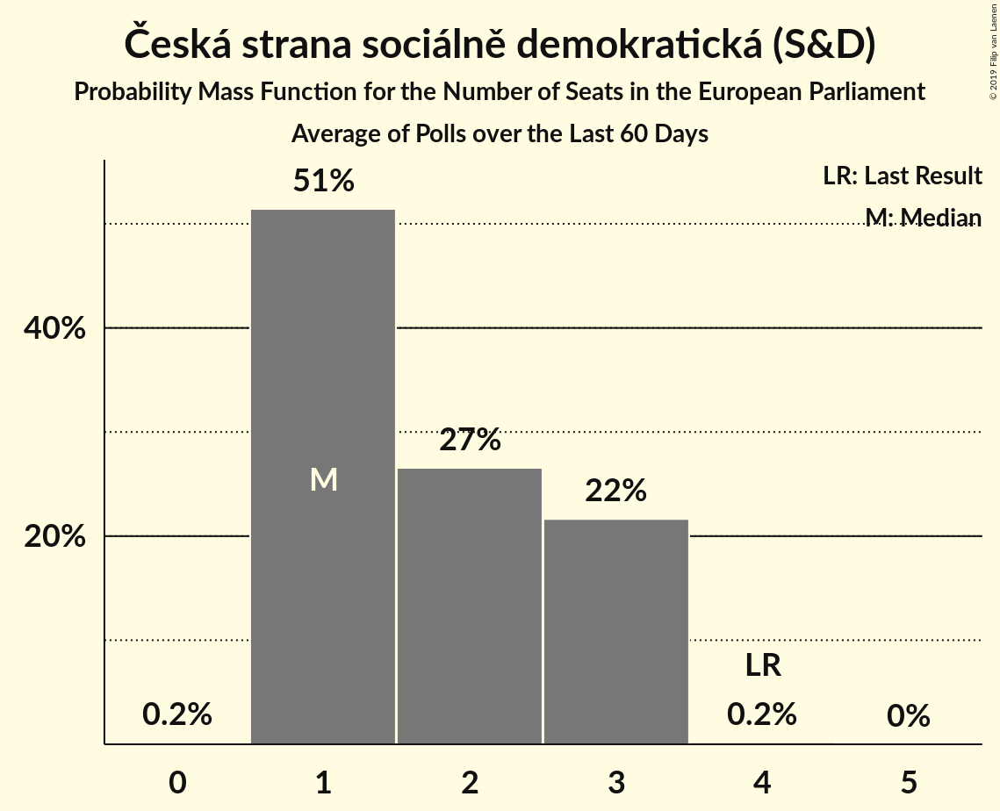

| Number of Seats | Probability | Accumulated | Special Marks |
|:---------------:|:-----------:|:-----------:|:-------------:|
| 0 | 0.2% | 100% |  |
| 1 | 59% | 99.8% | Median |
| 2 | 12% | 41% |  |
| 3 | 29% | 29% |  |
| 4 | 0.2% | 0.2% | Last Result |
| 5 | 0% | 0% |  |

### Komunistická strana Čech a Moravy (GUE/NGL)

*For a full overview of the results for this party, see the [Komunistická strana Čech a Moravy (GUE/NGL)](party-komunistickástranačechamoravyguengl.html) page.*

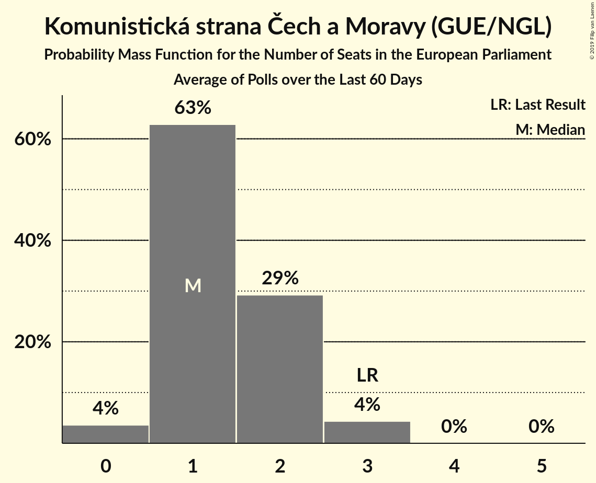

| Number of Seats | Probability | Accumulated | Special Marks |
|:---------------:|:-----------:|:-----------:|:-------------:|
| 0 | 3% | 100% |  |
| 1 | 53% | 97% | Median |
| 2 | 38% | 44% |  |
| 3 | 6% | 6% | Last Result |
| 4 | 0% | 0% |  |

### Křesťanská a demokratická unie–Československá strana lidová (EPP)

*For a full overview of the results for this party, see the [Křesťanská a demokratická unie–Československá strana lidová (EPP)](party-křesťanskáademokratickáunie–československástranalidováepp.html) page.*

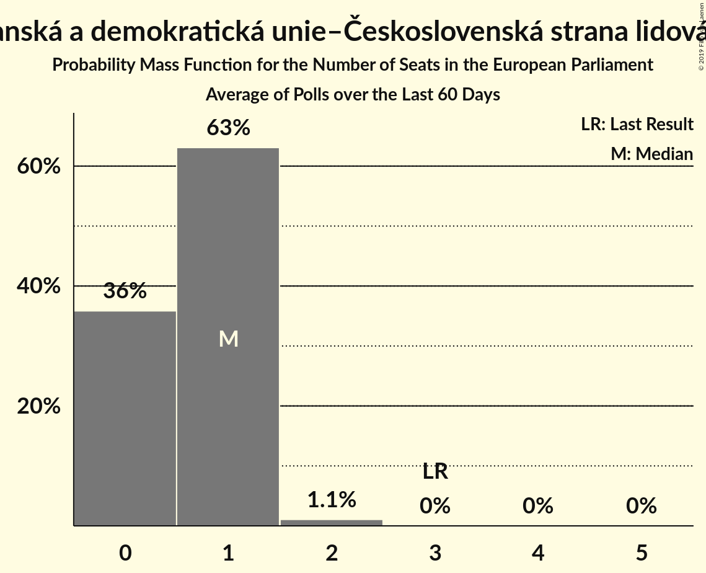

| Number of Seats | Probability | Accumulated | Special Marks |
|:---------------:|:-----------:|:-----------:|:-------------:|
| 0 | 34% | 100% |  |
| 1 | 64% | 66% | Median |
| 2 | 1.4% | 1.4% |  |
| 3 | 0% | 0% | Last Result |

### Občanská demokratická strana (ECR)

*For a full overview of the results for this party, see the [Občanská demokratická strana (ECR)](party-občanskádemokratickástranaecr.html) page.*

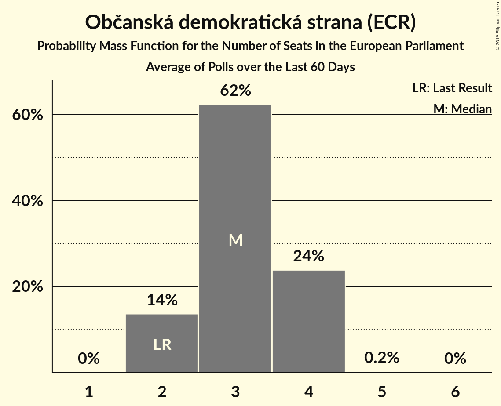

| Number of Seats | Probability | Accumulated | Special Marks |
|:---------------:|:-----------:|:-----------:|:-------------:|
| 2 | 18% | 100% | Last Result |
| 3 | 75% | 82% | Median |
| 4 | 7% | 7% |  |
| 5 | 0% | 0% |  |

### Česká pirátská strana (*)

*For a full overview of the results for this party, see the [Česká pirátská strana (*)](party-českápirátskástrana.html) page.*

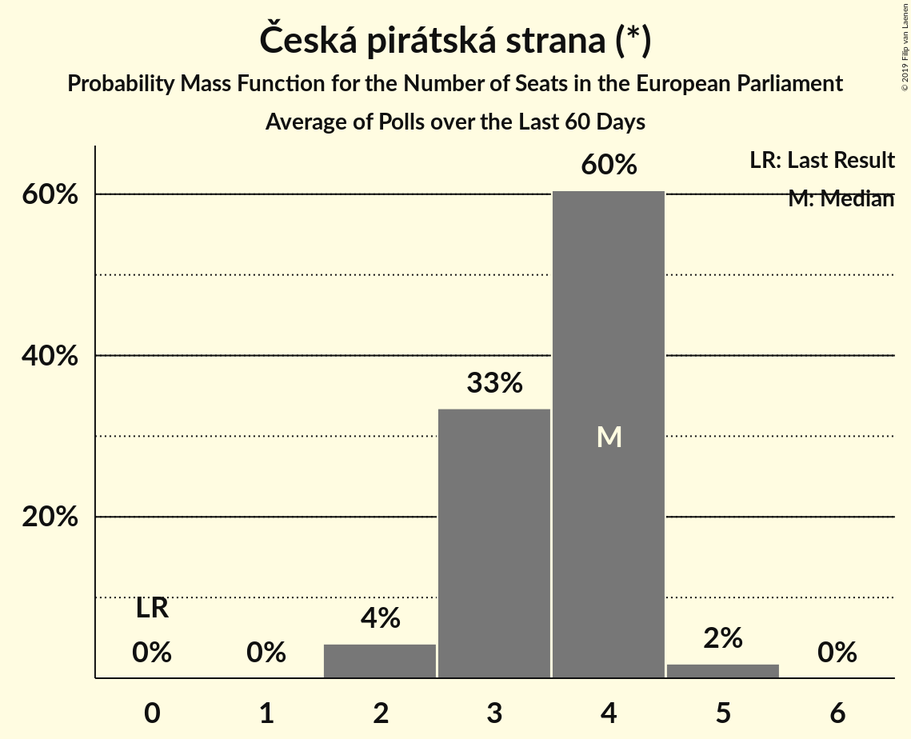

| Number of Seats | Probability | Accumulated | Special Marks |
|:---------------:|:-----------:|:-----------:|:-------------:|
| 0 | 0% | 100% | Last Result |
| 1 | 0% | 100% |  |
| 2 | 6% | 100% |  |
| 3 | 42% | 94% |  |
| 4 | 52% | 53% | Median |
| 5 | 0.6% | 0.6% |  |
| 6 | 0% | 0% |  |

### TOP 09–Starostové a nezávislí–Strana zelených (EPP)

*For a full overview of the results for this party, see the [TOP 09–Starostové a nezávislí–Strana zelených (EPP)](party-top09–starostovéanezávislí–stranazelenýchepp.html) page.*

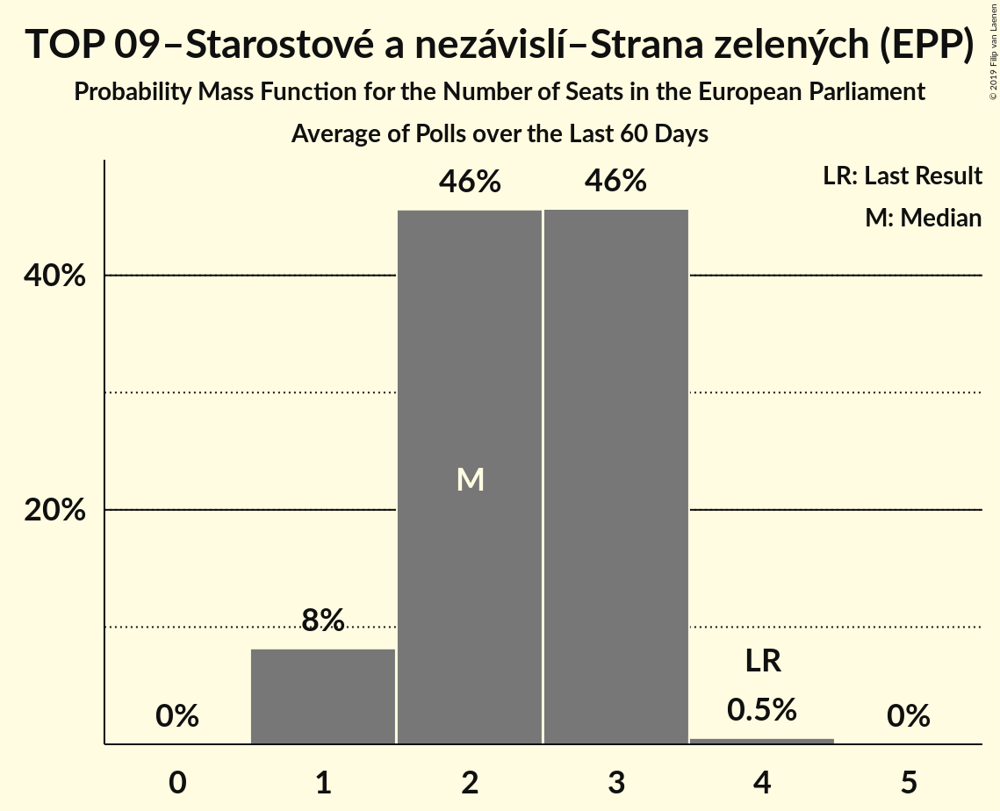

| Number of Seats | Probability | Accumulated | Special Marks |
|:---------------:|:-----------:|:-----------:|:-------------:|
| 1 | 11% | 100% |  |
| 2 | 56% | 89% | Median |
| 3 | 33% | 33% |  |
| 4 | 0.1% | 0.1% | Last Result |
| 5 | 0% | 0% |  |

### Svoboda a přímá demokracie (EAPN)

*For a full overview of the results for this party, see the [Svoboda a přímá demokracie (EAPN)](party-svobodaapřímádemokracieeapn.html) page.*

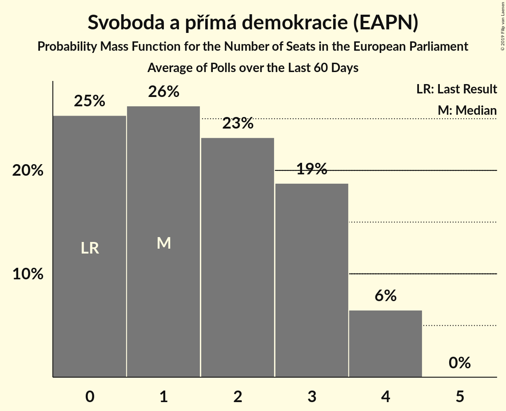

| Number of Seats | Probability | Accumulated | Special Marks |
|:---------------:|:-----------:|:-----------:|:-------------:|
| 0 | 3% | 100% | Last Result |
| 1 | 33% | 97% |  |
| 2 | 31% | 65% | Median |
| 3 | 25% | 34% |  |
| 4 | 9% | 9% |  |
| 5 | 0% | 0% |  |

## Coalitions

### Confidence Intervals

| Coalition | Last Result | Median | Majority? | 80% Confidence Interval | 90% Confidence Interval | 95% Confidence Interval | 99% Confidence Interval |
|:---------:|:-----------:|:------:|:---------:|:-----------------------:|:-----------------------:|:-----------------------:|:-----------------------:|
| ANO 2011 (ALDE) | 4 | 7 | 0% | 5–8 | 5–8 | 5–8 | 4–9 |
| Občanská demokratická strana (ECR) | 2 | 3 | 0% | 2–3 | 2–4 | 2–4 | 2–4 |
| Česká pirátská strana (*) | 0 | 4 | 0% | 3–4 | 2–4 | 2–4 | 2–5 |
| Křesťanská a demokratická unie–Československá strana lidová (EPP) – TOP 09–Starostové a nezávislí–Strana zelených (EPP) | 7 | 3 | 0% | 2–4 | 1–4 | 1–4 | 1–4 |
| Svoboda a přímá demokracie (EAPN) | 0 | 2 | 0% | 1–3 | 1–4 | 0–4 | 0–4 |
| Česká strana sociálně demokratická (S&D) | 4 | 1 | 0% | 1–3 | 1–3 | 1–3 | 1–3 |
| Komunistická strana Čech a Moravy (GUE/NGL) | 3 | 1 | 0% | 1–2 | 1–3 | 0–3 | 0–3 |
| Strana svobodných občanů (EFDD) | 1 | 0 | 0% | 0 | 0 | 0 | 0 |

### ANO 2011 (ALDE)

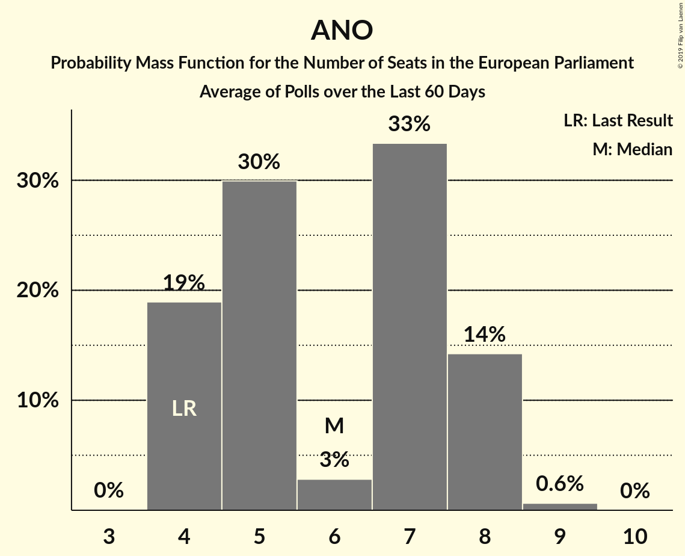

| Number of Seats | Probability | Accumulated | Special Marks |
|:---------------:|:-----------:|:-----------:|:-------------:|
| 4 | 2% | 100% | Last Result |
| 5 | 30% | 98% |  |
| 6 | 4% | 68% |  |
| 7 | 44% | 64% | Median |
| 8 | 19% | 20% |  |
| 9 | 0.9% | 0.9% |  |
| 10 | 0% | 0% |  |

### Občanská demokratická strana (ECR)

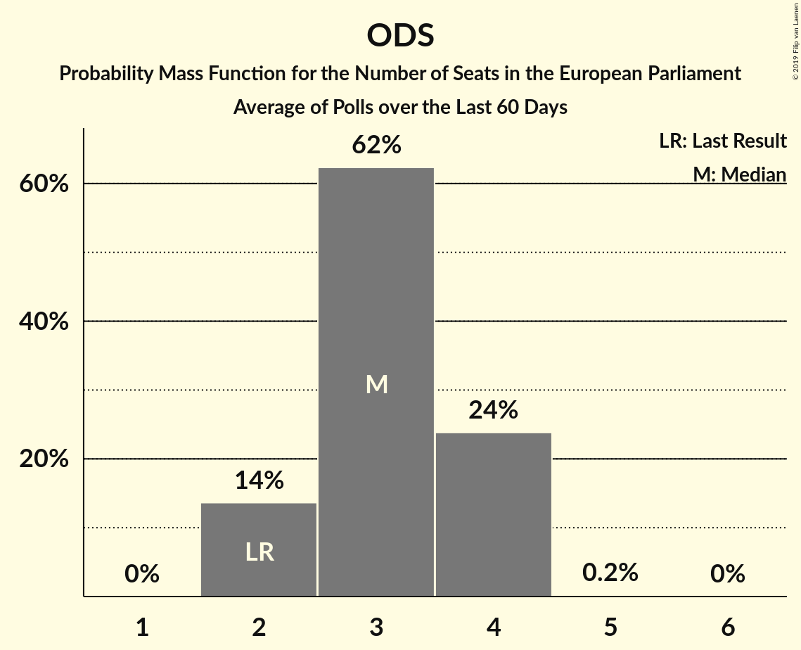

| Number of Seats | Probability | Accumulated | Special Marks |
|:---------------:|:-----------:|:-----------:|:-------------:|
| 2 | 18% | 100% | Last Result |
| 3 | 75% | 82% | Median |
| 4 | 7% | 7% |  |
| 5 | 0% | 0% |  |

### Česká pirátská strana (*)

| Number of Seats | Probability | Accumulated | Special Marks |
|:---------------:|:-----------:|:-----------:|:-------------:|
| 0 | 0% | 100% | Last Result |
| 1 | 0% | 100% |  |
| 2 | 6% | 100% |  |
| 3 | 42% | 94% |  |
| 4 | 52% | 53% | Median |
| 5 | 0.6% | 0.6% |  |
| 6 | 0% | 0% |  |

### Křesťanská a demokratická unie–Československá strana lidová (EPP) – TOP 09–Starostové a nezávislí–Strana zelených (EPP)

| Number of Seats | Probability | Accumulated | Special Marks |
|:---------------:|:-----------:|:-----------:|:-------------:|
| 1 | 9% | 100% |  |
| 2 | 26% | 91% |  |
| 3 | 32% | 65% | Median |
| 4 | 32% | 33% |  |
| 5 | 0.5% | 0.5% |  |
| 6 | 0% | 0% |  |
| 7 | 0% | 0% | Last Result |

### Svoboda a přímá demokracie (EAPN)

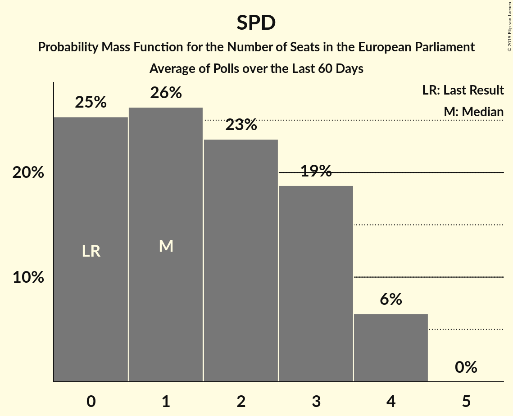

| Number of Seats | Probability | Accumulated | Special Marks |
|:---------------:|:-----------:|:-----------:|:-------------:|
| 0 | 3% | 100% | Last Result |
| 1 | 33% | 97% |  |
| 2 | 31% | 65% | Median |
| 3 | 25% | 34% |  |
| 4 | 9% | 9% |  |
| 5 | 0% | 0% |  |

### Česká strana sociálně demokratická (S&D)

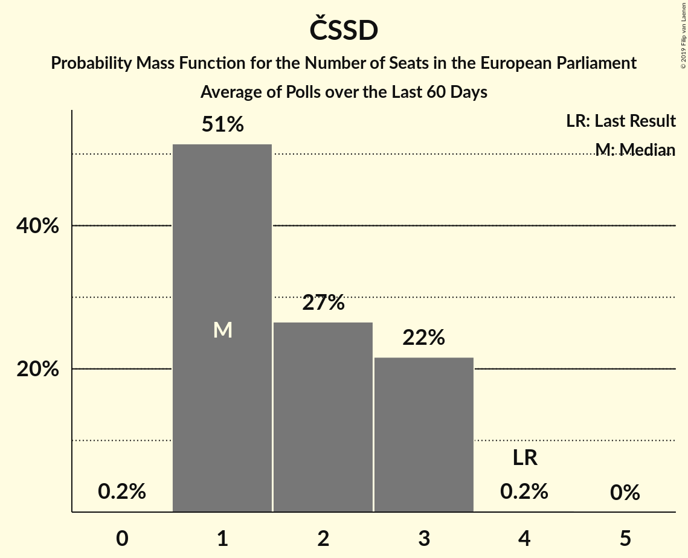

| Number of Seats | Probability | Accumulated | Special Marks |
|:---------------:|:-----------:|:-----------:|:-------------:|
| 0 | 0.2% | 100% |  |
| 1 | 59% | 99.8% | Median |
| 2 | 12% | 41% |  |
| 3 | 29% | 29% |  |
| 4 | 0.2% | 0.2% | Last Result |
| 5 | 0% | 0% |  |

### Komunistická strana Čech a Moravy (GUE/NGL)

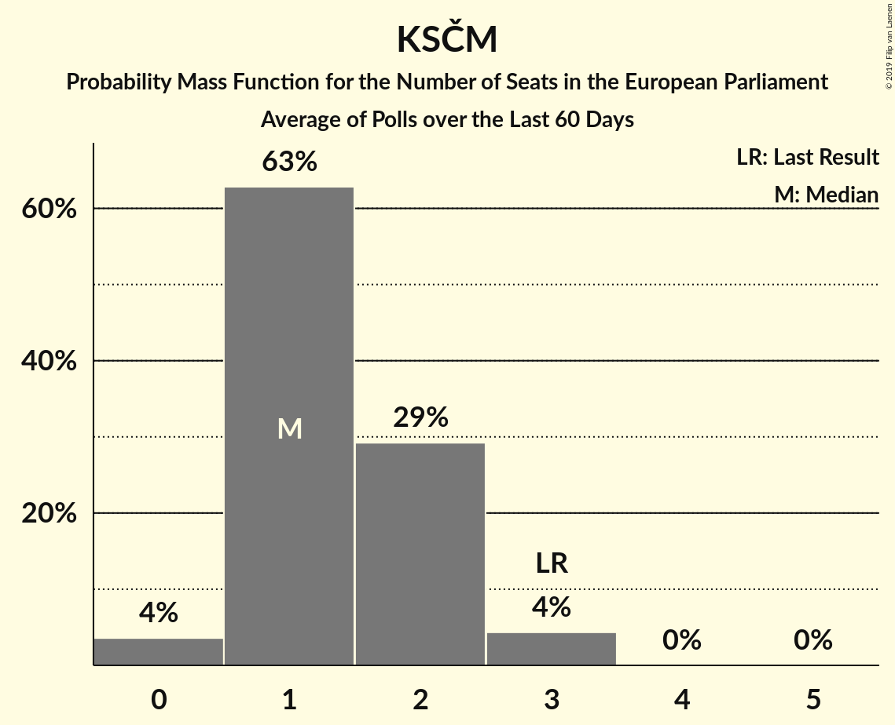

| Number of Seats | Probability | Accumulated | Special Marks |
|:---------------:|:-----------:|:-----------:|:-------------:|
| 0 | 3% | 100% |  |
| 1 | 53% | 97% | Median |
| 2 | 38% | 44% |  |
| 3 | 6% | 6% | Last Result |
| 4 | 0% | 0% |  |

### Strana svobodných občanů (EFDD)

| Number of Seats | Probability | Accumulated | Special Marks |
|:---------------:|:-----------:|:-----------:|:-------------:|
| 0 | 100% | 100% | Median |
| 1 | 0% | 0% | Last Result |

## Technical Information

+ **Number of polls included in this average:** 4
+ **Lowest number of simulations done in a poll included in this average:** 0
+ **Total number of simulations done in the polls included in this average:** 3,145,728
+ **Error estimate:** 2.48%
