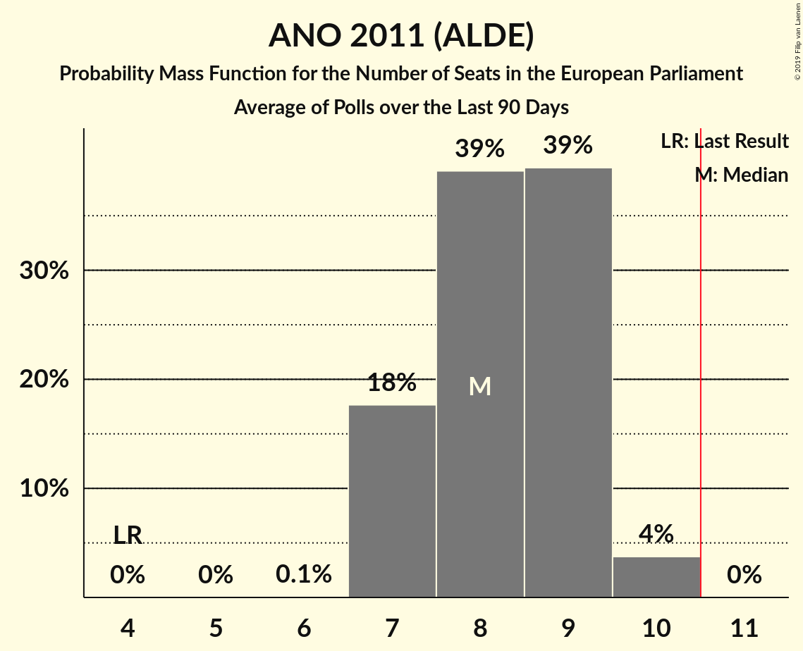

# ANO 2011 (ALDE)

<a href="#voting-intentions">Voting Intentions</a> | <a href="#seats">Seats</a>

## Voting Intentions

Last result: **16.1%** (General Election of 24–25 May 2014)

### Confidence Intervals

| Period     | Polling firm/Commissioner(s) | Median | 80% Confidence Interval | 90% Confidence Interval | 95% Confidence Interval | 99% Confidence Interval |
|:----------:|:----------------:|:-----------:|:-----------------------:|:-----------------------:|:-----------------------:|:-----------------------:|
| N/A | [Poll Average](average.html) | 31.7% | 28.8–35.4% | 28.2–36.5% | 27.7–37.3% | 26.7–38.5% |
| [12 January–2 February 2019](2019-02-02-TNSKantar.html) | TNS Kantar   Česká televize | 32.0% | 30.3–33.8% | 29.8–34.3% | 29.4–34.7% | 28.6–35.6% |
| [10 December 2018–24 January 2019](2019-01-24-Median.html) | Median | 29.8% | 28.1–31.6% | 27.7–32.1% | 27.3–32.6% | 26.4–33.5% |
| [17–21 January 2019](2019-01-21-SANEP.html) | SANEP | 32.9% | 31.5–34.4% | 31.2–34.8% | 30.8–35.1% | 30.2–35.8% |
| [5–19 January 2019](2019-01-19-Centrumprovýzkumveřejnéhomínění.html) | Centrum pro výzkum veřejného mínění | 31.0% | 28.9–33.2% | 28.3–33.8% | 27.8–34.4% | 26.8–35.4% |
| [20–26 December 2018](2018-12-26-SANEP.html) | SANEP | 31.2% | 29.8–32.7% | 29.4–33.1% | 29.1–33.5% | 28.4–34.2% |
| [1–13 December 2018](2018-12-13-Centrumprovýzkumveřejnéhomínění.html) | Centrum pro výzkum veřejného mínění | 33.5% | 31.7–35.4% | 31.2–36.0% | 30.7–36.4% | 29.9–37.4% |
| [10 November–9 December 2018](2018-12-09-Median.html) | Median | 29.8% | 28.1–31.7% | 27.6–32.2% | 27.1–32.7% | 26.3–33.6% |
| [20 November–8 December 2018](2018-12-08-PhoenixResearch.html) | Phoenix Research | 29.7% | 27.9–31.6% | 27.4–32.1% | 26.9–32.6% | 26.1–33.5% |
| [19–30 November 2018](2018-11-30-STEM.html) | STEM | 35.7% | 33.8–37.6% | 33.3–38.2% | 32.8–38.7% | 31.9–39.6% |
| [22–28 November 2018](2018-11-28-SANEP.html) | SANEP | 30.1% | 28.8–31.5% | 28.4–31.9% | 28.1–32.2% | 27.4–32.9% |
| [3–25 November 2018](2018-11-25-TNSKantar.html) | TNS Kantar   Česká televize | 32.5% | 30.8–34.3% | 30.3–34.8% | 29.9–35.2% | 29.1–36.1% |
| [3–15 November 2018](2018-11-15-Centrumprovýzkumveřejnéhomínění.html) | Centrum pro výzkum veřejného mínění | 29.5% | 27.8–31.3% | 27.3–31.9% | 26.9–32.3% | 26.1–33.2% |
| [20 October–7 November 2018](2018-11-07-PhoenixResearch.html) | Phoenix Research | 24.9% | 23.2–26.7% | 22.7–27.2% | 22.3–27.6% | 21.5–28.5% |
| [6–26 October 2018](2018-10-26-TNSKantar.html) | TNS Kantar   Česká televize | 27.0% | 25.4–28.7% | 25.0–29.2% | 24.6–29.6% | 23.8–30.4% |
| [13–26 October 2018](2018-10-26-Centrumprovýzkumveřejnéhomínění.html) | Centrum pro výzkum veřejného mínění | 30.2% | 28.3–32.1% | 27.8–32.6% | 27.4–33.1% | 26.6–34.0% |
| [25 September–25 October 2018](2018-10-25-Median.html) | Median | 28.5% | 26.8–30.3% | 26.4–30.8% | 25.9–31.3% | 25.1–32.2% |
| [9–24 October 2018](2018-10-24-STEM.html) | STEM | 33.5% | 31.7–35.5% | 31.1–36.0% | 30.7–36.5% | 29.8–37.4% |
| [22 October 2018](2018-10-22-SANEP.html) | SANEP | 27.6% | 26.0–29.3% | 25.5–29.8% | 25.1–30.2% | 24.4–31.0% |
| [1–10 October 2018](2018-10-10-PhoenixResearch.html) | Phoenix Research   Blesk Zprávy | 24.5% | 22.8–26.2% | 22.4–26.7% | 22.0–27.2% | 21.2–28.0% |
| [1–21 September 2018](2018-09-21-TNSKantar.html) | TNS Kantar | 29.5% | 27.8–31.2% | 27.4–31.7% | 27.0–32.1% | 26.2–33.0% |
| [8–20 September 2018](2018-09-20-Centrumprovýzkumveřejnéhomínění.html) | Centrum pro výzkum veřejného mínění | 30.0% | 28.2–31.9% | 27.7–32.4% | 27.3–32.9% | 26.4–33.8% |
| [6–12 September 2018](2018-09-12-SANEP.html) | SANEP | 28.6% | 27.3–30.0% | 26.9–30.4% | 26.6–30.7% | 25.9–31.4% |
| [25 July–28 August 2018](2018-08-28-Median.html) | Median | 30.9% | 29.1–32.7% | 28.6–33.3% | 28.1–33.7% | 27.3–34.6% |
| [4–26 August 2018](2018-08-26-TNSKantar.html) | TNS Kantar | 28.0% | 26.4–29.7% | 25.9–30.2% | 25.5–30.6% | 24.8–31.4% |
| [9–15 August 2018](2018-08-15-SANEP.html) | SANEP | 29.1% | 27.7–30.5% | 27.3–31.0% | 27.0–31.3% | 26.3–32.0% |
| [27 June–23 July 2018](2018-07-23-Median.html) | Median | 30.0% | 28.4–31.8% | 27.9–32.2% | 27.5–32.7% | 26.8–33.5% |
| [16–29 June 2018](2018-06-29-Centrumprovýzkumveřejnéhomínění.html) | Centrum pro výzkum veřejného mínění | 31.0% | 29.2–32.9% | 28.7–33.4% | 28.2–33.9% | 27.4–34.8% |
| [13–27 June 2018](2018-06-27-STEM.html) | STEM | 32.0% | 30.1–33.9% | 29.6–34.4% | 29.2–34.9% | 28.3–35.9% |
| [25 May–26 June 2018](2018-06-26-Median.html) | Median | 31.5% | 29.7–33.3% | 29.2–33.8% | 28.8–34.2% | 28.0–35.1% |
| [18–24 June 2018](2018-06-24-PhoenixResearch.html) | Phoenix Research   Blesk Zprávy | 28.3% | 26.6–30.2% | 26.1–30.7% | 25.7–31.2% | 24.8–32.1% |
| [2–22 June 2018](2018-06-22-TNSKantar.html) | TNS Kantar   Česká televize | 28.3% | 26.7–30.1% | 26.2–30.5% | 25.8–31.0% | 25.1–31.8% |
| [7–13 June 2018](2018-06-13-SANEP.html) | SANEP | 28.2% | 27.0–29.4% | 26.7–29.8% | 26.4–30.1% | 25.9–30.6% |
| [12 May–1 June 2018](2018-06-01-TNSKantar.html) | TNS Kantar   Česká televize | 27.0% | 25.4–28.7% | 25.0–29.2% | 24.6–29.6% | 23.8–30.4% |
| [12–24 May 2018](2018-05-24-Centrumprovýzkumveřejnéhomínění.html) | Centrum pro výzkum veřejného mínění | 29.0% | 27.2–30.8% | 26.7–31.4% | 26.2–31.9% | 25.4–32.8% |
| [17–23 May 2018](2018-05-23-SANEP.html) | SANEP | 28.9% | 27.7–30.1% | 27.4–30.4% | 27.1–30.7% | 26.6–31.3% |
| [10 April–5 May 2018](2018-05-05-Median.html) | Median | 30.5% | 28.8–32.2% | 28.3–32.7% | 28.0–33.1% | 27.2–34.0% |
| [15 November 2017–3 May 2018](2018-05-03-Median.html) | Median | 30.2% | 29.4–31.0% | 29.2–31.2% | 29.0–31.4% | 28.7–31.8% |
| [19–29 April 2018](2018-04-29-STEM.html) | STEM | 32.9% | 31.1–34.8% | 30.5–35.3% | 30.1–35.8% | 29.2–36.7% |
| [7–27 April 2018](2018-04-27-TNSKantar.html) | TNS Kantar   Česká televize | 30.6% | 28.6–32.6% | 28.1–33.2% | 27.6–33.7% | 26.7–34.7% |
| [19–25 April 2018](2018-04-25-SANEP.html) | SANEP | 28.6% | 27.4–29.8% | 27.1–30.2% | 26.8–30.5% | 26.2–31.1% |
| [7–19 April 2018](2018-04-19-Centrumprovýzkumveřejnéhomínění.html) | Centrum pro výzkum veřejného mínění | 29.0% | 27.3–30.8% | 26.8–31.3% | 26.4–31.7% | 25.6–32.6% |
| [10–29 March 2018](2018-03-29-TNSKantar.html) | TNS Kantar   Česká televize | 29.5% | 27.6–31.6% | 27.0–32.2% | 26.5–32.7% | 25.6–33.7% |
| [22–28 March 2018](2018-03-28-SANEP.html) | SANEP | 30.7% | 29.5–31.9% | 29.2–32.3% | 28.9–32.5% | 28.3–33.1% |
| [3–15 March 2018](2018-03-15-Centrumprovýzkumveřejnéhomínění.html) | Centrum pro výzkum veřejného mínění | 30.5% | 28.8–32.4% | 28.3–32.9% | 27.8–33.4% | 27.0–34.3% |
| [3–23 February 2018](2018-02-23-TNSKantar.html) | TNS Kantar   Česká televize | 33.7% | 31.9–35.5% | 31.5–36.0% | 31.0–36.4% | 30.2–37.3% |
| [15–21 February 2018](2018-02-21-SANEP.html) | SANEP | 32.1% | 30.9–33.4% | 30.5–33.7% | 30.2–34.0% | 29.7–34.7% |
| [3–15 February 2018](2018-02-15-Centrumprovýzkumveřejnéhomínění.html) | Centrum pro výzkum veřejného mínění | 33.5% | 31.4–35.7% | 30.8–36.3% | 30.3–36.8% | 29.4–37.9% |
| [1–8 February 2018](2018-02-08-STEM.html) | STEM | 32.5% | 30.7–34.4% | 30.1–34.9% | 29.7–35.4% | 28.8–36.4% |
| [15–24 January 2018](2018-01-24-Centrumprovýzkumveřejnéhomínění.html) | Centrum pro výzkum veřejného mínění | 30.5% | 28.8–32.4% | 28.3–32.9% | 27.8–33.4% | 27.0–34.3% |
| [2–17 December 2017](2017-12-17-Centrumprovýzkumveřejnéhomínění.html) | Centrum pro výzkum veřejného mínění | 35.5% | 33.3–37.9% | 32.6–38.5% | 32.1–39.1% | 31.0–40.2% |
| [1–11 December 2017](2017-12-11-STEM.html) | STEM | 33.0% | 31.2–34.9% | 30.6–35.5% | 30.2–36.0% | 29.3–36.9% |
| [4–24 November 2017](2017-11-24-TNSKantar.html) | TNS Kantar   Česká televize | 30.0% | 28.3–31.7% | 27.9–32.2% | 27.5–32.7% | 26.7–33.5% |

### Probability Mass Function

The following table shows the probability mass function per percentage block of voting intentions for the [poll average](average.html) for ANO 2011 (ALDE).

| Voting Intentions | Probability | Accumulated | Special Marks |
|:-----------------:|:-----------:|:-----------:|:-------------:|
| 15.5–16.5% | 0% | 100% | Last Result |
| 16.5–17.5% | 0% | 100% |  |
| 17.5–18.5% | 0% | 100% |  |
| 18.5–19.5% | 0% | 100% |  |
| 19.5–20.5% | 0% | 100% |  |
| 20.5–21.5% | 0% | 100% |  |
| 21.5–22.5% | 0% | 100% |  |
| 22.5–23.5% | 0% | 100% |  |
| 23.5–24.5% | 0% | 100% |  |
| 24.5–25.5% | 0% | 100% |  |
| 25.5–26.5% | 0.3% | 100% |  |
| 26.5–27.5% | 2% | 99.6% |  |
| 27.5–28.5% | 5% | 98% |  |
| 28.5–29.5% | 11% | 93% |  |
| 29.5–30.5% | 14% | 82% |  |
| 30.5–31.5% | 16% | 67% |  |
| 31.5–32.5% | 15% | 52% | Median |
| 32.5–33.5% | 13% | 37% |  |
| 33.5–34.5% | 9% | 24% |  |
| 34.5–35.5% | 6% | 15% |  |
| 35.5–36.5% | 5% | 9% |  |
| 36.5–37.5% | 3% | 5% |  |
| 37.5–38.5% | 1.3% | 2% |  |
| 38.5–39.5% | 0.4% | 0.5% |  |
| 39.5–40.5% | 0.1% | 0.1% |  |
| 40.5–41.5% | 0% | 0% |  |

## Seats

Last result: **4** seats (General Election of 24–25 May 2014)

### Confidence Intervals

| Period     | Polling firm/Commissioner(s) | Median | 80% Confidence Interval | 90% Confidence Interval | 95% Confidence Interval | 99% Confidence Interval |
|:----------:|:----------------:|:------:|:-----------------------:|:-----------------------:|:-----------------------:|:-----------------------:|
| N/A | [Poll Average](average.html) | 9 | 7–9 | 7–10 | 7–10 | 7–10 |
| [12 January–2 February 2019](2019-02-02-TNSKantar.html) | TNS Kantar   Česká televize | 9 | 8–9 | 8–9 | 8–9 | 8–9 |
| [10 December 2018–24 January 2019](2019-01-24-Median.html) | Median | 8 | 7–9 | 7–9 | 7–9 | 6–9 |
| [17–21 January 2019](2019-01-21-SANEP.html) | SANEP | 9 | 9 | 9 | 9 | 9 |
| [5–19 January 2019](2019-01-19-Centrumprovýzkumveřejnéhomínění.html) | Centrum pro výzkum veřejného mínění | 8 | 8–9 | 8–9 | 7–9 | 7–9 |
| [20–26 December 2018](2018-12-26-SANEP.html) | SANEP | 8 | 8–9 | 7–9 | 7–10 | 7–10 |
| [1–13 December 2018](2018-12-13-Centrumprovýzkumveřejnéhomínění.html) | Centrum pro výzkum veřejného mínění | 9 | 8–10 | 8–10 | 8–10 | 8–10 |
| [10 November–9 December 2018](2018-12-09-Median.html) | Median | 8 | 7–8 | 7–9 | 7–9 | 7–9 |
| [20 November–8 December 2018](2018-12-08-PhoenixResearch.html) | Phoenix Research | 8 | 7–8 | 7–9 | 7–9 | 7–9 |
| [19–30 November 2018](2018-11-30-STEM.html) | STEM | 9 | 8–10 | 8–10 | 8–10 | 8–11 |
| [22–28 November 2018](2018-11-28-SANEP.html) | SANEP | 8 | 7–9 | 7–9 | 7–9 | 7–9 |
| [3–25 November 2018](2018-11-25-TNSKantar.html) | TNS Kantar   Česká televize | 9 | 8–9 | 8–10 | 8–10 | 7–10 |
| [3–15 November 2018](2018-11-15-Centrumprovýzkumveřejnéhomínění.html) | Centrum pro výzkum veřejného mínění | 8 | 7–8 | 7–8 | 7–9 | 7–9 |
| [20 October–7 November 2018](2018-11-07-PhoenixResearch.html) | Phoenix Research | 7 | 6–7 | 6–7 | 6–7 | 5–8 |
| [6–26 October 2018](2018-10-26-TNSKantar.html) | TNS Kantar   Česká televize | 7 | 6–8 | 6–8 | 6–8 | 6–8 |
| [13–26 October 2018](2018-10-26-Centrumprovýzkumveřejnéhomínění.html) | Centrum pro výzkum veřejného mínění | 8 | 7–8 | 7–9 | 7–9 | 7–9 |
| [25 September–25 October 2018](2018-10-25-Median.html) | Median | 7 | 7–8 | 6–8 | 6–8 | 6–9 |
| [9–24 October 2018](2018-10-24-STEM.html) | STEM | 9 | 8–9 | 8–9 | 8–9 | 7–10 |
| [22 October 2018](2018-10-22-SANEP.html) | SANEP | 7 | 6–8 | 6–8 | 6–8 | 6–8 |
| [1–10 October 2018](2018-10-10-PhoenixResearch.html) | Phoenix Research   Blesk Zprávy | 7 | 6–7 | 6–7 | 6–7 | 5–8 |
| [1–21 September 2018](2018-09-21-TNSKantar.html) | TNS Kantar | 8 | 7–9 | 7–9 | 7–9 | 7–9 |
| [8–20 September 2018](2018-09-20-Centrumprovýzkumveřejnéhomínění.html) | Centrum pro výzkum veřejného mínění | 8 | 7–9 | 7–9 | 7–9 | 7–9 |
| [6–12 September 2018](2018-09-12-SANEP.html) | SANEP | 7 | 7–8 | 7–8 | 6–8 | 6–8 |
| [25 July–28 August 2018](2018-08-28-Median.html) | Median | 8 | 7–9 | 7–9 | 7–9 | 7–9 |
| [4–26 August 2018](2018-08-26-TNSKantar.html) | TNS Kantar | 7 | 6–8 | 6–8 | 6–8 | 6–8 |
| [9–15 August 2018](2018-08-15-SANEP.html) | SANEP | 8 | 7–8 | 7–8 | 7–8 | 6–9 |
| [27 June–23 July 2018](2018-07-23-Median.html) | Median | 8 | 7–8 | 7–9 | 7–9 | 7–9 |
| [16–29 June 2018](2018-06-29-Centrumprovýzkumveřejnéhomínění.html) | Centrum pro výzkum veřejného mínění | 8 | 7–9 | 7–9 | 7–9 | 7–9 |
| [13–27 June 2018](2018-06-27-STEM.html) | STEM | 8 | 8 | 8–9 | 7–9 | 7–9 |
| [25 May–26 June 2018](2018-06-26-Median.html) | Median | 8 | 8–9 | 8–9 | 7–9 | 7–10 |
| [18–24 June 2018](2018-06-24-PhoenixResearch.html) | Phoenix Research   Blesk Zprávy | 8 | 7–8 | 7–9 | 7–9 | 7–9 |
| [2–22 June 2018](2018-06-22-TNSKantar.html) | TNS Kantar   Česká televize | 7 | 7–8 | 7–8 | 7–8 | 6–9 |
| [7–13 June 2018](2018-06-13-SANEP.html) | SANEP | 7 | 7–8 | 7–8 | 7–8 | 6–8 |
| [12 May–1 June 2018](2018-06-01-TNSKantar.html) | TNS Kantar   Česká televize | 7 | 6–8 | 6–8 | 6–8 | 6–8 |
| [12–24 May 2018](2018-05-24-Centrumprovýzkumveřejnéhomínění.html) | Centrum pro výzkum veřejného mínění | 8 | 7–8 | 7–8 | 7–8 | 6–8 |
| [17–23 May 2018](2018-05-23-SANEP.html) | SANEP | 8 | 7–8 | 7–8 | 7–8 | 7–9 |
| [10 April–5 May 2018](2018-05-05-Median.html) | Median | 8 | 7–8 | 7–9 | 7–9 | 7–9 |
| [15 November 2017–3 May 2018](2018-05-03-Median.html) | Median | 8 | 7–8 | 7–8 | 7–8 | 7–8 |
| [19–29 April 2018](2018-04-29-STEM.html) | STEM | 9 | 8–9 | 8–9 | 8–10 | 7–10 |
| [7–27 April 2018](2018-04-27-TNSKantar.html) | TNS Kantar   Česká televize | 8 | 7–8 | 7–9 | 7–9 | 7–9 |
| [19–25 April 2018](2018-04-25-SANEP.html) | SANEP | 7 | 7–8 | 7–8 | 7–8 | 7–8 |
| [7–19 April 2018](2018-04-19-Centrumprovýzkumveřejnéhomínění.html) | Centrum pro výzkum veřejného mínění | 7 | 7–8 | 7–8 | 7–8 | 6–8 |
| [10–29 March 2018](2018-03-29-TNSKantar.html) | TNS Kantar   Česká televize | 8 | 7–9 | 7–9 | 7–9 | 6–9 |
| [22–28 March 2018](2018-03-28-SANEP.html) | SANEP | 8 | 8 | 7–9 | 7–9 | 7–9 |
| [3–15 March 2018](2018-03-15-Centrumprovýzkumveřejnéhomínění.html) | Centrum pro výzkum veřejného mínění | 8 | 8 | 8 | 7–9 | 7–9 |
| [3–23 February 2018](2018-02-23-TNSKantar.html) | TNS Kantar   Česká televize | 9 | 8–10 | 8–10 | 8–10 | 8–10 |
| [15–21 February 2018](2018-02-21-SANEP.html) | SANEP | 8 | 8–9 | 8–9 | 8–9 | 7–9 |
| [3–15 February 2018](2018-02-15-Centrumprovýzkumveřejnéhomínění.html) | Centrum pro výzkum veřejného mínění | 9 | 8–10 | 8–10 | 8–10 | 8–10 |
| [1–8 February 2018](2018-02-08-STEM.html) | STEM | 8 | 8–9 | 8–9 | 8–9 | 7–10 |
| [15–24 January 2018](2018-01-24-Centrumprovýzkumveřejnéhomínění.html) | Centrum pro výzkum veřejného mínění | 8 | 7–9 | 7–9 | 7–9 | 7–9 |
| [2–17 December 2017](2017-12-17-Centrumprovýzkumveřejnéhomínění.html) | Centrum pro výzkum veřejného mínění | 9 | 8–10 | 8–10 | 8–10 | 8–11 |
| [1–11 December 2017](2017-12-11-STEM.html) | STEM | 9 | 8–10 | 8–10 | 8–10 | 7–10 |
| [4–24 November 2017](2017-11-24-TNSKantar.html) | TNS Kantar   Česká televize | 8 | 8–9 | 7–9 | 7–9 | 7–9 |

### Probability Mass Function

The following table shows the probability mass function per seat for the [poll average](average.html) for ANO 2011 (ALDE).

| Number of Seats | Probability | Accumulated | Special Marks |
|:---------------:|:-----------:|:-----------:|:-------------:|
| 4 | 0% | 100% | Last Result |
| 5 | 0% | 100% |  |
| 6 | 0.2% | 100% |  |
| 7 | 10% | 99.8% |  |
| 8 | 39% | 90% |  |
| 9 | 46% | 51% | Median |
| 10 | 5% | 5% |  |
| 11 | 0.3% | 0.3% | Majority |
| 12 | 0% | 0% |  |

