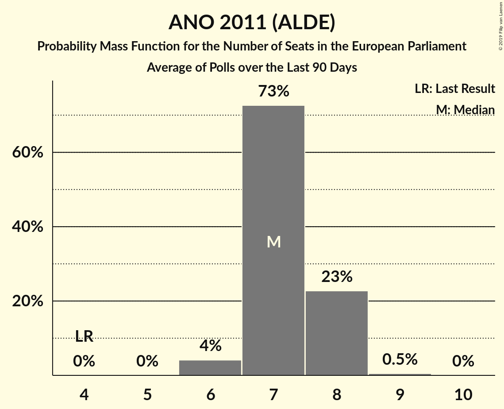

# ANO 2011 (ALDE)

<a href="#voting-intentions">Voting Intentions</a> | <a href="#seats">Seats</a>

## Voting Intentions

Last result: **16.1%** (General Election of 24–25 May 2014)

### Confidence Intervals

| Period     | Polling firm/Commissioner(s) | Median | 80% Confidence Interval | 90% Confidence Interval | 95% Confidence Interval | 99% Confidence Interval |
|:----------:|:----------------:|:-----------:|:-----------------------:|:-----------------------:|:-----------------------:|:-----------------------:|
| N/A | [Poll Average](average.html) | 32.2% | 30.0–34.4% | 29.3–35.1% | 28.7–35.6% | 27.7–36.6% |
| [3–15 March 2018](2018-03-15-Centrumprovýzkumveřejnéhomínění.html) | Centrum pro výzkum veřejného mínění | 30.5% | 28.8–32.4% | 28.3–32.9% | 27.8–33.4% | 27.0–34.3% |
| [3–23 February 2018](2018-02-23-TNSKantar.html) | TNS Kantar   Česká televize | 33.7% | 31.9–35.5% | 31.5–36.0% | 31.0–36.4% | 30.2–37.3% |
| [15–21 February 2018](2018-02-21-SANEP.html) | SANEP | 32.1% | 30.9–33.4% | 30.5–33.7% | 30.2–34.0% | 29.7–34.7% |
| [3–15 February 2018](2018-02-15-Centrumprovýzkumveřejnéhomínění.html) | Centrum pro výzkum veřejného mínění | 33.5% | 31.4–35.7% | 30.8–36.3% | 30.3–36.8% | 29.4–37.9% |
| [1–8 February 2018](2018-02-08-STEM.html) | STEM | 32.5% | 30.7–34.4% | 30.1–34.9% | 29.7–35.4% | 28.8–36.4% |
| [15–24 January 2018](2018-01-24-Centrumprovýzkumveřejnéhomínění.html) | Centrum pro výzkum veřejného mínění | 30.5% | 28.8–32.4% | 28.3–32.9% | 27.8–33.4% | 27.0–34.3% |
| [2–17 December 2017](2017-12-17-Centrumprovýzkumveřejnéhomínění.html) | Centrum pro výzkum veřejného mínění | 35.5% | 33.3–37.9% | 32.6–38.5% | 32.1–39.1% | 31.0–40.2% |
| [1–11 December 2017](2017-12-11-STEM.html) | STEM | 33.0% | 31.2–34.9% | 30.6–35.5% | 30.2–36.0% | 29.3–36.9% |
| [4–24 November 2017](2017-11-24-TNSKantar.html) | TNS Kantar   Česká televize | 30.0% | 28.3–31.7% | 27.9–32.2% | 27.5–32.7% | 26.7–33.5% |

### Probability Mass Function

The following table shows the probability mass function per percentage block of voting intentions for the [poll average](average.html) for ANO 2011 (ALDE).

| Voting Intentions | Probability | Accumulated | Special Marks |
|:-----------------:|:-----------:|:-----------:|:-------------:|
| 15.5–16.5% | 0% | 100% | Last Result |
| 16.5–17.5% | 0% | 100% |  |
| 17.5–18.5% | 0% | 100% |  |
| 18.5–19.5% | 0% | 100% |  |
| 19.5–20.5% | 0% | 100% |  |
| 20.5–21.5% | 0% | 100% |  |
| 21.5–22.5% | 0% | 100% |  |
| 22.5–23.5% | 0% | 100% |  |
| 23.5–24.5% | 0% | 100% |  |
| 24.5–25.5% | 0% | 100% |  |
| 25.5–26.5% | 0% | 100% |  |
| 26.5–27.5% | 0.3% | 100% |  |
| 27.5–28.5% | 2% | 99.6% |  |
| 28.5–29.5% | 5% | 98% |  |
| 29.5–30.5% | 9% | 93% |  |
| 30.5–31.5% | 18% | 84% |  |
| 31.5–32.5% | 24% | 66% | Median |
| 32.5–33.5% | 21% | 42% |  |
| 33.5–34.5% | 13% | 22% |  |
| 34.5–35.5% | 6% | 9% |  |
| 35.5–36.5% | 2% | 3% |  |
| 36.5–37.5% | 0.5% | 0.6% |  |
| 37.5–38.5% | 0.1% | 0.1% |  |
| 38.5–39.5% | 0% | 0% |  |

## Seats

Last result: **4** seats (General Election of 24–25 May 2014)

### Confidence Intervals

| Period     | Polling firm/Commissioner(s) | Median | 80% Confidence Interval | 90% Confidence Interval | 95% Confidence Interval | 99% Confidence Interval |
|:----------:|:----------------:|:------:|:-----------------------:|:-----------------------:|:-----------------------:|:-----------------------:|
| N/A | [Poll Average](average.html) | 8 | 7–9 | 7–9 | 7–10 | 6–10 |
| [3–15 March 2018](2018-03-15-Centrumprovýzkumveřejnéhomínění.html) | Centrum pro výzkum veřejného mínění | 7 | 7 | 7 | 6–7 | 6–9 |
| [3–23 February 2018](2018-02-23-TNSKantar.html) | TNS Kantar   Česká televize | 9 | 8–10 | 8–10 | 8–10 | 8–10 |
| [15–21 February 2018](2018-02-21-SANEP.html) | SANEP | 8 | 8–9 | 8–9 | 8–9 | 7–9 |
| [3–15 February 2018](2018-02-15-Centrumprovýzkumveřejnéhomínění.html) | Centrum pro výzkum veřejného mínění | 9 | 8–10 | 8–10 | 8–10 | 8–10 |
| [1–8 February 2018](2018-02-08-STEM.html) | STEM | 8 | 8–9 | 8–9 | 8–9 | 7–10 |
| [15–24 January 2018](2018-01-24-Centrumprovýzkumveřejnéhomínění.html) | Centrum pro výzkum veřejného mínění | 8 | 7–9 | 7–9 | 7–9 | 7–9 |
| [2–17 December 2017](2017-12-17-Centrumprovýzkumveřejnéhomínění.html) | Centrum pro výzkum veřejného mínění | 9 | 8–10 | 8–10 | 8–10 | 8–11 |
| [1–11 December 2017](2017-12-11-STEM.html) | STEM | 9 | 8–10 | 8–10 | 8–10 | 7–10 |
| [4–24 November 2017](2017-11-24-TNSKantar.html) | TNS Kantar   Česká televize | 8 | 8–9 | 7–9 | 7–9 | 7–9 |

### Probability Mass Function

The following table shows the probability mass function per seat for the [poll average](average.html) for ANO 2011 (ALDE).

| Number of Seats | Probability | Accumulated | Special Marks |
|:---------------:|:-----------:|:-----------:|:-------------:|
| 4 | 0% | 100% | Last Result |
| 5 | 0% | 100% |  |
| 6 | 0.7% | 100% |  |
| 7 | 25% | 99.3% |  |
| 8 | 37% | 74% | Median |
| 9 | 34% | 38% |  |
| 10 | 3% | 3% |  |
| 11 | 0% | 0% | Majority |

