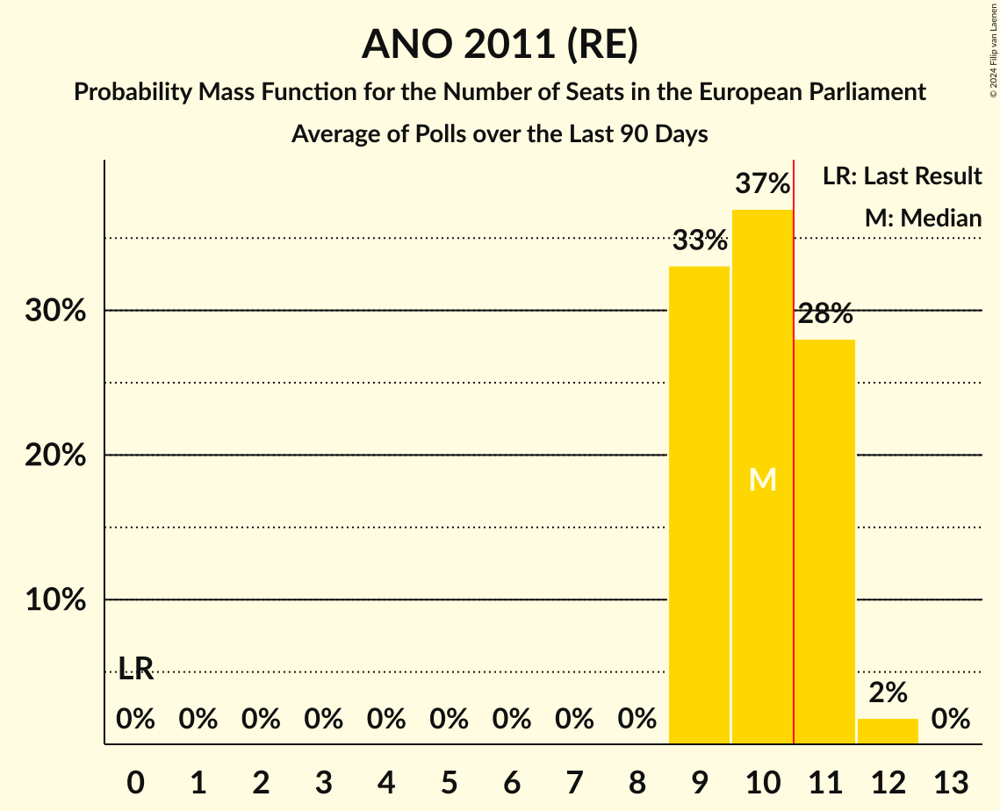

# ANO 2011 (RE)

<a href="#voting-intentions">Voting Intentions</a> | <a href="#seats">Seats</a>

## Voting Intentions

Last result: **16.1%** (General Election of 24–25 May 2019)

### Confidence Intervals

| Period     | Polling firm/Commissioner(s) | Median | 80% Confidence Interval | 90% Confidence Interval | 95% Confidence Interval | 99% Confidence Interval |
|:----------:|:----------------:|:-----------:|:-----------------------:|:-----------------------:|:-----------------------:|:-----------------------:|
| N/A | [Poll Average](average.html) | 30.2% | 28.3–32.2% | 27.8–32.8% | 27.4–33.3% | 26.5–34.3% |
| [28 August–29 September 2019](2019-09-29-Median.html) | Median | 31.0% | 29.2–32.9% | 28.7–33.4% | 28.3–33.9% | 27.4–34.8% |
| [20 August–18 September 2019](2019-09-18-PhoenixResearch.html) | Phoenix Research | 29.6% | 27.8–31.4% | 27.3–31.9% | 26.9–32.4% | 26.1–33.3% |
| [10–30 August 2019](2019-08-30-TNSKantar.html) | TNS Kantar | 30.0% | 28.3–31.7% | 27.9–32.2% | 27.5–32.7% | 26.7–33.5% |
| [27 July–26 August 2019](2019-08-26-Median.html) | Median | 29.2% | 27.4–31.1% | 26.9–31.6% | 26.5–32.0% | 25.7–33.0% |
| [1–26 July 2019](2019-07-26-Median.html) | Median | 28.5% | 26.8–30.4% | 26.3–30.9% | 25.9–31.4% | 25.0–32.3% |
| [1–30 June 2019](2019-06-30-Median.html) | Median | 29.0% | 27.2–30.8% | 26.7–31.4% | 26.3–31.8% | 25.5–32.7% |
| [17–26 June 2019](2019-06-26-TNSKantar.html) | TNS Kantar   Česká televize | 25.5% | 23.9–27.2% | 23.5–27.6% | 23.1–28.0% | 22.4–28.9% |
| [8–17 June 2019](2019-06-17-Centrumprovýzkumveřejnéhomínění.html) | Centrum pro výzkum veřejného mínění | 29.0% | 27.2–30.9% | 26.7–31.4% | 26.3–31.9% | 25.4–32.8% |
| [11–31 May 2019](2019-05-31-TNSKantar.html) | TNS Kantar   Česká televize | 27.5% | 25.9–29.2% | 25.4–29.7% | 25.0–30.1% | 24.3–30.9% |

### Probability Mass Function

The following table shows the probability mass function per percentage block of voting intentions for the [poll average](average.html) for ANO 2011 (RE).

| Voting Intentions | Probability | Accumulated | Special Marks |
|:-----------------:|:-----------:|:-----------:|:-------------:|
| 15.5–16.5% | 0% | 100% | Last Result |
| 16.5–17.5% | 0% | 100% |  |
| 17.5–18.5% | 0% | 100% |  |
| 18.5–19.5% | 0% | 100% |  |
| 19.5–20.5% | 0% | 100% |  |
| 20.5–21.5% | 0% | 100% |  |
| 21.5–22.5% | 0% | 100% |  |
| 22.5–23.5% | 0% | 100% |  |
| 23.5–24.5% | 0% | 100% |  |
| 24.5–25.5% | 0.1% | 100% |  |
| 25.5–26.5% | 0.5% | 99.9% |  |
| 26.5–27.5% | 3% | 99.4% |  |
| 27.5–28.5% | 10% | 96% |  |
| 28.5–29.5% | 20% | 87% |  |
| 29.5–30.5% | 26% | 67% | Median |
| 30.5–31.5% | 22% | 41% |  |
| 31.5–32.5% | 13% | 19% |  |
| 32.5–33.5% | 5% | 7% |  |
| 33.5–34.5% | 1.4% | 2% |  |
| 34.5–35.5% | 0.3% | 0.3% |  |
| 35.5–36.5% | 0% | 0% |  |

## Seats

Last result: **4** seats (General Election of 24–25 May 2019)

### Confidence Intervals

| Period     | Polling firm/Commissioner(s) | Median | 80% Confidence Interval | 90% Confidence Interval | 95% Confidence Interval | 99% Confidence Interval |
|:----------:|:----------------:|:------:|:-----------------------:|:-----------------------:|:-----------------------:|:-----------------------:|
| N/A | [Poll Average](average.html) | 8 | 7–9 | 7–9 | 7–10 | 7–10 |
| [28 August–29 September 2019](2019-09-29-Median.html) | Median | 8 | 7–9 | 7–10 | 7–10 | 7–10 |
| [20 August–18 September 2019](2019-09-18-PhoenixResearch.html) | Phoenix Research | 8 | 7–9 | 7–9 | 7–10 | 7–10 |
| [10–30 August 2019](2019-08-30-TNSKantar.html) | TNS Kantar | 8 | 8–9 | 7–9 | 7–9 | 7–9 |
| [27 July–26 August 2019](2019-08-26-Median.html) | Median | 8 | 7–9 | 7–9 | 7–9 | 7–9 |
| [1–26 July 2019](2019-07-26-Median.html) | Median | 7 | 7–8 | 7–8 | 7–8 | 6–9 |
| [1–30 June 2019](2019-06-30-Median.html) | Median | 7 | 7–8 | 7–8 | 7–9 | 7–9 |
| [17–26 June 2019](2019-06-26-TNSKantar.html) | TNS Kantar   Česká televize | 7 | 6–7 | 6–8 | 6–8 | 6–8 |
| [8–17 June 2019](2019-06-17-Centrumprovýzkumveřejnéhomínění.html) | Centrum pro výzkum veřejného mínění | 8 | 7–8 | 7–8 | 7–8 | 6–9 |
| [11–31 May 2019](2019-05-31-TNSKantar.html) | TNS Kantar   Česká televize | 7 | 7 | 7 | 6–8 | 6–8 |

### Probability Mass Function

The following table shows the probability mass function per seat for the [poll average](average.html) for ANO 2011 (RE).

| Number of Seats | Probability | Accumulated | Special Marks |
|:---------------:|:-----------:|:-----------:|:-------------:|
| 4 | 0% | 100% | Last Result |
| 5 | 0% | 100% |  |
| 6 | 0% | 100% |  |
| 7 | 15% | 100% |  |
| 8 | 60% | 85% | Median |
| 9 | 21% | 25% |  |
| 10 | 4% | 4% |  |
| 11 | 0% | 0% | Majority |

