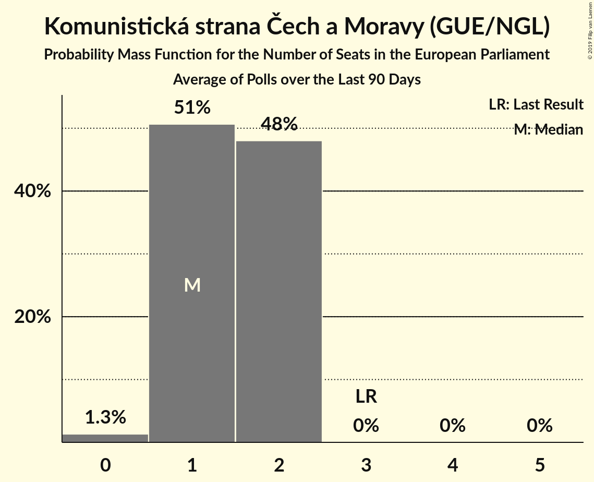

# Komunistická strana Čech a Moravy (GUE/NGL)

<a href="#voting-intentions">Voting Intentions</a> | <a href="#seats">Seats</a>

## Voting Intentions

Last result: **11.0%** (General Election of 24–25 May 2019)

### Confidence Intervals

| Period     | Polling firm/Commissioner(s) | Median | 80% Confidence Interval | 90% Confidence Interval | 95% Confidence Interval | 99% Confidence Interval |
|:----------:|:----------------:|:-----------:|:-----------------------:|:-----------------------:|:-----------------------:|:-----------------------:|
| N/A | [Poll Average](average.html) | 7.0% | 4.9–9.2% | 4.5–10.0% | 4.2–10.7% | 3.7–12.0% |
| [30 November–11 December 2019](2019-12-11-CVM.html) | CVM | 8.0% | 6.8–9.4% | 6.5–9.9% | 6.2–10.2% | 5.7–11.0% |
| [29 October–30 November 2019](2019-11-30-Median.html) | Median | 7.5% | 6.5–8.6% | 6.3–8.9% | 6.1–9.1% | 5.7–9.7% |
| [9–29 November 2019](2019-11-29-TNSKantar.html) | TNS Kantar | 5.9% | 5.1–6.9% | 4.9–7.2% | 4.7–7.4% | 4.4–7.9% |
| [21–27 November 2019](2019-11-27-SANEP.html) | SANEP | 6.4% | 5.5–7.5% | 5.3–7.8% | 5.1–8.1% | 4.7–8.6% |
| [14–26 November 2019](2019-11-26-STEM.html) | STEM | 7.1% | 6.2–8.2% | 6.0–8.5% | 5.7–8.8% | 5.3–9.3% |
| [1–18 November 2019](2019-11-18-PhoenixResearch.html) | Phoenix Research | 4.7% | 3.9–5.6% | 3.7–5.9% | 3.6–6.1% | 3.3–6.6% |
| [2–15 November 2019](2019-11-15-Centrumprovýzkumveřejnéhomínění.html) | Centrum pro výzkum veřejného mínění | 9.1% | 7.5–11.1% | 7.1–11.7% | 6.7–12.2% | 6.0–13.3% |
| [12 October–1 November 2019](2019-11-01-TNSKantar.html) | TNS Kantar | 7.0% | 6.1–8.0% | 5.9–8.3% | 5.7–8.6% | 5.3–9.1% |
| [30 September–28 October 2019](2019-10-28-Median.html) | Median | 7.0% | 6.1–8.1% | 5.9–8.4% | 5.7–8.7% | 5.3–9.2% |
| [11–25 October 2019](2019-10-25-STEM.html) | STEM | 8.4% | 7.3–9.6% | 7.1–10.0% | 6.8–10.3% | 6.3–10.9% |
| [16 September–5 October 2019](2019-10-05-TNSKantar.html) | TNS Kantar | 6.3% | 5.5–7.3% | 5.3–7.6% | 5.1–7.9% | 4.7–8.4% |
| [28 August–29 September 2019](2019-09-29-Median.html) | Median | 6.5% | 5.6–7.6% | 5.4–7.9% | 5.2–8.2% | 4.8–8.8% |
| [20 August–18 September 2019](2019-09-18-PhoenixResearch.html) | Phoenix Research | 4.9% | 4.2–5.9% | 3.9–6.2% | 3.8–6.4% | 3.4–6.9% |
| [7–17 September 2019](2019-09-17-Centrumprovýzkumveřejnéhomínění.html) | Centrum pro výzkum veřejného mínění | 8.7% | 7.3–10.3% | 7.0–10.8% | 6.7–11.2% | 6.1–12.0% |
| [10–30 August 2019](2019-08-30-TNSKantar.html) | TNS Kantar | 4.5% | 3.8–5.4% | 3.6–5.6% | 3.5–5.8% | 3.2–6.3% |
| [27 July–26 August 2019](2019-08-26-Median.html) | Median | 6.0% | 5.1–7.0% | 4.9–7.3% | 4.7–7.6% | 4.3–8.1% |
| [1–26 July 2019](2019-07-26-Median.html) | Median | 6.5% | 5.6–7.6% | 5.4–7.9% | 5.2–8.2% | 4.8–8.8% |
| [1–30 June 2019](2019-06-30-Median.html) | Median | 7.5% | 6.5–8.6% | 6.2–8.9% | 6.0–9.2% | 5.6–9.8% |
| [17–26 June 2019](2019-06-26-TNSKantar.html) | TNS Kantar   Česká televize | 5.5% | 4.7–6.4% | 4.5–6.7% | 4.3–7.0% | 4.0–7.4% |
| [8–17 June 2019](2019-06-17-Centrumprovýzkumveřejnéhomínění.html) | Centrum pro výzkum veřejného mínění | 9.0% | 7.9–10.2% | 7.6–10.6% | 7.3–10.9% | 6.9–11.5% |
| [11–31 May 2019](2019-05-31-TNSKantar.html) | TNS Kantar   Česká televize | 6.5% | 5.7–7.5% | 5.4–7.8% | 5.2–8.0% | 4.9–8.6% |

### Probability Mass Function

The following table shows the probability mass function per percentage block of voting intentions for the [poll average](average.html) for Komunistická strana Čech a Moravy (GUE/NGL).

| Voting Intentions | Probability | Accumulated | Special Marks |
|:-----------------:|:-----------:|:-----------:|:-------------:|
| 1.5–2.5% | 0% | 100% |  |
| 2.5–3.5% | 0.3% | 100% |  |
| 3.5–4.5% | 5% | 99.7% |  |
| 4.5–5.5% | 12% | 94% |  |
| 5.5–6.5% | 21% | 82% |  |
| 6.5–7.5% | 25% | 61% | Median |
| 7.5–8.5% | 19% | 36% |  |
| 8.5–9.5% | 9% | 17% |  |
| 9.5–10.5% | 4% | 7% |  |
| 10.5–11.5% | 2% | 3% | Last Result |
| 11.5–12.5% | 0.7% | 0.9% |  |
| 12.5–13.5% | 0.2% | 0.2% |  |
| 13.5–14.5% | 0% | 0% |  |

## Seats

Last result: **3** seats (General Election of 24–25 May 2019)

### Confidence Intervals

| Period     | Polling firm/Commissioner(s) | Median | 80% Confidence Interval | 90% Confidence Interval | 95% Confidence Interval | 99% Confidence Interval |
|:----------:|:----------------:|:------:|:-----------------------:|:-----------------------:|:-----------------------:|:-----------------------:|
| N/A | [Poll Average](average.html) | 1 | 0–2 | 0–2 | 0–2 | 0–3 |
| [30 November–11 December 2019](2019-12-11-CVM.html) | CVM | 2 | 1–2 | 1–2 | 1–2 | 1–3 |
| [29 October–30 November 2019](2019-11-30-Median.html) | Median | 2 | 1–2 | 1–2 | 1–2 | 1–2 |
| [9–29 November 2019](2019-11-29-TNSKantar.html) | TNS Kantar | 1 | 1 | 0–2 | 0–2 | 0–2 |
| [21–27 November 2019](2019-11-27-SANEP.html) | SANEP | 1 | 1–2 | 1–2 | 1–2 | 0–2 |
| [14–26 November 2019](2019-11-26-STEM.html) | STEM | 1 | 1–2 | 1–2 | 1–2 | 1–2 |
| [1–18 November 2019](2019-11-18-PhoenixResearch.html) | Phoenix Research | 0 | 0–1 | 0–1 | 0–1 | 0–1 |
| [2–15 November 2019](2019-11-15-Centrumprovýzkumveřejnéhomínění.html) | Centrum pro výzkum veřejného mínění | 2 | 2 | 2–3 | 1–3 | 1–3 |
| [12 October–1 November 2019](2019-11-01-TNSKantar.html) | TNS Kantar | 2 | 1–2 | 1–2 | 1–2 | 1–2 |
| [30 September–28 October 2019](2019-10-28-Median.html) | Median | 1 | 1–2 | 1–2 | 1–2 | 0–2 |
| [11–25 October 2019](2019-10-25-STEM.html) | STEM | 2 | 2 | 2 | 1–2 | 1–3 |
| [16 September–5 October 2019](2019-10-05-TNSKantar.html) | TNS Kantar | 1 | 1–2 | 1–2 | 0–2 | 0–2 |
| [28 August–29 September 2019](2019-09-29-Median.html) | Median | 1 | 1–2 | 1–2 | 1–2 | 0–2 |
| [20 August–18 September 2019](2019-09-18-PhoenixResearch.html) | Phoenix Research | 1 | 0–1 | 0–1 | 0–1 | 0–2 |
| [7–17 September 2019](2019-09-17-Centrumprovýzkumveřejnéhomínění.html) | Centrum pro výzkum veřejného mínění | 2 | 2 | 1–2 | 1–2 | 1–3 |
| [10–30 August 2019](2019-08-30-TNSKantar.html) | TNS Kantar | 0 | 0–1 | 0–1 | 0–1 | 0–1 |
| [27 July–26 August 2019](2019-08-26-Median.html) | Median | 1 | 0–1 | 0–2 | 0–2 | 0–2 |
| [1–26 July 2019](2019-07-26-Median.html) | Median | 1 | 1–2 | 1–2 | 1–2 | 0–2 |
| [1–30 June 2019](2019-06-30-Median.html) | Median | 1 | 1–2 | 1–2 | 1–2 | 1–2 |
| [17–26 June 2019](2019-06-26-TNSKantar.html) | TNS Kantar   Česká televize | 1 | 0–1 | 0–1 | 0–1 | 0–2 |
| [8–17 June 2019](2019-06-17-Centrumprovýzkumveřejnéhomínění.html) | Centrum pro výzkum veřejného mínění | 2 | 2 | 2 | 2–3 | 1–3 |
| [11–31 May 2019](2019-05-31-TNSKantar.html) | TNS Kantar   Česká televize | 1 | 1–2 | 1–2 | 1–2 | 0–2 |

### Probability Mass Function

The following table shows the probability mass function per seat for the [poll average](average.html) for Komunistická strana Čech a Moravy (GUE/NGL).

| Number of Seats | Probability | Accumulated | Special Marks |
|:---------------:|:-----------:|:-----------:|:-------------:|
| 0 | 12% | 100% |  |
| 1 | 48% | 88% | Median |
| 2 | 39% | 40% |  |
| 3 | 1.2% | 1.2% | Last Result |
| 4 | 0% | 0% |  |

