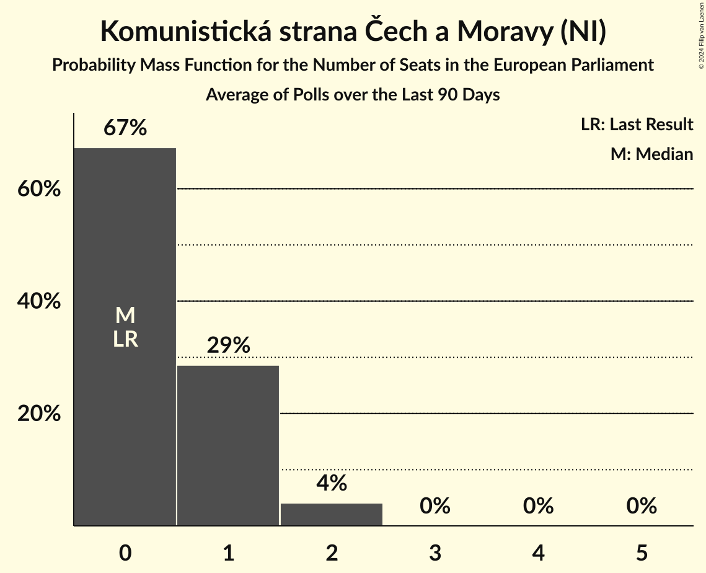

# Komunistická strana Čech a Moravy (NI)

<a href="#voting-intentions">Voting Intentions</a> | <a href="#seats">Seats</a>

## Voting Intentions

Last result: **0.0%** (General Election of 8 June 2024)

### Confidence Intervals

| Period     | Polling firm/Commissioner(s) | Median | 80% Confidence Interval | 90% Confidence Interval | 95% Confidence Interval | 99% Confidence Interval |
|:----------:|:----------------:|:-----------:|:-----------------------:|:-----------------------:|:-----------------------:|:-----------------------:|
| N/A | [Poll Average](average.html) | 5.0% | 2.8–6.2% | 2.5–6.5% | 2.4–6.8% | 2.0–7.3% |
| [1–8 August 2024](2024-08-08-NMS.html) | NMS | 5.7% | 5.0–6.7% | 4.8–6.9% | 4.6–7.1% | 4.3–7.6% |
| [1–31 July 2024](2024-07-31-PhoenixResearch.html) | Phoenix Research | 0.0% | N/A | N/A | N/A | N/A |
| [4–12 July 2024](2024-07-12-NMS.html) | NMS | 0.0% | N/A | N/A | N/A | N/A |
| [1–30 June 2024](2024-06-30-STEM.html) | STEM   CNN Prima News | 5.1% | 4.5–5.9% | 4.3–6.1% | 4.1–6.3% | 3.8–6.7% |
| [1–30 June 2024](2024-06-30-Median.html) | Median | 0.0% | N/A | N/A | N/A | N/A |
| [10–21 June 2024](2024-06-21-Kantar.html) | Kantar   ČT24 | 3.0% | 2.4–3.8% | 2.3–4.0% | 2.1–4.2% | 1.9–4.6% |

### Probability Mass Function

The following table shows the probability mass function per percentage block of voting intentions for the [poll average](average.html) for Komunistická strana Čech a Moravy (NI).

| Voting Intentions | Probability | Accumulated | Special Marks |
|:-----------------:|:-----------:|:-----------:|:-------------:|
| 0.0–0.5% | 0% | 100% | Last Result |
| 0.5–1.5% | 0% | 100% |  |
| 1.5–2.5% | 5% | 100% |  |
| 2.5–3.5% | 22% | 95% |  |
| 3.5–4.5% | 11% | 73% |  |
| 4.5–5.5% | 33% | 62% | Median |
| 5.5–6.5% | 25% | 29% |  |
| 6.5–7.5% | 4% | 4% |  |
| 7.5–8.5% | 0.2% | 0.2% |  |
| 8.5–9.5% | 0% | 0% |  |

## Seats

Last result: **0** seats (General Election of 8 June 2024)

### Confidence Intervals

| Period     | Polling firm/Commissioner(s) | Median | 80% Confidence Interval | 90% Confidence Interval | 95% Confidence Interval | 99% Confidence Interval |
|:----------:|:----------------:|:------:|:-----------------------:|:-----------------------:|:-----------------------:|:-----------------------:|
| N/A | [Poll Average](average.html) | 1 | 0–2 | 0–2 | 0–2 | 0–2 |
| [1–8 August 2024](2024-08-08-NMS.html) | NMS | 1 | 0–2 | 0–2 | 0–2 | 0–2 |
| [1–31 July 2024](2024-07-31-PhoenixResearch.html) | Phoenix Research |  |  |  |  |  |
| [4–12 July 2024](2024-07-12-NMS.html) | NMS |  |  |  |  |  |
| [1–30 June 2024](2024-06-30-STEM.html) | STEM   CNN Prima News | 1 | 1 | 0–1 | 0–1 | 0–2 |
| [1–30 June 2024](2024-06-30-Median.html) | Median |  |  |  |  |  |
| [10–21 June 2024](2024-06-21-Kantar.html) | Kantar   ČT24 | 0 | 0 | 0 | 0 | 0 |

### Probability Mass Function

The following table shows the probability mass function per seat for the [poll average](average.html) for Komunistická strana Čech a Moravy (NI).

| Number of Seats | Probability | Accumulated | Special Marks |
|:---------------:|:-----------:|:-----------:|:-------------:|
| 0 | 40% | 100% | Last Result |
| 1 | 50% | 60% | Median |
| 2 | 10% | 10% |  |
| 3 | 0% | 0% |  |

