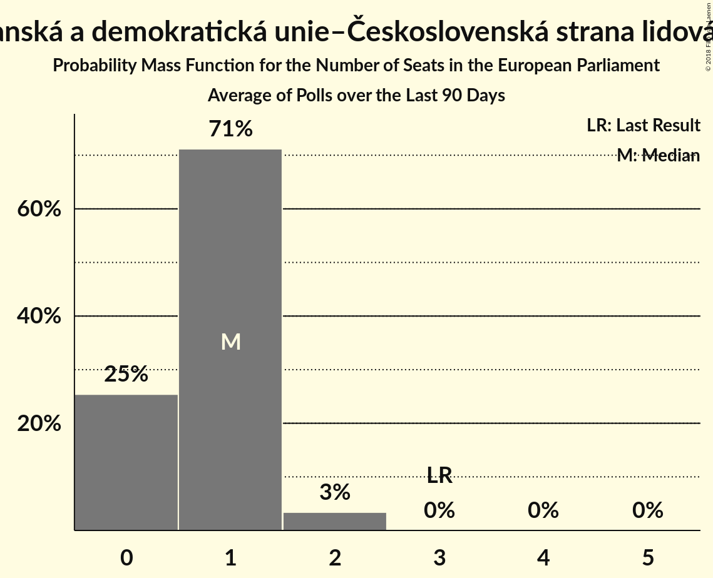

# Křesťanská a demokratická unie–Československá strana lidová (EPP)

<a href="#voting-intentions">Voting Intentions</a> | <a href="#seats">Seats</a>

## Voting Intentions

Last result: **10.0%** (General Election of 24–25 May 2014)

### Confidence Intervals

| Period     | Polling firm/Commissioner(s) | Median | 80% Confidence Interval | 90% Confidence Interval | 95% Confidence Interval | 99% Confidence Interval |
|:----------:|:----------------:|:-----------:|:-----------------------:|:-----------------------:|:-----------------------:|:-----------------------:|
| N/A | [Poll Average](average.html) | 5.1% | 4.2–6.0% | 3.9–6.2% | 3.7–6.5% | 3.3–7.0% |
| [10–29 March 2018](2018-03-29-TNSKantar.html) | TNS Kantar   Česká televize | 5.0% | 4.1–6.1% | 3.9–6.4% | 3.7–6.6% | 3.3–7.2% |
| [22–28 March 2018](2018-03-28-SANEP.html) | SANEP | 5.4% | 4.9–6.1% | 4.7–6.2% | 4.6–6.4% | 4.3–6.7% |
| [3–15 March 2018](2018-03-15-Centrumprovýzkumveřejnéhomínění.html) | Centrum pro výzkum veřejného mínění | 4.5% | 3.8–5.5% | 3.6–5.7% | 3.4–6.0% | 3.1–6.4% |
| [3–23 February 2018](2018-02-23-TNSKantar.html) | TNS Kantar   Česká televize | 5.1% | 4.3–6.0% | 4.1–6.2% | 4.0–6.5% | 3.6–7.0% |
| [15–21 February 2018](2018-02-21-SANEP.html) | SANEP | 5.8% | 5.2–6.5% | 5.0–6.7% | 4.9–6.8% | 4.6–7.2% |
| [3–15 February 2018](2018-02-15-Centrumprovýzkumveřejnéhomínění.html) | Centrum pro výzkum veřejného mínění | 3.4% | 2.7–4.4% | 2.6–4.7% | 2.4–5.0% | 2.1–5.5% |
| [1–8 February 2018](2018-02-08-STEM.html) | STEM | 5.2% | 4.4–6.2% | 4.1–6.4% | 4.0–6.7% | 3.6–7.2% |
| [15–24 January 2018](2018-01-24-Centrumprovýzkumveřejnéhomínění.html) | Centrum pro výzkum veřejného mínění | 5.0% | 4.2–5.9% | 4.0–6.2% | 3.8–6.4% | 3.5–6.9% |
| [2–17 December 2017](2017-12-17-Centrumprovýzkumveřejnéhomínění.html) | Centrum pro výzkum veřejného mínění | 6.4% | 5.4–7.8% | 5.1–8.2% | 4.9–8.5% | 4.4–9.2% |
| [1–11 December 2017](2017-12-11-STEM.html) | STEM | 5.4% | 4.5–6.4% | 4.3–6.7% | 4.1–6.9% | 3.8–7.4% |
| [4–24 November 2017](2017-11-24-TNSKantar.html) | TNS Kantar   Česká televize | 4.5% | 3.8–5.4% | 3.6–5.6% | 3.5–5.8% | 3.2–6.3% |

### Probability Mass Function

The following table shows the probability mass function per percentage block of voting intentions for the [poll average](average.html) for Křesťanská a demokratická unie–Československá strana lidová (EPP).

| Voting Intentions | Probability | Accumulated | Special Marks |
|:-----------------:|:-----------:|:-----------:|:-------------:|
| 1.5–2.5% | 0% | 100% |  |
| 2.5–3.5% | 1.5% | 100% |  |
| 3.5–4.5% | 22% | 98.5% |  |
| 4.5–5.5% | 50% | 77% | Median |
| 5.5–6.5% | 24% | 26% |  |
| 6.5–7.5% | 2% | 2% |  |
| 7.5–8.5% | 0.1% | 0.1% |  |
| 8.5–9.5% | 0% | 0% |  |
| 9.5–10.5% | 0% | 0% | Last Result |

## Seats

Last result: **3** seats (General Election of 24–25 May 2014)

### Confidence Intervals

| Period     | Polling firm/Commissioner(s) | Median | 80% Confidence Interval | 90% Confidence Interval | 95% Confidence Interval | 99% Confidence Interval |
|:----------:|:----------------:|:------:|:-----------------------:|:-----------------------:|:-----------------------:|:-----------------------:|
| N/A | [Poll Average](average.html) | 1 | 0–1 | 0–1 | 0–1 | 0–1 |
| [10–29 March 2018](2018-03-29-TNSKantar.html) | TNS Kantar   Česká televize | 1 | 0–1 | 0–1 | 0–1 | 0–1 |
| [22–28 March 2018](2018-03-28-SANEP.html) | SANEP | 1 | 0–1 | 0–1 | 0–1 | 0–1 |
| [3–15 March 2018](2018-03-15-Centrumprovýzkumveřejnéhomínění.html) | Centrum pro výzkum veřejného mínění | 0 | 0–1 | 0–1 | 0–1 | 0–1 |
| [3–23 February 2018](2018-02-23-TNSKantar.html) | TNS Kantar   Česká televize | 1 | 0–1 | 0–1 | 0–1 | 0–1 |
| [15–21 February 2018](2018-02-21-SANEP.html) | SANEP | 1 | 1 | 1 | 0–1 | 0–1 |
| [3–15 February 2018](2018-02-15-Centrumprovýzkumveřejnéhomínění.html) | Centrum pro výzkum veřejného mínění | 0 | 0 | 0 | 0 | 0–1 |
| [1–8 February 2018](2018-02-08-STEM.html) | STEM | 1 | 0–1 | 0–1 | 0–1 | 0–1 |
| [15–24 January 2018](2018-01-24-Centrumprovýzkumveřejnéhomínění.html) | Centrum pro výzkum veřejného mínění | 0 | 0–1 | 0–1 | 0–1 | 0–1 |
| [2–17 December 2017](2017-12-17-Centrumprovýzkumveřejnéhomínění.html) | Centrum pro výzkum veřejného mínění | 1 | 1–2 | 1–2 | 0–2 | 0–2 |
| [1–11 December 2017](2017-12-11-STEM.html) | STEM | 0 | 0–1 | 0–1 | 0–1 | 0–1 |
| [4–24 November 2017](2017-11-24-TNSKantar.html) | TNS Kantar   Česká televize | 0 | 0–1 | 0–1 | 0–1 | 0–1 |

### Probability Mass Function

The following table shows the probability mass function per seat for the [poll average](average.html) for Křesťanská a demokratická unie–Československá strana lidová (EPP).

| Number of Seats | Probability | Accumulated | Special Marks |
|:---------------:|:-----------:|:-----------:|:-------------:|
| 0 | 46% | 100% |  |
| 1 | 54% | 54% | Median |
| 2 | 0.2% | 0.2% |  |
| 3 | 0% | 0% | Last Result |

