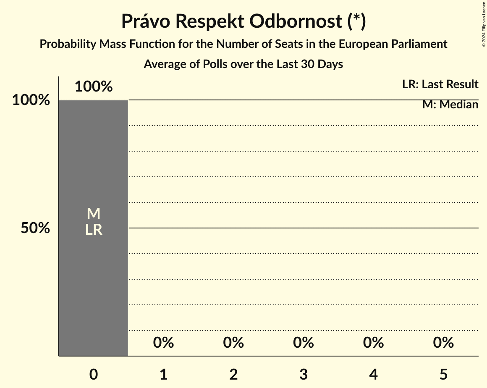

# Právo Respekt Odbornost (*)

<a href="#voting-intentions">Voting Intentions</a> | <a href="#seats">Seats</a>

## Voting Intentions

Last result: **0.0%** (General Election of 8 June 2024)

### Confidence Intervals

| Period     | Polling firm/Commissioner(s) | Median | 80% Confidence Interval | 90% Confidence Interval | 95% Confidence Interval | 99% Confidence Interval |
|:----------:|:----------------:|:-----------:|:-----------------------:|:-----------------------:|:-----------------------:|:-----------------------:|
| N/A | [Poll Average](average.html) | 1.2% | 0.8–1.8% | 0.7–1.9% | 0.6–2.1% | 0.5–2.4% |
| [1–13 December 2024](2024-12-13-PhoenixResearch.html) | Phoenix Research | 1.0% | 0.7–1.6% | 0.7–1.7% | 0.6–1.9% | 0.5–2.2% |
| [3–9 December 2024](2024-12-09-NMS.html) | NMS | 1.3% | 0.9–1.9% | 0.8–2.1% | 0.8–2.2% | 0.6–2.5% |
| [1–30 November 2024](2024-11-30-Median.html) | Median | 0.0% | N/A | N/A | N/A | N/A |
| [5–12 November 2024](2024-11-12-NMS.html) | NMS | 1.8% | 1.4–2.4% | 1.3–2.6% | 1.2–2.7% | 1.1–3.0% |
| [1–10 November 2024](2024-11-10-PhoenixResearch.html) | Phoenix Research | 1.0% | 0.7–1.5% | 0.6–1.7% | 0.6–1.8% | 0.5–2.1% |
| [31 October–8 November 2024](2024-11-08-STEM.html) | STEM   CNN Prima News | 1.1% | 0.8–1.6% | 0.7–1.8% | 0.6–1.9% | 0.5–2.2% |
| [21 October–8 November 2024](2024-11-08-Kantar.html) | Kantar   ČT24 | 0.0% | N/A | N/A | N/A | N/A |
| [1–31 October 2024](2024-10-31-Median.html) | Median | 2.0% | 1.6–2.8% | 1.4–3.0% | 1.3–3.2% | 1.1–3.5% |
| [2–11 October 2024](2024-10-11-STEM.html) | STEM   CNN Prima News | 0.0% | N/A | N/A | N/A | N/A |
| [30 September–11 October 2024](2024-10-11-Kantar.html) | Kantar   ČT24 | 0.0% | N/A | N/A | N/A | N/A |
| [4–9 October 2024](2024-10-09-NMS.html) | NMS | 0.0% | N/A | N/A | N/A | N/A |
| [1–30 September 2024](2024-09-30-Median.html) | Median | 2.0% | 1.5–2.7% | 1.4–2.8% | 1.3–3.0% | 1.1–3.4% |
| [3–10 September 2024](2024-09-10-NMS.html) | NMS | 1.1% | 0.8–1.6% | 0.7–1.7% | 0.6–1.8% | 0.5–2.1% |
| [29 August–8 September 2024](2024-09-08-STEM.html) | STEM | 1.0% | 0.7–1.5% | 0.6–1.7% | 0.6–1.8% | 0.4–2.1% |
| [1–8 September 2024](2024-09-08-PhoenixResearch.html) | Phoenix Research | 1.0% | 0.7–1.5% | 0.6–1.7% | 0.5–1.8% | 0.4–2.1% |
| [1–31 August 2024](2024-08-31-Median.html) | Median | 2.0% | 1.5–2.7% | 1.4–2.9% | 1.3–3.0% | 1.1–3.4% |
| [1–8 August 2024](2024-08-08-NMS.html) | NMS | 1.5% | 1.1–2.0% | 1.0–2.2% | 0.9–2.3% | 0.8–2.6% |
| [1–31 July 2024](2024-07-31-PhoenixResearch.html) | Phoenix Research | 0.0% | N/A | N/A | N/A | N/A |
| [1–31 July 2024](2024-07-31-Median.html) | Median | 2.0% | 1.5–2.7% | 1.4–2.9% | 1.3–3.0% | 1.1–3.4% |
| [4–12 July 2024](2024-07-12-NMS.html) | NMS | 0.0% | N/A | N/A | N/A | N/A |
| [1–30 June 2024](2024-06-30-STEM.html) | STEM   CNN Prima News | 1.9% | 1.6–2.5% | 1.4–2.6% | 1.4–2.7% | 1.2–3.0% |
| [1–30 June 2024](2024-06-30-Median.html) | Median | 1.5% | 1.1–2.1% | 1.0–2.3% | 0.9–2.5% | 0.7–2.8% |
| [10–21 June 2024](2024-06-21-Kantar.html) | Kantar   ČT24 | 0.0% | N/A | N/A | N/A | N/A |

### Probability Mass Function

The following table shows the probability mass function per percentage block of voting intentions for the [poll average](average.html) for Právo Respekt Odbornost (*).

| Voting Intentions | Probability | Accumulated | Special Marks |
|:-----------------:|:-----------:|:-----------:|:-------------:|
| 0.0–0.5% | 0.8% | 100% | Last Result |
| 0.5–1.5% | 78% | 99.2% | Median |
| 1.5–2.5% | 21% | 21% |  |
| 2.5–3.5% | 0.2% | 0.2% |  |
| 3.5–4.5% | 0% | 0% |  |

## Seats

Last result: **0** seats (General Election of 8 June 2024)

### Confidence Intervals

| Period     | Polling firm/Commissioner(s) | Median | 80% Confidence Interval | 90% Confidence Interval | 95% Confidence Interval | 99% Confidence Interval |
|:----------:|:----------------:|:------:|:-----------------------:|:-----------------------:|:-----------------------:|:-----------------------:|
| N/A | [Poll Average](average.html) | 0 | 0 | 0 | 0 | 0 |
| [1–13 December 2024](2024-12-13-PhoenixResearch.html) | Phoenix Research | 0 | 0 | 0 | 0 | 0 |
| [3–9 December 2024](2024-12-09-NMS.html) | NMS | 0 | 0 | 0 | 0 | 0 |
| [1–30 November 2024](2024-11-30-Median.html) | Median |  |  |  |  |  |
| [5–12 November 2024](2024-11-12-NMS.html) | NMS | 0 | 0 | 0 | 0 | 0 |
| [1–10 November 2024](2024-11-10-PhoenixResearch.html) | Phoenix Research | 0 | 0 | 0 | 0 | 0 |
| [31 October–8 November 2024](2024-11-08-STEM.html) | STEM   CNN Prima News | 0 | 0 | 0 | 0 | 0 |
| [21 October–8 November 2024](2024-11-08-Kantar.html) | Kantar   ČT24 |  |  |  |  |  |
| [1–31 October 2024](2024-10-31-Median.html) | Median | 0 | 0 | 0 | 0 | 0 |
| [2–11 October 2024](2024-10-11-STEM.html) | STEM   CNN Prima News |  |  |  |  |  |
| [30 September–11 October 2024](2024-10-11-Kantar.html) | Kantar   ČT24 |  |  |  |  |  |
| [4–9 October 2024](2024-10-09-NMS.html) | NMS |  |  |  |  |  |
| [1–30 September 2024](2024-09-30-Median.html) | Median | 0 | 0 | 0 | 0 | 0 |
| [3–10 September 2024](2024-09-10-NMS.html) | NMS | 0 | 0 | 0 | 0 | 0 |
| [29 August–8 September 2024](2024-09-08-STEM.html) | STEM | 0 | 0 | 0 | 0 | 0 |
| [1–8 September 2024](2024-09-08-PhoenixResearch.html) | Phoenix Research | 0 | 0 | 0 | 0 | 0 |
| [1–31 August 2024](2024-08-31-Median.html) | Median | 0 | 0 | 0 | 0 | 0 |
| [1–8 August 2024](2024-08-08-NMS.html) | NMS | 0 | 0 | 0 | 0 | 0 |
| [1–31 July 2024](2024-07-31-PhoenixResearch.html) | Phoenix Research |  |  |  |  |  |
| [1–31 July 2024](2024-07-31-Median.html) | Median | 0 | 0 | 0 | 0 | 0 |
| [4–12 July 2024](2024-07-12-NMS.html) | NMS |  |  |  |  |  |
| [1–30 June 2024](2024-06-30-STEM.html) | STEM   CNN Prima News | 0 | 0 | 0 | 0 | 0 |
| [1–30 June 2024](2024-06-30-Median.html) | Median | 0 | 0 | 0 | 0 | 0 |
| [10–21 June 2024](2024-06-21-Kantar.html) | Kantar   ČT24 |  |  |  |  |  |

### Probability Mass Function

The following table shows the probability mass function per seat for the [poll average](average.html) for Právo Respekt Odbornost (*).

| Number of Seats | Probability | Accumulated | Special Marks |
|:---------------:|:-----------:|:-----------:|:-------------:|
| 0 | 100% | 100% | Last Result, Median |

