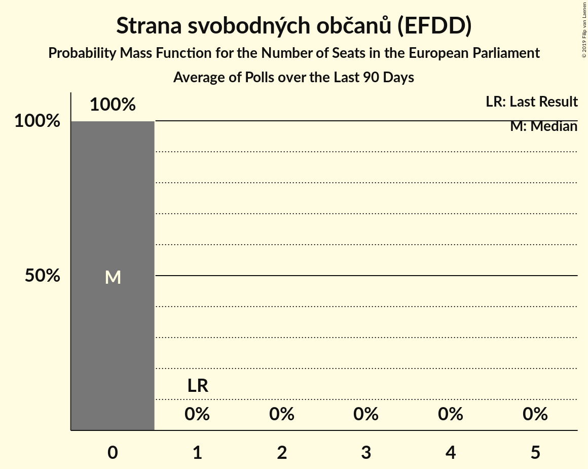

# Strana svobodných občanů (EFDD)

<a href="#voting-intentions">Voting Intentions</a> | <a href="#seats">Seats</a>

## Voting Intentions

Last result: **5.2%** (General Election of 24–25 May 2014)

### Confidence Intervals

| Period     | Polling firm/Commissioner(s) | Median | 80% Confidence Interval | 90% Confidence Interval | 95% Confidence Interval | 99% Confidence Interval |
|:----------:|:----------------:|:-----------:|:-----------------------:|:-----------------------:|:-----------------------:|:-----------------------:|
| N/A | [Poll Average](average.html) | 1.1% | 0.4–1.8% | 0.4–2.0% | 0.3–2.1% | 0.2–2.5% |
| [6–26 October 2018](2018-10-26-TNSKantar.html) | TNS Kantar   Česká televize | 0.0% | N/A | N/A | N/A | N/A |
| [13–26 October 2018](2018-10-26-Centrumprovýzkumveřejnéhomínění.html) | Centrum pro výzkum veřejného mínění | 0.0% | N/A | N/A | N/A | N/A |
| [25 September–25 October 2018](2018-10-25-Median.html) | Median | 1.5% | 1.1–2.0% | 1.0–2.2% | 0.9–2.4% | 0.7–2.7% |
| [9–24 October 2018](2018-10-24-STEM.html) | STEM | 0.5% | 0.3–0.9% | 0.2–1.0% | 0.2–1.2% | 0.2–1.4% |
| [22 October 2018](2018-10-22-SANEP.html) | SANEP | 0.0% | N/A | N/A | N/A | N/A |
| [1–10 October 2018](2018-10-10-PhoenixResearch.html) | Phoenix Research   Blesk Zprávy | 1.0% | 0.7–1.6% | 0.6–1.7% | 0.6–1.8% | 0.5–2.1% |
| [1–21 September 2018](2018-09-21-TNSKantar.html) | TNS Kantar | 0.0% | N/A | N/A | N/A | N/A |
| [8–20 September 2018](2018-09-20-Centrumprovýzkumveřejnéhomínění.html) | Centrum pro výzkum veřejného mínění | 1.0% | 0.7–1.5% | 0.6–1.6% | 0.5–1.8% | 0.4–2.1% |
| [6–12 September 2018](2018-09-12-SANEP.html) | SANEP | 0.0% | N/A | N/A | N/A | N/A |
| [25 July–28 August 2018](2018-08-28-Median.html) | Median | 1.5% | 1.1–2.1% | 1.0–2.3% | 0.9–2.5% | 0.8–2.8% |
| [4–26 August 2018](2018-08-26-TNSKantar.html) | TNS Kantar | 0.0% | N/A | N/A | N/A | N/A |
| [9–15 August 2018](2018-08-15-SANEP.html) | SANEP | 0.0% | N/A | N/A | N/A | N/A |
| [27 June–23 July 2018](2018-07-23-Median.html) | Median | 1.5% | 1.2–2.1% | 1.1–2.3% | 1.0–2.4% | 0.8–2.7% |
| [16–29 June 2018](2018-06-29-Centrumprovýzkumveřejnéhomínění.html) | Centrum pro výzkum veřejného mínění | 0.0% | N/A | N/A | N/A | N/A |
| [13–27 June 2018](2018-06-27-STEM.html) | STEM | 1.9% | 1.4–2.6% | 1.3–2.8% | 1.2–2.9% | 1.0–3.3% |
| [25 May–26 June 2018](2018-06-26-Median.html) | Median | 1.0% | 0.7–1.5% | 0.6–1.6% | 0.5–1.7% | 0.4–2.0% |
| [18–24 June 2018](2018-06-24-PhoenixResearch.html) | Phoenix Research   Blesk Zprávy | 2.4% | 1.8–3.1% | 1.7–3.3% | 1.6–3.5% | 1.4–3.9% |
| [2–22 June 2018](2018-06-22-TNSKantar.html) | TNS Kantar   Česká televize | 0.0% | N/A | N/A | N/A | N/A |
| [7–13 June 2018](2018-06-13-SANEP.html) | SANEP | 0.0% | N/A | N/A | N/A | N/A |
| [12 May–1 June 2018](2018-06-01-TNSKantar.html) | TNS Kantar   Česká televize | 0.0% | N/A | N/A | N/A | N/A |
| [12–24 May 2018](2018-05-24-Centrumprovýzkumveřejnéhomínění.html) | Centrum pro výzkum veřejného mínění | 1.0% | 0.7–1.5% | 0.6–1.7% | 0.5–1.8% | 0.4–2.1% |
| [17–23 May 2018](2018-05-23-SANEP.html) | SANEP | 0.0% | N/A | N/A | N/A | N/A |
| [10 April–5 May 2018](2018-05-05-Median.html) | Median | 1.0% | 0.7–1.4% | 0.6–1.6% | 0.6–1.7% | 0.4–2.0% |
| [15 November 2017–3 May 2018](2018-05-03-Median.html) | Median | 0.0% | N/A | N/A | N/A | N/A |
| [19–29 April 2018](2018-04-29-STEM.html) | STEM | 0.8% | 0.5–1.2% | 0.4–1.4% | 0.4–1.5% | 0.3–1.8% |
| [7–27 April 2018](2018-04-27-TNSKantar.html) | TNS Kantar   Česká televize | 0.0% | N/A | N/A | N/A | N/A |
| [19–25 April 2018](2018-04-25-SANEP.html) | SANEP | 0.0% | N/A | N/A | N/A | N/A |
| [7–19 April 2018](2018-04-19-Centrumprovýzkumveřejnéhomínění.html) | Centrum pro výzkum veřejného mínění | 0.0% | N/A | N/A | N/A | N/A |
| [10–29 March 2018](2018-03-29-TNSKantar.html) | TNS Kantar   Česká televize | 0.0% | N/A | N/A | N/A | N/A |
| [22–28 March 2018](2018-03-28-SANEP.html) | SANEP | 0.0% | N/A | N/A | N/A | N/A |
| [3–15 March 2018](2018-03-15-Centrumprovýzkumveřejnéhomínění.html) | Centrum pro výzkum veřejného mínění | 1.0% | 0.7–1.6% | 0.6–1.7% | 0.6–1.9% | 0.5–2.1% |
| [3–23 February 2018](2018-02-23-TNSKantar.html) | TNS Kantar   Česká televize | 0.0% | N/A | N/A | N/A | N/A |
| [15–21 February 2018](2018-02-21-SANEP.html) | SANEP | 0.0% | N/A | N/A | N/A | N/A |
| [3–15 February 2018](2018-02-15-Centrumprovýzkumveřejnéhomínění.html) | Centrum pro výzkum veřejného mínění | 1.0% | 0.7–1.6% | 0.6–1.8% | 0.5–1.9% | 0.4–2.3% |
| [1–8 February 2018](2018-02-08-STEM.html) | STEM | 1.5% | 1.1–2.1% | 1.0–2.2% | 0.9–2.4% | 0.7–2.7% |
| [15–24 January 2018](2018-01-24-Centrumprovýzkumveřejnéhomínění.html) | Centrum pro výzkum veřejného mínění | 1.5% | 1.1–2.1% | 1.0–2.3% | 0.9–2.4% | 0.8–2.7% |
| [2–17 December 2017](2017-12-17-Centrumprovýzkumveřejnéhomínění.html) | Centrum pro výzkum veřejného mínění | 0.0% | N/A | N/A | N/A | N/A |
| [1–11 December 2017](2017-12-11-STEM.html) | STEM | 0.0% | N/A | N/A | N/A | N/A |
| [4–24 November 2017](2017-11-24-TNSKantar.html) | TNS Kantar   Česká televize | 0.0% | N/A | N/A | N/A | N/A |

### Probability Mass Function

The following table shows the probability mass function per percentage block of voting intentions for the [poll average](average.html) for Strana svobodných občanů (EFDD).

| Voting Intentions | Probability | Accumulated | Special Marks |
|:-----------------:|:-----------:|:-----------:|:-------------:|
| 0.0–0.5% | 17% | 100% |  |
| 0.5–1.5% | 65% | 83% | Median |
| 1.5–2.5% | 18% | 19% |  |
| 2.5–3.5% | 0.3% | 0.3% |  |
| 3.5–4.5% | 0% | 0% |  |
| 4.5–5.5% | 0% | 0% | Last Result |

## Seats

Last result: **1** seats (General Election of 24–25 May 2014)

### Confidence Intervals

| Period     | Polling firm/Commissioner(s) | Median | 80% Confidence Interval | 90% Confidence Interval | 95% Confidence Interval | 99% Confidence Interval |
|:----------:|:----------------:|:------:|:-----------------------:|:-----------------------:|:-----------------------:|:-----------------------:|
| N/A | [Poll Average](average.html) | 0 | 0 | 0 | 0 | 0 |
| [6–26 October 2018](2018-10-26-TNSKantar.html) | TNS Kantar   Česká televize |  |  |  |  |  |
| [13–26 October 2018](2018-10-26-Centrumprovýzkumveřejnéhomínění.html) | Centrum pro výzkum veřejného mínění |  |  |  |  |  |
| [25 September–25 October 2018](2018-10-25-Median.html) | Median | 0 | 0 | 0 | 0 | 0 |
| [9–24 October 2018](2018-10-24-STEM.html) | STEM | 0 | 0 | 0 | 0 | 0 |
| [22 October 2018](2018-10-22-SANEP.html) | SANEP |  |  |  |  |  |
| [1–10 October 2018](2018-10-10-PhoenixResearch.html) | Phoenix Research   Blesk Zprávy | 0 | 0 | 0 | 0 | 0 |
| [1–21 September 2018](2018-09-21-TNSKantar.html) | TNS Kantar |  |  |  |  |  |
| [8–20 September 2018](2018-09-20-Centrumprovýzkumveřejnéhomínění.html) | Centrum pro výzkum veřejného mínění | 0 | 0 | 0 | 0 | 0 |
| [6–12 September 2018](2018-09-12-SANEP.html) | SANEP |  |  |  |  |  |
| [25 July–28 August 2018](2018-08-28-Median.html) | Median | 0 | 0 | 0 | 0 | 0 |
| [4–26 August 2018](2018-08-26-TNSKantar.html) | TNS Kantar |  |  |  |  |  |
| [9–15 August 2018](2018-08-15-SANEP.html) | SANEP |  |  |  |  |  |
| [27 June–23 July 2018](2018-07-23-Median.html) | Median | 0 | 0 | 0 | 0 | 0 |
| [16–29 June 2018](2018-06-29-Centrumprovýzkumveřejnéhomínění.html) | Centrum pro výzkum veřejného mínění |  |  |  |  |  |
| [13–27 June 2018](2018-06-27-STEM.html) | STEM | 0 | 0 | 0 | 0 | 0 |
| [25 May–26 June 2018](2018-06-26-Median.html) | Median | 0 | 0 | 0 | 0 | 0 |
| [18–24 June 2018](2018-06-24-PhoenixResearch.html) | Phoenix Research   Blesk Zprávy | 0 | 0 | 0 | 0 | 0 |
| [2–22 June 2018](2018-06-22-TNSKantar.html) | TNS Kantar   Česká televize |  |  |  |  |  |
| [7–13 June 2018](2018-06-13-SANEP.html) | SANEP |  |  |  |  |  |
| [12 May–1 June 2018](2018-06-01-TNSKantar.html) | TNS Kantar   Česká televize |  |  |  |  |  |
| [12–24 May 2018](2018-05-24-Centrumprovýzkumveřejnéhomínění.html) | Centrum pro výzkum veřejného mínění | 0 | 0 | 0 | 0 | 0 |
| [17–23 May 2018](2018-05-23-SANEP.html) | SANEP |  |  |  |  |  |
| [10 April–5 May 2018](2018-05-05-Median.html) | Median | 0 | 0 | 0 | 0 | 0 |
| [15 November 2017–3 May 2018](2018-05-03-Median.html) | Median |  |  |  |  |  |
| [19–29 April 2018](2018-04-29-STEM.html) | STEM | 0 | 0 | 0 | 0 | 0 |
| [7–27 April 2018](2018-04-27-TNSKantar.html) | TNS Kantar   Česká televize |  |  |  |  |  |
| [19–25 April 2018](2018-04-25-SANEP.html) | SANEP |  |  |  |  |  |
| [7–19 April 2018](2018-04-19-Centrumprovýzkumveřejnéhomínění.html) | Centrum pro výzkum veřejného mínění |  |  |  |  |  |
| [10–29 March 2018](2018-03-29-TNSKantar.html) | TNS Kantar   Česká televize |  |  |  |  |  |
| [22–28 March 2018](2018-03-28-SANEP.html) | SANEP |  |  |  |  |  |
| [3–15 March 2018](2018-03-15-Centrumprovýzkumveřejnéhomínění.html) | Centrum pro výzkum veřejného mínění | 0 | 0 | 0 | 0 | 0 |
| [3–23 February 2018](2018-02-23-TNSKantar.html) | TNS Kantar   Česká televize |  |  |  |  |  |
| [15–21 February 2018](2018-02-21-SANEP.html) | SANEP |  |  |  |  |  |
| [3–15 February 2018](2018-02-15-Centrumprovýzkumveřejnéhomínění.html) | Centrum pro výzkum veřejného mínění | 0 | 0 | 0 | 0 | 0 |
| [1–8 February 2018](2018-02-08-STEM.html) | STEM | 0 | 0 | 0 | 0 | 0 |
| [15–24 January 2018](2018-01-24-Centrumprovýzkumveřejnéhomínění.html) | Centrum pro výzkum veřejného mínění | 0 | 0 | 0 | 0 | 0 |
| [2–17 December 2017](2017-12-17-Centrumprovýzkumveřejnéhomínění.html) | Centrum pro výzkum veřejného mínění |  |  |  |  |  |
| [1–11 December 2017](2017-12-11-STEM.html) | STEM |  |  |  |  |  |
| [4–24 November 2017](2017-11-24-TNSKantar.html) | TNS Kantar   Česká televize |  |  |  |  |  |

### Probability Mass Function

The following table shows the probability mass function per seat for the [poll average](average.html) for Strana svobodných občanů (EFDD).

| Number of Seats | Probability | Accumulated | Special Marks |
|:---------------:|:-----------:|:-----------:|:-------------:|
| 0 | 100% | 100% | Median |
| 1 | 0% | 0% | Last Result |

