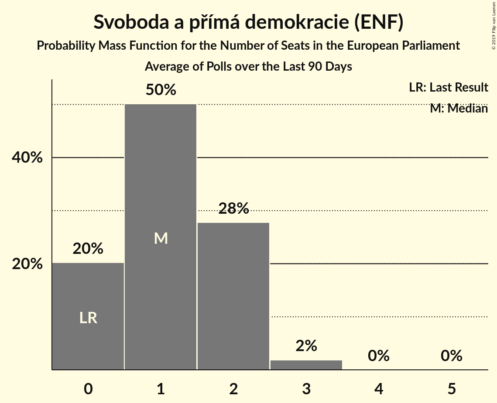

# Svoboda a přímá demokracie (ENF)

<a href="#voting-intentions">Voting Intentions</a> | <a href="#seats">Seats</a>

## Voting Intentions

Last result: **0.0%** (General Election of 24–25 May 2014)

### Confidence Intervals

| Period     | Polling firm/Commissioner(s) | Median | 80% Confidence Interval | 90% Confidence Interval | 95% Confidence Interval | 99% Confidence Interval |
|:----------:|:----------------:|:-----------:|:-----------------------:|:-----------------------:|:-----------------------:|:-----------------------:|
| N/A | [Poll Average](average.html) | 6.9% | 4.8–8.1% | 4.2–8.5% | 3.8–8.8% | 3.3–9.4% |
| [24 January–24 February 2019](2019-02-24-Median.html) | Median | 7.0% | 6.1–8.1% | 5.8–8.4% | 5.6–8.7% | 5.2–9.3% |
| [14–20 February 2019](2019-02-20-SANEP.html) | SANEP | 7.2% | 6.5–8.1% | 6.2–8.3% | 6.1–8.5% | 5.7–9.0% |
| [2–13 February 2019](2019-02-13-Centrumprovýzkumveřejnéhomínění.html) | Centrum pro výzkum veřejného mínění | 4.5% | 3.7–5.7% | 3.4–6.1% | 3.2–6.4% | 2.8–7.0% |
| [25 January–6 February 2019](2019-02-06-STEM.html) | STEM | 7.7% | 6.7–8.8% | 6.4–9.1% | 6.2–9.4% | 5.8–10.0% |
| [12 January–2 February 2019](2019-02-02-TNSKantar.html) | TNS Kantar   Česká televize | 7.0% | 6.1–8.0% | 5.9–8.3% | 5.7–8.6% | 5.3–9.1% |
| [10 December 2018–24 January 2019](2019-01-24-Median.html) | Median | 8.0% | 7.0–9.1% | 6.8–9.4% | 6.5–9.7% | 6.1–10.3% |
| [17–21 January 2019](2019-01-21-SANEP.html) | SANEP | 6.8% | 6.1–7.6% | 5.9–7.8% | 5.7–8.0% | 5.4–8.4% |
| [5–19 January 2019](2019-01-19-Centrumprovýzkumveřejnéhomínění.html) | Centrum pro výzkum veřejného mínění | 4.0% | 3.2–5.0% | 3.0–5.3% | 2.8–5.6% | 2.5–6.1% |
| [20–26 December 2018](2018-12-26-SANEP.html) | SANEP | 6.5% | 5.8–7.3% | 5.6–7.5% | 5.4–7.8% | 5.1–8.2% |
| [1–13 December 2018](2018-12-13-Centrumprovýzkumveřejnéhomínění.html) | Centrum pro výzkum veřejného mínění | 4.0% | 3.3–4.9% | 3.1–5.2% | 3.0–5.4% | 2.7–5.8% |
| [10 November–9 December 2018](2018-12-09-Median.html) | Median | 10.1% | 9.0–11.4% | 8.7–11.8% | 8.4–12.1% | 7.9–12.8% |
| [20 November–8 December 2018](2018-12-08-PhoenixResearch.html) | Phoenix Research | 6.3% | 5.4–7.4% | 5.2–7.7% | 5.0–8.0% | 4.6–8.5% |
| [19–30 November 2018](2018-11-30-STEM.html) | STEM | 6.9% | 5.9–8.0% | 5.7–8.3% | 5.5–8.6% | 5.1–9.1% |
| [22–28 November 2018](2018-11-28-SANEP.html) | SANEP | 7.2% | 6.5–8.0% | 6.3–8.3% | 6.1–8.5% | 5.8–8.9% |
| [3–25 November 2018](2018-11-25-TNSKantar.html) | TNS Kantar   Česká televize | 5.5% | 4.7–6.4% | 4.5–6.7% | 4.3–7.0% | 4.0–7.4% |
| [3–15 November 2018](2018-11-15-Centrumprovýzkumveřejnéhomínění.html) | Centrum pro výzkum veřejného mínění | 7.5% | 6.6–8.6% | 6.3–8.9% | 6.1–9.2% | 5.7–9.8% |
| [20 October–7 November 2018](2018-11-07-PhoenixResearch.html) | Phoenix Research | 7.8% | 6.8–8.9% | 6.5–9.3% | 6.3–9.6% | 5.8–10.2% |
| [6–26 October 2018](2018-10-26-TNSKantar.html) | TNS Kantar   Česká televize | 7.5% | 6.6–8.6% | 6.4–8.9% | 6.1–9.1% | 5.7–9.7% |
| [13–26 October 2018](2018-10-26-Centrumprovýzkumveřejnéhomínění.html) | Centrum pro výzkum veřejného mínění | 5.0% | 4.2–6.0% | 4.0–6.3% | 3.8–6.5% | 3.5–7.0% |
| [25 September–25 October 2018](2018-10-25-Median.html) | Median | 9.0% | 8.0–10.2% | 7.7–10.6% | 7.5–10.9% | 7.0–11.5% |
| [9–24 October 2018](2018-10-24-STEM.html) | STEM | 9.7% | 8.6–11.0% | 8.3–11.4% | 8.0–11.7% | 7.5–12.3% |
| [22 October 2018](2018-10-22-SANEP.html) | SANEP | 9.7% | 8.6–10.9% | 8.4–11.2% | 8.1–11.5% | 7.7–12.1% |
| [1–10 October 2018](2018-10-10-PhoenixResearch.html) | Phoenix Research   Blesk Zprávy | 7.2% | 6.2–8.3% | 6.0–8.6% | 5.7–8.9% | 5.3–9.4% |
| [1–21 September 2018](2018-09-21-TNSKantar.html) | TNS Kantar | 9.0% | 8.0–10.2% | 7.7–10.5% | 7.5–10.8% | 7.1–11.3% |
| [8–20 September 2018](2018-09-20-Centrumprovýzkumveřejnéhomínění.html) | Centrum pro výzkum veřejného mínění | 5.0% | 4.2–6.0% | 4.0–6.3% | 3.8–6.5% | 3.5–7.0% |
| [6–12 September 2018](2018-09-12-SANEP.html) | SANEP | 12.9% | 11.9–14.0% | 11.7–14.3% | 11.4–14.5% | 11.0–15.0% |
| [25 July–28 August 2018](2018-08-28-Median.html) | Median | 8.0% | 7.0–9.2% | 6.7–9.5% | 6.5–9.8% | 6.1–10.4% |
| [4–26 August 2018](2018-08-26-TNSKantar.html) | TNS Kantar | 8.0% | 7.1–9.1% | 6.8–9.4% | 6.6–9.7% | 6.2–10.2% |
| [9–15 August 2018](2018-08-15-SANEP.html) | SANEP | 12.7% | 11.7–13.8% | 11.4–14.1% | 11.2–14.4% | 10.7–14.9% |
| [27 June–23 July 2018](2018-07-23-Median.html) | Median | 8.5% | 7.6–9.6% | 7.3–9.9% | 7.1–10.2% | 6.6–10.7% |
| [16–29 June 2018](2018-06-29-Centrumprovýzkumveřejnéhomínění.html) | Centrum pro výzkum veřejného mínění | 6.5% | 5.6–7.6% | 5.4–7.9% | 5.2–8.2% | 4.8–8.7% |
| [13–27 June 2018](2018-06-27-STEM.html) | STEM | 8.6% | 7.6–9.9% | 7.3–10.2% | 7.1–10.5% | 6.6–11.2% |
| [25 May–26 June 2018](2018-06-26-Median.html) | Median | 8.5% | 7.5–9.7% | 7.3–10.0% | 7.0–10.3% | 6.6–10.9% |
| [18–24 June 2018](2018-06-24-PhoenixResearch.html) | Phoenix Research   Blesk Zprávy | 9.5% | 8.5–10.8% | 8.1–11.2% | 7.9–11.5% | 7.4–12.2% |
| [2–22 June 2018](2018-06-22-TNSKantar.html) | TNS Kantar   Česká televize | 9.4% | 8.4–10.6% | 8.1–10.9% | 7.9–11.2% | 7.4–11.8% |
| [7–13 June 2018](2018-06-13-SANEP.html) | SANEP | 12.4% | 11.6–13.3% | 11.3–13.6% | 11.1–13.8% | 10.7–14.2% |
| [12 May–1 June 2018](2018-06-01-TNSKantar.html) | TNS Kantar   Česká televize | 9.0% | 8.0–10.2% | 7.7–10.5% | 7.5–10.8% | 7.1–11.3% |
| [12–24 May 2018](2018-05-24-Centrumprovýzkumveřejnéhomínění.html) | Centrum pro výzkum veřejného mínění | 7.5% | 6.6–8.7% | 6.3–9.1% | 6.1–9.3% | 5.6–9.9% |
| [17–23 May 2018](2018-05-23-SANEP.html) | SANEP | 12.2% | 11.4–13.1% | 11.2–13.3% | 11.0–13.6% | 10.6–14.0% |
| [10 April–5 May 2018](2018-05-05-Median.html) | Median | 9.0% | 8.0–10.1% | 7.7–10.4% | 7.5–10.7% | 7.1–11.3% |
| [15 November 2017–3 May 2018](2018-05-03-Median.html) | Median | 9.4% | 8.9–9.9% | 8.8–10.1% | 8.7–10.2% | 8.5–10.4% |
| [19–29 April 2018](2018-04-29-STEM.html) | STEM | 9.0% | 7.9–10.2% | 7.7–10.6% | 7.4–10.9% | 6.9–11.5% |
| [7–27 April 2018](2018-04-27-TNSKantar.html) | TNS Kantar   Česká televize | 8.0% | 6.9–9.3% | 6.6–9.7% | 6.4–10.0% | 5.9–10.6% |
| [19–25 April 2018](2018-04-25-SANEP.html) | SANEP | 12.1% | 11.3–13.0% | 11.1–13.3% | 10.9–13.5% | 10.5–14.0% |
| [7–19 April 2018](2018-04-19-Centrumprovýzkumveřejnéhomínění.html) | Centrum pro výzkum veřejného mínění | 7.5% | 6.6–8.6% | 6.3–9.0% | 6.1–9.2% | 5.7–9.8% |
| [10–29 March 2018](2018-03-29-TNSKantar.html) | TNS Kantar   Česká televize | 7.6% | 6.5–8.9% | 6.2–9.2% | 6.0–9.5% | 5.5–10.2% |
| [22–28 March 2018](2018-03-28-SANEP.html) | SANEP | 11.7% | 10.9–12.6% | 10.7–12.8% | 10.5–13.0% | 10.1–13.4% |
| [3–15 March 2018](2018-03-15-Centrumprovýzkumveřejnéhomínění.html) | Centrum pro výzkum veřejného mínění | 6.5% | 5.6–7.6% | 5.4–7.9% | 5.2–8.2% | 4.8–8.7% |
| [3–23 February 2018](2018-02-23-TNSKantar.html) | TNS Kantar   Česká televize | 8.7% | 7.7–9.8% | 7.4–10.1% | 7.2–10.4% | 6.8–11.0% |
| [15–21 February 2018](2018-02-21-SANEP.html) | SANEP | 11.3% | 10.5–12.2% | 10.3–12.4% | 10.1–12.7% | 9.7–13.1% |
| [3–15 February 2018](2018-02-15-Centrumprovýzkumveřejnéhomínění.html) | Centrum pro výzkum veřejného mínění | 6.5% | 5.5–7.8% | 5.3–8.1% | 5.0–8.4% | 4.6–9.1% |
| [1–8 February 2018](2018-02-08-STEM.html) | STEM | 9.5% | 8.4–10.8% | 8.1–11.2% | 7.9–11.5% | 7.4–12.1% |
| [15–24 January 2018](2018-01-24-Centrumprovýzkumveřejnéhomínění.html) | Centrum pro výzkum veřejného mínění | 7.5% | 6.5–8.6% | 6.3–8.9% | 6.1–9.2% | 5.6–9.8% |
| [2–17 December 2017](2017-12-17-Centrumprovýzkumveřejnéhomínění.html) | Centrum pro výzkum veřejného mínění | 6.4% | 5.4–7.8% | 5.1–8.2% | 4.9–8.5% | 4.4–9.2% |
| [1–11 December 2017](2017-12-11-STEM.html) | STEM | 8.7% | 7.6–9.9% | 7.3–10.2% | 7.1–10.5% | 6.6–11.2% |
| [4–24 November 2017](2017-11-24-TNSKantar.html) | TNS Kantar   Česká televize | 9.5% | 8.5–10.7% | 8.2–11.0% | 8.0–11.3% | 7.5–11.9% |

### Probability Mass Function

The following table shows the probability mass function per percentage block of voting intentions for the [poll average](average.html) for Svoboda a přímá demokracie (ENF).

| Voting Intentions | Probability | Accumulated | Special Marks |
|:-----------------:|:-----------:|:-----------:|:-------------:|
| 0.0–0.5% | 0% | 100% | Last Result |
| 0.5–1.5% | 0% | 100% |  |
| 1.5–2.5% | 0% | 100% |  |
| 2.5–3.5% | 1.2% | 100% |  |
| 3.5–4.5% | 7% | 98.8% |  |
| 4.5–5.5% | 9% | 92% |  |
| 5.5–6.5% | 21% | 83% |  |
| 6.5–7.5% | 37% | 62% | Median |
| 7.5–8.5% | 21% | 25% |  |
| 8.5–9.5% | 4% | 4% |  |
| 9.5–10.5% | 0.3% | 0.3% |  |
| 10.5–11.5% | 0% | 0% |  |

## Seats

Last result: **0** seats (General Election of 24–25 May 2014)

### Confidence Intervals

| Period     | Polling firm/Commissioner(s) | Median | 80% Confidence Interval | 90% Confidence Interval | 95% Confidence Interval | 99% Confidence Interval |
|:----------:|:----------------:|:------:|:-----------------------:|:-----------------------:|:-----------------------:|:-----------------------:|
| N/A | [Poll Average](average.html) | 1 | 0–2 | 0–2 | 0–2 | 0–2 |
| [24 January–24 February 2019](2019-02-24-Median.html) | Median | 1 | 1–2 | 1–2 | 1–2 | 1–2 |
| [14–20 February 2019](2019-02-20-SANEP.html) | SANEP | 1 | 1–2 | 1–2 | 1–2 | 1–2 |
| [2–13 February 2019](2019-02-13-Centrumprovýzkumveřejnéhomínění.html) | Centrum pro výzkum veřejného mínění | 0 | 0–1 | 0–1 | 0–1 | 0–1 |
| [25 January–6 February 2019](2019-02-06-STEM.html) | STEM | 1 | 1–2 | 1–2 | 1–2 | 1–2 |
| [12 January–2 February 2019](2019-02-02-TNSKantar.html) | TNS Kantar   Česká televize | 1 | 1–2 | 1–2 | 1–2 | 1–2 |
| [10 December 2018–24 January 2019](2019-01-24-Median.html) | Median | 2 | 1–2 | 1–2 | 1–2 | 1–2 |
| [17–21 January 2019](2019-01-21-SANEP.html) | SANEP | 1 | 1 | 1–2 | 1–2 | 1–2 |
| [5–19 January 2019](2019-01-19-Centrumprovýzkumveřejnéhomínění.html) | Centrum pro výzkum veřejného mínění | 0 | 0 | 0–1 | 0–1 | 0–1 |
| [20–26 December 2018](2018-12-26-SANEP.html) | SANEP | 1 | 1–2 | 1–2 | 1–2 | 1–2 |
| [1–13 December 2018](2018-12-13-Centrumprovýzkumveřejnéhomínění.html) | Centrum pro výzkum veřejného mínění | 0 | 0 | 0 | 0–1 | 0–1 |
| [10 November–9 December 2018](2018-12-09-Median.html) | Median | 2 | 2–3 | 2–3 | 2–3 | 2–3 |
| [20 November–8 December 2018](2018-12-08-PhoenixResearch.html) | Phoenix Research | 1 | 1 | 1–2 | 1–2 | 0–2 |
| [19–30 November 2018](2018-11-30-STEM.html) | STEM | 1 | 1–2 | 1–2 | 1–2 | 1–2 |
| [22–28 November 2018](2018-11-28-SANEP.html) | SANEP | 2 | 1–2 | 1–2 | 1–2 | 1–2 |
| [3–25 November 2018](2018-11-25-TNSKantar.html) | TNS Kantar   Česká televize | 1 | 0–1 | 0–1 | 0–1 | 0–2 |
| [3–15 November 2018](2018-11-15-Centrumprovýzkumveřejnéhomínění.html) | Centrum pro výzkum veřejného mínění | 2 | 1–2 | 1–2 | 1–2 | 1–2 |
| [20 October–7 November 2018](2018-11-07-PhoenixResearch.html) | Phoenix Research | 2 | 1–2 | 1–2 | 1–2 | 1–2 |
| [6–26 October 2018](2018-10-26-TNSKantar.html) | TNS Kantar   Česká televize | 2 | 1–2 | 1–2 | 1–2 | 1–2 |
| [13–26 October 2018](2018-10-26-Centrumprovýzkumveřejnéhomínění.html) | Centrum pro výzkum veřejného mínění | 1 | 0–1 | 0–1 | 0–1 | 0–1 |
| [25 September–25 October 2018](2018-10-25-Median.html) | Median | 2 | 2 | 2 | 2–3 | 1–3 |
| [9–24 October 2018](2018-10-24-STEM.html) | STEM | 2 | 2–3 | 2–3 | 2–3 | 1–3 |
| [22 October 2018](2018-10-22-SANEP.html) | SANEP | 2 | 2 | 2–3 | 2–3 | 2–3 |
| [1–10 October 2018](2018-10-10-PhoenixResearch.html) | Phoenix Research   Blesk Zprávy | 2 | 1–2 | 1–2 | 1–2 | 1–2 |
| [1–21 September 2018](2018-09-21-TNSKantar.html) | TNS Kantar | 2 | 2 | 2–3 | 2–3 | 2–3 |
| [8–20 September 2018](2018-09-20-Centrumprovýzkumveřejnéhomínění.html) | Centrum pro výzkum veřejného mínění | 1 | 0–1 | 0–1 | 0–1 | 0–2 |
| [6–12 September 2018](2018-09-12-SANEP.html) | SANEP | 3 | 3 | 3 | 3–4 | 2–4 |
| [25 July–28 August 2018](2018-08-28-Median.html) | Median | 2 | 1–2 | 1–2 | 1–2 | 1–2 |
| [4–26 August 2018](2018-08-26-TNSKantar.html) | TNS Kantar | 2 | 1–2 | 1–2 | 1–2 | 1–2 |
| [9–15 August 2018](2018-08-15-SANEP.html) | SANEP | 3 | 3 | 3 | 3–4 | 2–4 |
| [27 June–23 July 2018](2018-07-23-Median.html) | Median | 2 | 2 | 1–2 | 1–2 | 1–2 |
| [16–29 June 2018](2018-06-29-Centrumprovýzkumveřejnéhomínění.html) | Centrum pro výzkum veřejného mínění | 1 | 1–2 | 1–2 | 1–2 | 0–2 |
| [13–27 June 2018](2018-06-27-STEM.html) | STEM | 2 | 2 | 2 | 1–2 | 1–2 |
| [25 May–26 June 2018](2018-06-26-Median.html) | Median | 2 | 2 | 1–2 | 1–2 | 1–3 |
| [18–24 June 2018](2018-06-24-PhoenixResearch.html) | Phoenix Research   Blesk Zprávy | 2 | 2–3 | 2–3 | 2–3 | 2–3 |
| [2–22 June 2018](2018-06-22-TNSKantar.html) | TNS Kantar   Česká televize | 2 | 2–3 | 2–3 | 2–3 | 2–3 |
| [7–13 June 2018](2018-06-13-SANEP.html) | SANEP | 3 | 3 | 3 | 3 | 2–4 |
| [12 May–1 June 2018](2018-06-01-TNSKantar.html) | TNS Kantar   Česká televize | 2 | 2 | 2 | 2–3 | 1–3 |
| [12–24 May 2018](2018-05-24-Centrumprovýzkumveřejnéhomínění.html) | Centrum pro výzkum veřejného mínění | 1 | 1–2 | 1–2 | 1–2 | 1–2 |
| [17–23 May 2018](2018-05-23-SANEP.html) | SANEP | 3 | 3 | 3 | 3 | 2–4 |
| [10 April–5 May 2018](2018-05-05-Median.html) | Median | 2 | 2 | 2 | 2 | 1–3 |
| [15 November 2017–3 May 2018](2018-05-03-Median.html) | Median | 2 | 2 | 2 | 2 | 2 |
| [19–29 April 2018](2018-04-29-STEM.html) | STEM | 2 | 2 | 2–3 | 1–3 | 1–3 |
| [7–27 April 2018](2018-04-27-TNSKantar.html) | TNS Kantar   Česká televize | 2 | 1–2 | 1–2 | 1–2 | 1–2 |
| [19–25 April 2018](2018-04-25-SANEP.html) | SANEP | 3 | 3 | 3 | 3 | 2–4 |
| [7–19 April 2018](2018-04-19-Centrumprovýzkumveřejnéhomínění.html) | Centrum pro výzkum veřejného mínění | 2 | 1–2 | 1–2 | 1–2 | 1–2 |
| [10–29 March 2018](2018-03-29-TNSKantar.html) | TNS Kantar   Česká televize | 2 | 1–2 | 1–2 | 1–2 | 1–2 |
| [22–28 March 2018](2018-03-28-SANEP.html) | SANEP | 3 | 2–3 | 2–3 | 2–3 | 2–3 |
| [3–15 March 2018](2018-03-15-Centrumprovýzkumveřejnéhomínění.html) | Centrum pro výzkum veřejného mínění | 1 | 1 | 1–2 | 1–2 | 1–2 |
| [3–23 February 2018](2018-02-23-TNSKantar.html) | TNS Kantar   Česká televize | 2 | 2 | 2 | 1–2 | 1–3 |
| [15–21 February 2018](2018-02-21-SANEP.html) | SANEP | 3 | 2–3 | 2–3 | 2–3 | 2–3 |
| [3–15 February 2018](2018-02-15-Centrumprovýzkumveřejnéhomínění.html) | Centrum pro výzkum veřejného mínění | 1 | 1–2 | 1–2 | 1–2 | 0–2 |
| [1–8 February 2018](2018-02-08-STEM.html) | STEM | 2 | 2 | 2–3 | 2–3 | 2–3 |
| [15–24 January 2018](2018-01-24-Centrumprovýzkumveřejnéhomínění.html) | Centrum pro výzkum veřejného mínění | 2 | 1–2 | 1–2 | 1–2 | 1–2 |
| [2–17 December 2017](2017-12-17-Centrumprovýzkumveřejnéhomínění.html) | Centrum pro výzkum veřejného mínění | 1 | 1–2 | 1–2 | 0–2 | 0–2 |
| [1–11 December 2017](2017-12-11-STEM.html) | STEM | 2 | 2 | 2 | 2–3 | 1–3 |
| [4–24 November 2017](2017-11-24-TNSKantar.html) | TNS Kantar   Česká televize | 2 | 2–3 | 2–3 | 2–3 | 2–3 |

### Probability Mass Function

The following table shows the probability mass function per seat for the [poll average](average.html) for Svoboda a přímá demokracie (ENF).

| Number of Seats | Probability | Accumulated | Special Marks |
|:---------------:|:-----------:|:-----------:|:-------------:|
| 0 | 13% | 100% | Last Result |
| 1 | 65% | 87% | Median |
| 2 | 22% | 22% |  |
| 3 | 0% | 0% |  |

