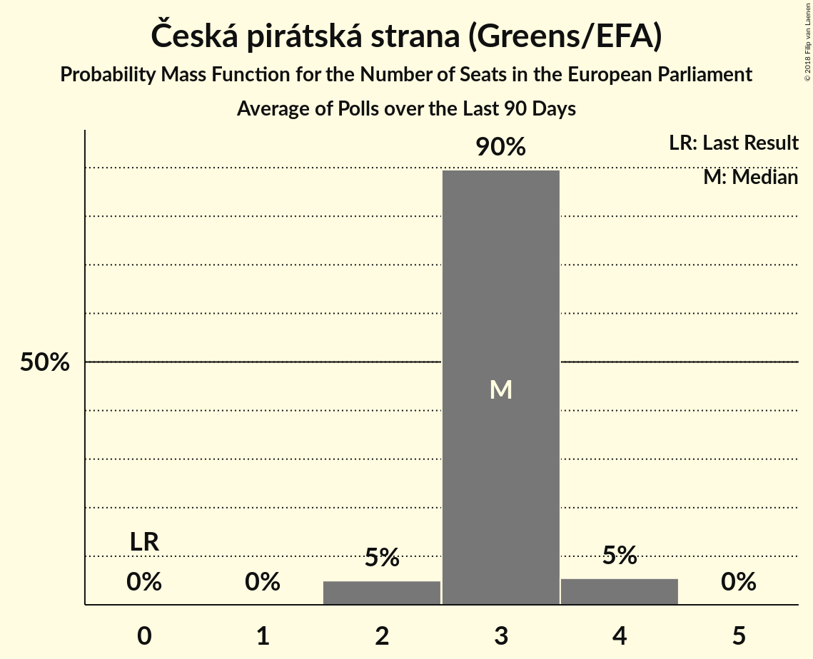

# Česká pirátská strana (Greens/EFA)

<a href="#voting-intentions">Voting Intentions</a> | <a href="#seats">Seats</a>

## Voting Intentions

Last result: **4.8%** (General Election of 24–25 May 2014)

### Confidence Intervals

| Period     | Polling firm/Commissioner(s) | Median | 80% Confidence Interval | 90% Confidence Interval | 95% Confidence Interval | 99% Confidence Interval |
|:----------:|:----------------:|:-----------:|:-----------------------:|:-----------------------:|:-----------------------:|:-----------------------:|
| N/A | [Poll Average](average.html) | 12.8% | 11.5–14.3% | 11.2–14.8% | 11.0–15.2% | 10.5–16.0% |
| [3–23 February 2018](2018-02-23-TNSKantar.html) | TNS Kantar   Česká televize | 12.8% | 11.6–14.1% | 11.2–14.4% | 11.0–14.8% | 10.4–15.4% |
| [15–21 February 2018](2018-02-21-SANEP.html) | SANEP | 12.1% | 11.3–13.0% | 11.0–13.3% | 10.8–13.5% | 10.5–13.9% |
| [3–15 February 2018](2018-02-15-Centrumprovýzkumveřejnéhomínění.html) | Centrum pro výzkum veřejného mínění | 13.1% | 11.6–14.7% | 11.2–15.2% | 10.9–15.6% | 10.3–16.4% |
| [1–8 February 2018](2018-02-08-STEM.html) | STEM | 13.3% | 12.0–14.8% | 11.7–15.2% | 11.4–15.5% | 10.8–16.3% |
| [15–24 January 2018](2018-01-24-Centrumprovýzkumveřejnéhomínění.html) | Centrum pro výzkum veřejného mínění | 12.5% | 11.3–13.9% | 11.0–14.3% | 10.7–14.7% | 10.1–15.4% |
| [2–17 December 2017](2017-12-17-Centrumprovýzkumveřejnéhomínění.html) | Centrum pro výzkum veřejného mínění | 11.5% | 10.1–13.1% | 9.7–13.6% | 9.3–14.0% | 8.7–14.9% |
| [1–11 December 2017](2017-12-11-STEM.html) | STEM | 12.2% | 10.9–13.6% | 10.6–14.0% | 10.3–14.3% | 9.8–15.0% |
| [4–24 November 2017](2017-11-24-TNSKantar.html) | TNS Kantar   Česká televize | 14.0% | 12.8–15.4% | 12.4–15.7% | 12.1–16.1% | 11.6–16.8% |

### Probability Mass Function

The following table shows the probability mass function per percentage block of voting intentions for the [poll average](average.html) for Česká pirátská strana (Greens/EFA).

| Voting Intentions | Probability | Accumulated | Special Marks |
|:-----------------:|:-----------:|:-----------:|:-------------:|
| 4.5–5.5% | 0% | 100% | Last Result |
| 5.5–6.5% | 0% | 100% |  |
| 6.5–7.5% | 0% | 100% |  |
| 7.5–8.5% | 0% | 100% |  |
| 8.5–9.5% | 0% | 100% |  |
| 9.5–10.5% | 0.7% | 100% |  |
| 10.5–11.5% | 10% | 99.3% |  |
| 11.5–12.5% | 31% | 90% |  |
| 12.5–13.5% | 33% | 59% | Median |
| 13.5–14.5% | 18% | 26% |  |
| 14.5–15.5% | 6% | 7% |  |
| 15.5–16.5% | 1.2% | 1.3% |  |
| 16.5–17.5% | 0.1% | 0.1% |  |
| 17.5–18.5% | 0% | 0% |  |

## Seats

Last result: **0** seats (General Election of 24–25 May 2014)

### Confidence Intervals

| Period     | Polling firm/Commissioner(s) | Median | 80% Confidence Interval | 90% Confidence Interval | 95% Confidence Interval | 99% Confidence Interval |
|:----------:|:----------------:|:------:|:-----------------------:|:-----------------------:|:-----------------------:|:-----------------------:|
| N/A | [Poll Average](average.html) | 3 | 3–4 | 3–4 | 2–4 | 2–4 |
| [3–23 February 2018](2018-02-23-TNSKantar.html) | TNS Kantar   Česká televize | 3 | 3 | 3–4 | 2–4 | 2–4 |
| [15–21 February 2018](2018-02-21-SANEP.html) | SANEP | 3 | 2–3 | 2–3 | 2–3 | 2–3 |
| [3–15 February 2018](2018-02-15-Centrumprovýzkumveřejnéhomínění.html) | Centrum pro výzkum veřejného mínění | 3 | 3–4 | 3–4 | 3–4 | 2–4 |
| [1–8 February 2018](2018-02-08-STEM.html) | STEM | 3 | 3–4 | 3–4 | 3–4 | 2–4 |
| [15–24 January 2018](2018-01-24-Centrumprovýzkumveřejnéhomínění.html) | Centrum pro výzkum veřejného mínění | 3 | 3 | 3 | 2–4 | 2–4 |
| [2–17 December 2017](2017-12-17-Centrumprovýzkumveřejnéhomínění.html) | Centrum pro výzkum veřejného mínění | 3 | 2–3 | 2–3 | 2–3 | 2–4 |
| [1–11 December 2017](2017-12-11-STEM.html) | STEM | 3 | 3 | 2–3 | 2–4 | 2–4 |
| [4–24 November 2017](2017-11-24-TNSKantar.html) | TNS Kantar   Česká televize | 3 | 3–4 | 3–4 | 3–4 | 3–4 |

### Probability Mass Function

The following table shows the probability mass function per seat for the [poll average](average.html) for Česká pirátská strana (Greens/EFA).

| Number of Seats | Probability | Accumulated | Special Marks |
|:---------------:|:-----------:|:-----------:|:-------------:|
| 0 | 0% | 100% | Last Result |
| 1 | 0% | 100% |  |
| 2 | 5% | 100% |  |
| 3 | 84% | 95% | Median |
| 4 | 11% | 11% |  |
| 5 | 0% | 0% |  |

