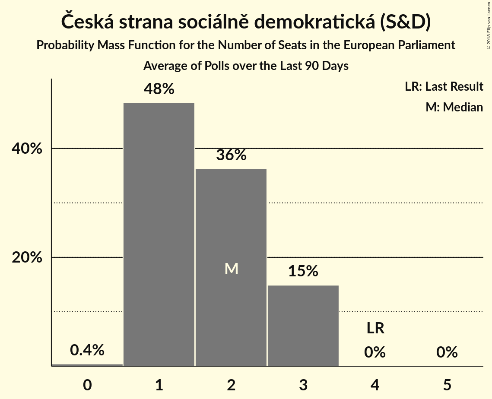

# Česká strana sociálně demokratická (S&D)

<a href="#voting-intentions">Voting Intentions</a> | <a href="#seats">Seats</a>

## Voting Intentions

Last result: **14.2%** (General Election of 24–25 May 2014)

### Confidence Intervals

| Period     | Polling firm/Commissioner(s) | Median | 80% Confidence Interval | 90% Confidence Interval | 95% Confidence Interval | 99% Confidence Interval |
|:----------:|:----------------:|:-----------:|:-----------------------:|:-----------------------:|:-----------------------:|:-----------------------:|
| N/A | [Poll Average](average.html) | 7.2% | 5.2–12.6% | 4.9–13.2% | 4.7–13.7% | 4.2–14.6% |
| [3–15 February 2018](2018-02-15-Centrumprovýzkumveřejnéhomínění.html) | Centrum pro výzkum veřejného mínění | 11.9% | 10.6–13.5% | 10.2–14.0% | 9.9–14.4% | 9.3–15.2% |
| [1–8 February 2018](2018-02-08-STEM.html) | STEM | 7.1% | 6.2–8.2% | 5.9–8.6% | 5.7–8.8% | 5.3–9.4% |
| [15–24 January 2018](2018-01-24-Centrumprovýzkumveřejnéhomínění.html) | Centrum pro výzkum veřejného mínění | 12.5% | 11.3–13.9% | 11.0–14.3% | 10.7–14.7% | 10.1–15.4% |
| [2–17 December 2017](2017-12-17-Centrumprovýzkumveřejnéhomínění.html) | Centrum pro výzkum veřejného mínění | 10.1% | 8.7–11.7% | 8.4–12.1% | 8.1–12.5% | 7.5–13.3% |
| [1–11 December 2017](2017-12-11-STEM.html) | STEM | 8.0% | 7.0–9.2% | 6.7–9.5% | 6.5–9.8% | 6.0–10.4% |
| [4–24 November 2017](2017-11-24-TNSKantar.html) | TNS Kantar   Česká televize | 5.5% | 4.7–6.4% | 4.5–6.7% | 4.3–7.0% | 4.0–7.4% |

### Probability Mass Function

The following table shows the probability mass function per percentage block of voting intentions for the [poll average](average.html) for Česká strana sociálně demokratická (S&D).

| Voting Intentions | Probability | Accumulated | Special Marks |
|:-----------------:|:-----------:|:-----------:|:-------------:|
| 2.5–3.5% | 0% | 100% |  |
| 3.5–4.5% | 2% | 100% |  |
| 4.5–5.5% | 15% | 98% |  |
| 5.5–6.5% | 21% | 83% |  |
| 6.5–7.5% | 18% | 62% | Median |
| 7.5–8.5% | 9% | 44% |  |
| 8.5–9.5% | 2% | 35% |  |
| 9.5–10.5% | 3% | 33% |  |
| 10.5–11.5% | 8% | 30% |  |
| 11.5–12.5% | 11% | 22% |  |
| 12.5–13.5% | 8% | 11% |  |
| 13.5–14.5% | 3% | 3% | Last Result |
| 14.5–15.5% | 0.5% | 0.6% |  |
| 15.5–16.5% | 0.1% | 0.1% |  |
| 16.5–17.5% | 0% | 0% |  |

## Seats

Last result: **4** seats (General Election of 24–25 May 2014)

### Confidence Intervals

| Period     | Polling firm/Commissioner(s) | Median | 80% Confidence Interval | 90% Confidence Interval | 95% Confidence Interval | 99% Confidence Interval |
|:----------:|:----------------:|:------:|:-----------------------:|:-----------------------:|:-----------------------:|:-----------------------:|
| N/A | [Poll Average](average.html) | 2 | 1–3 | 0–3 | 0–3 | 0–4 |
| [3–15 February 2018](2018-02-15-Centrumprovýzkumveřejnéhomínění.html) | Centrum pro výzkum veřejného mínění | 3 | 2–3 | 2–3 | 2–4 | 2–4 |
| [1–8 February 2018](2018-02-08-STEM.html) | STEM | 2 | 1–2 | 1–2 | 1–2 | 1–2 |
| [15–24 January 2018](2018-01-24-Centrumprovýzkumveřejnéhomínění.html) | Centrum pro výzkum veřejného mínění | 3 | 3 | 3 | 2–4 | 2–4 |
| [2–17 December 2017](2017-12-17-Centrumprovýzkumveřejnéhomínění.html) | Centrum pro výzkum veřejného mínění | 2 | 2–3 | 2–3 | 2–3 | 2–3 |
| [1–11 December 2017](2017-12-11-STEM.html) | STEM | 2 | 1–2 | 1–2 | 1–2 | 1–2 |
| [4–24 November 2017](2017-11-24-TNSKantar.html) | TNS Kantar   Česká televize | 1 | 0–1 | 0–1 | 0–1 | 0–2 |

### Probability Mass Function

The following table shows the probability mass function per seat for the [poll average](average.html) for Česká strana sociálně demokratická (S&D).

| Number of Seats | Probability | Accumulated | Special Marks |
|:---------------:|:-----------:|:-----------:|:-------------:|
| 0 | 5% | 100% |  |
| 1 | 40% | 95% |  |
| 2 | 28% | 55% | Median |
| 3 | 26% | 27% |  |
| 4 | 1.1% | 1.1% | Last Result |
| 5 | 0% | 0% |  |

