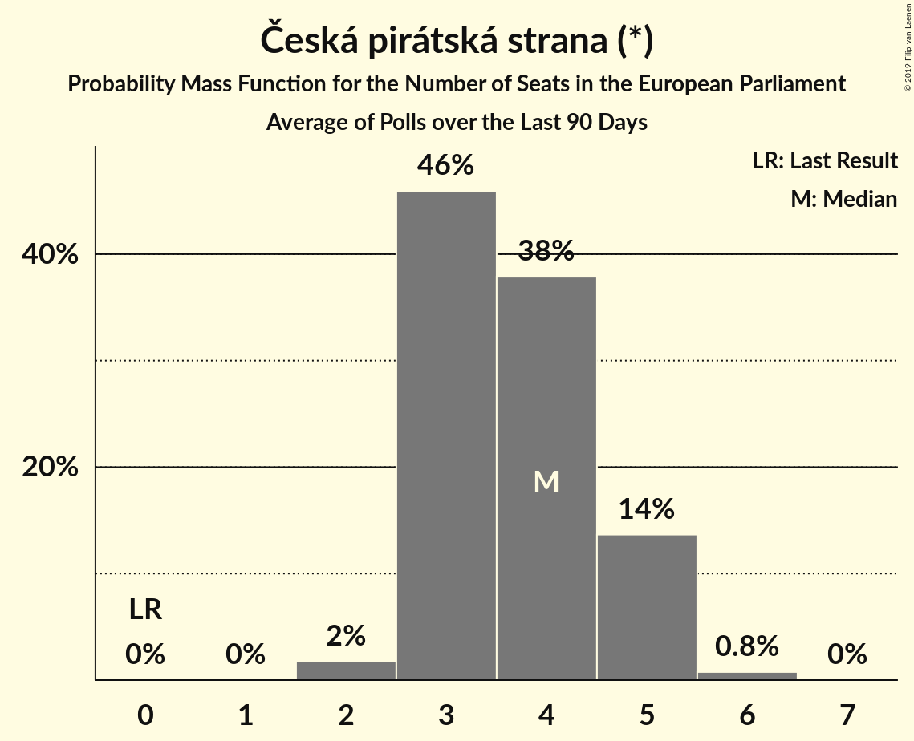

# Česká pirátská strana (*)

<a href="#voting-intentions">Voting Intentions</a> | <a href="#seats">Seats</a>

## Voting Intentions

Last result: **4.8%** (General Election of 24–25 May 2014)

### Confidence Intervals

| Period     | Polling firm/Commissioner(s) | Median | 80% Confidence Interval | 90% Confidence Interval | 95% Confidence Interval | 99% Confidence Interval |
|:----------:|:----------------:|:-----------:|:-----------------------:|:-----------------------:|:-----------------------:|:-----------------------:|
| N/A | [Poll Average](average.html) | 14.4% | 12.4–18.8% | 12.0–19.6% | 11.6–20.2% | 11.0–21.2% |
| [20–26 December 2018](2018-12-26-SANEP.html) | SANEP | 16.1% | 15.0–17.3% | 14.7–17.6% | 14.4–17.9% | 13.9–18.5% |
| [1–13 December 2018](2018-12-13-Centrumprovýzkumveřejnéhomínění.html) | Centrum pro výzkum veřejného mínění | 14.0% | 12.7–15.5% | 12.3–15.9% | 12.0–16.2% | 11.4–17.0% |
| [10 November–9 December 2018](2018-12-09-Median.html) | Median | 13.2% | 11.9–14.6% | 11.6–15.0% | 11.2–15.3% | 10.7–16.0% |
| [20 November–8 December 2018](2018-12-08-PhoenixResearch.html) | Phoenix Research | 14.1% | 12.8–15.6% | 12.5–16.1% | 12.1–16.4% | 11.5–17.2% |
| [19–30 November 2018](2018-11-30-STEM.html) | STEM | 13.1% | 11.8–14.5% | 11.4–14.9% | 11.1–15.3% | 10.6–16.0% |
| [22–28 November 2018](2018-11-28-SANEP.html) | SANEP | 15.5% | 14.5–16.6% | 14.2–16.9% | 13.9–17.2% | 13.4–17.8% |
| [3–25 November 2018](2018-11-25-TNSKantar.html) | TNS Kantar   Česká televize | 19.0% | 17.6–20.5% | 17.2–21.0% | 16.9–21.3% | 16.2–22.1% |
| [3–15 November 2018](2018-11-15-Centrumprovýzkumveřejnéhomínění.html) | Centrum pro výzkum veřejného mínění | 14.0% | 12.8–15.5% | 12.4–15.9% | 12.1–16.2% | 11.5–16.9% |
| [20 October–7 November 2018](2018-11-07-PhoenixResearch.html) | Phoenix Research | 13.2% | 11.9–14.6% | 11.5–15.0% | 11.2–15.4% | 10.6–16.1% |
| [6–26 October 2018](2018-10-26-TNSKantar.html) | TNS Kantar   Česká televize | 16.0% | 14.7–17.4% | 14.3–17.8% | 14.0–18.2% | 13.4–18.9% |
| [13–26 October 2018](2018-10-26-Centrumprovýzkumveřejnéhomínění.html) | Centrum pro výzkum veřejného mínění | 11.1% | 9.9–12.5% | 9.6–12.8% | 9.3–13.2% | 8.7–13.9% |
| [25 September–25 October 2018](2018-10-25-Median.html) | Median | 12.0% | 10.9–13.4% | 10.5–13.8% | 10.2–14.1% | 9.7–14.8% |
| [9–24 October 2018](2018-10-24-STEM.html) | STEM | 12.7% | 11.4–14.1% | 11.1–14.5% | 10.7–14.9% | 10.2–15.6% |
| [22 October 2018](2018-10-22-SANEP.html) | SANEP | 14.7% | 13.4–16.0% | 13.1–16.4% | 12.8–16.8% | 12.2–17.5% |
| [1–10 October 2018](2018-10-10-PhoenixResearch.html) | Phoenix Research   Blesk Zprávy | 13.8% | 12.6–15.3% | 12.2–15.7% | 11.9–16.1% | 11.3–16.8% |
| [1–21 September 2018](2018-09-21-TNSKantar.html) | TNS Kantar | 15.5% | 14.2–16.9% | 13.9–17.3% | 13.6–17.7% | 13.0–18.4% |
| [8–20 September 2018](2018-09-20-Centrumprovýzkumveřejnéhomínění.html) | Centrum pro výzkum veřejného mínění | 13.0% | 11.8–14.4% | 11.4–14.9% | 11.1–15.2% | 10.5–15.9% |
| [6–12 September 2018](2018-09-12-SANEP.html) | SANEP | 14.2% | 13.2–15.3% | 12.9–15.6% | 12.6–15.8% | 12.2–16.4% |
| [25 July–28 August 2018](2018-08-28-Median.html) | Median | 10.4% | 9.3–11.8% | 9.0–12.1% | 8.7–12.5% | 8.2–13.1% |
| [4–26 August 2018](2018-08-26-TNSKantar.html) | TNS Kantar | 15.0% | 13.7–16.4% | 13.4–16.8% | 13.1–17.1% | 12.5–17.8% |
| [9–15 August 2018](2018-08-15-SANEP.html) | SANEP | 13.1% | 12.1–14.2% | 11.8–14.5% | 11.6–14.8% | 11.1–15.3% |
| [27 June–23 July 2018](2018-07-23-Median.html) | Median | 11.5% | 10.4–12.7% | 10.1–13.1% | 9.8–13.4% | 9.3–14.0% |
| [16–29 June 2018](2018-06-29-Centrumprovýzkumveřejnéhomínění.html) | Centrum pro výzkum veřejného mínění | 10.0% | 8.9–11.3% | 8.6–11.7% | 8.4–12.0% | 7.8–12.7% |
| [13–27 June 2018](2018-06-27-STEM.html) | STEM | 10.2% | 9.1–11.6% | 8.8–11.9% | 8.5–12.3% | 8.0–12.9% |
| [25 May–26 June 2018](2018-06-26-Median.html) | Median | 11.5% | 10.3–12.8% | 10.0–13.2% | 9.8–13.5% | 9.2–14.1% |
| [18–24 June 2018](2018-06-24-PhoenixResearch.html) | Phoenix Research   Blesk Zprávy | 13.5% | 12.2–15.0% | 11.8–15.4% | 11.5–15.7% | 10.9–16.5% |
| [2–22 June 2018](2018-06-22-TNSKantar.html) | TNS Kantar   Česká televize | 12.4% | 11.3–13.7% | 10.9–14.1% | 10.7–14.4% | 10.1–15.1% |
| [7–13 June 2018](2018-06-13-SANEP.html) | SANEP | 14.2% | 13.3–15.2% | 13.1–15.4% | 12.9–15.7% | 12.4–16.1% |
| [12 May–1 June 2018](2018-06-01-TNSKantar.html) | TNS Kantar   Česká televize | 14.5% | 13.3–15.9% | 12.9–16.3% | 12.6–16.6% | 12.0–17.3% |
| [12–24 May 2018](2018-05-24-Centrumprovýzkumveřejnéhomínění.html) | Centrum pro výzkum veřejného mínění | 11.0% | 9.8–12.4% | 9.5–12.8% | 9.2–13.1% | 8.7–13.8% |
| [17–23 May 2018](2018-05-23-SANEP.html) | SANEP | 13.9% | 13.0–14.8% | 12.8–15.1% | 12.6–15.3% | 12.2–15.8% |
| [10 April–5 May 2018](2018-05-05-Median.html) | Median | 11.5% | 10.4–12.8% | 10.1–13.1% | 9.8–13.4% | 9.3–14.1% |
| [15 November 2017–3 May 2018](2018-05-03-Median.html) | Median | 11.9% | 11.4–12.5% | 11.2–12.6% | 11.1–12.7% | 10.8–13.0% |
| [19–29 April 2018](2018-04-29-STEM.html) | STEM | 13.5% | 12.2–14.9% | 11.8–15.3% | 11.5–15.7% | 11.0–16.4% |
| [7–27 April 2018](2018-04-27-TNSKantar.html) | TNS Kantar   Česká televize | 14.5% | 13.1–16.2% | 12.7–16.6% | 12.4–17.0% | 11.7–17.8% |
| [19–25 April 2018](2018-04-25-SANEP.html) | SANEP | 13.2% | 12.3–14.1% | 12.1–14.4% | 11.9–14.6% | 11.5–15.1% |
| [7–19 April 2018](2018-04-19-Centrumprovýzkumveřejnéhomínění.html) | Centrum pro výzkum veřejného mínění | 12.5% | 11.3–13.8% | 10.9–14.2% | 10.7–14.5% | 10.1–15.2% |
| [10–29 March 2018](2018-03-29-TNSKantar.html) | TNS Kantar   Česká televize | 13.5% | 12.1–15.1% | 11.7–15.5% | 11.3–15.9% | 10.7–16.7% |
| [22–28 March 2018](2018-03-28-SANEP.html) | SANEP | 12.8% | 12.0–13.7% | 11.8–14.0% | 11.6–14.2% | 11.2–14.6% |
| [3–15 March 2018](2018-03-15-Centrumprovýzkumveřejnéhomínění.html) | Centrum pro výzkum veřejného mínění | 12.5% | 11.3–13.9% | 11.0–14.3% | 10.7–14.7% | 10.1–15.4% |
| [3–23 February 2018](2018-02-23-TNSKantar.html) | TNS Kantar   Česká televize | 12.8% | 11.6–14.1% | 11.2–14.4% | 11.0–14.8% | 10.4–15.4% |
| [15–21 February 2018](2018-02-21-SANEP.html) | SANEP | 12.1% | 11.3–13.0% | 11.0–13.3% | 10.8–13.5% | 10.5–13.9% |
| [3–15 February 2018](2018-02-15-Centrumprovýzkumveřejnéhomínění.html) | Centrum pro výzkum veřejného mínění | 13.1% | 11.6–14.7% | 11.2–15.2% | 10.9–15.6% | 10.3–16.4% |
| [1–8 February 2018](2018-02-08-STEM.html) | STEM | 13.3% | 12.0–14.8% | 11.7–15.2% | 11.4–15.5% | 10.8–16.3% |
| [15–24 January 2018](2018-01-24-Centrumprovýzkumveřejnéhomínění.html) | Centrum pro výzkum veřejného mínění | 12.5% | 11.3–13.9% | 11.0–14.3% | 10.7–14.7% | 10.1–15.4% |
| [2–17 December 2017](2017-12-17-Centrumprovýzkumveřejnéhomínění.html) | Centrum pro výzkum veřejného mínění | 11.5% | 10.1–13.1% | 9.7–13.6% | 9.3–14.0% | 8.7–14.9% |
| [1–11 December 2017](2017-12-11-STEM.html) | STEM | 12.2% | 10.9–13.6% | 10.6–14.0% | 10.3–14.3% | 9.8–15.0% |
| [4–24 November 2017](2017-11-24-TNSKantar.html) | TNS Kantar   Česká televize | 14.0% | 12.8–15.4% | 12.4–15.7% | 12.1–16.1% | 11.6–16.8% |

### Probability Mass Function

The following table shows the probability mass function per percentage block of voting intentions for the [poll average](average.html) for Česká pirátská strana (*).

| Voting Intentions | Probability | Accumulated | Special Marks |
|:-----------------:|:-----------:|:-----------:|:-------------:|
| 4.5–5.5% | 0% | 100% | Last Result |
| 5.5–6.5% | 0% | 100% |  |
| 6.5–7.5% | 0% | 100% |  |
| 7.5–8.5% | 0% | 100% |  |
| 8.5–9.5% | 0% | 100% |  |
| 9.5–10.5% | 0.1% | 100% |  |
| 10.5–11.5% | 2% | 99.9% |  |
| 11.5–12.5% | 9% | 98% |  |
| 12.5–13.5% | 20% | 89% |  |
| 13.5–14.5% | 21% | 69% | Median |
| 14.5–15.5% | 15% | 47% |  |
| 15.5–16.5% | 11% | 33% |  |
| 16.5–17.5% | 6% | 22% |  |
| 17.5–18.5% | 5% | 16% |  |
| 18.5–19.5% | 6% | 11% |  |
| 19.5–20.5% | 4% | 5% |  |
| 20.5–21.5% | 1.3% | 2% |  |
| 21.5–22.5% | 0.2% | 0.3% |  |
| 22.5–23.5% | 0% | 0% |  |

## Seats

Last result: **0** seats (General Election of 24–25 May 2014)

### Confidence Intervals

| Period     | Polling firm/Commissioner(s) | Median | 80% Confidence Interval | 90% Confidence Interval | 95% Confidence Interval | 99% Confidence Interval |
|:----------:|:----------------:|:------:|:-----------------------:|:-----------------------:|:-----------------------:|:-----------------------:|
| N/A | [Poll Average](average.html) | 4 | 3–5 | 3–5 | 3–5 | 2–6 |
| [20–26 December 2018](2018-12-26-SANEP.html) | SANEP | 4 | 4 | 4–5 | 3–5 | 3–5 |
| [1–13 December 2018](2018-12-13-Centrumprovýzkumveřejnéhomínění.html) | Centrum pro výzkum veřejného mínění | 3 | 3–4 | 3–4 | 3–4 | 3–4 |
| [10 November–9 December 2018](2018-12-09-Median.html) | Median | 3 | 3–4 | 3–4 | 3–4 | 2–4 |
| [20 November–8 December 2018](2018-12-08-PhoenixResearch.html) | Phoenix Research | 3 | 3–4 | 3–4 | 3–4 | 3–4 |
| [19–30 November 2018](2018-11-30-STEM.html) | STEM | 3 | 3–4 | 2–4 | 2–4 | 2–4 |
| [22–28 November 2018](2018-11-28-SANEP.html) | SANEP | 4 | 3–4 | 3–4 | 3–5 | 3–5 |
| [3–25 November 2018](2018-11-25-TNSKantar.html) | TNS Kantar   Česká televize | 5 | 4–5 | 4–5 | 4–6 | 4–6 |
| [3–15 November 2018](2018-11-15-Centrumprovýzkumveřejnéhomínění.html) | Centrum pro výzkum veřejného mínění | 3 | 3–4 | 3–4 | 3–4 | 3–4 |
| [20 October–7 November 2018](2018-11-07-PhoenixResearch.html) | Phoenix Research | 3 | 3–4 | 3–4 | 3–4 | 2–4 |
| [6–26 October 2018](2018-10-26-TNSKantar.html) | TNS Kantar   Česká televize | 4 | 3–4 | 3–5 | 3–5 | 3–5 |
| [13–26 October 2018](2018-10-26-Centrumprovýzkumveřejnéhomínění.html) | Centrum pro výzkum veřejného mínění | 3 | 2–3 | 2–3 | 2–3 | 2–3 |
| [25 September–25 October 2018](2018-10-25-Median.html) | Median | 3 | 2–3 | 2–3 | 2–3 | 2–4 |
| [9–24 October 2018](2018-10-24-STEM.html) | STEM | 3 | 3 | 2–3 | 2–4 | 2–4 |
| [22 October 2018](2018-10-22-SANEP.html) | SANEP | 4 | 3–4 | 3–4 | 3–4 | 3–5 |
| [1–10 October 2018](2018-10-10-PhoenixResearch.html) | Phoenix Research   Blesk Zprávy | 3 | 3–4 | 3–4 | 3–4 | 3–4 |
| [1–21 September 2018](2018-09-21-TNSKantar.html) | TNS Kantar | 4 | 4–5 | 3–5 | 3–5 | 3–5 |
| [8–20 September 2018](2018-09-20-Centrumprovýzkumveřejnéhomínění.html) | Centrum pro výzkum veřejného mínění | 3 | 3–4 | 3–4 | 3–4 | 2–4 |
| [6–12 September 2018](2018-09-12-SANEP.html) | SANEP | 3 | 3–4 | 3–4 | 3–4 | 3–4 |
| [25 July–28 August 2018](2018-08-28-Median.html) | Median | 3 | 2–3 | 2–3 | 2–3 | 2–3 |
| [4–26 August 2018](2018-08-26-TNSKantar.html) | TNS Kantar | 3 | 3–4 | 3–4 | 3–4 | 3–4 |
| [9–15 August 2018](2018-08-15-SANEP.html) | SANEP | 3 | 3 | 3–4 | 3–4 | 3–4 |
| [27 June–23 July 2018](2018-07-23-Median.html) | Median | 3 | 2–3 | 2–3 | 2–3 | 2–3 |
| [16–29 June 2018](2018-06-29-Centrumprovýzkumveřejnéhomínění.html) | Centrum pro výzkum veřejného mínění | 2 | 2–3 | 2–3 | 2–3 | 2–3 |
| [13–27 June 2018](2018-06-27-STEM.html) | STEM | 2 | 2 | 2–3 | 2–3 | 2–3 |
| [25 May–26 June 2018](2018-06-26-Median.html) | Median | 3 | 2–3 | 2–3 | 2–3 | 2–4 |
| [18–24 June 2018](2018-06-24-PhoenixResearch.html) | Phoenix Research   Blesk Zprávy | 3 | 3–4 | 3–4 | 3–4 | 3–4 |
| [2–22 June 2018](2018-06-22-TNSKantar.html) | TNS Kantar   Česká televize | 3 | 3 | 3–4 | 2–4 | 2–4 |
| [7–13 June 2018](2018-06-13-SANEP.html) | SANEP | 3 | 3–4 | 3–4 | 3–4 | 3–4 |
| [12 May–1 June 2018](2018-06-01-TNSKantar.html) | TNS Kantar   Česká televize | 3 | 3–4 | 3–4 | 3–4 | 3–4 |
| [12–24 May 2018](2018-05-24-Centrumprovýzkumveřejnéhomínění.html) | Centrum pro výzkum veřejného mínění | 3 | 2–3 | 2–3 | 2–3 | 2–3 |
| [17–23 May 2018](2018-05-23-SANEP.html) | SANEP | 3 | 3–4 | 3–4 | 3–4 | 3–4 |
| [10 April–5 May 2018](2018-05-05-Median.html) | Median | 3 | 2–3 | 2–3 | 2–3 | 2–3 |
| [15 November 2017–3 May 2018](2018-05-03-Median.html) | Median | 3 | 2–3 | 2–3 | 2–3 | 2–3 |
| [19–29 April 2018](2018-04-29-STEM.html) | STEM | 3 | 3–4 | 3–4 | 3–4 | 2–4 |
| [7–27 April 2018](2018-04-27-TNSKantar.html) | TNS Kantar   Česká televize | 3 | 3–4 | 3–4 | 3–4 | 3–4 |
| [19–25 April 2018](2018-04-25-SANEP.html) | SANEP | 3 | 3 | 3–4 | 3–4 | 3–4 |
| [7–19 April 2018](2018-04-19-Centrumprovýzkumveřejnéhomínění.html) | Centrum pro výzkum veřejného mínění | 3 | 3 | 2–3 | 2–3 | 2–4 |
| [10–29 March 2018](2018-03-29-TNSKantar.html) | TNS Kantar   Česká televize | 3 | 3–4 | 3–4 | 3–4 | 2–4 |
| [22–28 March 2018](2018-03-28-SANEP.html) | SANEP | 3 | 3 | 3 | 3 | 2–4 |
| [3–15 March 2018](2018-03-15-Centrumprovýzkumveřejnéhomínění.html) | Centrum pro výzkum veřejného mínění | 3 | 3 | 3 | 3 | 2–4 |
| [3–23 February 2018](2018-02-23-TNSKantar.html) | TNS Kantar   Česká televize | 3 | 3 | 3–4 | 2–4 | 2–4 |
| [15–21 February 2018](2018-02-21-SANEP.html) | SANEP | 3 | 3 | 2–3 | 2–3 | 2–3 |
| [3–15 February 2018](2018-02-15-Centrumprovýzkumveřejnéhomínění.html) | Centrum pro výzkum veřejného mínění | 3 | 3–4 | 3–4 | 3–4 | 2–4 |
| [1–8 February 2018](2018-02-08-STEM.html) | STEM | 3 | 3–4 | 3–4 | 3–4 | 2–4 |
| [15–24 January 2018](2018-01-24-Centrumprovýzkumveřejnéhomínění.html) | Centrum pro výzkum veřejného mínění | 3 | 3 | 3 | 2–4 | 2–4 |
| [2–17 December 2017](2017-12-17-Centrumprovýzkumveřejnéhomínění.html) | Centrum pro výzkum veřejného mínění | 3 | 2–3 | 2–3 | 2–3 | 2–4 |
| [1–11 December 2017](2017-12-11-STEM.html) | STEM | 3 | 3 | 2–3 | 2–4 | 2–4 |
| [4–24 November 2017](2017-11-24-TNSKantar.html) | TNS Kantar   Česká televize | 3 | 3–4 | 3–4 | 3–4 | 3–4 |

### Probability Mass Function

The following table shows the probability mass function per seat for the [poll average](average.html) for Česká pirátská strana (*).

| Number of Seats | Probability | Accumulated | Special Marks |
|:---------------:|:-----------:|:-----------:|:-------------:|
| 0 | 0% | 100% | Last Result |
| 1 | 0% | 100% |  |
| 2 | 2% | 100% |  |
| 3 | 46% | 98% |  |
| 4 | 38% | 52% | Median |
| 5 | 14% | 14% |  |
| 6 | 0.8% | 0.8% |  |
| 7 | 0% | 0% |  |

