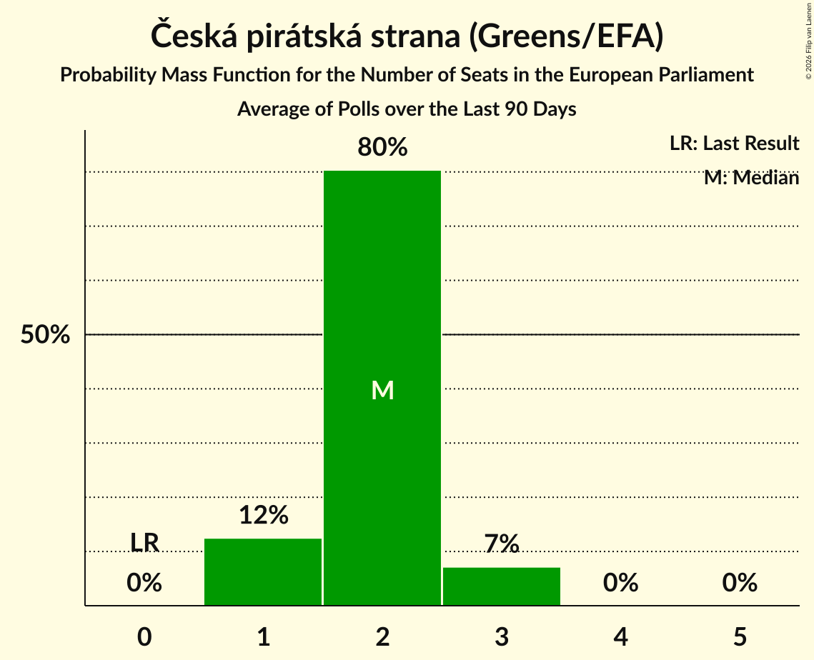

# Česká pirátská strana (Greens/EFA)

<a href="#voting-intentions">Voting Intentions</a> | <a href="#seats">Seats</a>

## Voting Intentions

Last result: **4.8%** (General Election of 24–25 May 2019)

### Confidence Intervals

| Period     | Polling firm/Commissioner(s) | Median | 80% Confidence Interval | 90% Confidence Interval | 95% Confidence Interval | 99% Confidence Interval |
|:----------:|:----------------:|:-----------:|:-----------------------:|:-----------------------:|:-----------------------:|:-----------------------:|
| N/A | [Poll Average](average.html) | 9.8% | 8.4–12.2% | 8.0–12.9% | 7.7–13.5% | 7.2–14.6% |
| [12–30 September 2022](2022-09-30-Kantar.html) | Kantar   CT24 | 9.0% | 8.0–10.3% | 7.7–10.7% | 7.4–11.0% | 6.9–11.6% |
| [1–8 September 2022](2022-09-08-STEM.html) | STEM   CNN Prima News | 9.4% | 8.4–10.6% | 8.1–10.9% | 7.9–11.2% | 7.4–11.8% |
| [15 August–2 September 2022](2022-09-02-Kantar.html) | Kantar   CT24 | 8.5% | N/A | N/A | N/A | N/A |
| [1–31 August 2022](2022-08-31-Median.html) | Median | 11.4% | 9.9–13.3% | 9.4–13.8% | 9.1–14.3% | 8.4–15.2% |
| [4–11 August 2022](2022-08-11-STEM.html) | STEM   CNN Prima News | 9.3% | N/A | N/A | N/A | N/A |
| [8 July–2 August 2022](2022-08-02-Median.html) | Median | 10.5% | 9.4–11.9% | 9.1–12.3% | 8.8–12.6% | 8.3–13.3% |
| [20 May–4 July 2022](2022-07-04-Median.html) | Median | 11.8% | 10.6–13.2% | 10.3–13.6% | 10.0–14.0% | 9.4–14.7% |
| [1 May–2 June 2022](2022-06-02-Median.html) | Median | 9.0% | 8.0–10.3% | 7.7–10.7% | 7.4–11.0% | 7.0–11.6% |
| [16 May–2 June 2022](2022-06-02-Kantar.html) | Kantar   CT24 | 0.0% | N/A | N/A | N/A | N/A |
| [8–29 April 2022](2022-04-29-Kantar.html) | Kantar   CT24 | 0.0% | N/A | N/A | N/A | N/A |
| [14 March–1 April 2022](2022-04-01-Kantar.html) | Kantar   CT24 | 0.0% | N/A | N/A | N/A | N/A |
| [14 February–4 March 2022](2022-03-04-Kantar.html) | Kantar   CT24 | 0.0% | N/A | N/A | N/A | N/A |
| [1 November–1 December 2021](2021-12-01-Median.html) | Median | 0.0% | N/A | N/A | N/A | N/A |
| [1–19 November 2021](2021-11-19-Kantar.html) | Kantar   CT24 | 7.9% | N/A | N/A | N/A | N/A |
| [24–30 September 2021](2021-09-30-STEM.html) | STEM   CNN Prima News | 0.0% | N/A | N/A | N/A | N/A |
| [1–30 September 2021](2021-09-30-Median.html) | Median | 0.0% | N/A | N/A | N/A | N/A |
| [23–29 September 2021](2021-09-29-Median.html) | Median   iDNES | 0.0% | N/A | N/A | N/A | N/A |
| [13–22 September 2021](2021-09-22-Kantar.html) | Kantar   CT24 | 0.0% | N/A | N/A | N/A | N/A |
| [8–12 September 2021](2021-09-12-Ipsos.html) | Ipsos | 0.0% | N/A | N/A | N/A | N/A |
| [1–10 September 2021](2021-09-10-PhoenixResearch.html) | Phoenix Research | 0.0% | N/A | N/A | N/A | N/A |
| [31 August–8 September 2021](2021-09-08-STEM.html) | STEM | 0.0% | N/A | N/A | N/A | N/A |
| [30 August–8 September 2021](2021-09-08-DataCollect.html) | Data Collect | 0.0% | N/A | N/A | N/A | N/A |
| [1 August–2 September 2021](2021-09-02-Median.html) | Median | 0.0% | N/A | N/A | N/A | N/A |
| [2–13 August 2021](2021-08-13-Kantar.html) | Kantar   CT24 | 0.0% | N/A | N/A | N/A | N/A |
| [9–12 August 2021](2021-08-12-STEM.html) | STEM | 0.0% | N/A | N/A | N/A | N/A |
| [1–10 August 2021](2021-08-10-PhoenixResearch.html) | Phoenix Research | 0.0% | N/A | N/A | N/A | N/A |
| [1–31 July 2021](2021-07-31-Median.html) | Median | 0.0% | N/A | N/A | N/A | N/A |
| [26 June–11 July 2021](2021-07-11-CVVM.html) | CVVM | 0.0% | N/A | N/A | N/A | N/A |
| [1–10 July 2021](2021-07-10-PhoenixResearch.html) | Phoenix Research | 0.0% | N/A | N/A | N/A | N/A |
| [1–30 June 2021](2021-06-30-Median.html) | Median | 0.0% | N/A | N/A | N/A | N/A |
| [21–29 June 2021](2021-06-29-STEM.html) | STEM | 0.0% | N/A | N/A | N/A | N/A |
| [7–18 June 2021](2021-06-18-Kantar.html) | Kantar   CT24 | 0.0% | N/A | N/A | N/A | N/A |
| [29 May–13 June 2021](2021-06-13-CVVM.html) | CVVM | 0.0% | N/A | N/A | N/A | N/A |
| [31 May–11 June 2021](2021-06-11-DataCollect.html) | Data Collect   CT24 | 0.0% | N/A | N/A | N/A | N/A |
| [1–10 June 2021](2021-06-10-PhoenixResearch.html) | Phoenix Research | 0.0% | N/A | N/A | N/A | N/A |
| [2–6 June 2021](2021-06-06-Ipsos.html) | Ipsos | 0.0% | N/A | N/A | N/A | N/A |
| [1–31 May 2021](2021-05-31-Median.html) | Median | 0.0% | N/A | N/A | N/A | N/A |
| [10–28 May 2021](2021-05-28-Kantar.html) | Kantar   CT24 | 0.0% | N/A | N/A | N/A | N/A |
| [19–24 May 2021](2021-05-24-Ipsos.html) | Ipsos | 0.0% | N/A | N/A | N/A | N/A |
| [3–21 May 2021](2021-05-21-DataCollect.html) | Data Collect   CT24 | 0.0% | N/A | N/A | N/A | N/A |
| [1–15 May 2021](2021-05-15-PhoenixResearch.html) | Phoenix Research | 0.0% | N/A | N/A | N/A | N/A |
| [1 April–4 May 2021](2021-05-04-Median.html) | Median | 0.0% | N/A | N/A | N/A | N/A |
| [12–30 April 2021](2021-04-30-Kantar.html) | Kantar   CT24 | 0.0% | N/A | N/A | N/A | N/A |
| [7–13 April 2021](2021-04-13-STEM.html) | STEM | 0.0% | N/A | N/A | N/A | N/A |
| [8–12 April 2021](2021-04-12-Ipsos.html) | Ipsos   SPOLU | 0.0% | N/A | N/A | N/A | N/A |
| [1–10 April 2021](2021-04-10-PhoenixResearch.html) | Phoenix Research | 0.0% | N/A | N/A | N/A | N/A |
| [25 March–1 April 2021](2021-04-01-Kantar.html) | Kantar   CT24 | 0.0% | N/A | N/A | N/A | N/A |
| [25 March–1 April 2021](2021-04-01-DataCollect.html) | Data Collect   CT24 | 0.0% | N/A | N/A | N/A | N/A |
| [1–29 March 2021](2021-03-29-Median.html) | Median | 0.0% | N/A | N/A | N/A | N/A |
| [12–16 March 2021](2021-03-16-Ipsos.html) | Ipsos   SPOLU | 0.0% | N/A | N/A | N/A | N/A |
| [15 February–5 March 2021](2021-03-05-Kantar.html) | Kantar   CT24 | 0.0% | N/A | N/A | N/A | N/A |
| [1 February–2 March 2021](2021-03-02-Median.html) | Median | 0.0% | N/A | N/A | N/A | N/A |
| [15–19 February 2021](2021-02-19-Ipsos.html) | Ipsos   SPOLU | 0.0% | N/A | N/A | N/A | N/A |
| [18 January–5 February 2021](2021-02-05-TNSKantar.html) | TNS Kantar   O24 | 0.0% | N/A | N/A | N/A | N/A |
| [1–29 January 2021](2021-01-29-Median.html) | Median | 0.0% | N/A | N/A | N/A | N/A |
| [15–19 January 2021](2021-01-19-Ipsos.html) | Ipsos | 0.0% | N/A | N/A | N/A | N/A |
| [1–10 January 2021](2021-01-10-PhoenixResearch.html) | Phoenix Research | 0.0% | N/A | N/A | N/A | N/A |
| [13 November–4 December 2020](2020-12-04-TNSKantar.html) | TNS Kantar   O24 | 20.0% | 18.3–21.8% | 17.9–22.3% | 17.5–22.8% | 16.7–23.7% |
| [1–30 November 2020](2020-11-30-Median.html) | Median | 14.0% | 12.4–16.0% | 11.9–16.5% | 11.5–17.0% | 10.8–17.9% |
| [19 October–6 November 2020](2020-11-06-TNSKantar.html) | TNS Kantar   O24 | 21.0% | 19.3–22.9% | 18.8–23.4% | 18.4–23.9% | 17.6–24.8% |
| [1–29 October 2020](2020-10-29-Median.html) | Median | 13.4% | 11.9–15.2% | 11.4–15.7% | 11.1–16.1% | 10.4–17.0% |
| [21 September–9 October 2020](2020-10-09-TNSKantar.html) | TNS Kantar   O24 | 19.1% | 17.5–20.8% | 17.0–21.3% | 16.7–21.8% | 15.9–22.6% |
| [5–20 September 2020](2020-09-20-CVVM.html) | CVVM | 16.0% | 14.3–18.0% | 13.8–18.5% | 13.4–19.0% | 12.6–20.0% |
| [31 August–13 September 2020](2020-09-13-STEM.html) | STEM | 12.9% | 11.6–14.3% | 11.2–14.7% | 10.9–15.0% | 10.4–15.8% |
| [24 August–11 September 2020](2020-09-11-TNSKantar.html) | TNS Kantar   O24 | 19.6% | 17.9–21.3% | 17.5–21.8% | 17.1–22.3% | 16.3–23.2% |
| [1–27 August 2020](2020-08-27-Median.html) | Median | 12.5% | 11.3–13.9% | 10.9–14.3% | 10.7–14.7% | 10.1–15.4% |
| [18–27 July 2020](2020-07-27-CVVM.html) | CVVM | 14.5% | 12.8–16.5% | 12.3–17.1% | 11.9–17.6% | 11.1–18.6% |
| [15 June–3 July 2020](2020-07-03-TNSKantar.html) | TNS Kantar   O24 | 18.0% | 17.1–19.0% | 16.8–19.3% | 16.6–19.5% | 16.1–20.0% |
| [20 June–2 July 2020](2020-07-02-CVVM.html) | CVVM | 13.6% | 12.1–15.4% | 11.6–15.9% | 11.3–16.4% | 10.6–17.3% |
| [18 May–5 June 2020](2020-06-05-TNSKantar.html) | TNS Kantar   O24 | 17.0% | 15.7–18.5% | 15.3–18.9% | 15.0–19.2% | 14.4–20.0% |
| [22 May–1 June 2020](2020-06-01-STEM.html) | STEM | 12.8% | 11.6–14.2% | 11.2–14.6% | 10.9–14.9% | 10.4–15.6% |
| [13–30 April 2020](2020-04-30-TNSKantar.html) | TNS Kantar   O24 | 16.0% | 14.5–17.7% | 14.1–18.1% | 13.8–18.5% | 13.1–19.4% |
| [9–27 March 2020](2020-03-27-TNSKantar.html) | TNS Kantar   O24 | 13.5% | 12.2–15.1% | 11.8–15.5% | 11.5–15.9% | 10.9–16.7% |
| [29 February–26 March 2020](2020-03-26-Median.html) | Median | 12.0% | 10.7–13.4% | 10.4–13.8% | 10.1–14.1% | 9.6–14.8% |
| [29 February–11 March 2020](2020-03-11-CVVM.html) | CVVM | 12.4% | 10.9–14.3% | 10.5–14.8% | 10.1–15.3% | 9.4–16.2% |
| [10–28 February 2020](2020-02-28-TNSKantar.html) | TNS Kantar   O24 | 15.4% | 13.7–17.4% | 13.3–17.9% | 12.8–18.4% | 12.1–19.4% |
| [1 January–13 February 2020](2020-02-13-Median.html) | Median | 11.5% | 10.1–13.2% | 9.7–13.7% | 9.4–14.1% | 8.7–15.0% |
| [1–13 February 2020](2020-02-13-CVVM.html) | CVVM | 13.0% | 11.4–14.8% | 10.9–15.4% | 10.6–15.8% | 9.9–16.8% |
| [13–31 January 2020](2020-01-31-TNSKantar.html) | TNS Kantar | 16.4% | 14.5–18.6% | 14.0–19.3% | 13.5–19.8% | 12.6–20.9% |
| [11–20 January 2020](2020-01-20-CVVM.html) | CVVM | 13.5% | 12.0–15.2% | 11.6–15.7% | 11.2–16.1% | 10.5–16.9% |
| [1–12 January 2020](2020-01-12-PhoenixResearch.html) | Phoenix Research | 15.9% | 14.5–17.4% | 14.1–17.9% | 13.7–18.3% | 13.1–19.0% |
| [30 November–11 December 2019](2019-12-11-CVVM.html) | CVVM | 14.0% | 12.5–15.8% | 12.0–16.3% | 11.7–16.8% | 11.0–17.7% |
| [29 October–30 November 2019](2019-11-30-Median.html) | Median | 12.5% | 11.3–13.9% | 11.0–14.3% | 10.7–14.6% | 10.2–15.3% |
| [9–29 November 2019](2019-11-29-TNSKantar.html) | TNS Kantar | 13.3% | 12.1–14.7% | 11.8–15.0% | 11.5–15.4% | 11.0–16.0% |
| [14–26 November 2019](2019-11-26-STEM.html) | STEM | 10.9% | 9.8–12.2% | 9.4–12.5% | 9.2–12.9% | 8.7–13.5% |
| [1–18 November 2019](2019-11-18-PhoenixResearch.html) | Phoenix Research | 10.5% | 9.4–11.8% | 9.1–12.1% | 8.8–12.4% | 8.3–13.1% |
| [2–15 November 2019](2019-11-15-CVVM.html) | CVVM | 13.4% | 11.5–15.8% | 10.9–16.4% | 10.5–17.0% | 9.6–18.2% |
| [12 October–1 November 2019](2019-11-01-TNSKantar.html) | TNS Kantar | 16.9% | 15.6–18.4% | 15.2–18.8% | 14.9–19.1% | 14.3–19.9% |
| [30 September–28 October 2019](2019-10-28-Median.html) | Median | 12.5% | 11.3–13.8% | 11.0–14.2% | 10.7–14.5% | 10.2–15.2% |
| [11–25 October 2019](2019-10-25-STEM.html) | STEM | 12.2% | 11.0–13.6% | 10.6–14.1% | 10.3–14.4% | 9.7–15.1% |
| [16 September–5 October 2019](2019-10-05-TNSKantar.html) | TNS Kantar | 15.1% | 13.8–16.5% | 13.5–16.9% | 13.2–17.2% | 12.6–17.9% |
| [28 August–29 September 2019](2019-09-29-Median.html) | Median | 13.5% | 12.3–15.0% | 11.9–15.4% | 11.6–15.8% | 11.0–16.5% |
| [20 August–18 September 2019](2019-09-18-PhoenixResearch.html) | Phoenix Research | 18.7% | 17.2–20.3% | 16.8–20.7% | 16.4–21.1% | 15.7–21.9% |
| [7–17 September 2019](2019-09-17-CVVM.html) | CVVM | 13.1% | 11.5–15.1% | 11.1–15.6% | 10.7–16.1% | 9.9–17.1% |
| [10–30 August 2019](2019-08-30-TNSKantar.html) | TNS Kantar | 17.0% | 15.7–18.5% | 15.3–18.9% | 15.0–19.2% | 14.4–20.0% |
| [27 July–26 August 2019](2019-08-26-Median.html) | Median | 14.3% | 13.0–15.8% | 12.6–16.2% | 12.3–16.6% | 11.7–17.3% |
| [1–26 July 2019](2019-07-26-Median.html) | Median | 14.0% | 12.7–15.5% | 12.4–15.9% | 12.0–16.3% | 11.4–17.0% |
| [1–30 June 2019](2019-06-30-Median.html) | Median | 13.0% | 11.8–14.4% | 11.4–14.8% | 11.1–15.2% | 10.5–15.9% |
| [17–26 June 2019](2019-06-26-TNSKantar.html) | TNS Kantar   Česká televize | 18.5% | 17.1–20.0% | 16.7–20.4% | 16.4–20.8% | 15.8–21.5% |
| [8–17 June 2019](2019-06-17-CVVM.html) | CVVM | 17.0% | 15.6–18.7% | 15.2–19.1% | 14.8–19.5% | 14.2–20.3% |
| [11–31 May 2019](2019-05-31-TNSKantar.html) | TNS Kantar   Česká televize | 17.5% | 16.2–19.0% | 15.8–19.4% | 15.5–19.8% | 14.8–20.5% |

### Probability Mass Function

The following table shows the probability mass function per percentage block of voting intentions for the [poll average](average.html) for Česká pirátská strana (Greens/EFA).

| Voting Intentions | Probability | Accumulated | Special Marks |
|:-----------------:|:-----------:|:-----------:|:-------------:|
| 4.5–5.5% | 0% | 100% | Last Result |
| 5.5–6.5% | 0% | 100% |  |
| 6.5–7.5% | 1.5% | 100% |  |
| 7.5–8.5% | 12% | 98.5% |  |
| 8.5–9.5% | 29% | 86% |  |
| 9.5–10.5% | 25% | 57% | Median |
| 10.5–11.5% | 15% | 31% |  |
| 11.5–12.5% | 9% | 17% |  |
| 12.5–13.5% | 5% | 7% |  |
| 13.5–14.5% | 2% | 2% |  |
| 14.5–15.5% | 0.4% | 0.5% |  |
| 15.5–16.5% | 0.1% | 0.1% |  |
| 16.5–17.5% | 0% | 0% |  |

## Seats

Last result: **0** seats (General Election of 24–25 May 2019)

### Confidence Intervals

| Period     | Polling firm/Commissioner(s) | Median | 80% Confidence Interval | 90% Confidence Interval | 95% Confidence Interval | 99% Confidence Interval |
|:----------:|:----------------:|:------:|:-----------------------:|:-----------------------:|:-----------------------:|:-----------------------:|
| N/A | [Poll Average](average.html) | 2 | 2–3 | 2–4 | 2–4 | 2–4 |
| [12–30 September 2022](2022-09-30-Kantar.html) | Kantar   CT24 | 2 | 2 | 2–3 | 2–3 | 1–3 |
| [1–8 September 2022](2022-09-08-STEM.html) | STEM   CNN Prima News | 2 | 2–3 | 2–3 | 2–3 | 2–3 |
| [15 August–2 September 2022](2022-09-02-Kantar.html) | Kantar   CT24 |  |  |  |  |  |
| [1–31 August 2022](2022-08-31-Median.html) | Median | 3 | 3–4 | 3–4 | 2–4 | 2–4 |
| [4–11 August 2022](2022-08-11-STEM.html) | STEM   CNN Prima News |  |  |  |  |  |
| [8 July–2 August 2022](2022-08-02-Median.html) | Median | 3 | 2–3 | 2–3 | 2–3 | 2–4 |
| [20 May–4 July 2022](2022-07-04-Median.html) | Median | 3 | 3–4 | 3–4 | 2–4 | 2–4 |
| [1 May–2 June 2022](2022-06-02-Median.html) | Median | 2 | 2–3 | 2–3 | 2–3 | 2–3 |
| [16 May–2 June 2022](2022-06-02-Kantar.html) | Kantar   CT24 |  |  |  |  |  |
| [8–29 April 2022](2022-04-29-Kantar.html) | Kantar   CT24 |  |  |  |  |  |
| [14 March–1 April 2022](2022-04-01-Kantar.html) | Kantar   CT24 |  |  |  |  |  |
| [14 February–4 March 2022](2022-03-04-Kantar.html) | Kantar   CT24 |  |  |  |  |  |
| [1 November–1 December 2021](2021-12-01-Median.html) | Median |  |  |  |  |  |
| [1–19 November 2021](2021-11-19-Kantar.html) | Kantar   CT24 |  |  |  |  |  |
| [24–30 September 2021](2021-09-30-STEM.html) | STEM   CNN Prima News |  |  |  |  |  |
| [1–30 September 2021](2021-09-30-Median.html) | Median |  |  |  |  |  |
| [23–29 September 2021](2021-09-29-Median.html) | Median   iDNES |  |  |  |  |  |
| [13–22 September 2021](2021-09-22-Kantar.html) | Kantar   CT24 |  |  |  |  |  |
| [8–12 September 2021](2021-09-12-Ipsos.html) | Ipsos |  |  |  |  |  |
| [1–10 September 2021](2021-09-10-PhoenixResearch.html) | Phoenix Research |  |  |  |  |  |
| [31 August–8 September 2021](2021-09-08-STEM.html) | STEM |  |  |  |  |  |
| [30 August–8 September 2021](2021-09-08-DataCollect.html) | Data Collect |  |  |  |  |  |
| [1 August–2 September 2021](2021-09-02-Median.html) | Median |  |  |  |  |  |
| [2–13 August 2021](2021-08-13-Kantar.html) | Kantar   CT24 |  |  |  |  |  |
| [9–12 August 2021](2021-08-12-STEM.html) | STEM |  |  |  |  |  |
| [1–10 August 2021](2021-08-10-PhoenixResearch.html) | Phoenix Research |  |  |  |  |  |
| [1–31 July 2021](2021-07-31-Median.html) | Median |  |  |  |  |  |
| [26 June–11 July 2021](2021-07-11-CVVM.html) | CVVM |  |  |  |  |  |
| [1–10 July 2021](2021-07-10-PhoenixResearch.html) | Phoenix Research |  |  |  |  |  |
| [1–30 June 2021](2021-06-30-Median.html) | Median |  |  |  |  |  |
| [21–29 June 2021](2021-06-29-STEM.html) | STEM |  |  |  |  |  |
| [7–18 June 2021](2021-06-18-Kantar.html) | Kantar   CT24 |  |  |  |  |  |
| [29 May–13 June 2021](2021-06-13-CVVM.html) | CVVM |  |  |  |  |  |
| [31 May–11 June 2021](2021-06-11-DataCollect.html) | Data Collect   CT24 |  |  |  |  |  |
| [1–10 June 2021](2021-06-10-PhoenixResearch.html) | Phoenix Research |  |  |  |  |  |
| [2–6 June 2021](2021-06-06-Ipsos.html) | Ipsos |  |  |  |  |  |
| [1–31 May 2021](2021-05-31-Median.html) | Median |  |  |  |  |  |
| [10–28 May 2021](2021-05-28-Kantar.html) | Kantar   CT24 |  |  |  |  |  |
| [19–24 May 2021](2021-05-24-Ipsos.html) | Ipsos |  |  |  |  |  |
| [3–21 May 2021](2021-05-21-DataCollect.html) | Data Collect   CT24 |  |  |  |  |  |
| [1–15 May 2021](2021-05-15-PhoenixResearch.html) | Phoenix Research |  |  |  |  |  |
| [1 April–4 May 2021](2021-05-04-Median.html) | Median |  |  |  |  |  |
| [12–30 April 2021](2021-04-30-Kantar.html) | Kantar   CT24 |  |  |  |  |  |
| [7–13 April 2021](2021-04-13-STEM.html) | STEM |  |  |  |  |  |
| [8–12 April 2021](2021-04-12-Ipsos.html) | Ipsos   SPOLU |  |  |  |  |  |
| [1–10 April 2021](2021-04-10-PhoenixResearch.html) | Phoenix Research |  |  |  |  |  |
| [25 March–1 April 2021](2021-04-01-Kantar.html) | Kantar   CT24 |  |  |  |  |  |
| [25 March–1 April 2021](2021-04-01-DataCollect.html) | Data Collect   CT24 |  |  |  |  |  |
| [1–29 March 2021](2021-03-29-Median.html) | Median |  |  |  |  |  |
| [12–16 March 2021](2021-03-16-Ipsos.html) | Ipsos   SPOLU |  |  |  |  |  |
| [15 February–5 March 2021](2021-03-05-Kantar.html) | Kantar   CT24 |  |  |  |  |  |
| [1 February–2 March 2021](2021-03-02-Median.html) | Median |  |  |  |  |  |
| [15–19 February 2021](2021-02-19-Ipsos.html) | Ipsos   SPOLU |  |  |  |  |  |
| [18 January–5 February 2021](2021-02-05-TNSKantar.html) | TNS Kantar   O24 |  |  |  |  |  |
| [1–29 January 2021](2021-01-29-Median.html) | Median |  |  |  |  |  |
| [15–19 January 2021](2021-01-19-Ipsos.html) | Ipsos |  |  |  |  |  |
| [1–10 January 2021](2021-01-10-PhoenixResearch.html) | Phoenix Research |  |  |  |  |  |
| [13 November–4 December 2020](2020-12-04-TNSKantar.html) | TNS Kantar   O24 | 5 | 5–6 | 5–6 | 5–6 | 4–6 |
| [1–30 November 2020](2020-11-30-Median.html) | Median | 3 | 3–4 | 3–4 | 3–4 | 2–5 |
| [19 October–6 November 2020](2020-11-06-TNSKantar.html) | TNS Kantar   O24 | 5 | 5–6 | 5–6 | 5–6 | 4–7 |
| [1–29 October 2020](2020-10-29-Median.html) | Median | 3 | 3–4 | 3–4 | 3–4 | 2–4 |
| [21 September–9 October 2020](2020-10-09-TNSKantar.html) | TNS Kantar   O24 | 5 | 4–5 | 4–6 | 4–6 | 4–6 |
| [5–20 September 2020](2020-09-20-CVVM.html) | CVVM | 4 | 3–4 | 3–5 | 3–5 | 3–5 |
| [31 August–13 September 2020](2020-09-13-STEM.html) | STEM | 3 | 3–4 | 3–4 | 2–4 | 2–4 |
| [24 August–11 September 2020](2020-09-11-TNSKantar.html) | TNS Kantar   O24 | 5 | 5–6 | 4–6 | 4–6 | 4–6 |
| [1–27 August 2020](2020-08-27-Median.html) | Median | 3 | 3 | 3 | 2–3 | 2–4 |
| [18–27 July 2020](2020-07-27-CVVM.html) | CVVM | 4 | 3–4 | 3–4 | 3–4 | 3–5 |
| [15 June–3 July 2020](2020-07-03-TNSKantar.html) | TNS Kantar   O24 | 5 | 4–5 | 4–5 | 4–5 | 4–6 |
| [20 June–2 July 2020](2020-07-02-CVVM.html) | CVVM | 4 | 3–4 | 3–4 | 3–4 | 2–5 |
| [18 May–5 June 2020](2020-06-05-TNSKantar.html) | TNS Kantar   O24 | 4 | 4–5 | 4–5 | 4–5 | 4–5 |
| [22 May–1 June 2020](2020-06-01-STEM.html) | STEM | 3 | 3–4 | 3–4 | 3–4 | 3–4 |
| [13–30 April 2020](2020-04-30-TNSKantar.html) | TNS Kantar   O24 | 4 | 4–5 | 3–5 | 3–5 | 3–5 |
| [9–27 March 2020](2020-03-27-TNSKantar.html) | TNS Kantar   O24 | 3 | 3–4 | 3–4 | 3–4 | 3–4 |
| [29 February–26 March 2020](2020-03-26-Median.html) | Median | 3 | 3 | 2–3 | 2–4 | 2–4 |
| [29 February–11 March 2020](2020-03-11-CVVM.html) | CVVM | 3 | 2–3 | 2–4 | 2–4 | 2–4 |
| [10–28 February 2020](2020-02-28-TNSKantar.html) | TNS Kantar   O24 | 4 | 3–5 | 3–5 | 3–5 | 3–5 |
| [1 January–13 February 2020](2020-02-13-Median.html) | Median | 3 | 2–3 | 2–3 | 2–3 | 2–4 |
| [1–13 February 2020](2020-02-13-CVVM.html) | CVVM | 3 | 3–4 | 3–4 | 3–4 | 2–4 |
| [13–31 January 2020](2020-01-31-TNSKantar.html) | TNS Kantar | 4 | 4–5 | 3–5 | 3–5 | 3–6 |
| [11–20 January 2020](2020-01-20-CVVM.html) | CVVM | 3 | 3–4 | 3–4 | 3–4 | 2–4 |
| [1–12 January 2020](2020-01-12-PhoenixResearch.html) | Phoenix Research | 4 | 4 | 3–5 | 3–5 | 3–5 |
| [30 November–11 December 2019](2019-12-11-CVVM.html) | CVVM | 3 | 3–4 | 3–4 | 3–4 | 3–5 |
| [29 October–30 November 2019](2019-11-30-Median.html) | Median | 3 | 2–4 | 2–4 | 2–4 | 2–4 |
| [9–29 November 2019](2019-11-29-TNSKantar.html) | TNS Kantar | 3 | 3–4 | 3–4 | 3–4 | 3–4 |
| [14–26 November 2019](2019-11-26-STEM.html) | STEM | 3 | 2–3 | 2–3 | 2–3 | 2–3 |
| [1–18 November 2019](2019-11-18-PhoenixResearch.html) | Phoenix Research | 3 | 2–3 | 2–3 | 2–3 | 2–3 |
| [2–15 November 2019](2019-11-15-CVVM.html) | CVVM | 3 | 3–4 | 3–4 | 3–4 | 2–4 |
| [12 October–1 November 2019](2019-11-01-TNSKantar.html) | TNS Kantar | 5 | 4–5 | 4–5 | 4–5 | 4–6 |
| [30 September–28 October 2019](2019-10-28-Median.html) | Median | 3 | 3 | 2–3 | 2–4 | 2–4 |
| [11–25 October 2019](2019-10-25-STEM.html) | STEM | 3 | 3 | 3 | 2–4 | 2–4 |
| [16 September–5 October 2019](2019-10-05-TNSKantar.html) | TNS Kantar | 4 | 3–4 | 3–5 | 3–5 | 3–5 |
| [28 August–29 September 2019](2019-09-29-Median.html) | Median | 3 | 3–4 | 3–4 | 3–4 | 2–5 |
| [20 August–18 September 2019](2019-09-18-PhoenixResearch.html) | Phoenix Research | 5 | 5–6 | 4–6 | 4–6 | 4–6 |
| [7–17 September 2019](2019-09-17-CVVM.html) | CVVM | 3 | 3–4 | 3–4 | 2–4 | 2–4 |
| [10–30 August 2019](2019-08-30-TNSKantar.html) | TNS Kantar | 5 | 4–5 | 4–5 | 4–5 | 3–5 |
| [27 July–26 August 2019](2019-08-26-Median.html) | Median | 4 | 3–4 | 3–4 | 3–4 | 3–5 |
| [1–26 July 2019](2019-07-26-Median.html) | Median | 3 | 3–4 | 3–4 | 3–4 | 3–4 |
| [1–30 June 2019](2019-06-30-Median.html) | Median | 3 | 3–4 | 3–4 | 2–4 | 2–4 |
| [17–26 June 2019](2019-06-26-TNSKantar.html) | TNS Kantar   Česká televize | 5 | 4–5 | 4–5 | 4–6 | 4–6 |
| [8–17 June 2019](2019-06-17-CVVM.html) | CVVM | 4 | 4–5 | 4–5 | 4–5 | 3–5 |
| [11–31 May 2019](2019-05-31-TNSKantar.html) | TNS Kantar   Česká televize | 4 | 4–5 | 4–5 | 4–5 | 4–5 |

### Probability Mass Function

The following table shows the probability mass function per seat for the [poll average](average.html) for Česká pirátská strana (Greens/EFA).

| Number of Seats | Probability | Accumulated | Special Marks |
|:---------------:|:-----------:|:-----------:|:-------------:|
| 0 | 0% | 100% | Last Result |
| 1 | 0.3% | 100% |  |
| 2 | 59% | 99.7% | Median |
| 3 | 34% | 40% |  |
| 4 | 6% | 6% |  |
| 5 | 0% | 0% |  |

