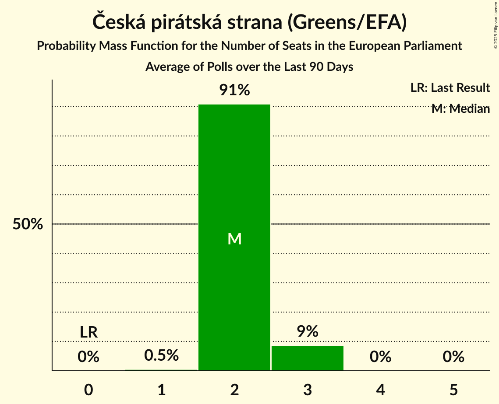

# Česká pirátská strana (Greens/EFA)

<a href="#voting-intentions">Voting Intentions</a> | <a href="#seats">Seats</a>

## Voting Intentions

Last result: **4.8%** (General Election of 24–25 May 2019)

### Confidence Intervals

| Period     | Polling firm/Commissioner(s) | Median | 80% Confidence Interval | 90% Confidence Interval | 95% Confidence Interval | 99% Confidence Interval |
|:----------:|:----------------:|:-----------:|:-----------------------:|:-----------------------:|:-----------------------:|:-----------------------:|
| N/A | [Poll Average](average.html) | 13.3% | 10.9–18.2% | 10.4–18.7% | 10.0–19.0% | 9.4–19.6% |
| [15 June–3 July 2020](2020-07-03-TNSKantar.html) | TNS Kantar   O24 | 18.0% | 17.1–19.0% | 16.8–19.3% | 16.6–19.5% | 16.1–20.0% |
| [20 June–2 July 2020](2020-07-02-CVVM.html) | CVVM | 13.6% | 12.1–15.4% | 11.6–15.9% | 11.3–16.4% | 10.6–17.3% |
| [18 May–5 June 2020](2020-06-05-TNSKantar.html) | TNS Kantar   O24 | 17.0% | 15.7–18.5% | 15.3–18.9% | 15.0–19.2% | 14.4–20.0% |
| [22 May–1 June 2020](2020-06-01-STEM.html) | STEM | 12.8% | 11.6–14.2% | 11.2–14.6% | 10.9–14.9% | 10.4–15.6% |
| [7–13 May 2020](2020-05-13-SANEP.html) | SANEP | 11.2% | 10.0–12.5% | 9.7–12.8% | 9.5–13.2% | 8.9–13.8% |
| [13–30 April 2020](2020-04-30-TNSKantar.html) | TNS Kantar   O24 | 16.0% | 14.5–17.7% | 14.1–18.1% | 13.8–18.5% | 13.1–19.4% |
| [9–27 March 2020](2020-03-27-TNSKantar.html) | TNS Kantar   O24 | 13.5% | 12.2–15.1% | 11.8–15.5% | 11.5–15.9% | 10.9–16.7% |
| [29 February–26 March 2020](2020-03-26-Median.html) | Median | 12.0% | 10.7–13.4% | 10.4–13.8% | 10.1–14.1% | 9.6–14.8% |
| [29 February–11 March 2020](2020-03-11-CVVM.html) | CVVM | 12.4% | 10.9–14.3% | 10.5–14.8% | 10.1–15.3% | 9.4–16.2% |
| [10–28 February 2020](2020-02-28-TNSKantar.html) | TNS Kantar   O24 | 15.4% | 13.7–17.4% | 13.3–17.9% | 12.8–18.4% | 12.1–19.4% |
| [1 January–13 February 2020](2020-02-13-Median.html) | Median | 11.5% | 10.1–13.2% | 9.7–13.7% | 9.4–14.1% | 8.7–15.0% |
| [1–13 February 2020](2020-02-13-CVVM.html) | CVVM | 13.0% | 11.4–14.8% | 10.9–15.4% | 10.6–15.8% | 9.9–16.8% |
| [13–31 January 2020](2020-01-31-TNSKantar.html) | TNS Kantar | 16.4% | 14.5–18.6% | 14.0–19.3% | 13.5–19.8% | 12.6–20.9% |
| [11–20 January 2020](2020-01-20-CVVM.html) | CVVM | 13.5% | 12.0–15.2% | 11.6–15.7% | 11.2–16.1% | 10.5–16.9% |
| [1–12 January 2020](2020-01-12-PhoenixResearch.html) | Phoenix Research | 15.9% | 14.5–17.4% | 14.1–17.9% | 13.7–18.3% | 13.1–19.0% |
| [30 November–11 December 2019](2019-12-11-CVM.html) | CVM | 14.0% | 12.5–15.8% | 12.0–16.3% | 11.7–16.8% | 11.0–17.7% |
| [29 October–30 November 2019](2019-11-30-Median.html) | Median | 12.5% | 11.3–13.9% | 11.0–14.3% | 10.7–14.6% | 10.2–15.3% |
| [9–29 November 2019](2019-11-29-TNSKantar.html) | TNS Kantar | 13.3% | 12.1–14.7% | 11.8–15.0% | 11.5–15.4% | 11.0–16.0% |
| [21–27 November 2019](2019-11-27-SANEP.html) | SANEP | 8.9% | 7.9–10.1% | 7.6–10.5% | 7.3–10.8% | 6.9–11.4% |
| [14–26 November 2019](2019-11-26-STEM.html) | STEM | 10.9% | 9.8–12.2% | 9.4–12.5% | 9.2–12.9% | 8.7–13.5% |
| [1–18 November 2019](2019-11-18-PhoenixResearch.html) | Phoenix Research | 10.5% | 9.4–11.8% | 9.1–12.1% | 8.8–12.4% | 8.3–13.1% |
| [2–15 November 2019](2019-11-15-Centrumprovýzkumveřejnéhomínění.html) | Centrum pro výzkum veřejného mínění | 13.4% | 11.5–15.8% | 10.9–16.4% | 10.5–17.0% | 9.6–18.2% |
| [12 October–1 November 2019](2019-11-01-TNSKantar.html) | TNS Kantar | 16.9% | 15.6–18.4% | 15.2–18.8% | 14.9–19.1% | 14.3–19.9% |
| [30 September–28 October 2019](2019-10-28-Median.html) | Median | 12.5% | 11.3–13.8% | 11.0–14.2% | 10.7–14.5% | 10.2–15.2% |
| [11–25 October 2019](2019-10-25-STEM.html) | STEM | 12.2% | 11.0–13.6% | 10.6–14.1% | 10.3–14.4% | 9.7–15.1% |
| [16 September–5 October 2019](2019-10-05-TNSKantar.html) | TNS Kantar | 15.1% | 13.8–16.5% | 13.5–16.9% | 13.2–17.2% | 12.6–17.9% |
| [28 August–29 September 2019](2019-09-29-Median.html) | Median | 13.5% | 12.3–15.0% | 11.9–15.4% | 11.6–15.8% | 11.0–16.5% |
| [20 August–18 September 2019](2019-09-18-PhoenixResearch.html) | Phoenix Research | 18.7% | 17.2–20.3% | 16.8–20.7% | 16.4–21.1% | 15.7–21.9% |
| [7–17 September 2019](2019-09-17-Centrumprovýzkumveřejnéhomínění.html) | Centrum pro výzkum veřejného mínění | 13.1% | 11.5–15.1% | 11.1–15.6% | 10.7–16.1% | 9.9–17.1% |
| [10–30 August 2019](2019-08-30-TNSKantar.html) | TNS Kantar | 17.0% | 15.7–18.5% | 15.3–18.9% | 15.0–19.2% | 14.4–20.0% |
| [27 July–26 August 2019](2019-08-26-Median.html) | Median | 14.3% | 13.0–15.8% | 12.6–16.2% | 12.3–16.6% | 11.7–17.3% |
| [1–26 July 2019](2019-07-26-Median.html) | Median | 14.0% | 12.7–15.5% | 12.4–15.9% | 12.0–16.3% | 11.4–17.0% |
| [1–30 June 2019](2019-06-30-Median.html) | Median | 13.0% | 11.8–14.4% | 11.4–14.8% | 11.1–15.2% | 10.5–15.9% |
| [17–26 June 2019](2019-06-26-TNSKantar.html) | TNS Kantar   Česká televize | 18.5% | 17.1–20.0% | 16.7–20.4% | 16.4–20.8% | 15.8–21.5% |
| [8–17 June 2019](2019-06-17-Centrumprovýzkumveřejnéhomínění.html) | Centrum pro výzkum veřejného mínění | 17.0% | 15.6–18.7% | 15.2–19.1% | 14.8–19.5% | 14.2–20.3% |
| [11–31 May 2019](2019-05-31-TNSKantar.html) | TNS Kantar   Česká televize | 17.5% | 16.2–19.0% | 15.8–19.4% | 15.5–19.8% | 14.8–20.5% |

### Probability Mass Function

The following table shows the probability mass function per percentage block of voting intentions for the [poll average](average.html) for Česká pirátská strana (Greens/EFA).

| Voting Intentions | Probability | Accumulated | Special Marks |
|:-----------------:|:-----------:|:-----------:|:-------------:|
| 4.5–5.5% | 0% | 100% | Last Result |
| 5.5–6.5% | 0% | 100% |  |
| 6.5–7.5% | 0% | 100% |  |
| 7.5–8.5% | 0% | 100% |  |
| 8.5–9.5% | 0.8% | 100% |  |
| 9.5–10.5% | 5% | 99.2% |  |
| 10.5–11.5% | 13% | 94% |  |
| 11.5–12.5% | 18% | 81% |  |
| 12.5–13.5% | 18% | 63% | Median |
| 13.5–14.5% | 12% | 45% |  |
| 14.5–15.5% | 6% | 33% |  |
| 15.5–16.5% | 2% | 27% |  |
| 16.5–17.5% | 6% | 25% |  |
| 17.5–18.5% | 12% | 19% |  |
| 18.5–19.5% | 6% | 6% |  |
| 19.5–20.5% | 0.6% | 0.6% |  |
| 20.5–21.5% | 0% | 0% |  |

## Seats

Last result: **0** seats (General Election of 24–25 May 2019)

### Confidence Intervals

| Period     | Polling firm/Commissioner(s) | Median | 80% Confidence Interval | 90% Confidence Interval | 95% Confidence Interval | 99% Confidence Interval |
|:----------:|:----------------:|:------:|:-----------------------:|:-----------------------:|:-----------------------:|:-----------------------:|
| N/A | [Poll Average](average.html) | 3 | 3–5 | 2–5 | 2–5 | 2–5 |
| [15 June–3 July 2020](2020-07-03-TNSKantar.html) | TNS Kantar   O24 | 5 | 4–5 | 4–5 | 4–5 | 4–6 |
| [20 June–2 July 2020](2020-07-02-CVVM.html) | CVVM | 4 | 3–4 | 3–4 | 3–4 | 2–5 |
| [18 May–5 June 2020](2020-06-05-TNSKantar.html) | TNS Kantar   O24 | 4 | 4–5 | 4–5 | 4–5 | 3–5 |
| [22 May–1 June 2020](2020-06-01-STEM.html) | STEM | 3 | 3–4 | 3–4 | 3–4 | 3–4 |
| [7–13 May 2020](2020-05-13-SANEP.html) | SANEP | 3 | 2–3 | 2–3 | 2–3 | 2–4 |
| [13–30 April 2020](2020-04-30-TNSKantar.html) | TNS Kantar   O24 | 4 | 4–5 | 3–5 | 3–5 | 3–5 |
| [9–27 March 2020](2020-03-27-TNSKantar.html) | TNS Kantar   O24 | 3 | 3–4 | 3–4 | 3–4 | 3–4 |
| [29 February–26 March 2020](2020-03-26-Median.html) | Median | 3 | 3 | 2–3 | 2–4 | 2–4 |
| [29 February–11 March 2020](2020-03-11-CVVM.html) | CVVM | 3 | 2–3 | 2–4 | 2–4 | 2–4 |
| [10–28 February 2020](2020-02-28-TNSKantar.html) | TNS Kantar   O24 | 4 | 3–5 | 3–5 | 3–5 | 3–5 |
| [1 January–13 February 2020](2020-02-13-Median.html) | Median | 3 | 2–3 | 2–3 | 2–3 | 2–4 |
| [1–13 February 2020](2020-02-13-CVVM.html) | CVVM | 3 | 3–4 | 3–4 | 3–4 | 2–4 |
| [13–31 January 2020](2020-01-31-TNSKantar.html) | TNS Kantar | 4 | 4–5 | 3–5 | 3–5 | 3–6 |
| [11–20 January 2020](2020-01-20-CVVM.html) | CVVM | 3 | 3–4 | 3–4 | 3–4 | 2–4 |
| [1–12 January 2020](2020-01-12-PhoenixResearch.html) | Phoenix Research | 4 | 4 | 3–5 | 3–5 | 3–5 |
| [30 November–11 December 2019](2019-12-11-CVM.html) | CVM | 3 | 3–4 | 3–4 | 3–4 | 3–5 |
| [29 October–30 November 2019](2019-11-30-Median.html) | Median | 3 | 2–4 | 2–4 | 2–4 | 2–4 |
| [9–29 November 2019](2019-11-29-TNSKantar.html) | TNS Kantar | 3 | 3–4 | 3–4 | 3–4 | 3–4 |
| [21–27 November 2019](2019-11-27-SANEP.html) | SANEP | 2 | 2 | 2 | 2 | 1–3 |
| [14–26 November 2019](2019-11-26-STEM.html) | STEM | 3 | 2–3 | 2–3 | 2–3 | 2–3 |
| [1–18 November 2019](2019-11-18-PhoenixResearch.html) | Phoenix Research | 3 | 2–3 | 2–3 | 2–3 | 2–3 |
| [2–15 November 2019](2019-11-15-Centrumprovýzkumveřejnéhomínění.html) | Centrum pro výzkum veřejného mínění | 3 | 3–4 | 3–4 | 3–4 | 2–4 |
| [12 October–1 November 2019](2019-11-01-TNSKantar.html) | TNS Kantar | 5 | 4–5 | 4–5 | 4–5 | 4–6 |
| [30 September–28 October 2019](2019-10-28-Median.html) | Median | 3 | 3 | 2–3 | 2–4 | 2–4 |
| [11–25 October 2019](2019-10-25-STEM.html) | STEM | 3 | 3 | 3 | 2–4 | 2–4 |
| [16 September–5 October 2019](2019-10-05-TNSKantar.html) | TNS Kantar | 4 | 3–4 | 3–5 | 3–5 | 3–5 |
| [28 August–29 September 2019](2019-09-29-Median.html) | Median | 3 | 3–4 | 3–4 | 3–4 | 2–5 |
| [20 August–18 September 2019](2019-09-18-PhoenixResearch.html) | Phoenix Research | 5 | 5–6 | 4–6 | 4–6 | 4–6 |
| [7–17 September 2019](2019-09-17-Centrumprovýzkumveřejnéhomínění.html) | Centrum pro výzkum veřejného mínění | 3 | 3–4 | 3–4 | 2–4 | 2–4 |
| [10–30 August 2019](2019-08-30-TNSKantar.html) | TNS Kantar | 5 | 4–5 | 4–5 | 4–5 | 3–5 |
| [27 July–26 August 2019](2019-08-26-Median.html) | Median | 4 | 3–4 | 3–4 | 3–4 | 3–5 |
| [1–26 July 2019](2019-07-26-Median.html) | Median | 3 | 3–4 | 3–4 | 3–4 | 3–4 |
| [1–30 June 2019](2019-06-30-Median.html) | Median | 3 | 3–4 | 3–4 | 2–4 | 2–4 |
| [17–26 June 2019](2019-06-26-TNSKantar.html) | TNS Kantar   Česká televize | 5 | 4–5 | 4–5 | 4–6 | 4–6 |
| [8–17 June 2019](2019-06-17-Centrumprovýzkumveřejnéhomínění.html) | Centrum pro výzkum veřejného mínění | 4 | 4–5 | 4–5 | 4–5 | 3–5 |
| [11–31 May 2019](2019-05-31-TNSKantar.html) | TNS Kantar   Česká televize | 4 | 4–5 | 4–5 | 4–5 | 4–5 |

### Probability Mass Function

The following table shows the probability mass function per seat for the [poll average](average.html) for Česká pirátská strana (Greens/EFA).

| Number of Seats | Probability | Accumulated | Special Marks |
|:---------------:|:-----------:|:-----------:|:-------------:|
| 0 | 0% | 100% | Last Result |
| 1 | 0% | 100% |  |
| 2 | 6% | 100% |  |
| 3 | 49% | 94% | Median |
| 4 | 26% | 45% |  |
| 5 | 19% | 20% |  |
| 6 | 0.5% | 0.5% |  |
| 7 | 0% | 0% |  |

