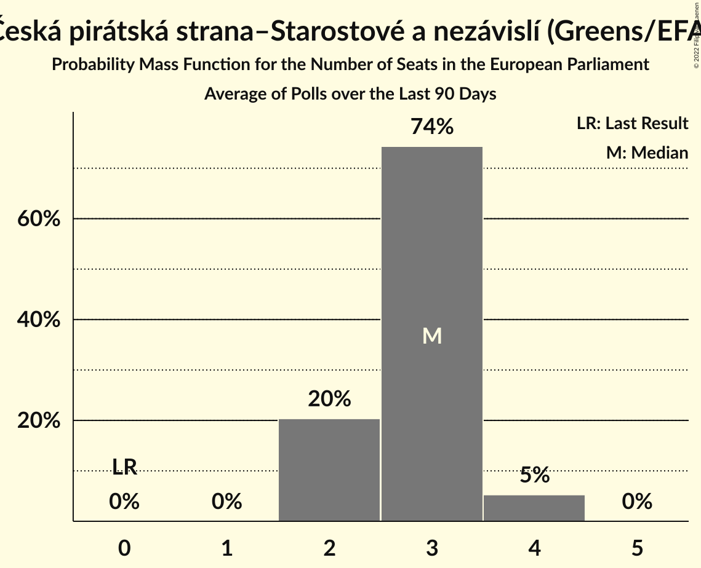

# Česká pirátská strana–Starostové a nezávislí (Greens/EFA)

<a href="#voting-intentions">Voting Intentions</a> | <a href="#seats">Seats</a>

## Voting Intentions

Last result: **0.0%** (General Election of 24–25 May 2019)

### Confidence Intervals

| Period     | Polling firm/Commissioner(s) | Median | 80% Confidence Interval | 90% Confidence Interval | 95% Confidence Interval | 99% Confidence Interval |
|:----------:|:----------------:|:-----------:|:-----------------------:|:-----------------------:|:-----------------------:|:-----------------------:|
| N/A | [Poll Average](average.html) | 17.4% | 15.6–19.1% | 15.0–19.5% | 14.5–19.9% | 13.6–20.8% |
| [1 November–1 December 2021](2021-12-01-Median.html) | Median | 16.4% | 14.8–18.3% | 14.3–18.8% | 13.9–19.3% | 13.2–20.2% |
| [1–19 November 2021](2021-11-19-Kantar.html) | Kantar   CT24 | 17.0% | 15.1–19.2% | 14.5–19.8% | 14.1–20.4% | 13.2–21.5% |
| [24–30 September 2021](2021-09-30-STEM.html) | STEM   CNN Prima News | 17.4% | 16.1–18.9% | 15.7–19.3% | 15.4–19.6% | 14.8–20.3% |
| [23–30 September 2021](2021-09-30-SANEP.html) | SANEP | 18.3% | 17.2–19.5% | 16.9–19.8% | 16.6–20.1% | 16.1–20.7% |
| [1–30 September 2021](2021-09-30-Median.html) | Median | 19.6% | 18.1–21.3% | 17.7–21.8% | 17.3–22.2% | 16.6–23.0% |
| [23–29 September 2021](2021-09-29-Median.html) | Median   iDNES | 19.4% | N/A | N/A | N/A | N/A |
| [13–22 September 2021](2021-09-22-Kantar.html) | Kantar   CT24 | 20.5% | 19.1–22.1% | 18.7–22.5% | 18.3–22.9% | 17.6–23.6% |
| [8–12 September 2021](2021-09-12-Ipsos.html) | Ipsos | 17.3% | 15.8–18.9% | 15.4–19.4% | 15.1–19.8% | 14.4–20.6% |
| [1–10 September 2021](2021-09-10-PhoenixResearch.html) | Phoenix Research | 15.6% | 14.2–17.1% | 13.8–17.5% | 13.5–17.9% | 12.9–18.6% |
| [2–9 September 2021](2021-09-09-SANEP.html) | SANEP | 17.8% | N/A | N/A | N/A | N/A |
| [31 August–8 September 2021](2021-09-08-STEM.html) | STEM | 18.0% | N/A | N/A | N/A | N/A |
| [30 August–8 September 2021](2021-09-08-DataCollect.html) | Data Collect | 21.0% | 19.5–22.6% | 19.1–23.0% | 18.8–23.4% | 18.1–24.2% |
| [1 August–2 September 2021](2021-09-02-Median.html) | Median | 20.5% | N/A | N/A | N/A | N/A |
| [2–13 August 2021](2021-08-13-Kantar.html) | Kantar   CT24 | 21.0% | N/A | N/A | N/A | N/A |
| [9–12 August 2021](2021-08-12-STEM.html) | STEM | 18.7% | N/A | N/A | N/A | N/A |
| [1–10 August 2021](2021-08-10-PhoenixResearch.html) | Phoenix Research | 18.0% | N/A | N/A | N/A | N/A |
| [1–31 July 2021](2021-07-31-Median.html) | Median | 20.0% | N/A | N/A | N/A | N/A |
| [8–14 July 2021](2021-07-14-SANEP.html) | SANEP | 23.4% | N/A | N/A | N/A | N/A |
| [26 June–11 July 2021](2021-07-11-CVVM.html) | CVVM | 21.0% | 18.5–23.8% | 17.8–24.6% | 17.2–25.3% | 16.1–26.7% |
| [1–10 July 2021](2021-07-10-PhoenixResearch.html) | Phoenix Research | 21.0% | N/A | N/A | N/A | N/A |
| [1–30 June 2021](2021-06-30-Median.html) | Median | 21.5% | 19.9–23.2% | 19.5–23.7% | 19.1–24.1% | 18.4–24.9% |
| [21–29 June 2021](2021-06-29-STEM.html) | STEM | 24.1% | 22.0–26.4% | 21.4–27.1% | 20.9–27.7% | 19.9–28.8% |
| [7–18 June 2021](2021-06-18-Kantar.html) | Kantar   CT24 | 24.0% | 22.3–25.9% | 21.8–26.4% | 21.4–26.9% | 20.6–27.8% |
| [10–15 June 2021](2021-06-15-SANEP.html) | SANEP | 25.1% | 23.8–26.4% | 23.5–26.7% | 23.2–27.1% | 22.6–27.7% |
| [29 May–13 June 2021](2021-06-13-CVVM.html) | CVVM | 22.6% | 20.5–24.8% | 20.0–25.4% | 19.5–25.9% | 18.5–27.0% |
| [31 May–11 June 2021](2021-06-11-DataCollect.html) | Data Collect   CT24 | 25.5% | 23.4–27.8% | 22.8–28.4% | 22.3–29.0% | 21.4–30.1% |
| [1–10 June 2021](2021-06-10-PhoenixResearch.html) | Phoenix Research | 25.5% | 23.8–27.2% | 23.4–27.7% | 23.0–28.2% | 22.2–29.0% |
| [2–6 June 2021](2021-06-06-Ipsos.html) | Ipsos | 22.4% | 20.4–24.6% | 19.8–25.2% | 19.4–25.7% | 18.5–26.8% |
| [1–31 May 2021](2021-05-31-Median.html) | Median | 23.8% | 22.2–25.5% | 21.7–26.0% | 21.3–26.4% | 20.6–27.3% |
| [10–28 May 2021](2021-05-28-Kantar.html) | Kantar   CT24 | 26.0% | 24.2–27.9% | 23.7–28.5% | 23.2–29.0% | 22.4–29.9% |
| [19–24 May 2021](2021-05-24-Ipsos.html) | Ipsos | 23.7% | 21.6–25.9% | 21.0–26.6% | 20.5–27.1% | 19.6–28.2% |
| [3–21 May 2021](2021-05-21-DataCollect.html) | Data Collect   CT24 | 27.0% | 24.9–29.3% | 24.2–30.0% | 23.7–30.6% | 22.7–31.7% |
| [13–19 May 2021](2021-05-19-SANEP.html) | SANEP | 26.7% | 25.4–28.1% | 25.1–28.5% | 24.7–28.8% | 24.1–29.4% |
| [1–15 May 2021](2021-05-15-PhoenixResearch.html) | Phoenix Research | 25.8% | 24.1–27.6% | 23.6–28.1% | 23.2–28.5% | 22.4–29.4% |
| [1 April–4 May 2021](2021-05-04-Median.html) | Median | 27.6% | 25.4–29.8% | 24.8–30.5% | 24.3–31.1% | 23.3–32.2% |
| [12–30 April 2021](2021-04-30-Kantar.html) | Kantar   CT24 | 27.0% | 25.4–28.7% | 25.0–29.2% | 24.6–29.6% | 23.8–30.4% |
| [15–21 April 2021](2021-04-21-SANEP.html) | SANEP | 26.4% | 24.8–28.1% | 24.4–28.5% | 24.0–29.0% | 23.3–29.8% |
| [7–13 April 2021](2021-04-13-STEM.html) | STEM | 27.9% | 26.2–29.8% | 25.7–30.3% | 25.3–30.7% | 24.5–31.6% |
| [8–12 April 2021](2021-04-12-Ipsos.html) | Ipsos   SPOLU | 27.9% | 26.2–29.8% | 25.7–30.3% | 25.3–30.8% | 24.4–31.7% |
| [1–10 April 2021](2021-04-10-PhoenixResearch.html) | Phoenix Research | 26.3% | 24.0–28.7% | 23.4–29.3% | 22.9–29.9% | 21.9–31.1% |
| [25 March–1 April 2021](2021-04-01-Kantar.html) | Kantar   CT24 | 29.5% | 27.7–31.5% | 27.2–32.0% | 26.7–32.5% | 25.8–33.5% |
| [25 March–1 April 2021](2021-04-01-DataCollect.html) | Data Collect   CT24 | 28.5% | 26.7–30.5% | 26.1–31.0% | 25.7–31.5% | 24.8–32.5% |
| [1–29 March 2021](2021-03-29-Median.html) | Median | 27.5% | 25.8–29.4% | 25.3–29.9% | 24.9–30.4% | 24.1–31.3% |
| [18–23 March 2021](2021-03-23-SANEP.html) | SANEP | 26.1% | 24.8–27.4% | 24.5–27.8% | 24.2–28.1% | 23.6–28.8% |
| [12–16 March 2021](2021-03-16-Ipsos.html) | Ipsos   SPOLU | 27.7% | 26.0–29.5% | 25.5–30.1% | 25.1–30.5% | 24.2–31.4% |
| [15 February–5 March 2021](2021-03-05-Kantar.html) | Kantar   CT24 | 34.0% | 32.0–36.0% | 31.5–36.6% | 31.0–37.1% | 30.1–38.1% |
| [1 February–2 March 2021](2021-03-02-Median.html) | Median | 25.0% | 23.3–26.8% | 22.9–27.3% | 22.5–27.7% | 21.7–28.6% |
| [18–23 February 2021](2021-02-23-SANEP.html) | SANEP | 24.9% | 23.7–26.2% | 23.3–26.6% | 23.0–26.9% | 22.5–27.5% |
| [15–19 February 2021](2021-02-19-Ipsos.html) | Ipsos   SPOLU | 24.9% | 23.2–26.7% | 22.7–27.2% | 22.3–27.7% | 21.5–28.6% |
| [18 January–5 February 2021](2021-02-05-TNSKantar.html) | TNS Kantar   O24 | 29.6% | 27.4–31.9% | 26.7–32.6% | 26.2–33.2% | 25.2–34.3% |
| [1–29 January 2021](2021-01-29-Median.html) | Median | 25.1% | 23.0–27.3% | 22.4–27.9% | 21.9–28.5% | 21.0–29.6% |
| [21–26 January 2021](2021-01-26-SANEP.html) | SANEP | 23.6% | 22.1–25.3% | 21.6–25.8% | 21.2–26.2% | 20.5–27.0% |
| [15–19 January 2021](2021-01-19-Ipsos.html) | Ipsos | 23.3% | 21.3–25.5% | 20.7–26.2% | 20.2–26.7% | 19.3–27.8% |
| [1–10 January 2021](2021-01-10-PhoenixResearch.html) | Phoenix Research | 21.1% | 19.2–23.2% | 18.7–23.7% | 18.2–24.2% | 17.4–25.3% |
| [11–16 December 2020](2020-12-16-SANEP.html) | SANEP | 0.0% | N/A | N/A | N/A | N/A |
| [13 November–4 December 2020](2020-12-04-TNSKantar.html) | TNS Kantar   O24 | 0.0% | N/A | N/A | N/A | N/A |
| [1–30 November 2020](2020-11-30-Median.html) | Median | 0.0% | N/A | N/A | N/A | N/A |
| [19 October–6 November 2020](2020-11-06-TNSKantar.html) | TNS Kantar   O24 | 0.0% | N/A | N/A | N/A | N/A |
| [1–29 October 2020](2020-10-29-Median.html) | Median | 0.0% | N/A | N/A | N/A | N/A |
| [21 September–9 October 2020](2020-10-09-TNSKantar.html) | TNS Kantar   O24 | 0.0% | N/A | N/A | N/A | N/A |
| [5–20 September 2020](2020-09-20-CVVM.html) | CVVM | 0.0% | N/A | N/A | N/A | N/A |
| [31 August–13 September 2020](2020-09-13-STEM.html) | STEM | 0.0% | N/A | N/A | N/A | N/A |
| [24 August–11 September 2020](2020-09-11-TNSKantar.html) | TNS Kantar   O24 | 0.0% | N/A | N/A | N/A | N/A |
| [1–27 August 2020](2020-08-27-Median.html) | Median | 0.0% | N/A | N/A | N/A | N/A |
| [18–27 July 2020](2020-07-27-CVVM.html) | CVVM | 0.0% | N/A | N/A | N/A | N/A |
| [15 June–3 July 2020](2020-07-03-TNSKantar.html) | TNS Kantar   O24 | 0.0% | N/A | N/A | N/A | N/A |
| [20 June–2 July 2020](2020-07-02-CVVM.html) | CVVM | 0.0% | N/A | N/A | N/A | N/A |
| [18 May–5 June 2020](2020-06-05-TNSKantar.html) | TNS Kantar   O24 | 0.0% | N/A | N/A | N/A | N/A |
| [22 May–1 June 2020](2020-06-01-STEM.html) | STEM | 0.0% | N/A | N/A | N/A | N/A |
| [7–13 May 2020](2020-05-13-SANEP.html) | SANEP | 0.0% | N/A | N/A | N/A | N/A |
| [13–30 April 2020](2020-04-30-TNSKantar.html) | TNS Kantar   O24 | 0.0% | N/A | N/A | N/A | N/A |
| [9–27 March 2020](2020-03-27-TNSKantar.html) | TNS Kantar   O24 | 0.0% | N/A | N/A | N/A | N/A |
| [29 February–26 March 2020](2020-03-26-Median.html) | Median | 0.0% | N/A | N/A | N/A | N/A |
| [29 February–11 March 2020](2020-03-11-CVVM.html) | CVVM | 0.0% | N/A | N/A | N/A | N/A |
| [10–28 February 2020](2020-02-28-TNSKantar.html) | TNS Kantar   O24 | 0.0% | N/A | N/A | N/A | N/A |
| [1 January–13 February 2020](2020-02-13-Median.html) | Median | 0.0% | N/A | N/A | N/A | N/A |
| [1–13 February 2020](2020-02-13-CVVM.html) | CVVM | 0.0% | N/A | N/A | N/A | N/A |
| [13–31 January 2020](2020-01-31-TNSKantar.html) | TNS Kantar | 0.0% | N/A | N/A | N/A | N/A |
| [11–20 January 2020](2020-01-20-CVVM.html) | CVVM | 0.0% | N/A | N/A | N/A | N/A |
| [1–12 January 2020](2020-01-12-PhoenixResearch.html) | Phoenix Research | 0.0% | N/A | N/A | N/A | N/A |
| [30 November–11 December 2019](2019-12-11-CVVM.html) | CVVM | 0.0% | N/A | N/A | N/A | N/A |
| [29 October–30 November 2019](2019-11-30-Median.html) | Median | 0.0% | N/A | N/A | N/A | N/A |
| [9–29 November 2019](2019-11-29-TNSKantar.html) | TNS Kantar | 0.0% | N/A | N/A | N/A | N/A |
| [21–27 November 2019](2019-11-27-SANEP.html) | SANEP | 0.0% | N/A | N/A | N/A | N/A |
| [14–26 November 2019](2019-11-26-STEM.html) | STEM | 0.0% | N/A | N/A | N/A | N/A |
| [1–18 November 2019](2019-11-18-PhoenixResearch.html) | Phoenix Research | 0.0% | N/A | N/A | N/A | N/A |
| [2–15 November 2019](2019-11-15-CVVM.html) | CVVM | 0.0% | N/A | N/A | N/A | N/A |
| [12 October–1 November 2019](2019-11-01-TNSKantar.html) | TNS Kantar | 0.0% | N/A | N/A | N/A | N/A |
| [30 September–28 October 2019](2019-10-28-Median.html) | Median | 0.0% | N/A | N/A | N/A | N/A |
| [11–25 October 2019](2019-10-25-STEM.html) | STEM | 0.0% | N/A | N/A | N/A | N/A |
| [16 September–5 October 2019](2019-10-05-TNSKantar.html) | TNS Kantar | 0.0% | N/A | N/A | N/A | N/A |
| [28 August–29 September 2019](2019-09-29-Median.html) | Median | 0.0% | N/A | N/A | N/A | N/A |
| [20 August–18 September 2019](2019-09-18-PhoenixResearch.html) | Phoenix Research | 0.0% | N/A | N/A | N/A | N/A |
| [7–17 September 2019](2019-09-17-CVVM.html) | CVVM | 0.0% | N/A | N/A | N/A | N/A |
| [10–30 August 2019](2019-08-30-TNSKantar.html) | TNS Kantar | 0.0% | N/A | N/A | N/A | N/A |
| [27 July–26 August 2019](2019-08-26-Median.html) | Median | 0.0% | N/A | N/A | N/A | N/A |
| [1–26 July 2019](2019-07-26-Median.html) | Median | 0.0% | N/A | N/A | N/A | N/A |
| [1–30 June 2019](2019-06-30-Median.html) | Median | 0.0% | N/A | N/A | N/A | N/A |
| [17–26 June 2019](2019-06-26-TNSKantar.html) | TNS Kantar   Česká televize | 0.0% | N/A | N/A | N/A | N/A |
| [8–17 June 2019](2019-06-17-CVVM.html) | CVVM | 0.0% | N/A | N/A | N/A | N/A |
| [11–31 May 2019](2019-05-31-TNSKantar.html) | TNS Kantar   Česká televize | 0.0% | N/A | N/A | N/A | N/A |

### Probability Mass Function

The following table shows the probability mass function per percentage block of voting intentions for the [poll average](average.html) for Česká pirátská strana–Starostové a nezávislí (Greens/EFA).

| Voting Intentions | Probability | Accumulated | Special Marks |
|:-----------------:|:-----------:|:-----------:|:-------------:|
| 0.0–0.5% | 0% | 100% | Last Result |
| 0.5–1.5% | 0% | 100% |  |
| 1.5–2.5% | 0% | 100% |  |
| 2.5–3.5% | 0% | 100% |  |
| 3.5–4.5% | 0% | 100% |  |
| 4.5–5.5% | 0% | 100% |  |
| 5.5–6.5% | 0% | 100% |  |
| 6.5–7.5% | 0% | 100% |  |
| 7.5–8.5% | 0% | 100% |  |
| 8.5–9.5% | 0% | 100% |  |
| 9.5–10.5% | 0% | 100% |  |
| 10.5–11.5% | 0% | 100% |  |
| 11.5–12.5% | 0% | 100% |  |
| 12.5–13.5% | 0.4% | 100% |  |
| 13.5–14.5% | 2% | 99.6% |  |
| 14.5–15.5% | 7% | 97% |  |
| 15.5–16.5% | 17% | 90% |  |
| 16.5–17.5% | 26% | 73% | Median |
| 17.5–18.5% | 27% | 46% |  |
| 18.5–19.5% | 15% | 19% |  |
| 19.5–20.5% | 4% | 5% |  |
| 20.5–21.5% | 0.6% | 0.8% |  |
| 21.5–22.5% | 0.1% | 0.1% |  |
| 22.5–23.5% | 0% | 0% |  |

## Seats

Last result: **0** seats (General Election of 24–25 May 2019)

### Confidence Intervals

| Period     | Polling firm/Commissioner(s) | Median | 80% Confidence Interval | 90% Confidence Interval | 95% Confidence Interval | 99% Confidence Interval |
|:----------:|:----------------:|:------:|:-----------------------:|:-----------------------:|:-----------------------:|:-----------------------:|
| N/A | [Poll Average](average.html) | 4 | 4–5 | 4–5 | 3–5 | 3–5 |
| [1 November–1 December 2021](2021-12-01-Median.html) | Median | 4 | 4–5 | 3–5 | 3–5 | 3–5 |
| [1–19 November 2021](2021-11-19-Kantar.html) | Kantar   CT24 | 4 | 4–5 | 3–5 | 3–5 | 3–5 |
| [24–30 September 2021](2021-09-30-STEM.html) | STEM   CNN Prima News | 4 | 4–5 | 4–5 | 4–5 | 3–5 |
| [23–30 September 2021](2021-09-30-SANEP.html) | SANEP | 4 | 4–5 | 4–5 | 4–5 | 4–5 |
| [1–30 September 2021](2021-09-30-Median.html) | Median | 5 | 4–5 | 4–6 | 4–6 | 4–6 |
| [23–29 September 2021](2021-09-29-Median.html) | Median   iDNES |  |  |  |  |  |
| [13–22 September 2021](2021-09-22-Kantar.html) | Kantar   CT24 | 5 | 5–6 | 5–6 | 4–6 | 4–6 |
| [8–12 September 2021](2021-09-12-Ipsos.html) | Ipsos | 4 | 4–5 | 4–5 | 4–5 | 3–5 |
| [1–10 September 2021](2021-09-10-PhoenixResearch.html) | Phoenix Research | 4 | 3–4 | 3–4 | 3–4 | 3–5 |
| [2–9 September 2021](2021-09-09-SANEP.html) | SANEP |  |  |  |  |  |
| [31 August–8 September 2021](2021-09-08-STEM.html) | STEM |  |  |  |  |  |
| [30 August–8 September 2021](2021-09-08-DataCollect.html) | Data Collect | 5 | 5–6 | 5–6 | 5–6 | 4–6 |
| [1 August–2 September 2021](2021-09-02-Median.html) | Median |  |  |  |  |  |
| [2–13 August 2021](2021-08-13-Kantar.html) | Kantar   CT24 |  |  |  |  |  |
| [9–12 August 2021](2021-08-12-STEM.html) | STEM |  |  |  |  |  |
| [1–10 August 2021](2021-08-10-PhoenixResearch.html) | Phoenix Research |  |  |  |  |  |
| [1–31 July 2021](2021-07-31-Median.html) | Median |  |  |  |  |  |
| [8–14 July 2021](2021-07-14-SANEP.html) | SANEP |  |  |  |  |  |
| [26 June–11 July 2021](2021-07-11-CVVM.html) | CVVM | 5 | 4–6 | 4–6 | 4–6 | 4–7 |
| [1–10 July 2021](2021-07-10-PhoenixResearch.html) | Phoenix Research |  |  |  |  |  |
| [1–30 June 2021](2021-06-30-Median.html) | Median | 5 | 5–6 | 5–6 | 5–6 | 4–6 |
| [21–29 June 2021](2021-06-29-STEM.html) | STEM | 6 | 5–7 | 5–7 | 5–7 | 5–7 |
| [7–18 June 2021](2021-06-18-Kantar.html) | Kantar   CT24 | 6 | 5–6 | 5–7 | 5–7 | 5–7 |
| [10–15 June 2021](2021-06-15-SANEP.html) | SANEP | 6 | 6–7 | 6–7 | 6–7 | 5–7 |
| [29 May–13 June 2021](2021-06-13-CVVM.html) | CVVM | 5 | 5–6 | 5–6 | 5–6 | 4–7 |
| [31 May–11 June 2021](2021-06-11-DataCollect.html) | Data Collect   CT24 | 6 | 6–7 | 6–7 | 5–7 | 5–8 |
| [1–10 June 2021](2021-06-10-PhoenixResearch.html) | Phoenix Research | 7 | 6–7 | 6–7 | 6–8 | 5–8 |
| [2–6 June 2021](2021-06-06-Ipsos.html) | Ipsos | 6 | 5–7 | 5–7 | 5–7 | 4–7 |
| [1–31 May 2021](2021-05-31-Median.html) | Median | 6 | 6 | 5–7 | 5–7 | 5–7 |
| [10–28 May 2021](2021-05-28-Kantar.html) | Kantar   CT24 | 7 | 6–7 | 6–8 | 6–8 | 6–8 |
| [19–24 May 2021](2021-05-24-Ipsos.html) | Ipsos | 6 | 5–7 | 5–7 | 5–7 | 5–7 |
| [3–21 May 2021](2021-05-21-DataCollect.html) | Data Collect   CT24 | 7 | 6–7 | 6–8 | 6–8 | 6–8 |
| [13–19 May 2021](2021-05-19-SANEP.html) | SANEP | 7 | 6–7 | 6–7 | 6–7 | 6–8 |
| [1–15 May 2021](2021-05-15-PhoenixResearch.html) | Phoenix Research | 7 | 6–7 | 6–7 | 6–8 | 5–8 |
| [1 April–4 May 2021](2021-05-04-Median.html) | Median | 7 | 6–8 | 6–8 | 6–8 | 6–8 |
| [12–30 April 2021](2021-04-30-Kantar.html) | Kantar   CT24 | 7 | 6–7 | 6–8 | 6–8 | 6–8 |
| [15–21 April 2021](2021-04-21-SANEP.html) | SANEP | 7 | 6–7 | 6–7 | 6–7 | 6–8 |
| [7–13 April 2021](2021-04-13-STEM.html) | STEM | 7 | 6–7 | 6–7 | 6–8 | 6–8 |
| [8–12 April 2021](2021-04-12-Ipsos.html) | Ipsos   SPOLU | 7 | 6–8 | 6–8 | 6–8 | 6–8 |
| [1–10 April 2021](2021-04-10-PhoenixResearch.html) | Phoenix Research | 6 | 6–7 | 5–7 | 5–7 | 5–8 |
| [25 March–1 April 2021](2021-04-01-Kantar.html) | Kantar   CT24 | 7 | 7–8 | 7–8 | 6–8 | 6–9 |
| [25 March–1 April 2021](2021-04-01-DataCollect.html) | Data Collect   CT24 | 7 | 6–8 | 6–8 | 6–8 | 6–8 |
| [1–29 March 2021](2021-03-29-Median.html) | Median | 7 | 6–7 | 6–8 | 6–8 | 6–8 |
| [18–23 March 2021](2021-03-23-SANEP.html) | SANEP | 6 | 6–7 | 6–7 | 6–7 | 6–7 |
| [12–16 March 2021](2021-03-16-Ipsos.html) | Ipsos   SPOLU | 7 | 6–7 | 6–8 | 6–8 | 6–8 |
| [15 February–5 March 2021](2021-03-05-Kantar.html) | Kantar   CT24 | 8 | 7–9 | 7–9 | 7–9 | 7–9 |
| [1 February–2 March 2021](2021-03-02-Median.html) | Median | 6 | 6–7 | 5–7 | 5–7 | 5–7 |
| [18–23 February 2021](2021-02-23-SANEP.html) | SANEP | 6 | 6 | 5–7 | 5–7 | 5–7 |
| [15–19 February 2021](2021-02-19-Ipsos.html) | Ipsos   SPOLU | 6 | 6–7 | 6–7 | 5–7 | 5–7 |
| [18 January–5 February 2021](2021-02-05-TNSKantar.html) | TNS Kantar   O24 | 7 | 6–8 | 6–8 | 6–8 | 6–8 |
| [1–29 January 2021](2021-01-29-Median.html) | Median | 6 | 5–7 | 5–7 | 5–7 | 5–7 |
| [21–26 January 2021](2021-01-26-SANEP.html) | SANEP | 6 | 5–6 | 5–6 | 5–6 | 5–7 |
| [15–19 January 2021](2021-01-19-Ipsos.html) | Ipsos | 6 | 5–6 | 5–6 | 5–7 | 4–7 |
| [1–10 January 2021](2021-01-10-PhoenixResearch.html) | Phoenix Research | 5 | 4–6 | 4–6 | 4–6 | 4–6 |
| [11–16 December 2020](2020-12-16-SANEP.html) | SANEP |  |  |  |  |  |
| [13 November–4 December 2020](2020-12-04-TNSKantar.html) | TNS Kantar   O24 |  |  |  |  |  |
| [1–30 November 2020](2020-11-30-Median.html) | Median |  |  |  |  |  |
| [19 October–6 November 2020](2020-11-06-TNSKantar.html) | TNS Kantar   O24 |  |  |  |  |  |
| [1–29 October 2020](2020-10-29-Median.html) | Median |  |  |  |  |  |
| [21 September–9 October 2020](2020-10-09-TNSKantar.html) | TNS Kantar   O24 |  |  |  |  |  |
| [5–20 September 2020](2020-09-20-CVVM.html) | CVVM |  |  |  |  |  |
| [31 August–13 September 2020](2020-09-13-STEM.html) | STEM |  |  |  |  |  |
| [24 August–11 September 2020](2020-09-11-TNSKantar.html) | TNS Kantar   O24 |  |  |  |  |  |
| [1–27 August 2020](2020-08-27-Median.html) | Median |  |  |  |  |  |
| [18–27 July 2020](2020-07-27-CVVM.html) | CVVM |  |  |  |  |  |
| [15 June–3 July 2020](2020-07-03-TNSKantar.html) | TNS Kantar   O24 |  |  |  |  |  |
| [20 June–2 July 2020](2020-07-02-CVVM.html) | CVVM |  |  |  |  |  |
| [18 May–5 June 2020](2020-06-05-TNSKantar.html) | TNS Kantar   O24 |  |  |  |  |  |
| [22 May–1 June 2020](2020-06-01-STEM.html) | STEM |  |  |  |  |  |
| [7–13 May 2020](2020-05-13-SANEP.html) | SANEP |  |  |  |  |  |
| [13–30 April 2020](2020-04-30-TNSKantar.html) | TNS Kantar   O24 |  |  |  |  |  |
| [9–27 March 2020](2020-03-27-TNSKantar.html) | TNS Kantar   O24 |  |  |  |  |  |
| [29 February–26 March 2020](2020-03-26-Median.html) | Median |  |  |  |  |  |
| [29 February–11 March 2020](2020-03-11-CVVM.html) | CVVM |  |  |  |  |  |
| [10–28 February 2020](2020-02-28-TNSKantar.html) | TNS Kantar   O24 |  |  |  |  |  |
| [1 January–13 February 2020](2020-02-13-Median.html) | Median |  |  |  |  |  |
| [1–13 February 2020](2020-02-13-CVVM.html) | CVVM |  |  |  |  |  |
| [13–31 January 2020](2020-01-31-TNSKantar.html) | TNS Kantar |  |  |  |  |  |
| [11–20 January 2020](2020-01-20-CVVM.html) | CVVM |  |  |  |  |  |
| [1–12 January 2020](2020-01-12-PhoenixResearch.html) | Phoenix Research |  |  |  |  |  |
| [30 November–11 December 2019](2019-12-11-CVVM.html) | CVVM |  |  |  |  |  |
| [29 October–30 November 2019](2019-11-30-Median.html) | Median |  |  |  |  |  |
| [9–29 November 2019](2019-11-29-TNSKantar.html) | TNS Kantar |  |  |  |  |  |
| [21–27 November 2019](2019-11-27-SANEP.html) | SANEP |  |  |  |  |  |
| [14–26 November 2019](2019-11-26-STEM.html) | STEM |  |  |  |  |  |
| [1–18 November 2019](2019-11-18-PhoenixResearch.html) | Phoenix Research |  |  |  |  |  |
| [2–15 November 2019](2019-11-15-CVVM.html) | CVVM |  |  |  |  |  |
| [12 October–1 November 2019](2019-11-01-TNSKantar.html) | TNS Kantar |  |  |  |  |  |
| [30 September–28 October 2019](2019-10-28-Median.html) | Median |  |  |  |  |  |
| [11–25 October 2019](2019-10-25-STEM.html) | STEM |  |  |  |  |  |
| [16 September–5 October 2019](2019-10-05-TNSKantar.html) | TNS Kantar |  |  |  |  |  |
| [28 August–29 September 2019](2019-09-29-Median.html) | Median |  |  |  |  |  |
| [20 August–18 September 2019](2019-09-18-PhoenixResearch.html) | Phoenix Research |  |  |  |  |  |
| [7–17 September 2019](2019-09-17-CVVM.html) | CVVM |  |  |  |  |  |
| [10–30 August 2019](2019-08-30-TNSKantar.html) | TNS Kantar |  |  |  |  |  |
| [27 July–26 August 2019](2019-08-26-Median.html) | Median |  |  |  |  |  |
| [1–26 July 2019](2019-07-26-Median.html) | Median |  |  |  |  |  |
| [1–30 June 2019](2019-06-30-Median.html) | Median |  |  |  |  |  |
| [17–26 June 2019](2019-06-26-TNSKantar.html) | TNS Kantar   Česká televize |  |  |  |  |  |
| [8–17 June 2019](2019-06-17-CVVM.html) | CVVM |  |  |  |  |  |
| [11–31 May 2019](2019-05-31-TNSKantar.html) | TNS Kantar   Česká televize |  |  |  |  |  |

### Probability Mass Function

The following table shows the probability mass function per seat for the [poll average](average.html) for Česká pirátská strana–Starostové a nezávislí (Greens/EFA).

| Number of Seats | Probability | Accumulated | Special Marks |
|:---------------:|:-----------:|:-----------:|:-------------:|
| 0 | 0% | 100% | Last Result |
| 1 | 0% | 100% |  |
| 2 | 0% | 100% |  |
| 3 | 3% | 100% |  |
| 4 | 70% | 97% | Median |
| 5 | 26% | 26% |  |
| 6 | 0.1% | 0.1% |  |
| 7 | 0% | 0% |  |

