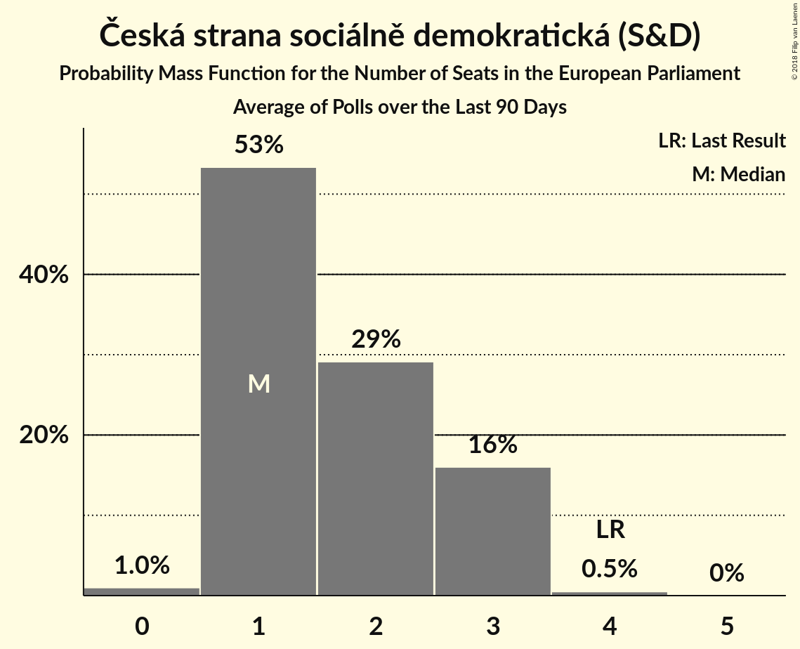

# Česká strana sociálně demokratická (S&D)

<a href="#voting-intentions">Voting Intentions</a> | <a href="#seats">Seats</a>

## Voting Intentions

Last result: **14.2%** (General Election of 24–25 May 2019)

### Confidence Intervals

| Period     | Polling firm/Commissioner(s) | Median | 80% Confidence Interval | 90% Confidence Interval | 95% Confidence Interval | 99% Confidence Interval |
|:----------:|:----------------:|:-----------:|:-----------------------:|:-----------------------:|:-----------------------:|:-----------------------:|
| N/A | [Poll Average](average.html) | 5.4% | 4.3–6.5% | 4.0–6.8% | 3.7–7.1% | 3.3–7.8% |
| [1 May–2 June 2022](2022-06-02-Median.html) | Median | 5.5% | 4.7–6.5% | 4.5–6.8% | 4.3–7.1% | 3.9–7.6% |
| [16 May–2 June 2022](2022-06-02-Kantar.html) | Kantar   CT24 | 5.1% | 4.0–6.5% | 3.7–6.9% | 3.5–7.2% | 3.1–7.9% |
| [8–29 April 2022](2022-04-29-Kantar.html) | Kantar   CT24 | 4.0% | 3.2–5.2% | 2.9–5.6% | 2.7–5.9% | 2.3–6.6% |
| [14 March–1 April 2022](2022-04-01-Kantar.html) | Kantar   CT24 | 3.0% | N/A | N/A | N/A | N/A |
| [14 February–4 March 2022](2022-03-04-Kantar.html) | Kantar   CT24 | 3.0% | N/A | N/A | N/A | N/A |
| [1 November–1 December 2021](2021-12-01-Median.html) | Median | 4.5% | 3.7–5.7% | 3.4–6.0% | 3.2–6.3% | 2.9–6.9% |
| [1–19 November 2021](2021-11-19-Kantar.html) | Kantar   CT24 | 4.0% | 3.1–5.3% | 2.9–5.7% | 2.7–6.0% | 2.3–6.7% |
| [24–30 September 2021](2021-09-30-STEM.html) | STEM   CNN Prima News | 4.4% | 3.7–5.3% | 3.6–5.5% | 3.4–5.7% | 3.1–6.1% |
| [1–30 September 2021](2021-09-30-Median.html) | Median | 4.9% | 4.1–5.9% | 3.9–6.2% | 3.7–6.4% | 3.4–6.9% |
| [23–29 September 2021](2021-09-29-Median.html) | Median   iDNES | 5.6% | N/A | N/A | N/A | N/A |
| [13–22 September 2021](2021-09-22-Kantar.html) | Kantar   CT24 | 4.5% | 3.8–5.4% | 3.6–5.6% | 3.5–5.8% | 3.2–6.3% |
| [8–12 September 2021](2021-09-12-Ipsos.html) | Ipsos | 4.1% | 3.4–5.0% | 3.2–5.3% | 3.0–5.5% | 2.7–6.0% |
| [1–10 September 2021](2021-09-10-PhoenixResearch.html) | Phoenix Research | 6.0% | 5.2–7.0% | 4.9–7.3% | 4.7–7.6% | 4.4–8.1% |
| [31 August–8 September 2021](2021-09-08-STEM.html) | STEM | 4.4% | N/A | N/A | N/A | N/A |
| [30 August–8 September 2021](2021-09-08-DataCollect.html) | Data Collect | 4.0% | 3.4–4.8% | 3.2–5.1% | 3.0–5.3% | 2.7–5.7% |
| [1 August–2 September 2021](2021-09-02-Median.html) | Median | 4.5% | N/A | N/A | N/A | N/A |
| [2–13 August 2021](2021-08-13-Kantar.html) | Kantar   CT24 | 3.5% | N/A | N/A | N/A | N/A |
| [9–12 August 2021](2021-08-12-STEM.html) | STEM | 4.6% | N/A | N/A | N/A | N/A |
| [1–10 August 2021](2021-08-10-PhoenixResearch.html) | Phoenix Research | 5.1% | N/A | N/A | N/A | N/A |
| [1–31 July 2021](2021-07-31-Median.html) | Median | 4.5% | N/A | N/A | N/A | N/A |
| [26 June–11 July 2021](2021-07-11-CVVM.html) | CVVM | 6.4% | 5.1–8.3% | 4.7–8.8% | 4.4–9.3% | 3.8–10.3% |
| [1–10 July 2021](2021-07-10-PhoenixResearch.html) | Phoenix Research | 5.0% | N/A | N/A | N/A | N/A |
| [1–30 June 2021](2021-06-30-Median.html) | Median | 5.0% | 4.3–6.0% | 4.0–6.3% | 3.9–6.6% | 3.5–7.1% |
| [21–29 June 2021](2021-06-29-STEM.html) | STEM | 5.4% | 4.4–6.8% | 4.1–7.2% | 3.9–7.6% | 3.5–8.3% |
| [7–18 June 2021](2021-06-18-Kantar.html) | Kantar   CT24 | 3.5% | 2.8–4.4% | 2.6–4.6% | 2.5–4.9% | 2.2–5.3% |
| [29 May–13 June 2021](2021-06-13-CVVM.html) | CVVM | 7.5% | 6.3–9.0% | 6.0–9.4% | 5.7–9.8% | 5.2–10.5% |
| [31 May–11 June 2021](2021-06-11-DataCollect.html) | Data Collect   CT24 | 5.0% | 4.1–6.2% | 3.8–6.6% | 3.6–6.9% | 3.2–7.6% |
| [1–10 June 2021](2021-06-10-PhoenixResearch.html) | Phoenix Research | 5.4% | 4.6–6.4% | 4.4–6.6% | 4.2–6.9% | 3.8–7.4% |
| [2–6 June 2021](2021-06-06-Ipsos.html) | Ipsos | 4.7% | 3.8–5.9% | 3.5–6.2% | 3.3–6.5% | 2.9–7.2% |
| [1–31 May 2021](2021-05-31-Median.html) | Median | 6.9% | 6.0–8.0% | 5.7–8.3% | 5.5–8.6% | 5.1–9.1% |
| [10–28 May 2021](2021-05-28-Kantar.html) | Kantar   CT24 | 3.0% | 2.4–3.9% | 2.2–4.1% | 2.1–4.3% | 1.8–4.8% |
| [19–24 May 2021](2021-05-24-Ipsos.html) | Ipsos | 4.0% | 3.2–5.2% | 3.0–5.6% | 2.8–5.9% | 2.4–6.5% |
| [3–21 May 2021](2021-05-21-DataCollect.html) | Data Collect   CT24 | 3.5% | 2.8–4.7% | 2.6–5.0% | 2.4–5.3% | 2.1–5.9% |
| [1–15 May 2021](2021-05-15-PhoenixResearch.html) | Phoenix Research | 5.3% | 4.5–6.3% | 4.3–6.6% | 4.1–6.9% | 3.7–7.4% |
| [1 April–4 May 2021](2021-05-04-Median.html) | Median | 6.5% | 5.4–7.9% | 5.1–8.3% | 4.9–8.6% | 4.4–9.4% |
| [12–30 April 2021](2021-04-30-Kantar.html) | Kantar   CT24 | 4.0% | 3.4–4.8% | 3.2–5.1% | 3.0–5.3% | 2.7–5.7% |
| [7–13 April 2021](2021-04-13-STEM.html) | STEM | 7.1% | 6.1–8.2% | 5.9–8.5% | 5.7–8.8% | 5.2–9.3% |
| [8–12 April 2021](2021-04-12-Ipsos.html) | Ipsos   SPOLU | 4.5% | 3.7–5.4% | 3.5–5.7% | 3.4–5.9% | 3.0–6.4% |
| [1–10 April 2021](2021-04-10-PhoenixResearch.html) | Phoenix Research | 6.2% | 5.1–7.6% | 4.8–8.0% | 4.5–8.4% | 4.0–9.2% |
| [25 March–1 April 2021](2021-04-01-Kantar.html) | Kantar   CT24 | 3.0% | 2.3–3.8% | 2.2–4.0% | 2.0–4.2% | 1.8–4.7% |
| [25 March–1 April 2021](2021-04-01-DataCollect.html) | Data Collect   CT24 | 3.7% | 3.0–4.6% | 2.8–4.9% | 2.7–5.1% | 2.4–5.6% |
| [1–29 March 2021](2021-03-29-Median.html) | Median | 4.0% | 3.4–5.0% | 3.2–5.2% | 3.0–5.5% | 2.7–5.9% |
| [12–16 March 2021](2021-03-16-Ipsos.html) | Ipsos   SPOLU | 4.2% | 3.4–5.1% | 3.3–5.3% | 3.1–5.5% | 2.8–6.0% |
| [15 February–5 March 2021](2021-03-05-Kantar.html) | Kantar   CT24 | 4.5% | 3.7–5.5% | 3.5–5.7% | 3.3–6.0% | 3.0–6.5% |
| [1 February–2 March 2021](2021-03-02-Median.html) | Median | 4.5% | 3.8–5.4% | 3.6–5.7% | 3.4–5.9% | 3.1–6.4% |
| [15–19 February 2021](2021-02-19-Ipsos.html) | Ipsos   SPOLU | 5.5% | 4.7–6.5% | 4.4–6.8% | 4.3–7.1% | 3.9–7.6% |
| [18 January–5 February 2021](2021-02-05-TNSKantar.html) | TNS Kantar   O24 | 4.0% | 3.1–5.1% | 2.9–5.5% | 2.7–5.7% | 2.4–6.4% |
| [1–29 January 2021](2021-01-29-Median.html) | Median | 7.0% | 5.9–8.4% | 5.5–8.8% | 5.3–9.2% | 4.8–9.9% |
| [15–19 January 2021](2021-01-19-Ipsos.html) | Ipsos | 5.8% | 4.8–7.2% | 4.5–7.6% | 4.3–7.9% | 3.8–8.6% |
| [1–10 January 2021](2021-01-10-PhoenixResearch.html) | Phoenix Research | 6.1% | 5.1–7.4% | 4.8–7.8% | 4.5–8.1% | 4.1–8.8% |
| [13 November–4 December 2020](2020-12-04-TNSKantar.html) | TNS Kantar   O24 | 4.5% | 3.7–5.5% | 3.5–5.8% | 3.3–6.0% | 2.9–6.6% |
| [1–30 November 2020](2020-11-30-Median.html) | Median | 7.0% | 5.9–8.5% | 5.5–8.9% | 5.3–9.3% | 4.8–10.1% |
| [19 October–6 November 2020](2020-11-06-TNSKantar.html) | TNS Kantar   O24 | 3.1% | 2.4–4.0% | 2.2–4.2% | 2.1–4.4% | 1.8–4.9% |
| [1–29 October 2020](2020-10-29-Median.html) | Median | 6.4% | 5.4–7.8% | 5.1–8.1% | 4.8–8.5% | 4.4–9.2% |
| [21 September–9 October 2020](2020-10-09-TNSKantar.html) | TNS Kantar   O24 | 4.1% | 3.3–5.0% | 3.1–5.3% | 3.0–5.5% | 2.6–6.1% |
| [5–20 September 2020](2020-09-20-CVVM.html) | CVVM | 10.5% | 9.1–12.2% | 8.7–12.7% | 8.4–13.1% | 7.8–14.0% |
| [31 August–13 September 2020](2020-09-13-STEM.html) | STEM | 7.3% | 6.4–8.5% | 6.1–8.8% | 5.9–9.1% | 5.4–9.6% |
| [24 August–11 September 2020](2020-09-11-TNSKantar.html) | TNS Kantar   O24 | 5.6% | 4.7–6.7% | 4.4–7.0% | 4.2–7.3% | 3.9–7.8% |
| [1–27 August 2020](2020-08-27-Median.html) | Median | 9.5% | 8.5–10.8% | 8.2–11.2% | 7.9–11.5% | 7.4–12.1% |
| [18–27 July 2020](2020-07-27-CVVM.html) | CVVM | 9.4% | 8.1–11.2% | 7.7–11.6% | 7.3–12.1% | 6.7–12.9% |
| [15 June–3 July 2020](2020-07-03-TNSKantar.html) | TNS Kantar   O24 | 5.0% | 4.5–5.6% | 4.3–5.8% | 4.2–5.9% | 4.0–6.2% |
| [20 June–2 July 2020](2020-07-02-CVVM.html) | CVVM | 13.1% | 11.5–14.8% | 11.1–15.3% | 10.7–15.8% | 10.1–16.7% |
| [18 May–5 June 2020](2020-06-05-TNSKantar.html) | TNS Kantar   O24 | 5.5% | 4.7–6.4% | 4.5–6.7% | 4.3–7.0% | 4.0–7.4% |
| [22 May–1 June 2020](2020-06-01-STEM.html) | STEM | 8.9% | 7.9–10.1% | 7.6–10.5% | 7.4–10.8% | 6.9–11.4% |
| [13–30 April 2020](2020-04-30-TNSKantar.html) | TNS Kantar   O24 | 5.5% | 4.6–6.6% | 4.4–6.9% | 4.2–7.2% | 3.8–7.8% |
| [9–27 March 2020](2020-03-27-TNSKantar.html) | TNS Kantar   O24 | 6.0% | 5.1–7.1% | 4.8–7.4% | 4.6–7.7% | 4.2–8.2% |
| [29 February–26 March 2020](2020-03-26-Median.html) | Median | 7.5% | 6.5–8.6% | 6.2–8.9% | 6.0–9.3% | 5.6–9.8% |
| [29 February–11 March 2020](2020-03-11-CVVM.html) | CVVM | 8.5% | 7.2–10.0% | 6.8–10.5% | 6.5–10.9% | 6.0–11.7% |
| [10–28 February 2020](2020-02-28-TNSKantar.html) | TNS Kantar   O24 | 5.6% | 4.6–6.9% | 4.3–7.3% | 4.0–7.6% | 3.6–8.3% |
| [1 January–13 February 2020](2020-02-13-Median.html) | Median | 7.1% | 6.0–8.5% | 5.6–8.9% | 5.4–9.2% | 4.9–9.9% |
| [1–13 February 2020](2020-02-13-CVVM.html) | CVVM | 9.0% | 7.7–10.7% | 7.3–11.1% | 7.0–11.5% | 6.4–12.3% |
| [13–31 January 2020](2020-01-31-TNSKantar.html) | TNS Kantar | 4.9% | 3.9–6.3% | 3.6–6.7% | 3.4–7.1% | 2.9–7.8% |
| [11–20 January 2020](2020-01-20-CVVM.html) | CVVM | 8.4% | 7.3–9.9% | 6.9–10.3% | 6.7–10.7% | 6.1–11.4% |
| [1–12 January 2020](2020-01-12-PhoenixResearch.html) | Phoenix Research | 7.0% | 6.1–8.1% | 5.8–8.5% | 5.6–8.7% | 5.2–9.3% |
| [30 November–11 December 2019](2019-12-11-CVVM.html) | CVVM | 10.0% | 8.6–11.5% | 8.3–12.0% | 8.0–12.4% | 7.4–13.2% |
| [29 October–30 November 2019](2019-11-30-Median.html) | Median | 7.5% | 6.5–8.6% | 6.3–8.9% | 6.1–9.1% | 5.7–9.7% |
| [9–29 November 2019](2019-11-29-TNSKantar.html) | TNS Kantar | 5.9% | 5.1–6.9% | 4.9–7.2% | 4.7–7.4% | 4.4–7.9% |
| [14–26 November 2019](2019-11-26-STEM.html) | STEM | 6.4% | 5.5–7.4% | 5.3–7.7% | 5.1–8.0% | 4.7–8.5% |
| [1–18 November 2019](2019-11-18-PhoenixResearch.html) | Phoenix Research | 5.7% | 4.9–6.7% | 4.6–7.0% | 4.5–7.2% | 4.1–7.7% |
| [2–15 November 2019](2019-11-15-CVVM.html) | CVVM | 9.1% | 7.5–11.1% | 7.1–11.7% | 6.7–12.2% | 6.0–13.3% |
| [12 October–1 November 2019](2019-11-01-TNSKantar.html) | TNS Kantar | 4.5% | 3.8–5.4% | 3.6–5.6% | 3.5–5.8% | 3.2–6.3% |
| [30 September–28 October 2019](2019-10-28-Median.html) | Median | 7.5% | 6.6–8.6% | 6.3–8.9% | 6.1–9.1% | 5.7–9.7% |
| [11–25 October 2019](2019-10-25-STEM.html) | STEM | 6.5% | 5.5–7.6% | 5.3–7.9% | 5.1–8.2% | 4.7–8.7% |
| [16 September–5 October 2019](2019-10-05-TNSKantar.html) | TNS Kantar | 4.9% | 4.2–5.8% | 4.0–6.1% | 3.8–6.3% | 3.5–6.8% |
| [28 August–29 September 2019](2019-09-29-Median.html) | Median | 7.0% | 6.1–8.1% | 5.8–8.5% | 5.6–8.7% | 5.2–9.3% |
| [20 August–18 September 2019](2019-09-18-PhoenixResearch.html) | Phoenix Research | 7.4% | 6.4–8.5% | 6.2–8.9% | 6.0–9.1% | 5.5–9.7% |
| [7–17 September 2019](2019-09-17-CVVM.html) | CVVM | 9.7% | 8.3–11.4% | 7.9–11.9% | 7.5–12.3% | 6.9–13.2% |
| [10–30 August 2019](2019-08-30-TNSKantar.html) | TNS Kantar | 6.0% | 5.2–7.0% | 5.0–7.3% | 4.8–7.5% | 4.4–8.0% |
| [27 July–26 August 2019](2019-08-26-Median.html) | Median | 6.4% | 5.5–7.5% | 5.3–7.8% | 5.1–8.1% | 4.7–8.6% |
| [1–26 July 2019](2019-07-26-Median.html) | Median | 8.0% | 7.0–9.2% | 6.7–9.5% | 6.5–9.8% | 6.0–10.4% |
| [1–30 June 2019](2019-06-30-Median.html) | Median | 7.5% | 6.5–8.6% | 6.2–8.9% | 6.0–9.2% | 5.6–9.8% |
| [17–26 June 2019](2019-06-26-TNSKantar.html) | TNS Kantar   Česká televize | 6.5% | 5.7–7.5% | 5.4–7.8% | 5.2–8.0% | 4.9–8.6% |
| [8–17 June 2019](2019-06-17-CVVM.html) | CVVM | 7.5% | 6.5–8.7% | 6.2–9.0% | 6.0–9.3% | 5.6–9.9% |
| [11–31 May 2019](2019-05-31-TNSKantar.html) | TNS Kantar   Česká televize | 6.0% | 5.2–7.0% | 5.0–7.3% | 4.8–7.5% | 4.4–8.0% |

### Probability Mass Function

The following table shows the probability mass function per percentage block of voting intentions for the [poll average](average.html) for Česká strana sociálně demokratická (S&D).

| Voting Intentions | Probability | Accumulated | Special Marks |
|:-----------------:|:-----------:|:-----------:|:-------------:|
| 1.5–2.5% | 0% | 100% |  |
| 2.5–3.5% | 1.4% | 100% |  |
| 3.5–4.5% | 15% | 98.6% |  |
| 4.5–5.5% | 42% | 84% | Median |
| 5.5–6.5% | 34% | 42% |  |
| 6.5–7.5% | 8% | 9% |  |
| 7.5–8.5% | 0.9% | 0.9% |  |
| 8.5–9.5% | 0.1% | 0.1% |  |
| 9.5–10.5% | 0% | 0% |  |
| 10.5–11.5% | 0% | 0% |  |
| 11.5–12.5% | 0% | 0% |  |
| 12.5–13.5% | 0% | 0% |  |
| 13.5–14.5% | 0% | 0% | Last Result |

## Seats

Last result: **4** seats (General Election of 24–25 May 2019)

### Confidence Intervals

| Period     | Polling firm/Commissioner(s) | Median | 80% Confidence Interval | 90% Confidence Interval | 95% Confidence Interval | 99% Confidence Interval |
|:----------:|:----------------:|:------:|:-----------------------:|:-----------------------:|:-----------------------:|:-----------------------:|
| N/A | [Poll Average](average.html) | 1 | 0–1 | 0–1 | 0–2 | 0–2 |
| [1 May–2 June 2022](2022-06-02-Median.html) | Median | 1 | 0–1 | 0–2 | 0–2 | 0–2 |
| [16 May–2 June 2022](2022-06-02-Kantar.html) | Kantar   CT24 | 1 | 0–1 | 0–1 | 0–1 | 0–2 |
| [8–29 April 2022](2022-04-29-Kantar.html) | Kantar   CT24 | 0 | 0–1 | 0–1 | 0–1 | 0–1 |
| [14 March–1 April 2022](2022-04-01-Kantar.html) | Kantar   CT24 |  |  |  |  |  |
| [14 February–4 March 2022](2022-03-04-Kantar.html) | Kantar   CT24 |  |  |  |  |  |
| [1 November–1 December 2021](2021-12-01-Median.html) | Median | 0 | 0–1 | 0–1 | 0–1 | 0–1 |
| [1–19 November 2021](2021-11-19-Kantar.html) | Kantar   CT24 | 0 | 0–1 | 0–1 | 0–1 | 0–1 |
| [24–30 September 2021](2021-09-30-STEM.html) | STEM   CNN Prima News | 0 | 0–1 | 0–1 | 0–1 | 0–1 |
| [1–30 September 2021](2021-09-30-Median.html) | Median | 0 | 0–1 | 0–1 | 0–1 | 0–1 |
| [23–29 September 2021](2021-09-29-Median.html) | Median   iDNES |  |  |  |  |  |
| [13–22 September 2021](2021-09-22-Kantar.html) | Kantar   CT24 | 0 | 0–1 | 0–1 | 0–1 | 0–1 |
| [8–12 September 2021](2021-09-12-Ipsos.html) | Ipsos | 0 | 0 | 0–1 | 0–1 | 0–1 |
| [1–10 September 2021](2021-09-10-PhoenixResearch.html) | Phoenix Research | 1 | 1 | 0–1 | 0–2 | 0–2 |
| [31 August–8 September 2021](2021-09-08-STEM.html) | STEM |  |  |  |  |  |
| [30 August–8 September 2021](2021-09-08-DataCollect.html) | Data Collect | 0 | 0 | 0–1 | 0–1 | 0–1 |
| [1 August–2 September 2021](2021-09-02-Median.html) | Median |  |  |  |  |  |
| [2–13 August 2021](2021-08-13-Kantar.html) | Kantar   CT24 |  |  |  |  |  |
| [9–12 August 2021](2021-08-12-STEM.html) | STEM |  |  |  |  |  |
| [1–10 August 2021](2021-08-10-PhoenixResearch.html) | Phoenix Research |  |  |  |  |  |
| [1–31 July 2021](2021-07-31-Median.html) | Median |  |  |  |  |  |
| [26 June–11 July 2021](2021-07-11-CVVM.html) | CVVM | 1 | 1–2 | 0–2 | 0–2 | 0–2 |
| [1–10 July 2021](2021-07-10-PhoenixResearch.html) | Phoenix Research |  |  |  |  |  |
| [1–30 June 2021](2021-06-30-Median.html) | Median | 1 | 0–1 | 0–1 | 0–1 | 0–1 |
| [21–29 June 2021](2021-06-29-STEM.html) | STEM | 1 | 0–1 | 0–1 | 0–1 | 0–2 |
| [7–18 June 2021](2021-06-18-Kantar.html) | Kantar   CT24 | 0 | 0 | 0 | 0 | 0–1 |
| [29 May–13 June 2021](2021-06-13-CVVM.html) | CVVM | 1 | 1–2 | 1–2 | 1–2 | 1–2 |
| [31 May–11 June 2021](2021-06-11-DataCollect.html) | Data Collect   CT24 | 1 | 0–1 | 0–1 | 0–1 | 0–2 |
| [1–10 June 2021](2021-06-10-PhoenixResearch.html) | Phoenix Research | 1 | 0–1 | 0–1 | 0–1 | 0–2 |
| [2–6 June 2021](2021-06-06-Ipsos.html) | Ipsos | 0 | 0–1 | 0–1 | 0–1 | 0–1 |
| [1–31 May 2021](2021-05-31-Median.html) | Median | 1 | 1–2 | 1–2 | 1–2 | 1–2 |
| [10–28 May 2021](2021-05-28-Kantar.html) | Kantar   CT24 | 0 | 0 | 0 | 0 | 0 |
| [19–24 May 2021](2021-05-24-Ipsos.html) | Ipsos | 0 | 0–1 | 0–1 | 0–1 | 0–1 |
| [3–21 May 2021](2021-05-21-DataCollect.html) | Data Collect   CT24 | 0 | 0 | 0 | 0–1 | 0–1 |
| [1–15 May 2021](2021-05-15-PhoenixResearch.html) | Phoenix Research | 1 | 0–1 | 0–1 | 0–1 | 0–2 |
| [1 April–4 May 2021](2021-05-04-Median.html) | Median | 1 | 1–2 | 1–2 | 0–2 | 0–2 |
| [12–30 April 2021](2021-04-30-Kantar.html) | Kantar   CT24 | 0 | 0 | 0 | 0–1 | 0–1 |
| [7–13 April 2021](2021-04-13-STEM.html) | STEM | 1 | 1–2 | 1–2 | 1–2 | 1–2 |
| [8–12 April 2021](2021-04-12-Ipsos.html) | Ipsos   SPOLU | 0 | 0–1 | 0–1 | 0–1 | 0–1 |
| [1–10 April 2021](2021-04-10-PhoenixResearch.html) | Phoenix Research | 1 | 1 | 0–2 | 0–2 | 0–2 |
| [25 March–1 April 2021](2021-04-01-Kantar.html) | Kantar   CT24 | 0 | 0 | 0 | 0 | 0 |
| [25 March–1 April 2021](2021-04-01-DataCollect.html) | Data Collect   CT24 | 0 | 0 | 0 | 0–1 | 0–1 |
| [1–29 March 2021](2021-03-29-Median.html) | Median | 0 | 0 | 0–1 | 0–1 | 0–1 |
| [12–16 March 2021](2021-03-16-Ipsos.html) | Ipsos   SPOLU | 0 | 0–1 | 0–1 | 0–1 | 0–1 |
| [15 February–5 March 2021](2021-03-05-Kantar.html) | Kantar   CT24 | 0 | 0–1 | 0–1 | 0–1 | 0–1 |
| [1 February–2 March 2021](2021-03-02-Median.html) | Median | 0 | 0–1 | 0–1 | 0–1 | 0–1 |
| [15–19 February 2021](2021-02-19-Ipsos.html) | Ipsos   SPOLU | 1 | 0–1 | 0–1 | 0–1 | 0–2 |
| [18 January–5 February 2021](2021-02-05-TNSKantar.html) | TNS Kantar   O24 | 0 | 0–1 | 0–1 | 0–1 | 0–1 |
| [1–29 January 2021](2021-01-29-Median.html) | Median | 1 | 1–2 | 1–2 | 1–2 | 0–2 |
| [15–19 January 2021](2021-01-19-Ipsos.html) | Ipsos | 1 | 0–1 | 0–2 | 0–2 | 0–2 |
| [1–10 January 2021](2021-01-10-PhoenixResearch.html) | Phoenix Research | 1 | 1 | 0–2 | 0–2 | 0–2 |
| [13 November–4 December 2020](2020-12-04-TNSKantar.html) | TNS Kantar   O24 | 0 | 0–1 | 0–1 | 0–1 | 0–1 |
| [1–30 November 2020](2020-11-30-Median.html) | Median | 2 | 1–2 | 1–2 | 1–2 | 0–2 |
| [19 October–6 November 2020](2020-11-06-TNSKantar.html) | TNS Kantar   O24 | 0 | 0 | 0 | 0 | 0 |
| [1–29 October 2020](2020-10-29-Median.html) | Median | 1 | 1–2 | 1–2 | 0–2 | 0–2 |
| [21 September–9 October 2020](2020-10-09-TNSKantar.html) | TNS Kantar   O24 | 0 | 0–1 | 0–1 | 0–1 | 0–1 |
| [5–20 September 2020](2020-09-20-CVVM.html) | CVVM | 3 | 2–3 | 2–3 | 2–3 | 2–3 |
| [31 August–13 September 2020](2020-09-13-STEM.html) | STEM | 2 | 1–2 | 1–2 | 1–2 | 1–2 |
| [24 August–11 September 2020](2020-09-11-TNSKantar.html) | TNS Kantar   O24 | 1 | 0–1 | 0–2 | 0–2 | 0–2 |
| [1–27 August 2020](2020-08-27-Median.html) | Median | 2 | 2 | 2–3 | 2–3 | 2–3 |
| [18–27 July 2020](2020-07-27-CVVM.html) | CVVM | 2 | 2–3 | 2–3 | 2–3 | 1–3 |
| [15 June–3 July 2020](2020-07-03-TNSKantar.html) | TNS Kantar   O24 | 0 | 0–1 | 0–1 | 0–1 | 0–1 |
| [20 June–2 July 2020](2020-07-02-CVVM.html) | CVVM | 3 | 3 | 3–4 | 3–4 | 2–4 |
| [18 May–5 June 2020](2020-06-05-TNSKantar.html) | TNS Kantar   O24 | 1 | 0–1 | 0–1 | 0–1 | 0–2 |
| [22 May–1 June 2020](2020-06-01-STEM.html) | STEM | 2 | 2–3 | 2–3 | 2–3 | 1–3 |
| [13–30 April 2020](2020-04-30-TNSKantar.html) | TNS Kantar   O24 | 1 | 0–1 | 0–1 | 0–2 | 0–2 |
| [9–27 March 2020](2020-03-27-TNSKantar.html) | TNS Kantar   O24 | 1 | 1 | 0–2 | 0–2 | 0–2 |
| [29 February–26 March 2020](2020-03-26-Median.html) | Median | 2 | 1–2 | 1–2 | 1–2 | 1–2 |
| [29 February–11 March 2020](2020-03-11-CVVM.html) | CVVM | 2 | 1–2 | 1–3 | 1–3 | 1–3 |
| [10–28 February 2020](2020-02-28-TNSKantar.html) | TNS Kantar   O24 | 1 | 0–1 | 0–2 | 0–2 | 0–2 |
| [1 January–13 February 2020](2020-02-13-Median.html) | Median | 2 | 1–2 | 1–2 | 1–2 | 1–2 |
| [1–13 February 2020](2020-02-13-CVVM.html) | CVVM | 2 | 2–3 | 2–3 | 2–3 | 1–3 |
| [13–31 January 2020](2020-01-31-TNSKantar.html) | TNS Kantar | 1 | 0–1 | 0–1 | 0–2 | 0–2 |
| [11–20 January 2020](2020-01-20-CVVM.html) | CVVM | 2 | 2 | 1–2 | 1–3 | 1–3 |
| [1–12 January 2020](2020-01-12-PhoenixResearch.html) | Phoenix Research | 1 | 1–2 | 1–2 | 1–2 | 1–2 |
| [30 November–11 December 2019](2019-12-11-CVVM.html) | CVVM | 2 | 2–3 | 2–3 | 2–3 | 2–3 |
| [29 October–30 November 2019](2019-11-30-Median.html) | Median | 1 | 1–2 | 1–2 | 1–2 | 1–2 |
| [9–29 November 2019](2019-11-29-TNSKantar.html) | TNS Kantar | 1 | 1 | 0–2 | 0–2 | 0–2 |
| [14–26 November 2019](2019-11-26-STEM.html) | STEM | 1 | 1–2 | 1–2 | 0–2 | 0–2 |
| [1–18 November 2019](2019-11-18-PhoenixResearch.html) | Phoenix Research | 1 | 0–1 | 0–1 | 0–2 | 0–2 |
| [2–15 November 2019](2019-11-15-CVVM.html) | CVVM | 2 | 2–3 | 2–3 | 2–3 | 1–3 |
| [12 October–1 November 2019](2019-11-01-TNSKantar.html) | TNS Kantar | 0 | 0–1 | 0–1 | 0–1 | 0–1 |
| [30 September–28 October 2019](2019-10-28-Median.html) | Median | 2 | 1–2 | 1–2 | 1–2 | 1–2 |
| [11–25 October 2019](2019-10-25-STEM.html) | STEM | 1 | 1–2 | 1–2 | 1–2 | 0–2 |
| [16 September–5 October 2019](2019-10-05-TNSKantar.html) | TNS Kantar | 0 | 0–1 | 0–1 | 0–2 | 0–2 |
| [28 August–29 September 2019](2019-09-29-Median.html) | Median | 1 | 1–2 | 1–2 | 1–2 | 1–2 |
| [20 August–18 September 2019](2019-09-18-PhoenixResearch.html) | Phoenix Research | 2 | 1–2 | 1–2 | 1–2 | 1–3 |
| [7–17 September 2019](2019-09-17-CVVM.html) | CVVM | 2 | 2–3 | 2–3 | 2–3 | 1–3 |
| [10–30 August 2019](2019-08-30-TNSKantar.html) | TNS Kantar | 1 | 1 | 1–2 | 0–2 | 0–2 |
| [27 July–26 August 2019](2019-08-26-Median.html) | Median | 1 | 1–2 | 1–2 | 0–2 | 0–2 |
| [1–26 July 2019](2019-07-26-Median.html) | Median | 2 | 1–2 | 1–2 | 1–2 | 1–2 |
| [1–30 June 2019](2019-06-30-Median.html) | Median | 2 | 1–2 | 1–2 | 1–2 | 1–2 |
| [17–26 June 2019](2019-06-26-TNSKantar.html) | TNS Kantar   Česká televize | 1 | 1–2 | 1–2 | 1–2 | 0–2 |
| [8–17 June 2019](2019-06-17-CVVM.html) | CVVM | 2 | 1–2 | 1–2 | 1–2 | 1–2 |
| [11–31 May 2019](2019-05-31-TNSKantar.html) | TNS Kantar   Česká televize | 1 | 1 | 0–1 | 0–2 | 0–2 |

### Probability Mass Function

The following table shows the probability mass function per seat for the [poll average](average.html) for Česká strana sociálně demokratická (S&D).

| Number of Seats | Probability | Accumulated | Special Marks |
|:---------------:|:-----------:|:-----------:|:-------------:|
| 0 | 36% | 100% |  |
| 1 | 61% | 64% | Median |
| 2 | 3% | 3% |  |
| 3 | 0% | 0% |  |
| 4 | 0% | 0% | Last Result |

